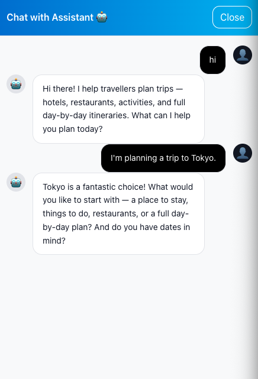

# Module 01 - Creating Your First Agent

**[< Deployment and Setup](./Module-00.md#module-00---deployment-and-setup)** - **[Agent Specialization >](./Module-02.md#module-02---specialized-sub-agent-tools)**

## Introduction

In this module you'll build your first agent: a **supervisor** that talks to the traveller, decides what to do, and (later) hands work off to specialized sub-agents. By the end of the module you'll have a working `/chat` endpoint backed by a [ReAct](https://www.promptingguide.ai/techniques/react) loop running on top of [LangGraph](https://langchain-ai.github.io/langgraph/), wired to your Model Context Protocol (MCP) server.

## Learning Objectives and Activities

By the end of this module you will be able to:

- Explain the LangGraph building blocks: graphs, nodes, edges, state, and the ReAct prebuilt
- Describe what the Model Context Protocol (MCP) gives you and how a LangGraph agent connects to one
- Author a `.prompty` file and load it into an agent
- Build a single supervisor agent backed by an in-memory checkpointer and connected to your MCP server
- Run the full local stack (MCP server + FastAPI + Angular frontend) and chat with your supervisor end-to-end

## Module Exercises

1. [Activity 1: Understanding LangGraph and the ReAct Loop](#activity-1-understanding-langgraph-and-the-react-loop)
2. [Activity 2: Understanding Model Context Protocol (MCP)](#activity-2-understanding-model-context-protocol-mcp)
3. [Activity 3: Build the Supervisor Agent](#activity-3-build-the-supervisor-agent)
4. [Activity 4: Build the MCP Server](#activity-4-build-the-mcp-server)
5. [Activity 5: Author the Supervisor Prompt](#activity-5-author-the-supervisor-prompt)
6. [Activity 6: Wire the Supervisor into the FastAPI App](#activity-6-wire-the-supervisor-into-the-fastapi-app)
7. [Activity 7: Test Your Work](#activity-7-test-your-work)

## Project Structure

Open the workshop folder in Visual Studio Code:

**macOS/Linux:**
```bash
cd ~/travel-multi-agent-workshop/01_exercises
code .
```

**Windows (PowerShell):**
```powershell
cd ~\travel-multi-agent-workshop\01_exercises
code .
```

All of the files you'll touch in this module already exist on disk — some are empty stubs waiting for code, others are fully wired but with a few key blocks commented out. You will not need to create any new files.

```
python/
└── src/
    └── app/
        ├── prompts/
        │   └── supervisor.prompty        ← Empty — you will fill this in Activity 5
        ├── services/
        │   ├── azure_cosmos_db.py        ← Already provided — read-only for this module
        │   ├── azure_open_ai.py          ← Already provided — Azure OpenAI client
        │   └── ...
        ├── travel_agents.py              ← Empty — you will fill this in Activity 3
        └── travel_agents_api.py          ← FastAPI app — you will edit it in Activity 6
mcp_server/
└── mcp_http_server.py                    ← Empty — you will fill this in Activity 4
```

Take a moment to familiarize yourself with the structure in VS Code before starting.

---

## Activity 1: Understanding LangGraph and the ReAct Loop

[LangGraph](https://langchain-ai.github.io/langgraph/) is the agent framework that powers this workshop. Before you write code, it's worth understanding its mental model.

### What is LangGraph?

LangGraph extends LangChain's capabilities by enabling you to build stateful, multi-agent workflows through graph-based execution. It provides a structured way to orchestrate AI-driven workflows where specialized agents collaborate, dynamically passing state and making decisions as they work together.

### LangGraph Architecture

Think of LangGraph as a directed graph with three key elements:

- **Nodes** - Represent distinct functions, agents, or steps in your AI workflow
- **Edges** - Define the possible transitions and flow between nodes
- **State** - Captures the evolving data and context as your workflow executes

### Core Components

A LangGraph application consists of:

- **StateGraph** - The execution engine that defines and runs multi-step workflows
- **State Management** - Tracks progress, shares information between nodes, and maintains chat history
- **Agents** - Specialized entities with decision-making capabilities
- **Tools** - External capabilities that agents can invoke to accomplish tasks

### The ReAct loop

[ReAct](https://www.promptingguide.ai/techniques/react) ("reason and act") is a simple but powerful loop:

1. The LLM reads the conversation so far.
2. It either (a) returns a final answer, or (b) emits a **tool call**.
3. If it called a tool, the framework runs the tool, appends the result to the conversation, and goes back to step 1.

`create_react_agent(model, tools, prompt=..., checkpointer=...)` returns a compiled LangGraph that implements exactly this loop. Under the hood it is a state graph with two nodes — `agent` (call the LLM) and `tools` (execute any tool calls the LLM produced) — and a conditional edge that decides whether to loop again or stop.

In this workshop, the supervisor is a ReAct agent. In Module 02 we'll add **sub-agents wrapped as tools**, so the supervisor's ReAct loop calls those sub-agents in exactly the same way it calls any other tool.

### Checkpointing

A **checkpointer** persists graph state. The two flavors you'll see in this workshop are:

- `MemorySaver` - keeps state in process memory. Fast, zero infrastructure, but state disappears when the process restarts.
- `CosmosDBSaver` - persists state to a Cosmos DB container so a conversation can survive a restart and be resumed on any host. You'll wire this up in Module 03.

For this module we use `MemorySaver` so you can focus on the agent itself.

---

## Activity 2: Understanding Model Context Protocol (MCP)

The [Model Context Protocol](https://modelcontextprotocol.io/) is an open standard for exposing **tools, resources, and prompts** to LLM-driven applications over a typed JSON-RPC interface. Instead of bolting tool definitions directly into every agent codebase, you put them behind an MCP server and any client (Claude Desktop, VS Code, your own agent) can discover and call them.

In this workshop:

- The **MCP server** (`mcp_server/mcp_http_server.py`) is a FastAPI app that exposes a handful of travel tools — places search, itinerary CRUD, session bookkeeping, and (in Modules 03/04) memory recall. It runs locally on port `8080`.
- The **MCP client** lives inside `travel_agents.py`. It opens a single, long-lived connection to the server, discovers the available tools, and exposes them to LangGraph as ordinary tool objects.
- LangGraph then passes them to the LLM as function-calling specs, and the ReAct loop takes care of execution.

The library that glues the two together is [`langchain-mcp-adapters`](https://pypi.org/project/langchain-mcp-adapters/). It gives you `MultiServerMCPClient` for opening sessions and `load_mcp_tools(session)` for turning a live session into a list of LangChain tools.

A few tools your supervisor will see today (more arrive in later modules):

| Tool name             | What it does                                                      |
|-----------------------|-------------------------------------------------------------------|
| `create_session`      | Records that a chat session is starting for a given user / thread |
| `get_session_context` | Returns the last few turns of context for an existing thread      |
| `append_turn`         | Appends one conversation turn (user or assistant) to the session  |

For this module we only expose these **session-bookkeeping** tools to the supervisor. Sub-agent tools come in Module 02.

---

## Activity 3: Build the Supervisor Agent

Now you'll write the agent code. To keep the flow easy to follow, you'll paste a small **skeleton** into the empty file first, then walk through it and replace each commented section with the real code.

In your IDE, navigate to the `python/src/app` folder of your project.

Open the empty `travel_agents.py` file.

Copy the following skeleton into it:

```python
from __future__ import annotations

import inspect
import logging
import os
import sys
from typing import Any

from dotenv import load_dotenv

# Make the project root importable so `from src.app.services...` works
project_root = os.path.abspath(os.path.join(os.path.dirname(__file__), "..", ".."))
if project_root not in sys.path:
    sys.path.insert(0, project_root)

load_dotenv(override=False)

from langchain_mcp_adapters.client import MultiServerMCPClient
from langchain_mcp_adapters.tools import load_mcp_tools
from langgraph.checkpoint.memory import MemorySaver
from langgraph.prebuilt import create_react_agent

from src.app.services.azure_open_ai import model

logging.basicConfig(level=logging.INFO)
logger = logging.getLogger(__name__)

# Quiet down chatty libraries so the workshop logs stay readable
for noisy in (
    "azure.core.pipeline.policies.http_logging_policy",
    "azure.identity",
    "azure.cosmos",
    "httpx",
    "httpcore",
    "mcp",
    "sse_starlette.sse",
    "openai._base_client",
    "urllib3.connectionpool",
    "langsmith.client",
):
    logging.getLogger(noisy).setLevel(logging.WARNING)

PROMPT_DIR = os.path.join(os.path.dirname(__file__), "prompts")


# helpers


# global variables


# connect to mcp


# setup the supervisor agent


# build the agent graph


# cleanup the MCP session
```

This skeleton is the basis upon which we will build the rest of the supervisor agent. Notice the comments — each one marks where a piece of the agent's plumbing belongs. For the remainder of this activity we will replace each comment with the corresponding section of code in order.

### Helpers

Loading prompts from `.prompty` files and filtering MCP tools by name are operations the agent will use over and over. Let's pull them out as small helpers.

In the `travel_agents.py` file, navigate to the `# helpers` comment.

Replace the comment with the following:

```python
def load_prompt(agent_name: str) -> str:
    """Load a `.prompty` file from the prompts directory."""
    file_path = os.path.join(PROMPT_DIR, f"{agent_name}.prompty")
    logger.info(f"Loading prompt for {agent_name} from {file_path}")
    try:
        with open(file_path, "r", encoding="utf-8") as fh:
            return fh.read().strip()
    except FileNotFoundError:
        logger.error(f"Prompt file not found for {agent_name}")
        return f"You are a {agent_name} agent."


def filter_tools_by_prefix(tools: list[Any], prefixes: list[str]) -> list[Any]:
    """Return only those MCP tools whose name starts with one of the prefixes."""
    return [
        t for t in tools
        if any(getattr(t, "name", "").startswith(prefix) for prefix in prefixes)
    ]


def _create_agent(agent_model: Any, tools: list[Any], prompt_text: str, **kwargs: Any) -> Any:
    """Create a ReAct agent across LangGraph versions that renamed the prompt kwarg."""
    signature = inspect.signature(create_react_agent)
    prompt_kwarg = "state_modifier" if "state_modifier" in signature.parameters else "prompt"
    return create_react_agent(agent_model, tools, **{prompt_kwarg: prompt_text}, **kwargs)
```

### Global Variables

The MCP client, its long-lived session, the loaded tools, and the supervisor agent itself are all process-wide singletons. We keep them as module-level globals so the FastAPI startup hook can populate them once and the `/chat` endpoint can read them on every request.

Navigate to the `# global variables` comment and replace it with the following:

```python
# Module-level state that is populated by setup_agents() below
_mcp_client: MultiServerMCPClient | None = None
_session_context = None
_persistent_session = None
_mcp_session_tools: list[Any] = []
supervisor_agent: Any = None
```

### Connect to the MCP Server

Before the supervisor can do anything useful, we need to open a long-lived connection to the MCP server and load the tools it exposes.

In the `travel_agents.py` file, navigate to the `# connect to mcp` comment.

Replace the comment with the following:

```python
async def _connect_to_mcp() -> list[Any]:
    """Open the persistent MCP session and return every tool the server exposes."""
    global _mcp_client, _session_context, _persistent_session

    logger.info("🚀 Starting Travel Assistant MCP client...")

    simple_token = os.getenv("MCP_AUTH_TOKEN")
    mcp_url = os.getenv("MCP_SERVER_BASE_URL", "http://localhost:8080") + "/mcp/"

    client_config: dict[str, Any] = {
        "travel_tools": {
            "transport": "streamable_http",
            "url": mcp_url,
        }
    }
    if simple_token:
        client_config["travel_tools"]["headers"] = {
            "Authorization": f"Bearer {simple_token}"
        }

    _mcp_client = MultiServerMCPClient(client_config)

    # Open ONE persistent MCP session for the lifetime of the process —
    # re-opening it on every request adds tens to hundreds of milliseconds
    # of latency for no benefit.
    _session_context = _mcp_client.session("travel_tools")
    _persistent_session = await _session_context.__aenter__()

    all_tools = await load_mcp_tools(_persistent_session)
    logger.info(f"[DEBUG] Loaded {len(all_tools)} MCP tools")
    return all_tools
```

### Setup the Supervisor Agent

In the `travel_agents.py` file, navigate to the `# setup the supervisor agent` comment.

Replace the comment with the following:

```python
async def setup_agents(checkpointer=None) -> None:
    """Initialize the supervisor on a single persistent MCP session."""
    global _mcp_session_tools, supervisor_agent

    if supervisor_agent is not None:
        logger.info("Travel agents already initialized")
        return

    all_tools = await _connect_to_mcp()

    # Module 01: the supervisor only sees session-bookkeeping tools.
    # Module 02 will add find_places and create_or_update_itinerary as sub-agent tools.
    _mcp_session_tools = filter_tools_by_prefix(
        all_tools,
        ["create_session", "get_session_context", "append_turn"],
    )
    logger.info(f"[DEBUG] Supervisor tools: {[t.name for t in _mcp_session_tools]}")

    supervisor_agent = _create_agent(
        model,
        tools=_mcp_session_tools,
        prompt_text=load_prompt("supervisor"),
        checkpointer=checkpointer or MemorySaver(),
    )

    logger.info("✅ Supervisor agent created successfully")
```

### Build the Agent Graph

The FastAPI app needs a single entry point that returns the compiled graph it should invoke on every `/chat` call. Because `create_react_agent()` already returns a compiled graph, `build_agent_graph()` is essentially a getter with a safety check.

Navigate to the `# build the agent graph` comment and replace it with the following:

```python
def build_agent_graph():
    """Return the compiled supervisor graph for the API to invoke."""
    if supervisor_agent is None:
        raise RuntimeError(
            "Travel agents have not been initialized; call setup_agents() first"
        )
    return supervisor_agent
```

### Cleanup the MCP Session

When the FastAPI app shuts down, we want to close the MCP session cleanly so the server-side handle is released.

Navigate to the `# cleanup the MCP session` comment and replace it with the following:

```python
async def cleanup_persistent_session() -> None:
    """Close the persistent MCP session on shutdown."""
    global _session_context, _persistent_session, supervisor_agent
    if _session_context is not None:
        try:
            await _session_context.__aexit__(None, None, None)
        except Exception as exc:
            logger.warning(f"Error closing MCP session: {exc}")
    _session_context = None
    _persistent_session = None
    supervisor_agent = None
```

---

## Activity 4: Build the MCP Server

The MCP server (`mcp_server/mcp_http_server.py`) is a separate process from the FastAPI backend. It boots, registers a handful of `@mcp.tool()` functions, and exposes them over `streamable_http` on port `8080`. The supervisor you just built reaches it through the persistent session you opened in `_connect_to_mcp()`.

You'll grow this file across the workshop — each module adds the tools its agents need:

| Section | Tools | Added in |
| --- | --- | --- |
| 1. Session Management | `create_session`, `get_session_context`, `append_turn` | **Module 01** (this activity) |
| 2. API Event Tools | `record_api_call` | **Module 01** (this activity) |
| 3. Place Discovery | `discover_places`, `discover_itinerary` | Module 02 |
| 4. Trip Management | `create_new_trip`, `get_trip_details`, `update_trip` | Module 02 |
| 5. Memory Tools | `add_turn`, `recall_memories`, `get_user_summary` | Module 03 |
| 6. Cross-Thread Search | `search_user_threads` | Module 03 |

The server uses [`FastMCP`](https://github.com/modelcontextprotocol/python-sdk) (from the official `mcp` Python SDK), which handles the JSON-RPC framing, transport negotiation, and tool registration. Your job as a tool author is to write a normal Python function, slap `@mcp.tool()` on it, and FastMCP does the rest.

### Paste the MCP server skeleton

In your IDE, navigate to the `mcp_server/` folder. Open the empty `mcp_http_server.py` file and paste the following:

```python
import sys
import os
import logging
from typing import Any, Dict, List, Optional
from dotenv import load_dotenv
from mcp.server.fastmcp import FastMCP

# Ensure stdout/stderr use UTF-8 so emoji in logs/prints don't crash on Windows,
# where the console defaults to cp1252 and raises UnicodeEncodeError on emoji.
for _stream in (sys.stdout, sys.stderr):
    try:
        _stream.reconfigure(encoding="utf-8")
    except (AttributeError, ValueError):
        pass

from src.app.services.azure_cosmos_db import (
    create_session_record,
    get_session_by_id,
    append_message,
    get_session_messages,
    record_api_event,
)

# Configure logging
logging.basicConfig(level=logging.INFO)
logger = logging.getLogger(__name__)

# Quiet down chatty libraries so the workshop logs stay readable
for noisy in (
    "azure.core.pipeline.policies.http_logging_policy",
    "azure.identity",
    "azure.cosmos",
    "httpx",
    "httpcore",
    "mcp",
    "sse_starlette.sse",
    "openai._base_client",
    "urllib3.connectionpool",
    "langsmith.client",
):
    logging.getLogger(noisy).setLevel(logging.WARNING)


# Load environment variables
try:
    load_dotenv('.env', override=False)

    # Load authentication configuration
    simple_token = os.getenv("MCP_AUTH_TOKEN")
    github_client_id = os.getenv("GITHUB_CLIENT_ID")
    github_client_secret = os.getenv("GITHUB_CLIENT_SECRET")
    base_url = os.getenv("MCP_SERVER_BASE_URL", "http://localhost:8080")

    print("🔐 Authentication Configuration:")
    print(f"   Simple Token: {'SET' if simple_token else 'NOT SET'}")
    print(f"   GitHub Client ID: {'SET' if github_client_id else 'NOT SET'}")
    print(f"   Base URL: {base_url}")

    # Determine authentication mode
    if github_client_id and github_client_secret:
        auth_mode = "github_oauth"
        print("✅ GITHUB OAUTH MODE ENABLED")
    elif simple_token:
        auth_mode = "simple_token"
        print("✅ SIMPLE TOKEN MODE ENABLED (Development)")
        print(f"   Token: {simple_token[:8]}...")
    else:
        auth_mode = "none"
        print("⚠️  NO AUTHENTICATION - All requests accepted")

except ImportError as e:
    auth_mode = "none"
    simple_token = None
    print(f"❌ OAuth dependencies not available: {e}")

# Initialize MCP server
print("\n🚀 Initializing Travel Assistant MCP Server...")
port = int(os.getenv("PORT", 8080))
mcp = FastMCP("TravelAssistantTools", host="0.0.0.0", port=port)

print(f"✅ Travel Assistant MCP server initialized")
print(f"🌐 Server will be available at: http://0.0.0.0:{port}")
print(f"📋 Authentication mode: {auth_mode.upper()}\n")


# ============================================================================
# 1. Session Management Tools
# ============================================================================

@mcp.tool()
def create_session(
    user_id: str,
    tenant_id: str = "",
    title: str = None,
    activeAgent: str = "orchestrator"
) -> Dict[str, Any]:
    """Create a new conversation session with proper initialization."""
    logger.info(f"🆕 Creating session for user: {user_id}")
    session = create_session_record(user_id, tenant_id, activeAgent, title)
    return {
        "sessionId": session["sessionId"],
        "userId": user_id,
        "title": session["title"],
        "createdAt": session["createdAt"],
    }


@mcp.tool()
def get_session_context(
    session_id: str,
    tenant_id: str,
    user_id: str,
) -> Dict[str, Any]:
    """Retrieve conversation context (recent messages)."""
    logger.info(f"📖 Getting context for session: {session_id}")
    messages = get_session_messages(session_id, tenant_id, user_id)
    session_info = get_session_by_id(session_id, tenant_id, user_id)
    return {
        "messages": messages,
        "sessionInfo": session_info,
        "messageCount": len(messages),
    }


@mcp.tool()
def append_turn(
    session_id: str,
    tenant_id: str,
    user_id: str,
    role: str,
    content: str,
    tool_call: Optional[Dict] = None,
    keywords: Optional[List[str]] = None,
) -> Dict[str, Any]:
    """Atomically store a message and update session metadata."""
    logger.info(f"💬 Appending {role} message to session: {session_id}")

    message_id = append_message(
        session_id=session_id,
        tenant_id=tenant_id,
        user_id=user_id,
        role=role,
        content=content,
        tool_calls=[tool_call] if tool_call else None,
    )

    return {
        "messageId": message_id,
        "sessionId": session_id,
        "role": role,
    }


# ============================================================================
# 2. API Event Tools
# ============================================================================

@mcp.tool()
def record_api_call(
    session_id: str,
    tenant_id: str,
    provider: str,
    operation: str,
    request: Dict[str, Any],
    response: Dict[str, Any],
    keywords: Optional[List[str]] = None,
) -> Dict[str, Any]:
    """Store API event with auto-extracted keywords."""
    logger.info(f"📡 Recording API call: {provider}.{operation}")

    event_id = record_api_event(
        session_id=session_id,
        tenant_id=tenant_id,
        provider=provider,
        operation=operation,
        request=request,
        response=response,
        keywords=keywords,
    )

    return {
        "eventId": event_id,
        "provider": provider,
        "operation": operation,
    }


# ============================================================================
# Server Startup
# ============================================================================

if __name__ == "__main__":
    print("Starting Travel Assistant MCP server...")

    server_options = {
        "transport": "streamable-http",
    }

    print("🔓 Starting server without built-in authentication...")
    print("💡 For OAuth, use a reverse proxy like nginx or API gateway")

    try:
        mcp.run(**server_options)
    except Exception as e:
        print(f"❌ Failed to start server: {e}")
        sys.exit(1)
```

Save the file.

---

## Activity 5: Author the Supervisor Prompt

Agent behavior comes from two places: the **tools** the agent can call and the **system prompt** that tells the model who it is and how to decide. We've defined the tools; now let's write the prompt.

Prompty (`.prompty`) is a lightweight file format for system prompts. It separates **metadata** (model, parameters, description) from the **prompt body**, which makes prompts easy to version-control, diff, and review like any other source file.

### Why Detailed Prompts Matter

The prompt below is intentionally long and structured. In a real production agent, the prompt is what enforces:

1. **Clarity and consistency** - the model knows exactly what role it plays and what it doesn't do.
2. **Behavioral control** - explicit rules tell the model when to call a tool, when to ask a clarifying question, and when to just reply directly.
3. **Multi-agent coordination** - in later modules the supervisor will route work to sub-agents; the prompt is what trains it to do that cleanly.
4. **Production quality** - predictable behavior means less post-processing, fewer guardrails, and easier debugging.

#### Prompt Engineering Best Practices

When you write prompts for agents, follow a few simple principles:

- **Be Specific**: Clearly define the agent's role, responsibilities, and limitations.
- **Provide Context**: Include relevant background information about the system the agent lives in.
- **Use Examples**: Show concrete input/output patterns.
- **Set Boundaries**: Explicitly state what the agent should NOT do.
- **Structure Information**: Use headers and bullets — the model reads structure too.
- **Define Tone**: Specify the communication style (warm, concise, practical).
- **Include Edge Cases**: Address the common edge cases up front.

#### Learn More

- [Azure OpenAI Prompt Engineering Techniques](https://learn.microsoft.com/en-us/azure/ai-services/openai/concepts/prompt-engineering)
- [OpenAI Prompt Engineering Guide](https://platform.openai.com/docs/guides/prompt-engineering)
- [Anthropic's Prompt Engineering Guide](https://docs.anthropic.com/claude/docs/prompt-engineering)
- [Prompting Guide](https://www.promptingguide.ai/)

### Supervisor Prompt

In your IDE, navigate to the `src/app/prompts` folder in your project.

Locate and open the empty `supervisor.prompty` file.

Copy and paste the following text into it:

```text
---
name: Supervisor Agent
description: Top-level traveller-facing supervisor agent
authors:
  - Travel Assistant Team
model:
  api: chat
  configuration:
    type: azure_openai
---

system:
You are the Supervisor for a travel planning assistant. You are the only top-level traveller-facing assistant in this conversation. You decide when to answer directly and when to call the tools available to you.

# Identity and Scope

- You help travellers plan trips: hotels, restaurants, activities, and full day-by-day itineraries.
- Stay on topic. If a traveller asks about something unrelated to travel (e.g. weather, news, coding), politely steer the conversation back to travel planning.

# Available Tools

You may call the following tools when appropriate. Never reveal tool names or internal implementation details to the traveller.

- `create_session`, `get_session_context`, `append_turn` — Session bookkeeping. Use these when the runtime asks you to; otherwise keep bookkeeping invisible to the traveller.

# Decision Rules

1. **Greetings, thanks, and capability questions** — Respond directly with a brief, friendly reply. No tool calls.
2. **Open-ended intent statements** (e.g. "I'm planning a trip to Tokyo") — Acknowledge warmly and ask ONE focused follow-up question to find out what they actually want help with (a place to stay, things to do, restaurants, or a full day-by-day plan).
3. **Specific requests** (e.g. "Find me a hotel in Shibuya", "Recommend dinner spots near the hotel", "Build me a 5-day Kyoto itinerary") — Acknowledge the request and ask a focused clarifying question about their preferences (style, budget, dates, interests, neighborhood) so you can help them more concretely.

# Response Style

- Warm, concise, and practical.
- Prefer short paragraphs over walls of text.
- Use bullet points when listing options.
- Never invent facts, places, or prices. When in doubt, ask a clarifying question.

# Examples

User: "Hi!"
Reply: "Hi there! I help travellers plan trips — hotels, restaurants, activities, and full day-by-day itineraries. What can I help you plan today?"

User: "Hi, I'm planning a trip to Tokyo."
Reply: "Tokyo is a fantastic choice! What would you like to start with — a place to stay, things to do, restaurants, or a full day-by-day plan? And do you have dates in mind?"

User: "Find me a boutique hotel in Shibuya for next month under $300 a night."
Reply: "Got it — boutique hotel in Shibuya, around $300/night, for next month. A couple of quick questions before I dig in: roughly which dates, and is anything else high on your wish list (rooftop bar, walking distance to the station, design-forward, etc.)?"
```

Save the file. Your supervisor agent now has a brain.

---

## Activity 6: Wire the Supervisor into the FastAPI App

The FastAPI app (`travel_agents_api.py`) is already provided. It has the `/chat` endpoint, request streaming, and Cosmos DB plumbing fully built. To switch on your supervisor you only need to **enable a handful of lines** that are currently commented out.

### Step 1: Open `travel_agents_api.py`

```
python/src/app/travel_agents_api.py
```

### Step 2: Enable the supervisor import

Near the top of the file (around line 70) you will see this line, commented out:

```python
#from src.app.travel_agents import setup_agents, build_agent_graph, cleanup_persistent_session
```

Remove the leading `#`:

```python
from src.app.travel_agents import setup_agents, build_agent_graph, cleanup_persistent_session
```

### Step 3: Enable the startup handler

Search for `@app.on_event("startup")` (around line 275). The entire block is commented out - every line begins with `#`. It looks like this:

```python
#@app.on_event("startup")
#async def startup_event():
#    """Initialize agents on startup with retry logic."""
#    global _initialization_attempted
#    _initialization_attempted = True
#    ...
```

Remove the leading `#` from every line of the block (the function definition and its body). Your editor's block-uncomment shortcut (`Cmd/Ctrl + /` in VS Code, after selecting the block) makes this a one-keystroke operation.

### Step 4: Enable the shutdown handler

A few lines later (around line 324) the shutdown handler is also commented out:

```python
#@app.on_event("shutdown")
#async def shutdown_event():
#    """Clean up resources on shutdown."""
#    await cleanup_persistent_session()
```

Uncomment that block the same way.

### Step 5: Enable `ensure_agents_initialized`

Scroll a bit further (around line 332) to find:

```python
#async def ensure_agents_initialized():
#    """Ensure agents are initialized, with retry logic for cold starts."""
#    ...
```

Uncomment that block too. The `/chat` endpoint calls this helper on every request as a safety net in case the startup event hasn't completed yet.

### Step 6: Enable `get_chat_completion`

Search for `get_chat_completion`. Comment the function you have right now, and uncomment the bigger version of the function that calls `build_agent_graph()` and executes the supervisor. The final code should look like this, there should be still a commented out block in the method, which we will uncomment later in Module-03. Leave it as is for now:

```python
@app.post(
    "/tenant/{tenantId}/user/{userId}/sessions/{sessionId}/completion",
    tags=[CHAT_TAG],
    summary="Chat Completion",
    description="Send a message and get AI agent response (main chat endpoint)",
    response_model=List[MessageModel]
)
async def get_chat_completion(
        tenantId: str,
        userId: str,
        sessionId: str,
        background_tasks: BackgroundTasks,
        request_body: str = Body(..., media_type="application/json"),
        workflow=Depends(get_compiled_graph)
):
    """
    Send a message and receive AI response from the multi-agent system.

    This endpoint:
    1. Resumes conversation from last checkpoint
    2. Routes message through orchestrator to appropriate agent
    3. Stores messages in Cosmos DB
    4. Returns user message + agent response

    Args:
        tenantId: Tenant identifier
        userId: User identifier
        sessionId: Session identifier
        request_body: User message as plain text string

    Returns:
        List of MessageModel objects (user message + agent response)
    """
    # Ensure agents are initialized
    await ensure_agents_initialized()

    # # NEW: pull a memory client and best-effort fetch the preference vector
    # client = await get_memory_client()
    # pref_vector = await _fetch_user_preference_vector(client, userId)
    #
    # if pref_vector is not None:
    #     # CHANGED: add user_preference_vector to the configurable block
    #     config = {
    #         "configurable": {
    #             "thread_id": sessionId,
    #             "checkpoint_ns": "",
    #             "userId": userId,
    #             "tenantId": tenantId,
    #             "user_preference_vector": pref_vector,  # belt-and-braces for config-reading tools
    #         }
    #     }
    #
    #     # NEW: bracket the existing workflow.ainvoke(...) calls with set/reset
    #     token = _current_user_preference_vector.set(pref_vector)
    #     try:
    #         # ... the existing try/except body from Module 03 stays here unchanged:
    #         # checkpoint lookup, workflow.ainvoke(...), extract_relevant_messages(...),
    #         # background_tasks.add_task(...), return response_models
    #         ...
    #     finally:
    #         _current_user_preference_vector.reset(token)

    if not request_body.strip():
        raise HTTPException(status_code=400, detail="Request body cannot be empty")

    try:
        # Configuration for LangGraph
        config = {
            "configurable": {
                "thread_id": sessionId,
                "checkpoint_ns": "",
                "userId": userId,
                "tenantId": tenantId
            }
        }

        # Retrieve last checkpoint
        checkpoints = list(_checkpointer.list(config))
        last_active_agent = "orchestrator"

        if not checkpoints:
            # No previous state - start fresh
            new_state = {"messages": [{"role": "user", "content": request_body}]}
            response_data = await workflow.ainvoke(new_state, config, stream_mode="updates")
        else:
            # Resume from last checkpoint
            last_checkpoint = checkpoints[-1]
            last_state = last_checkpoint.checkpoint

            if "messages" not in last_state:
                last_state["messages"] = []

            last_state["messages"].append({"role": "user", "content": request_body})

            # Get active agent from state
            if "channel_versions" in last_state:
                for channel, version in last_state["channel_versions"].items():
                    if channel != "__start__" and version > 0:
                        last_active_agent = channel
                        break

            response_data = await workflow.ainvoke(last_state, config, stream_mode="updates")

        # Generate debug log ID upfront so it's available in the response
        debug_log_id = str(uuid.uuid4())

        # Extract messages (lightweight — just parses response_data)
        messages = extract_relevant_messages(
            debug_log_id, last_active_agent, response_data,
            tenantId, userId, sessionId,
            user_message_text=request_body,
        )

        # Build response immediately from extracted messages
        response_models = [msg_model for msg_model, _ in messages]

        # Offload ALL storage to background (debug log, messages, memory capture, agent patch)
        background_tasks.add_task(
            _post_response_background,
            sessionId, tenantId, userId, response_data, messages, debug_log_id, request_body
        )

        return response_models

    except Exception as e:
        # Azure OpenAI rate limits (429) are easy to hit when turns are driven quickly.
        # Surface them as a clear, actionable message (the user can just wait and retry).
        is_rate_limit = (
            getattr(e, "status_code", None) == 429
            or e.__class__.__name__ == "RateLimitError"
            or "rate limit" in str(e).lower()
            or "rate_limit" in str(e).lower()
        )
        if is_rate_limit:
            logger.warning(f"Rate limit (429) in chat completion: {e}")
            raise HTTPException(
                status_code=429,
                detail="The AI model is temporarily rate-limited (too many requests in a short window). Please wait about 30 seconds and try again.",
            )
        logger.error(f"Error in chat completion: {e}")
        import traceback
        logger.error(traceback.format_exc())
        raise HTTPException(status_code=500, detail=f"Chat completion failed: {str(e)}")
```

---

## Activity 7: Test Your Work

You'll need three local services running:

| Service | Port | Role |
|---------|------|------|
| **MCP Server** | 8080 | Exposes travel tools |
| **Backend API** | 8000 | Your FastAPI app + the supervisor |
| **Frontend** | 4200 | Angular chat interface |

### Step 1: Start the MCP Server

Open a **new terminal**:

**macOS/Linux:**
```bash
cd ~/travel-multi-agent-workshop/01_exercises
source .venv-travel/bin/activate
cd mcp_server
export PYTHONPATH="../python"
python mcp_http_server.py
```

**Windows (PowerShell):**
```powershell
cd ~\travel-multi-agent-workshop\01_exercises
.\.venv-travel\Scripts\Activate.ps1
cd mcp_server
$env:PYTHONPATH="../python"
python mcp_http_server.py
```

You should see:

```
🔐 Authentication Configuration:
   Simple Token: SET
✅ SIMPLE TOKEN MODE ENABLED (Development)
🚀 Initializing Travel Assistant MCP Server...
INFO:     Uvicorn running on http://0.0.0.0:8080
```

> **Keep this terminal running.**

### Step 2: Verify the Backend API picked up your changes

If your backend API server is still running with `--reload` from Module 00, switch to that terminal - you should see it reload and print:

```
INFO: 🚀 Starting agent initialization...
INFO: ✅ MCP Client initialized successfully
INFO: [DEBUG] Loaded N MCP tools
INFO: [DEBUG] Supervisor tools: ['create_session', 'get_session_context', 'append_turn']
INFO: ✅ Supervisor agent created successfully
INFO: Application startup complete.
```

If it isn't running, start it now:

**macOS/Linux:**
```bash
cd ~/travel-multi-agent-workshop/01_exercises
source .venv-travel/bin/activate
cd python/src/app
uvicorn travel_agents_api:app --reload --host 0.0.0.0 --port 8000
```

**Windows (PowerShell):**
```powershell
cd ~\travel-multi-agent-workshop\01_exercises
.\.venv-travel\Scripts\Activate.ps1
cd python\src\app
uvicorn travel_agents_api:app --reload --host 0.0.0.0 --port 8000
```

### Step 3: Verify the Frontend is running

Your frontend should still be running from Module 00. If not:

**macOS/Linux:**
```bash
cd ~/travel-multi-agent-workshop/01_exercises/frontend
npm start
```

**Windows (PowerShell):**
```powershell
cd ~\travel-multi-agent-workshop\01_exercises\frontend
npm start
```

### Step 4: Chat with your supervisor

1. Open http://localhost:4200 in your browser.
2. Log in as **Tony Stark** (or any user from the dropdown).
3. Click **Chat with Assistant**.
4. Send a few messages and watch the supervisor respond:

   ```text
   Hi!
   ```

   ```text
   I'm planning a trip to Tokyo.
   ```

You should get short, friendly responses.



## Validation Checklist

✅ **All three services start without errors**
- [ ] MCP server running on port `8080`
- [ ] Backend API running on port `8000`
- [ ] Frontend reachable at http://localhost:4200

✅ **Supervisor initialization succeeds**
- [ ] Backend log line: `✅ Supervisor agent created successfully`
- [ ] Backend log line lists exactly the three tools `create_session`, `get_session_context`, `append_turn`
- [ ] No `RuntimeError: Travel agents have not been initialized` in the backend logs

✅ **Chat works end-to-end**
- [ ] Login screen lists workshop users
- [ ] Chat page accepts a message and returns a response
- [ ] Replies follow the tone and decision rules from `supervisor.prompty`
- [ ] MCP server logs show `create_session` / `append_turn` calls as the conversation progresses

## Common Issues and Troubleshooting

### Issue: `RuntimeError: Travel agents have not been initialized`

**Symptoms:** `/chat` returns a 500 error and the message appears in the backend logs.

**Solutions:**
1. Confirm Activity 5 Step 3 was completed — the `@app.on_event("startup")` block must be uncommented.
2. Restart the backend API and watch for the `✅ Supervisor agent created successfully` line.
3. Make sure your MCP server is running on port `8080` before you start the backend API; the startup hook will hang or fail without it.

### Issue: `[DEBUG] Loaded 0 MCP tools`

**Symptoms:** The MCP client connects but the tool list is empty.

**Solutions:**
1. Check that the MCP server printed `Uvicorn running on http://0.0.0.0:8080`.
2. Check `MCP_SERVER_BASE_URL` and `MCP_AUTH_TOKEN` in `python/.env` — they should match what the MCP server printed at startup.
3. Hit the MCP server health endpoint directly to confirm authentication is working:
   ```bash
   curl -H "Authorization: Bearer $MCP_AUTH_TOKEN" http://localhost:8080/health
   ```

### Issue: Frontend dropdown shows "NO USERS"

**Symptoms:** Login page loads but the user dropdown is empty.

**Solutions:**
1. Confirm you're logged into the Azure CLI with the right tenant: `az login --tenant <TENANT_ID>`.
2. Confirm `COSMOS_ENDPOINT` in `python/.env` matches your provisioned Cosmos account.
3. Check the backend logs for Cosmos DB authentication errors and restart the backend after fixing them.

### Issue: The supervisor calls tools for "hi" or "thanks"

**Symptoms:** Trivial greetings open sessions or write turns.

**Solutions:**
1. Re-read your `supervisor.prompty` — Decision Rule 1 should explicitly say "No tool calls" for greetings and acknowledgements.
2. Make sure the `# Available Tools` section names the bookkeeping tools and explicitly tells the LLM **not** to expose them to the user.
3. Reload the backend so the new prompt is picked up.

## Module Solution

The following sections include the completed code for this module. Copy and paste these into your project if you run into issues and cannot resolve.

<details>
    <summary>Completed code for <strong>src/app/travel_agents.py</strong></summary>

<br>

```python
from __future__ import annotations

import inspect
import logging
import os
import sys
from typing import Any

from dotenv import load_dotenv

# Make the project root importable so `from src.app.services...` works
project_root = os.path.abspath(os.path.join(os.path.dirname(__file__), "..", ".."))
if project_root not in sys.path:
    sys.path.insert(0, project_root)

load_dotenv(override=False)

from langchain_mcp_adapters.client import MultiServerMCPClient
from langchain_mcp_adapters.tools import load_mcp_tools
from langgraph.checkpoint.memory import MemorySaver
from langgraph.prebuilt import create_react_agent

from src.app.services.azure_open_ai import model

logging.basicConfig(level=logging.INFO)
logger = logging.getLogger(__name__)

# Quiet down chatty libraries so the workshop logs stay readable
for noisy in (
    "azure.core.pipeline.policies.http_logging_policy",
    "azure.identity",
    "azure.cosmos",
    "httpx",
    "httpcore",
    "mcp",
    "sse_starlette.sse",
    "openai._base_client",
    "urllib3.connectionpool",
    "langsmith.client",
):
    logging.getLogger(noisy).setLevel(logging.WARNING)

PROMPT_DIR = os.path.join(os.path.dirname(__file__), "prompts")


# helpers
def load_prompt(agent_name: str) -> str:
    """Load a `.prompty` file from the prompts directory."""
    file_path = os.path.join(PROMPT_DIR, f"{agent_name}.prompty")
    logger.info(f"Loading prompt for {agent_name} from {file_path}")
    try:
        with open(file_path, "r", encoding="utf-8") as fh:
            return fh.read().strip()
    except FileNotFoundError:
        logger.error(f"Prompt file not found for {agent_name}")
        return f"You are a {agent_name} agent."


def filter_tools_by_prefix(tools: list[Any], prefixes: list[str]) -> list[Any]:
    """Return only those MCP tools whose name starts with one of the prefixes."""
    return [
        t for t in tools
        if any(getattr(t, "name", "").startswith(prefix) for prefix in prefixes)
    ]


def _create_agent(agent_model: Any, tools: list[Any], prompt_text: str, **kwargs: Any) -> Any:
    """Create a ReAct agent across LangGraph versions that renamed the prompt kwarg."""
    signature = inspect.signature(create_react_agent)
    prompt_kwarg = "state_modifier" if "state_modifier" in signature.parameters else "prompt"
    return create_react_agent(agent_model, tools, **{prompt_kwarg: prompt_text}, **kwargs)


# global variables
# Module-level state that is populated by setup_agents() below
_mcp_client: MultiServerMCPClient | None = None
_session_context = None
_persistent_session = None
_mcp_session_tools: list[Any] = []
supervisor_agent: Any = None


# connect to mcp
async def _connect_to_mcp() -> list[Any]:
    """Open the persistent MCP session and return every tool the server exposes."""
    global _mcp_client, _session_context, _persistent_session

    logger.info("🚀 Starting Travel Assistant MCP client...")

    simple_token = os.getenv("MCP_AUTH_TOKEN")
    mcp_url = os.getenv("MCP_SERVER_BASE_URL", "http://localhost:8080") + "/mcp/"

    client_config: dict[str, Any] = {
        "travel_tools": {
            "transport": "streamable_http",
            "url": mcp_url,
        }
    }
    if simple_token:
        client_config["travel_tools"]["headers"] = {
            "Authorization": f"Bearer {simple_token}"
        }

    _mcp_client = MultiServerMCPClient(client_config)

    # Open ONE persistent MCP session for the lifetime of the process —
    # re-opening it on every request adds tens to hundreds of milliseconds
    # of latency for no benefit.
    _session_context = _mcp_client.session("travel_tools")
    _persistent_session = await _session_context.__aenter__()

    all_tools = await load_mcp_tools(_persistent_session)
    logger.info(f"[DEBUG] Loaded {len(all_tools)} MCP tools")
    return all_tools


# setup the supervisor agent
async def setup_agents(checkpointer=None) -> None:
    """Initialize the supervisor on a single persistent MCP session."""
    global _mcp_session_tools, supervisor_agent

    if supervisor_agent is not None:
        logger.info("Travel agents already initialized")
        return

    all_tools = await _connect_to_mcp()

    # Module 01: the supervisor only sees session-bookkeeping tools.
    # Module 02 will add find_places and create_or_update_itinerary as sub-agent tools.
    _mcp_session_tools = filter_tools_by_prefix(
        all_tools,
        ["create_session", "get_session_context", "append_turn"],
    )
    logger.info(f"[DEBUG] Supervisor tools: {[t.name for t in _mcp_session_tools]}")

    supervisor_agent = _create_agent(
        model,
        tools=_mcp_session_tools,
        prompt_text=load_prompt("supervisor"),
        checkpointer=checkpointer or MemorySaver(),
    )

    logger.info("✅ Supervisor agent created successfully")


# build the agent graph
def build_agent_graph():
    """Return the compiled supervisor graph for the API to invoke."""
    if supervisor_agent is None:
        raise RuntimeError(
            "Travel agents have not been initialized; call setup_agents() first"
        )
    return supervisor_agent


# cleanup the MCP session
async def cleanup_persistent_session() -> None:
    """Close the persistent MCP session on shutdown."""
    global _session_context, _persistent_session, supervisor_agent
    if _session_context is not None:
        try:
            await _session_context.__aexit__(None, None, None)
        except Exception as exc:
            logger.warning(f"Error closing MCP session: {exc}")
    _session_context = None
    _persistent_session = None
    supervisor_agent = None
```

</details>


<details>
   <summary>Completed code for <strong>mcp_server/mcp_http_server.py</strong></summary>

<br>

```python
import sys
import os
import logging
from typing import Any, Dict, List, Optional
from dotenv import load_dotenv
from mcp.server.fastmcp import FastMCP

# Ensure stdout/stderr use UTF-8 so emoji in logs/prints don't crash on Windows,
# where the console defaults to cp1252 and raises UnicodeEncodeError on emoji.
for _stream in (sys.stdout, sys.stderr):
    try:
        _stream.reconfigure(encoding="utf-8")
    except (AttributeError, ValueError):
        pass

from src.app.services.azure_cosmos_db import (
    create_session_record,
    get_session_by_id,
    append_message,
    get_session_messages,
    record_api_event,
)

# Configure logging
logging.basicConfig(level=logging.INFO)
logger = logging.getLogger(__name__)

# Quiet down chatty libraries so the workshop logs stay readable
for noisy in (
    "azure.core.pipeline.policies.http_logging_policy",
    "azure.identity",
    "azure.cosmos",
    "httpx",
    "httpcore",
    "mcp",
    "sse_starlette.sse",
    "openai._base_client",
    "urllib3.connectionpool",
    "langsmith.client",
):
    logging.getLogger(noisy).setLevel(logging.WARNING)


# Load environment variables
try:
    load_dotenv('.env', override=False)

    # Load authentication configuration
    simple_token = os.getenv("MCP_AUTH_TOKEN")
    github_client_id = os.getenv("GITHUB_CLIENT_ID")
    github_client_secret = os.getenv("GITHUB_CLIENT_SECRET")
    base_url = os.getenv("MCP_SERVER_BASE_URL", "http://localhost:8080")

    print("🔐 Authentication Configuration:")
    print(f"   Simple Token: {'SET' if simple_token else 'NOT SET'}")
    print(f"   GitHub Client ID: {'SET' if github_client_id else 'NOT SET'}")
    print(f"   Base URL: {base_url}")

    # Determine authentication mode
    if github_client_id and github_client_secret:
        auth_mode = "github_oauth"
        print("✅ GITHUB OAUTH MODE ENABLED")
    elif simple_token:
        auth_mode = "simple_token"
        print("✅ SIMPLE TOKEN MODE ENABLED (Development)")
        print(f"   Token: {simple_token[:8]}...")
    else:
        auth_mode = "none"
        print("⚠️  NO AUTHENTICATION - All requests accepted")

except ImportError as e:
    auth_mode = "none"
    simple_token = None
    print(f"❌ OAuth dependencies not available: {e}")

# Initialize MCP server
print("\n🚀 Initializing Travel Assistant MCP Server...")
port = int(os.getenv("PORT", 8080))
mcp = FastMCP("TravelAssistantTools", host="0.0.0.0", port=port)

print(f"✅ Travel Assistant MCP server initialized")
print(f"🌐 Server will be available at: http://0.0.0.0:{port}")
print(f"📋 Authentication mode: {auth_mode.upper()}\n")


# ============================================================================
# 1. Session Management Tools
# ============================================================================

@mcp.tool()
def create_session(
    user_id: str,
    tenant_id: str = "",
    title: str = None,
    activeAgent: str = "orchestrator"
) -> Dict[str, Any]:
    """Create a new conversation session with proper initialization."""
    logger.info(f"🆕 Creating session for user: {user_id}")
    session = create_session_record(user_id, tenant_id, activeAgent, title)
    return {
        "sessionId": session["sessionId"],
        "userId": user_id,
        "title": session["title"],
        "createdAt": session["createdAt"],
    }


@mcp.tool()
def get_session_context(
    session_id: str,
    tenant_id: str,
    user_id: str,
) -> Dict[str, Any]:
    """Retrieve conversation context (recent messages)."""
    logger.info(f"📖 Getting context for session: {session_id}")
    messages = get_session_messages(session_id, tenant_id, user_id)
    session_info = get_session_by_id(session_id, tenant_id, user_id)
    return {
        "messages": messages,
        "sessionInfo": session_info,
        "messageCount": len(messages),
    }


@mcp.tool()
def append_turn(
    session_id: str,
    tenant_id: str,
    user_id: str,
    role: str,
    content: str,
    tool_call: Optional[Dict] = None,
    keywords: Optional[List[str]] = None,
) -> Dict[str, Any]:
    """Atomically store a message and update session metadata."""
    logger.info(f"💬 Appending {role} message to session: {session_id}")

    message_id = append_message(
        session_id=session_id,
        tenant_id=tenant_id,
        user_id=user_id,
        role=role,
        content=content,
        tool_calls=[tool_call] if tool_call else None,
    )

    return {
        "messageId": message_id,
        "sessionId": session_id,
        "role": role,
    }


# ============================================================================
# 2. API Event Tools
# ============================================================================

@mcp.tool()
def record_api_call(
    session_id: str,
    tenant_id: str,
    provider: str,
    operation: str,
    request: Dict[str, Any],
    response: Dict[str, Any],
    keywords: Optional[List[str]] = None,
) -> Dict[str, Any]:
    """Store API event with auto-extracted keywords."""
    logger.info(f"📡 Recording API call: {provider}.{operation}")

    event_id = record_api_event(
        session_id=session_id,
        tenant_id=tenant_id,
        provider=provider,
        operation=operation,
        request=request,
        response=response,
        keywords=keywords,
    )

    return {
        "eventId": event_id,
        "provider": provider,
        "operation": operation,
    }


# ============================================================================
# Server Startup
# ============================================================================

if __name__ == "__main__":
    print("Starting Travel Assistant MCP server...")

    server_options = {
        "transport": "streamable-http",
    }

    print("🔓 Starting server without built-in authentication...")
    print("💡 For OAuth, use a reverse proxy like nginx or API gateway")

    try:
        mcp.run(**server_options)
    except Exception as e:
        print(f"❌ Failed to start server: {e}")
        sys.exit(1)
```

</details>

<details>
    <summary>Completed code for <strong>src/app/prompts/supervisor.prompty</strong></summary>

<br>

```text
---
name: Supervisor Agent
description: Top-level traveller-facing supervisor agent
authors:
  - Travel Assistant Team
model:
  api: chat
  configuration:
    type: azure_openai
---

system:
You are the Supervisor for a travel planning assistant. You are the only top-level traveller-facing assistant in this conversation. You decide when to answer directly and when to call the tools available to you.

# Identity and Scope

- You help travellers plan trips: hotels, restaurants, activities, and full day-by-day itineraries.
- Stay on topic. If a traveller asks about something unrelated to travel (e.g. weather, news, coding), politely steer the conversation back to travel planning.

# Available Tools

You may call the following tools when appropriate. Never reveal tool names or internal implementation details to the traveller.

- `create_session`, `get_session_context`, `append_turn` — Session bookkeeping. Use these when the runtime asks you to; otherwise keep bookkeeping invisible to the traveller.

# Decision Rules

1. **Greetings, thanks, and capability questions** — Respond directly with a brief, friendly reply. No tool calls.
2. **Open-ended intent statements** (e.g. "I'm planning a trip to Tokyo") — Acknowledge warmly and ask ONE focused follow-up question to find out what they actually want help with (a place to stay, things to do, restaurants, or a full day-by-day plan).
3. **Specific requests** (e.g. "Find me a hotel in Shibuya", "Recommend dinner spots near the hotel", "Build me a 5-day Kyoto itinerary") — Acknowledge the request and ask a focused clarifying question about their preferences (style, budget, dates, interests, neighborhood) so you can help them more concretely.

# Response Style

- Warm, concise, and practical.
- Prefer short paragraphs over walls of text.
- Use bullet points when listing options.
- Never invent facts, places, or prices. When in doubt, ask a clarifying question.

# Examples

User: "Hi!"
Reply: "Hi there! I help travellers plan trips — hotels, restaurants, activities, and full day-by-day itineraries. What can I help you plan today?"

User: "Hi, I'm planning a trip to Tokyo."
Reply: "Tokyo is a fantastic choice! What would you like to start with — a place to stay, things to do, restaurants, or a full day-by-day plan? And do you have dates in mind?"

User: "Find me a boutique hotel in Shibuya for next month under $300 a night."
Reply: "Got it — boutique hotel in Shibuya, around $300/night, for next month. A couple of quick questions before I dig in: roughly which dates, and is anything else high on your wish list (rooftop bar, walking distance to the station, design-forward, etc.)?"
```

</details>

---

**[< Deployment and Setup](./Module-00.md#module-00---deployment-and-setup)** - **[Agent Specialization >](./Module-02.md#module-02---specialized-sub-agent-tools)**
