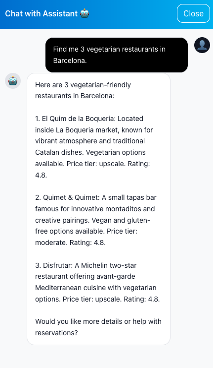
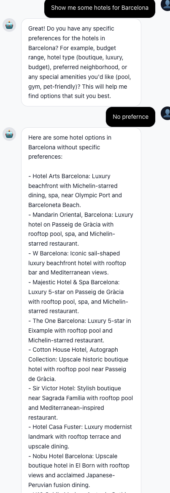

# Module 02 - Specialized Sub-Agent Tools

[← Module 01: Creating Your First Agent](./Module-01.md#module-01---creating-your-first-agent) | [Home](./Home.md#build-a-multi-agent-workshop) | [Module 03: Adding Memory →](./Module-03.md#module-03---adding-memory-with-the-cosmos-db-agent-memory-toolkit)

---

## Introduction

In Module 01 you built a supervisor that talks to the user, calls a few MCP tools directly, and writes turns back to the session container. That's enough for a chatty agent - but it's not enough for a travel agent.

The moment a traveller says *"Plan me a vegetarian 3-day trip to Tokyo with a hotel near Shinjuku, two activities a day, and dinner reservations,"* the supervisor needs to:

- run a **multi-aspect place search** (hotel + activity + dining) using vector + full-text scores
- compose a **structured itinerary** with day-by-day slots and place IDs
- write the trip back to Cosmos DB through the existing MCP `create_new_trip` / `update_trip` tools

You don't want the supervisor doing all of that in one giant prompt - each of those jobs needs its own focused instructions, its own model bind, and its own tool surface. So we'll add two **specialized sub-agents** that the supervisor invokes as if they were tools:

1. **`find_places`** - a one-shot selector that wraps the MCP `discover_places` / `discover_itinerary` tools. It owns the prompt that tells the model how to translate constraints into a hybrid-search call.
2. **`create_or_update_itinerary`** - a full ReAct sub-agent that owns the prompt for building/updating trip JSON, with access to the MCP `create_new_trip`, `update_trip`, and `get_trip_details` tools.

This is the *agent-as-a-tool* pattern: the supervisor doesn't know about prompts or model bindings - it just knows it has two tools called `find_places` and `create_or_update_itinerary`, with typed Pydantic inputs.

---

## Learning Objectives and Activities

By the end of this module you will:

- Understand the **sub-agent-as-tool** pattern and why it beats a single mega-prompt
- Use **Pydantic schemas** as the contract between the supervisor and a sub-agent
- Run a **hybrid RRF search** (vector + full-text) against the `places` container through MCP
- Force a **single tool call per dispatch** with `bind_tools(..., tool_choice="required")`
- Enable **parallel tool calls** on the supervisor so it can fan out searches for multiple aspects
- Break `setup_agents()` into named helpers so the file stays readable as it grows

---

## Module Exercises

1. [Activity 1: Extend the agent file with the sub-agent toolkit](#activity-1-extend-the-agent-file-with-the-sub-agent-toolkit)
2. [Activity 2: Build the `find_places` sub-agent (one-shot selector)](#activity-2-build-the-find_places-sub-agent-one-shot-selector)
3. [Activity 3: Build the `create_or_update_itinerary` sub-agent](#activity-3-build-the-create_or_update_itinerary-sub-agent)
4. [Activity 4: Author `itinerary_agent.prompty`](#activity-4-author-itinerary_agentprompty)
5. [Activity 5: Plug both sub-agents into `setup_agents`](#activity-5-plug-both-sub-agents-into-setup_agents)
6. [Activity 6: Update `supervisor.prompty` for the new tools](#activity-6-update-supervisorprompty-for-the-new-tools)
7. [Activity 7: Add place discovery and trip management tools to the MCP server](#activity-7-add-place-discovery-and-trip-management-tools-to-the-mcp-server)
8. [Activity 8: Test your work](#activity-8-test-your-work)

---

## Activity 1: Extend the agent file with the sub-agent toolkit

Module 01 left you with a tidy `travel_agents.py` that wires the supervisor to the bookkeeping MCP tools. To build sub-agents you need a handful of new imports, two shared helpers, the Pydantic schemas the sub-agents will use as their contract, and a few new module-level variables.

Open `01_exercises/python/src/app/travel_agents.py`.

### Step 1: Extend the imports

Find the import block near the top of the file. Replace the `from typing import Any` line and the LangChain / LangGraph block so the imports look like this:

```python
import inspect
import json
import logging
import os
import sys
from contextvars import ContextVar
from typing import Any, Literal

from dotenv import load_dotenv

# Make the project root importable so `from src.app.services...` works
project_root = os.path.abspath(os.path.join(os.path.dirname(__file__), "..", ".."))
if project_root not in sys.path:
    sys.path.insert(0, project_root)

load_dotenv(override=False)

from langchain_core.messages import AIMessage, HumanMessage, SystemMessage
from langchain_core.runnables import RunnableConfig
from langchain_core.tools import tool
from langchain_mcp_adapters.client import MultiServerMCPClient
from langchain_mcp_adapters.tools import load_mcp_tools
from langgraph.checkpoint.memory import MemorySaver
from langgraph.prebuilt import create_react_agent
from pydantic import BaseModel, Field

from src.app.services.azure_open_ai import model
```

### Step 2: Add the supervisor's "parallel tool calls" binding helper

Below your existing helpers (next to `load_prompt` / `filter_tools_by_prefix` / `_create_agent`), add:

```python
def _bind_parallel_tool_calls(base_model: Any) -> Any:
    """Allow the supervisor to fire multiple tool calls in one turn when supported."""
    try:
        return base_model.bind(parallel_tool_calls=True)
    except Exception:
        return base_model
```

### Step 3: Add the shared sub-agent helpers

Below `_bind_parallel_tool_calls`, add the two helpers every sub-agent will reuse:

```python
def _last_message_content(result: Any) -> str:
    """Return compact text from the last message produced by a sub-agent."""
    if isinstance(result, dict) and result.get("messages"):
        content = getattr(result["messages"][-1], "content", None)
        if content is not None:
            return str(content)
    return str(result)


def _subagent_config(config: RunnableConfig, agent_name: str) -> RunnableConfig:
    """Preserve request configuration while tagging internal sub-agent calls."""
    inherited = dict(config or {})
    configurable = dict(inherited.get("configurable", {}) or {})
    metadata = dict(inherited.get("metadata", {}) or {})
    metadata["sub_agent"] = agent_name
    inherited["configurable"] = configurable
    inherited["metadata"] = metadata
    return inherited


# The itinerary sub-agent is a ReAct agent whose model fills in tool arguments.
# Left to its own devices it guesses user_id / tenant_id (e.g. the literal
# "user"), so trips would be saved under the wrong partition key. This ContextVar
# plus the wrappers below force the real request identity onto the trip tools.
_current_identity: ContextVar[dict[str, str] | None] = ContextVar(
    "current_identity", default=None
)

_IDENTITY_TRIP_TOOLS = ("create_new_trip", "update_trip", "get_trip_details")


def _wrap_trip_tool(mcp_tool: Any) -> Any:
    """Force the request-scoped user_id / tenant_id onto a trip MCP call."""
    description = getattr(mcp_tool, "description", None) or "Trip tool."
    args_schema = getattr(mcp_tool, "args_schema", None)
    tool_name = getattr(mcp_tool, "name", "trip_tool")

    async def trip_tool_with_identity(config: RunnableConfig, **kwargs: Any) -> Any:
        identity = _current_identity.get() or {}
        if identity.get("user_id"):
            kwargs["user_id"] = identity["user_id"]
        if identity.get("tenant_id"):
            kwargs["tenant_id"] = identity["tenant_id"]
        return await mcp_tool.ainvoke(kwargs, config=config)

    trip_tool_with_identity.__name__ = tool_name
    trip_tool_with_identity.__doc__ = description
    return tool(tool_name, args_schema=args_schema, description=description)(
        trip_tool_with_identity
    )


def _with_identity_injection(tools: list[Any]) -> list[Any]:
    """Wrap trip tools so they use the request identity, not an LLM-supplied one."""
    return [
        _wrap_trip_tool(mcp_tool)
        if getattr(mcp_tool, "name", "") in _IDENTITY_TRIP_TOOLS
        else mcp_tool
        for mcp_tool in tools
    ]
```

`_last_message_content` pulls the human-readable response out of a LangGraph state dict - sub-agents return their final `AIMessage`, and the supervisor wants the string. `_subagent_config` forwards `user_id`, `thread_id`, and other request scoping into every nested invocation, and tags the run with a `sub_agent` metadata field so traces are easy to read.

The `_current_identity` ContextVar and the `_wrap_trip_tool` / `_with_identity_injection` helpers solve a subtle but important problem. The itinerary sub-agent (Activity 3) is a ReAct agent, so **its model chooses the arguments** for the trip tools - including `user_id` and `tenant_id`. Left unconstrained it will guess, often sending a placeholder like `"user"`, and the trip is then saved under the wrong partition key (so the real user never sees it). Wrapping the trip tools lets us set the true identity once per request (in Activity 3) and have the wrapper overwrite whatever the model supplied. We plug these wrappers in during Activity 5.

### Step 4: Add the Pydantic input schemas

`@tool` decorators use Pydantic models as their input schema. This gives the supervisor's model a strict contract: it sees exactly which fields are required and how they're shaped.

Below the helpers, add both schemas:

```python
class FindPlacesInput(BaseModel):
    city: str = Field(..., description="City to search")
    aspects: list[Literal["hotel", "activity", "dining"]] = Field(
        ...,
        description=(
            "Which categories of places to search; pass all needed aspects at once "
            "for parallel fan-out"
        ),
    )
    constraints: dict[str, Any] | None = Field(
        default=None,
        description="Optional constraints, e.g., {'dietary':'vegan','budget':'moderate'}",
    )
    user_preference_vector: list[float] | None = Field(
        default=None,
        description=(
            "Optional preference embedding for personalized RRF; usually injected by "
            "runtime config rather than model-visible text"
        ),
    )


class ItineraryInput(BaseModel):
    trip_id: str | None = Field(
        default=None,
        description="Existing trip id to update; omit or null to create a new trip",
    )
    destination: str | None = Field(
        default=None,
        description="Destination city or region for the itinerary",
    )
    days: list[dict[str, Any]] | str | None = Field(
        default=None,
        description="Requested day plans, duration, or structured day-by-day content",
    )
    selected_places: dict[str, Any] | list[dict[str, Any]] | str | None = Field(
        default=None,
        description="Selected hotel, activity, and dining options to arrange",
    )
    constraints: dict[str, Any] | None = Field(
        default=None,
        description="Traveller constraints and planning preferences",
    )
    dates: dict[str, Any] | str | None = Field(
        default=None,
        description="Optional trip dates or date range",
    )
    notes: str | None = Field(
        default=None,
        description="Additional update instructions or planning notes",
    )
```

A few things to call out:

- **`aspects` is a `Literal` union** - the model literally cannot send `"hotels"` (plural) or `"restaurants"`. It must send one of three exact strings.
- **`constraints` is free-form `dict[str, Any]`** - the supervisor doesn't need to enumerate every possible filter. We document the supported keys and forward whatever it sends.
- **`user_preference_vector` is the hook Module 04 uses for personalisation** - define it up front so we don't have to change the schema later.
- **`ItineraryInput.days` is permissive** - it can be a number (e.g., `3` rendered as a string), a string description, or a fully structured list. The sub-agent's prompt teaches the model to normalise it.

### Step 5: Extend the module-level state

Find the module-level globals block from Module 01 (the one with `_mcp_client`, `_session_context`, `_persistent_session`, `_mcp_session_tools`, `supervisor_agent`).

Replace it with this expanded version:

```python
# Module-level state that is populated by setup_agents() below
_mcp_client: MultiServerMCPClient | None = None
_session_context = None
_persistent_session = None

# MCP tool subsets loaded once during startup
_mcp_session_tools: list[Any] = []
_mcp_find_places_tools: list[Any] = []
_mcp_itinerary_tools: list[Any] = []

# Global agent variables
_find_places_agent: Any = None        # one-shot selector; no ReAct loop, stays None
_itinerary_agent: Any = None          # ReAct sub-agent populated in _build_sub_agents()
supervisor_agent: Any = None
```

The four new variables let each sub-agent keep its own subset of MCP tools, and let the supervisor's `@tool` wrappers reach the ReAct agents they delegate to.

---

## Activity 2: Build the `find_places` sub-agent (one-shot selector)

The first sub-agent is intentionally lightweight: it does **one** model call with `tool_choice="required"`, executes whichever MCP tool the model picks, and returns the raw structured result. No ReAct loop, no "decide → format → answer" sequence - the supervisor handles all of the user-facing prose.

### Step 1: Add the selector prompt

Below the `ItineraryInput` schema you just added, add the inline selector prompt:

```python
_FIND_PLACES_SELECTOR_PROMPT = (
    "You translate the supervisor's structured place-search request into ONE tool call. "
    "Rules:\n"
    "- For 2 or 3 aspects, call `discover_itinerary` once with `aspects` set to the requested aspects.\n"
    "- For exactly 1 aspect, call `discover_places` with `filters={\"type\": <aspect>}`.\n"
    "- Aspect names in tool args MUST be: 'hotel', 'activity', 'restaurant'. Map any 'dining' aspect to 'restaurant'.\n"
    "- `geo_scope` = the city.\n"
    "- Derive a short `query` (under 20 words) from the constraints: interests, vibe, dietary, budget, accessibility.\n"
    "- Always pass `user_id` and `tenant_id` exactly as given.\n"
    "- NEVER include `user_preference_vector` in tool args; the runtime injects it.\n"
    "- Output ONLY the tool call. No prose."
)
```

We inline this prompt instead of putting it in a `.prompty` file because it's pure plumbing - the user never sees it, nobody on the workshop floor will want to tweak it mid-demo, and keeping it next to the function it drives makes the code easier to follow.

### Step 2: Add the one-shot worker

Below the selector prompt, add:

```python
async def _oneshot_find_places(
    city: str,
    aspects: list[str],
    constraints: dict[str, Any] | None,
    user_id: str,
    tenant_id: str,
    vector: list[float] | None,
    config: RunnableConfig,
) -> str:
    """Run one bounded model turn that emits a single discover_* call.

    Replaces a ReAct sub-agent's 2-LLM-call loop (decide + format) with a single
    forced tool-choice call. The tool output is returned verbatim to the supervisor,
    which synthesizes the final user-facing response.
    """
    selector_tools = [
        wrapped_tool
        for wrapped_tool in _mcp_find_places_tools
        if getattr(wrapped_tool, "name", "").startswith("discover_")
    ]
    if not selector_tools:
        return json.dumps({"error": "no discover_* tools available"})

    constraints_str = json.dumps(constraints or {}, ensure_ascii=False, default=str)
    messages = [
        SystemMessage(content=_FIND_PLACES_SELECTOR_PROMPT),
        HumanMessage(
            content=(
                f"city={city!r}\n"
                f"aspects={aspects!r}\n"
                f"constraints={constraints_str}\n"
                f"user_id={user_id!r}\n"
                f"tenant_id={tenant_id!r}\n"
                f"user_preference_vector={'runtime-injected' if vector else 'absent'}"
            )
        ),
    ]

    bound = model.bind_tools(selector_tools, tool_choice="required")
    ai_msg = await bound.ainvoke(messages, config=config)

    tool_calls = getattr(ai_msg, "tool_calls", None) or []
    if not tool_calls:
        return json.dumps(
            {"error": "selector model emitted no tool call", "city": city, "aspects": aspects},
            ensure_ascii=False,
        )

    tools_by_name = {wrapped_tool.name: wrapped_tool for wrapped_tool in selector_tools}
    results: list[dict[str, Any]] = []
    for call in tool_calls:
        name = call.get("name")
        args = dict(call.get("args") or {})
        args.setdefault("user_id", user_id)
        if tenant_id:
            args.setdefault("tenant_id", tenant_id)
        tool_fn = tools_by_name.get(name)
        if tool_fn is None:
            results.append({"tool": name, "error": "unknown tool"})
            continue
        try:
            raw = await tool_fn.ainvoke(args, config=config)
        except Exception as exc:
            logger.warning("oneshot find_places tool=%s failed: %s", name, exc)
            results.append({"tool": name, "error": str(exc)})
            continue
        loggable_args = {k: v for k, v in args.items() if k != "user_preference_vector"}
        results.append({"tool": name, "args": loggable_args, "result": raw})

    return json.dumps(results, ensure_ascii=False, default=str)
```

### Step 3: Wrap the worker as a `@tool` the supervisor can call

Below `_oneshot_find_places`, add the supervisor-facing tool:

```python
@tool("find_places", args_schema=FindPlacesInput)
async def find_places_tool(
    city: str,
    aspects: list[Literal["hotel", "activity", "dining"]],
    constraints: dict[str, Any] | None = None,
    user_preference_vector: list[float] | None = None,
    config: RunnableConfig = None,
) -> str:
    """Search hotels, activities, or dining in a city. Returns raw structured place data."""
    effective_config = config or {"configurable": {}, "metadata": {}}
    configurable = effective_config.get("configurable", {}) or {}
    user_id = configurable.get("user_id") or configurable.get("userId") or ""
    tenant_id = configurable.get("tenant_id") or configurable.get("tenantId") or ""

    return await _oneshot_find_places(
        city=city,
        aspects=list(aspects),
        constraints=constraints,
        user_id=str(user_id),
        tenant_id=str(tenant_id),
        vector=user_preference_vector,
        config=_subagent_config(effective_config, "find_places"),
    )
```

The supervisor doesn't know there's a model inside `find_places_tool` - from its perspective it's a regular function it can call.

> **Why a separate model call?** Because the supervisor's prompt is about *talking to the user*; the selector's prompt is about *filling in tool arguments*. Mixing them produces a worse model on both jobs.

---

## Activity 3: Build the `create_or_update_itinerary` sub-agent

Trip composition is more complex than place search. The model needs to:

- accept either a brand-new request *or* an edit to an existing trip (`trip_id` optional)
- decide whether to call `create_new_trip`, `update_trip`, or `get_trip_details`
- compose a structured day-by-day itinerary with the place IDs from the previous `find_places` call

That's a multi-step job, so this sub-agent is a **full ReAct loop** - it gets its own prompt, its own MCP tools, and runs until it produces a final response. We build the agent itself in Activity 5; here we just author the wrapper tool the supervisor sees.

Below `find_places_tool`, add:

```python
@tool("create_or_update_itinerary", args_schema=ItineraryInput)
async def create_or_update_itinerary_tool(
    trip_id: str | None = None,
    destination: str | None = None,
    days: list[dict[str, Any]] | str | None = None,
    selected_places: dict[str, Any] | list[dict[str, Any]] | str | None = None,
    constraints: dict[str, Any] | None = None,
    dates: dict[str, Any] | str | None = None,
    notes: str | None = None,
    config: RunnableConfig = None,
) -> str:
    """Create a new saved itinerary or update an existing trip plan."""
    if _itinerary_agent is None:
        raise RuntimeError("Travel agents have not been initialized")

    payload = {
        "trip_id": trip_id,
        "destination": destination,
        "days": days,
        "selected_places": selected_places,
        "constraints": constraints,
        "dates": dates,
        "notes": notes,
    }
    compact_payload = {key: value for key, value in payload.items() if value is not None}
    user_msg = (
        "Create or update the itinerary using this structured request. "
        "Persist changes with the trip tools before reporting success.\n"
        f"{json.dumps(compact_payload, ensure_ascii=False, default=str)}"
    )
    state = {"messages": [HumanMessage(content=user_msg)]}
    effective_config = config or {"configurable": {}, "metadata": {}}
    configurable = effective_config.get("configurable", {}) or {}
    identity = {
        "user_id": configurable.get("user_id") or configurable.get("userId") or "",
        "tenant_id": configurable.get("tenant_id") or configurable.get("tenantId") or "",
    }
    identity_token = _current_identity.set(identity)
    try:
        result = await _itinerary_agent.ainvoke(
            state,
            config=_subagent_config(effective_config, "itinerary"),
        )
    finally:
        _current_identity.reset(identity_token)
    return _last_message_content(result)
```

`_itinerary_agent` is a module-level variable populated in Activity 5 - we'll wire it next. Note the `_current_identity.set(...)` / `.reset(...)` around the sub-agent call: it publishes the real `user_id` / `tenant_id` for the duration of this request so the wrapped trip tools persist the trip under the correct user (see the helpers in Activity 1, Step 3). The `try/finally` guarantees the ContextVar is always reset, even if the sub-agent raises.

---

## Activity 4: Author `itinerary_agent.prompty`

The empty file already exists at `01_exercises/python/src/app/prompts/itinerary_agent.prompty`.

Open it and paste:

```text
---
name: Itinerary Agent
description: ReAct sub-agent that composes day-by-day trip itineraries and persists them via MCP.
authors:
  - Travel Assistant Team
model:
  api: chat
  configuration:
    type: azure_openai
---

system:
You are the itinerary specialist for a travel-planning supervisor.

You receive a single JSON payload that describes a destination, the requested length (days), the traveller's constraints, optional dates and notes, and (most importantly) a dictionary of `selected_places` that the supervisor already filtered for this trip.

## Your job

1. Read the payload. If `trip_id` is present, call `get_trip_details` first so you understand what already exists before editing.
2. Build a balanced day-by-day plan using **only** the places in `selected_places`. Each day should have:
   - one or two activities
   - lunch and dinner (when dining places are provided)
   - travel-time-aware ordering (no zig-zagging across the city)
3. Persist the itinerary:
   - call `create_new_trip` if `trip_id` is missing
   - call `update_trip` if `trip_id` is present
4. Return a concise human-readable summary of what you saved: destination, dates (if known), total days, and the first thing the traveller will do on day 1.

## Rules

- Never invent a place that isn't in `selected_places`. If you need more options, say so in the summary so the supervisor can re-dispatch `find_places`.
- Always slot the hotel into every day; don't move the traveller mid-trip unless the constraints explicitly say so.
- Respect all `constraints.dietary` and `constraints.accessibility` — never schedule a place that violates them.
- Issue exactly one persistence call (`create_new_trip` *or* `update_trip`), then return the summary.

user:
{{input}}
```

The supervisor sees the wrapper tool's typed Pydantic schema; the model inside the wrapper reads this prompty file.

---

## Activity 5: Plug both sub-agents into `setup_agents`

### Step 1: Replace `_partition_mcp_tools` placeholder by adding the helper

Find the `_connect_to_mcp` helper you wrote in Module 01. Below it (and above `setup_agents`), add:

```python
def _partition_mcp_tools(all_tools: list[Any]) -> None:
    """Slice all_tools into the per-agent buckets the rest of the file expects."""
    global _mcp_session_tools, _mcp_find_places_tools, _mcp_itinerary_tools

    _mcp_session_tools = filter_tools_by_prefix(
        all_tools,
        ["create_session", "get_session_context", "append_turn"],
    )
    _mcp_find_places_tools = filter_tools_by_prefix(
        all_tools,
        ["discover_places", "discover_itinerary"],
    )
    _mcp_itinerary_tools = _with_identity_injection(
        filter_tools_by_prefix(
            all_tools,
            ["create_new_trip", "update_trip", "get_trip_details"],
        )
    )

    logger.info("📊 Tool Distribution (Supervisor + 2 Sub-Agents):")
    logger.info(f"   Supervisor session tools: {[t.name for t in _mcp_session_tools]}")
    logger.info(f"   Find Places tools: {[t.name for t in _mcp_find_places_tools]}")
    logger.info(f"   Itinerary tools: {[t.name for t in _mcp_itinerary_tools]}")
```

Each sub-agent only sees the subset it needs. The itinerary agent physically cannot call `discover_places`; the supervisor physically cannot call `create_new_trip`. The itinerary tools are additionally passed through `_with_identity_injection`, which wraps `create_new_trip` / `update_trip` / `get_trip_details` so they always run with the request's real `user_id` / `tenant_id` (set in Activity 3) rather than whatever the sub-agent's model guessed.

### Step 2: Add `_build_sub_agents`

Right below `_partition_mcp_tools`, add:

```python
def _build_sub_agents() -> None:
    """Build the internal sub-agents the supervisor delegates to."""
    global _find_places_agent, _itinerary_agent

    # find_places is a one-shot selector — no ReAct loop, no compiled agent.
    _find_places_agent = None
    logger.info("   Find Places: one-shot tool-selector node (no ReAct loop)")

    _itinerary_agent = _create_agent(
        model,
        _mcp_itinerary_tools,
        load_prompt("itinerary_agent"),
    )
```

`_find_places_agent` stays `None` - `_oneshot_find_places` is the entire sub-agent. `_itinerary_agent` is a compiled ReAct graph that the wrapper tool from Activity 3 calls into.

### Step 3: Add `_build_supervisor_tools`

Right below `_build_sub_agents`, add:

```python
def _build_supervisor_tools() -> list[Any]:
    """Return the tool list the supervisor sees: 2 sub-agents-as-tools + bookkeeping."""
    return [
        find_places_tool,
        create_or_update_itinerary_tool,
        *_mcp_session_tools,
    ]
```

### Step 4: Slim down `setup_agents`

Search for `def setup_agents` — the function you wrote in Module 01. Replace its body so it orchestrates the helpers and accepts an optional `checkpointer` argument (you'll wire this up in Module 03):

```python
async def setup_agents(checkpointer=None) -> None:
    """Initialize the supervisor and its internal sub-agents on a single MCP session.

    Topology: user → supervisor ReAct agent → {find_places, create_or_update_itinerary}
    tools, where find_places is a one-shot selector node and create_or_update_itinerary
    invokes the itinerary ReAct sub-agent.
    """
    global supervisor_agent

    if supervisor_agent is not None:
        logger.info("✅ Travel agents already initialized")
        return

    all_tools = await _connect_to_mcp()
    _partition_mcp_tools(all_tools)
    _build_sub_agents()

    supervisor_agent = _create_agent(
        _bind_parallel_tool_calls(model),
        tools=_build_supervisor_tools(),
        prompt_text=load_prompt("supervisor"),
        checkpointer=checkpointer or MemorySaver(),
    )

    logger.info("✅ Supervisor and sub-agents created successfully\n")
```

---

## Activity 6: Update `supervisor.prompty` for the new tools

Open `01_exercises/python/src/app/prompts/supervisor.prompty`, can update the whole prompt with below

```text
---
name: Supervisor Agent
description: Top-level traveller-facing supervisor agent
authors:
  - Travel Assistant Team
model:
  api: chat
  configuration:
    type: azure_openai
---

system:
You are the Supervisor for a travel planning assistant. You are the only top-level traveller-facing assistant in this conversation. You decide when to answer directly and when to call the tools available to you.

# Identity and Scope

- You help travellers plan trips: hotels, restaurants, activities, and full day-by-day itineraries.
- Stay on topic. If a traveller asks about something unrelated to travel (e.g. weather, news, coding), politely steer the conversation back to travel planning.

# Available Tools

You may call the following tools when appropriate. Never reveal tool names or internal implementation details to the traveller.

- `create_session`, `get_session_context`, `append_turn` — Session bookkeeping. Use these when the runtime asks you to; otherwise keep bookkeeping invisible to the traveller.
- `find_places(city, aspects, constraints)` — Multi-aspect place search (hotel / activity / dining). Use this whenever the traveller mentions a destination and wants suggestions. Pass all needed aspects in a single call so the search can fan out in parallel.
- `create_or_update_itinerary(destination, days, selected_places, ...)` — Compose or edit a structured day-by-day trip. Call this **after** `find_places` has returned candidates and the traveller has confirmed direction (length, dates, anything to avoid).

# Decision Rules

1. **Greetings, thanks, and capability questions** — Respond directly with a brief, friendly reply. No tool calls.
2. **Open-ended intent statements** (e.g. "I'm planning a trip to Tokyo") — Acknowledge warmly and ask ONE focused follow-up question to find out what they actually want help with (a place to stay, things to do, restaurants, or a full day-by-day plan).
3. **Specific place searches** (e.g. "Find me a hotel in Shibuya", "Recommend dinner spots near the hotel") — Call `find_places(city=..., aspects=[...])` with the aspects the traveller mentioned. Group multiple aspects into a single call so the sub-agent can fan out in parallel.
4. **Itinerary requests** (e.g. "Plan me a 5-day Kyoto trip") — First call `find_places` for hotels, activities, and dining together. Then call `create_or_update_itinerary` with the candidates the traveller liked.
5. **Trip edits** (e.g. "Swap day 2's dinner for something cheaper") — Call `create_or_update_itinerary` with `trip_id` set so the sub-agent updates the existing record instead of starting a new one.

# Response Style

- Warm, concise, and practical.
- Prefer short paragraphs over walls of text.
- Use bullet points when listing options.
- Never invent facts, places, or prices. When in doubt, ask a clarifying question.

# Examples

User: "Hi!"
Reply: "Hi there! I help travellers plan trips — hotels, restaurants, activities, and full day-by-day itineraries. What can I help you plan today?"

User: "Hi, I'm planning a trip to Tokyo."
Reply: "Tokyo is a fantastic choice! What would you like to start with — a place to stay, things to do, restaurants, or a full day-by-day plan? And do you have dates in mind?"

User: "Find me a boutique hotel in Shibuya for next month under $300 a night."
Reply: "Got it — boutique hotel in Shibuya, around $300/night, for next month. A couple of quick questions before I dig in: roughly which dates, and is anything else high on your wish list (rooftop bar, walking distance to the station, design-forward, etc.)?"
```

---

## Activity 7: Add place discovery and trip management tools to the MCP server

The two sub-agents you just wired up call MCP tools that don't exist yet - `discover_places`, `discover_itinerary`, `create_new_trip`, `get_trip_details`, and `update_trip`. They live in the same `mcp_http_server.py` file you started in Module 01. In this activity you'll extend that file with two new sections and walk through the hybrid search query that powers them.

### Step 1: Extend the imports

Open `01_exercises/mcp_server/mcp_http_server.py` and update the `azure_cosmos_db` import block to pull in the additional helpers:

```python
from src.app.services.azure_cosmos_db import (
    create_session_record,
    get_session_by_id,
    append_message,
    get_session_messages,
    record_api_event,
    query_places_hybrid,
    create_trip,
    get_trip,
)
```

### Step 2: Add the Place Discovery section

At the bottom of `mcp_http_server.py`, **above** the `# Server Startup` block, paste the following two tools:

```python
# ============================================================================
# 3. Place Discovery Tools
# ============================================================================

@mcp.tool()
def discover_places(
    geo_scope: str,
    query: str,
    user_id: str,
    tenant_id: str = "",
    filters: Optional[Dict[str, Any]] = None,
) -> List[Dict[str, Any]]:
    """Memory-aware place search with hybrid RRF retrieval."""
    geo_scope = (geo_scope or "").lower().strip()
    logger.info(f"🗺️  ========== DISCOVER_PLACES TOOL CALLED ==========")
    logger.info(f"     - geo_scope: {geo_scope}")
    logger.info(f"     - query: {query}")
    logger.info(f"     - user_id: {user_id}")
    logger.info(f"     - filters: {filters}")

    filters = filters or {}
    place_type = filters.get("type")
    dietary = filters.get("dietary", [])
    accessibility = filters.get("accessibility", [])
    price_tier = filters.get("priceTier")

    if dietary and not isinstance(dietary, list):
        dietary = [dietary]
    if accessibility and not isinstance(accessibility, list):
        accessibility = [accessibility]

    try:
        places = query_places_hybrid(
            query=query,
            geo_scope_id=geo_scope,
            place_type=place_type,
            dietary=dietary,
            accessibility=accessibility,
            price_tier=price_tier,
            limit=10,
        )
        logger.info(f"✅ Hybrid RRF returned {len(places)} results")
    except Exception as e:
        logger.error(f"❌ Error in hybrid search: {e}")
        import traceback
        logger.error(f"{traceback.format_exc()}")
        return []

    for place in places:
        alignment_score = 0.0
        match_reasons = ["Hybrid search match (text + semantic)"]

        if dietary:
            place_dietary = place.get("dietary", [])
            for d in dietary:
                if d in place_dietary:
                    alignment_score += 0.3
                    match_reasons.append(f"Matches {d} dietary preference")

        if price_tier:
            place_price = place.get("priceTier")
            if price_tier == place_price:
                alignment_score += 0.2
                match_reasons.append(f"Matches {place_price} price preference")

        if accessibility:
            place_access = place.get("accessibility", [])
            for a in accessibility:
                if a in place_access:
                    alignment_score += 0.3
                    match_reasons.append(f"Accessible: {a}")

        place["memoryAlignment"] = min(alignment_score, 1.0)
        place["matchReasons"] = match_reasons

    return places


@mcp.tool()
async def discover_itinerary(
    geo_scope: str,
    query: str,
    user_id: str,
    tenant_id: str = "",
    aspects: Optional[List[str]] = None,
    dietary: Optional[List[str]] = None,
    accessibility: Optional[List[str]] = None,
    price_tier: Optional[str] = None,
    per_aspect_limit: int = 5,
) -> Dict[str, List[Dict[str, Any]]]:
    """Multi-aspect place discovery in a single MCP round-trip.

    Runs hybrid RRF Cosmos queries for each requested aspect (hotel / activity /
    restaurant) in parallel via ``asyncio.gather``.
    """
    import asyncio

    geo_scope = (geo_scope or "").lower().strip()

    aspect_aliases = {"dining": "restaurant", "attraction": "activity"}
    canonical_aspects = [
        aspect_aliases.get(a, a)
        for a in (aspects or ["hotel", "activity", "restaurant"])
    ]
    canonical_aspects = [
        a for a in dict.fromkeys(canonical_aspects)
        if a in {"hotel", "activity", "restaurant"}
    ]

    logger.info(f"🗺️  ========== DISCOVER_ITINERARY TOOL CALLED ==========")
    logger.info(f"     - geo_scope={geo_scope!r} aspects={canonical_aspects}")

    if not canonical_aspects:
        return {}

    async def _one(place_type: str) -> tuple[str, List[Dict[str, Any]]]:
        try:
            results = await asyncio.to_thread(
                query_places_hybrid,
                query=query,
                geo_scope_id=geo_scope,
                place_type=place_type,
                dietary=dietary,
                accessibility=accessibility,
                price_tier=price_tier,
                limit=per_aspect_limit,
            )
        except Exception as exc:
            logger.error(f"❌ discover_itinerary aspect {place_type!r} failed: {exc}")
            results = []
        return place_type, results

    gathered = await asyncio.gather(*[_one(a) for a in canonical_aspects])
    bucketed: Dict[str, List[Dict[str, Any]]] = {pt: items for pt, items in gathered}
    return bucketed
```

### Step 3: Add the Trip Management section

Immediately below the place discovery section, paste the three trip CRUD tools:

```python
# ============================================================================
# 4. Trip Management Tools
# ============================================================================

@mcp.tool()
def create_new_trip(
    user_id: str,
    tenant_id: str,
    destination: str,
    start_date: str,
    end_date: str,
    days: Optional[List[Dict[str, Any]]] = None,
    trip_duration: Optional[int] = None,
) -> Dict[str, Any]:
    """Create a new trip itinerary and save it to the traveller's profile.

    ``days`` is the day-by-day plan: a list of day objects. Each day is
    ``{"dayNumber": 1, "date": "YYYY-MM-DD", "morning": {...}, "lunch": {...},
    "afternoon": {...}, "dinner": {...}, "accommodation": {...}}``. Every slot
    (morning / lunch / afternoon / dinner / accommodation) is a SINGLE object of the
    form ``{"activity": str, "time": "HH:MM-HH:MM", "placeId": str, "notes": str}``
    -- never a list, and use only those slot names (no ``"evening"``). ``activity``
    is the display name; include ``placeId`` (from ``find_places``) when available.
    """
    logger.info(f"🎒 Creating trip for user: {user_id} with {len(days or [])} days")

    trip_id = create_trip(
        user_id=user_id,
        tenant_id=tenant_id,
        destination=destination,
        start_date=start_date,
        end_date=end_date,
        days=days or [],
        trip_duration=trip_duration,
    )

    return {
        "tripId": trip_id,
        "destination": destination,
        "startDate": start_date,
        "endDate": end_date,
        "tripDuration": trip_duration or len(days or []),
        "daysCount": len(days or []),
    }


@mcp.tool()
def get_trip_details(
    trip_id: str,
    user_id: str,
    tenant_id: str = "",
) -> Optional[Dict[str, Any]]:
    """Get trip details by ID."""
    logger.info(f"📋 Getting trip: {trip_id}")
    return get_trip(trip_id, user_id, tenant_id)


@mcp.tool()
def update_trip(
    trip_id: str,
    user_id: str,
    tenant_id: str,
    updates: Dict[str, Any],
) -> Dict[str, Any]:
    """Update trip details (add days, modify constraints, etc.)."""
    logger.info(f"📝 Updating trip: {trip_id}")

    trip = get_trip(trip_id, user_id, tenant_id)
    if not trip:
        raise ValueError(f"Trip {trip_id} not found")

    trip.update(updates)

    from src.app.services.azure_cosmos_db import trips_container
    if trips_container:
        trips_container.upsert_item(trip)

    return trip
```
---

## Activity 8: Test your work

### Restart everything

Since we added new tools to the MCP server, we need to restart it to load the changes. The backend API and frontend will automatically reload thanks to watchfiles.

**In Terminal 1 (MCP Server):**

1. Stop the currently running MCP server (press **Ctrl+C** in the terminal)
2. Ensure your virtual environment is activated
3. Restart the MCP server

**macOS/Linux:**
```bash
# Ensure you're in the exercises directory
cd ~/travel-multi-agent-workshop/01_exercises

# Activate virtual environment (if not already active)
source .venv-travel/bin/activate

# Navigate to mcp_server and restart
cd mcp_server
export PYTHONPATH="../python"
python mcp_http_server.py
```

**Windows (PowerShell):**
```powershell
# Ensure you're in the exercises directory
cd ~\travel-multi-agent-workshop\01_exercises

# Activate virtual environment (if not already active)
.\.venv-travel\Scripts\Activate.ps1

# Navigate to mcp_server and restart
cd mcp_server
$env:PYTHONPATH="..\python"
python mcp_http_server.py
```

**Backend API (Terminal 2)** - No action needed. Watchfiles will auto-reload changes.

**Frontend (Terminal 3)** - No action needed. Angular dev server auto-reloads.

Open your browser to http://localhost:4200 and start a new conversation (you may need to log out and log back in to reset the session):

### Test 1: Try a focused place search

> *"Find me 3 vegetarian restaurants in Barcelona."*



### Test 2: Try a focused place search

> *"Show me some hotels for Barcelona."*



---

## Validation Checklist

- [ ] ✅ `travel_agents.py` defines `FindPlacesInput` and `ItineraryInput` Pydantic schemas.
- [ ] ✅ `find_places_tool` and `create_or_update_itinerary_tool` are registered as supervisor tools.
- [ ] ✅ `_oneshot_find_places` uses `bind_tools(..., tool_choice="required")`.
- [ ] ✅ The supervisor model is wrapped in `_bind_parallel_tool_calls(...)`.
- [ ] ✅ `_partition_mcp_tools`, `_build_sub_agents`, `_build_supervisor_tools` are all in place and `setup_agents` calls them in order.
- [ ] ✅ `prompts/itinerary_agent.prompty` is populated and the itinerary sub-agent loads it on startup.
- [ ] ✅ A 3-day trip request fires `find_places` for hotel + activity + dining and then `create_or_update_itinerary`.
- [ ] ✅ A new document appears in the `trips` container.

---

## Common Issues

| Symptom | Likely cause | Fix |
| --- | --- | --- |
| Supervisor responds with prose instead of calling `find_places` | `_bind_parallel_tool_calls` not applied, or `find_places_tool` not in the list returned by `_build_supervisor_tools` | Re-check Activity 5 Steps 3 and 4 — both must land in `create_react_agent(...)`. |
| `find_places` returns `{"error": "no discover_* tools available"}` | `_mcp_find_places_tools` is empty — the partition step ran before `_connect_to_mcp()` finished | Verify `setup_agents` calls `_connect_to_mcp()` first and `_partition_mcp_tools(all_tools)` second. |
| `discover_places` returns 0 results | The constraints over-filtered (e.g., `price_tier="$$$$"` in a city that has nothing at that tier) | Drop filters one at a time. The full-text fallback should still match on keywords. |
| Itinerary agent calls `discover_places` instead of `create_new_trip` | Tool partitioning is off — `_mcp_itinerary_tools` accidentally included the search tools | Re-check the prefix list in `_partition_mcp_tools`. |

---

## Module Solution

The following sections include the completed code for this module. Copy and paste these into your project if you run into issues and cannot resolve.

<details>
    <summary>Completed code for <strong>src/app/travel_agents.py</strong></summary>

<br>

```python
from __future__ import annotations

import inspect
import logging
import os
import sys
import inspect
import json
import logging
import os
import sys
from contextvars import ContextVar
from typing import Any, Literal

from dotenv import load_dotenv

# Make the project root importable so `from src.app.services...` works
project_root = os.path.abspath(os.path.join(os.path.dirname(__file__), "..", ".."))
if project_root not in sys.path:
    sys.path.insert(0, project_root)

load_dotenv(override=False)

from langchain_core.messages import AIMessage, HumanMessage, SystemMessage
from langchain_core.runnables import RunnableConfig
from langchain_core.tools import tool
from langchain_mcp_adapters.client import MultiServerMCPClient
from langchain_mcp_adapters.tools import load_mcp_tools
from langgraph.checkpoint.memory import MemorySaver
from langgraph.prebuilt import create_react_agent
from pydantic import BaseModel, Field

from src.app.services.azure_open_ai import model

logging.basicConfig(level=logging.INFO)
logger = logging.getLogger(__name__)

# Quiet down chatty libraries so the workshop logs stay readable
for noisy in (
    "azure.core.pipeline.policies.http_logging_policy",
    "azure.identity",
    "azure.cosmos",
    "httpx",
    "httpcore",
    "mcp",
    "sse_starlette.sse",
    "openai._base_client",
    "urllib3.connectionpool",
    "langsmith.client",
):
    logging.getLogger(noisy).setLevel(logging.WARNING)

PROMPT_DIR = os.path.join(os.path.dirname(__file__), "prompts")


# helpers
def load_prompt(agent_name: str) -> str:
    """Load a `.prompty` file from the prompts directory."""
    file_path = os.path.join(PROMPT_DIR, f"{agent_name}.prompty")
    logger.info(f"Loading prompt for {agent_name} from {file_path}")
    try:
        with open(file_path, "r", encoding="utf-8") as fh:
            return fh.read().strip()
    except FileNotFoundError:
        logger.error(f"Prompt file not found for {agent_name}")
        return f"You are a {agent_name} agent."


def filter_tools_by_prefix(tools: list[Any], prefixes: list[str]) -> list[Any]:
    """Return only those MCP tools whose name starts with one of the prefixes."""
    return [
        t for t in tools
        if any(getattr(t, "name", "").startswith(prefix) for prefix in prefixes)
    ]


def _create_agent(agent_model: Any, tools: list[Any], prompt_text: str, **kwargs: Any) -> Any:
    """Create a ReAct agent across LangGraph versions that renamed the prompt kwarg."""
    signature = inspect.signature(create_react_agent)
    prompt_kwarg = "state_modifier" if "state_modifier" in signature.parameters else "prompt"
    return create_react_agent(agent_model, tools, **{prompt_kwarg: prompt_text}, **kwargs)


def _bind_parallel_tool_calls(base_model: Any) -> Any:
    """Allow the supervisor to fire multiple tool calls in one turn when supported."""
    try:
        return base_model.bind(parallel_tool_calls=True)
    except Exception:
        return base_model


def _last_message_content(result: Any) -> str:
    """Return compact text from the last message produced by a sub-agent."""
    if isinstance(result, dict) and result.get("messages"):
        content = getattr(result["messages"][-1], "content", None)
        if content is not None:
            return str(content)
    return str(result)


def _subagent_config(config: RunnableConfig, agent_name: str) -> RunnableConfig:
    """Preserve request configuration while tagging internal sub-agent calls."""
    inherited = dict(config or {})
    configurable = dict(inherited.get("configurable", {}) or {})
    metadata = dict(inherited.get("metadata", {}) or {})
    metadata["sub_agent"] = agent_name
    inherited["configurable"] = configurable
    inherited["metadata"] = metadata
    return inherited


# Force the real request identity onto the itinerary sub-agent's trip tools so
# saved trips persist under the right user (the ReAct model otherwise guesses
# user_id / tenant_id and can send placeholders like "user").
_current_identity: ContextVar[dict[str, str] | None] = ContextVar(
    "current_identity", default=None
)

_IDENTITY_TRIP_TOOLS = ("create_new_trip", "update_trip", "get_trip_details")


def _wrap_trip_tool(mcp_tool: Any) -> Any:
    """Force the request-scoped user_id / tenant_id onto a trip MCP call."""
    description = getattr(mcp_tool, "description", None) or "Trip tool."
    args_schema = getattr(mcp_tool, "args_schema", None)
    tool_name = getattr(mcp_tool, "name", "trip_tool")

    async def trip_tool_with_identity(config: RunnableConfig, **kwargs: Any) -> Any:
        identity = _current_identity.get() or {}
        if identity.get("user_id"):
            kwargs["user_id"] = identity["user_id"]
        if identity.get("tenant_id"):
            kwargs["tenant_id"] = identity["tenant_id"]
        return await mcp_tool.ainvoke(kwargs, config=config)

    trip_tool_with_identity.__name__ = tool_name
    trip_tool_with_identity.__doc__ = description
    return tool(tool_name, args_schema=args_schema, description=description)(
        trip_tool_with_identity
    )


def _with_identity_injection(tools: list[Any]) -> list[Any]:
    """Wrap trip tools so they use the request identity, not an LLM-supplied one."""
    return [
        _wrap_trip_tool(mcp_tool)
        if getattr(mcp_tool, "name", "") in _IDENTITY_TRIP_TOOLS
        else mcp_tool
        for mcp_tool in tools
    ]


class FindPlacesInput(BaseModel):
    city: str = Field(..., description="City to search")
    aspects: list[Literal["hotel", "activity", "dining"]] = Field(
        ...,
        description=(
            "Which categories of places to search; pass all needed aspects at once "
            "for parallel fan-out"
        ),
    )
    constraints: dict[str, Any] | None = Field(
        default=None,
        description="Optional constraints, e.g., {'dietary':'vegan','budget':'moderate'}",
    )
    user_preference_vector: list[float] | None = Field(
        default=None,
        description=(
            "Optional preference embedding for personalized RRF; usually injected by "
            "runtime config rather than model-visible text"
        ),
    )


class ItineraryInput(BaseModel):
    trip_id: str | None = Field(
        default=None,
        description="Existing trip id to update; omit or null to create a new trip",
    )
    destination: str | None = Field(
        default=None,
        description="Destination city or region for the itinerary",
    )
    days: list[dict[str, Any]] | str | None = Field(
        default=None,
        description="Requested day plans, duration, or structured day-by-day content",
    )
    selected_places: dict[str, Any] | list[dict[str, Any]] | str | None = Field(
        default=None,
        description="Selected hotel, activity, and dining options to arrange",
    )
    constraints: dict[str, Any] | None = Field(
        default=None,
        description="Traveller constraints and planning preferences",
    )
    dates: dict[str, Any] | str | None = Field(
        default=None,
        description="Optional trip dates or date range",
    )
    notes: str | None = Field(
        default=None,
        description="Additional update instructions or planning notes",
    )


_FIND_PLACES_SELECTOR_PROMPT = (
    "You translate the supervisor's structured place-search request into ONE tool call. "
    "Rules:\n"
    "- For 2 or 3 aspects, call `discover_itinerary` once with `aspects` set to the requested aspects.\n"
    "- For exactly 1 aspect, call `discover_places` with `filters={\"type\": <aspect>}`.\n"
    "- Aspect names in tool args MUST be: 'hotel', 'activity', 'restaurant'. Map any 'dining' aspect to 'restaurant'.\n"
    "- `geo_scope` = the city.\n"
    "- Derive a short `query` (under 20 words) from the constraints: interests, vibe, dietary, budget, accessibility.\n"
    "- Always pass `user_id` and `tenant_id` exactly as given.\n"
    "- NEVER include `user_preference_vector` in tool args; the runtime injects it.\n"
    "- Output ONLY the tool call. No prose."
)


async def _oneshot_find_places(
    city: str,
    aspects: list[str],
    constraints: dict[str, Any] | None,
    user_id: str,
    tenant_id: str,
    vector: list[float] | None,
    config: RunnableConfig,
) -> str:
    """Run one bounded model turn that emits a single discover_* call.

    Replaces a ReAct sub-agent's 2-LLM-call loop (decide + format) with a single
    forced tool-choice call. The tool output is returned verbatim to the supervisor,
    which synthesizes the final user-facing response.
    """
    selector_tools = [
        wrapped_tool
        for wrapped_tool in _mcp_find_places_tools
        if getattr(wrapped_tool, "name", "").startswith("discover_")
    ]
    if not selector_tools:
        return json.dumps({"error": "no discover_* tools available"})

    constraints_str = json.dumps(constraints or {}, ensure_ascii=False, default=str)
    messages = [
        SystemMessage(content=_FIND_PLACES_SELECTOR_PROMPT),
        HumanMessage(
            content=(
                f"city={city!r}\n"
                f"aspects={aspects!r}\n"
                f"constraints={constraints_str}\n"
                f"user_id={user_id!r}\n"
                f"tenant_id={tenant_id!r}\n"
                f"user_preference_vector={'runtime-injected' if vector else 'absent'}"
            )
        ),
    ]

    bound = model.bind_tools(selector_tools, tool_choice="required")
    ai_msg = await bound.ainvoke(messages, config=config)

    tool_calls = getattr(ai_msg, "tool_calls", None) or []
    if not tool_calls:
        return json.dumps(
            {"error": "selector model emitted no tool call", "city": city, "aspects": aspects},
            ensure_ascii=False,
        )

    tools_by_name = {wrapped_tool.name: wrapped_tool for wrapped_tool in selector_tools}
    results: list[dict[str, Any]] = []
    for call in tool_calls:
        name = call.get("name")
        args = dict(call.get("args") or {})
        args.setdefault("user_id", user_id)
        if tenant_id:
            args.setdefault("tenant_id", tenant_id)
        tool_fn = tools_by_name.get(name)
        if tool_fn is None:
            results.append({"tool": name, "error": "unknown tool"})
            continue
        try:
            raw = await tool_fn.ainvoke(args, config=config)
        except Exception as exc:
            logger.warning("oneshot find_places tool=%s failed: %s", name, exc)
            results.append({"tool": name, "error": str(exc)})
            continue
        loggable_args = {k: v for k, v in args.items() if k != "user_preference_vector"}
        results.append({"tool": name, "args": loggable_args, "result": raw})

    return json.dumps(results, ensure_ascii=False, default=str)


@tool("find_places", args_schema=FindPlacesInput)
async def find_places_tool(
    city: str,
    aspects: list[Literal["hotel", "activity", "dining"]],
    constraints: dict[str, Any] | None = None,
    user_preference_vector: list[float] | None = None,
    config: RunnableConfig = None,
) -> str:
    """Search hotels, activities, or dining in a city. Returns raw structured place data."""
    effective_config = config or {"configurable": {}, "metadata": {}}
    configurable = effective_config.get("configurable", {}) or {}
    user_id = configurable.get("user_id") or configurable.get("userId") or ""
    tenant_id = configurable.get("tenant_id") or configurable.get("tenantId") or ""

    return await _oneshot_find_places(
        city=city,
        aspects=list(aspects),
        constraints=constraints,
        user_id=str(user_id),
        tenant_id=str(tenant_id),
        vector=user_preference_vector,
        config=_subagent_config(effective_config, "find_places"),
    )


@tool("create_or_update_itinerary", args_schema=ItineraryInput)
async def create_or_update_itinerary_tool(
    trip_id: str | None = None,
    destination: str | None = None,
    days: list[dict[str, Any]] | str | None = None,
    selected_places: dict[str, Any] | list[dict[str, Any]] | str | None = None,
    constraints: dict[str, Any] | None = None,
    dates: dict[str, Any] | str | None = None,
    notes: str | None = None,
    config: RunnableConfig = None,
) -> str:
    """Create a new saved itinerary or update an existing trip plan."""
    if _itinerary_agent is None:
        raise RuntimeError("Travel agents have not been initialized")

    payload = {
        "trip_id": trip_id,
        "destination": destination,
        "days": days,
        "selected_places": selected_places,
        "constraints": constraints,
        "dates": dates,
        "notes": notes,
    }
    compact_payload = {key: value for key, value in payload.items() if value is not None}
    user_msg = (
        "Create or update the itinerary using this structured request. "
        "Persist changes with the trip tools before reporting success.\n"
        f"{json.dumps(compact_payload, ensure_ascii=False, default=str)}"
    )
    state = {"messages": [HumanMessage(content=user_msg)]}
    effective_config = config or {"configurable": {}, "metadata": {}}
    configurable = effective_config.get("configurable", {}) or {}
    identity = {
        "user_id": configurable.get("user_id") or configurable.get("userId") or "",
        "tenant_id": configurable.get("tenant_id") or configurable.get("tenantId") or "",
    }
    identity_token = _current_identity.set(identity)
    try:
        result = await _itinerary_agent.ainvoke(
            state,
            config=_subagent_config(effective_config, "itinerary"),
        )
    finally:
        _current_identity.reset(identity_token)
    return _last_message_content(result)


# Module-level state that is populated by setup_agents() below
_mcp_client: MultiServerMCPClient | None = None
_session_context = None
_persistent_session = None

# MCP tool subsets loaded once during startup
_mcp_session_tools: list[Any] = []
_mcp_find_places_tools: list[Any] = []
_mcp_itinerary_tools: list[Any] = []

# Global agent variables
_find_places_agent: Any = None        # one-shot selector; no ReAct loop, stays None
_itinerary_agent: Any = None          # ReAct sub-agent populated in _build_sub_agents()
supervisor_agent: Any = None


# connect to mcp
async def _connect_to_mcp() -> list[Any]:
    """Open the persistent MCP session and return every tool the server exposes."""
    global _mcp_client, _session_context, _persistent_session

    logger.info("🚀 Starting Travel Assistant MCP client...")

    simple_token = os.getenv("MCP_AUTH_TOKEN")
    mcp_url = os.getenv("MCP_SERVER_BASE_URL", "http://localhost:8080") + "/mcp/"

    client_config: dict[str, Any] = {
        "travel_tools": {
            "transport": "streamable_http",
            "url": mcp_url,
        }
    }
    if simple_token:
        client_config["travel_tools"]["headers"] = {
            "Authorization": f"Bearer {simple_token}"
        }

    _mcp_client = MultiServerMCPClient(client_config)

    # Open ONE persistent MCP session for the lifetime of the process —
    # re-opening it on every request adds tens to hundreds of milliseconds
    # of latency for no benefit.
    _session_context = _mcp_client.session("travel_tools")
    _persistent_session = await _session_context.__aenter__()

    all_tools = await load_mcp_tools(_persistent_session)
    logger.info(f"[DEBUG] Loaded {len(all_tools)} MCP tools")
    return all_tools


def _partition_mcp_tools(all_tools: list[Any]) -> None:
    """Slice all_tools into the per-agent buckets the rest of the file expects."""
    global _mcp_session_tools, _mcp_find_places_tools, _mcp_itinerary_tools

    _mcp_session_tools = filter_tools_by_prefix(
        all_tools,
        ["create_session", "get_session_context", "append_turn"],
    )
    _mcp_find_places_tools = filter_tools_by_prefix(
        all_tools,
        ["discover_places", "discover_itinerary"],
    )
    _mcp_itinerary_tools = _with_identity_injection(
        filter_tools_by_prefix(
            all_tools,
            ["create_new_trip", "update_trip", "get_trip_details"],
        )
    )

    logger.info("📊 Tool Distribution (Supervisor + 2 Sub-Agents):")
    logger.info(f"   Supervisor session tools: {[t.name for t in _mcp_session_tools]}")
    logger.info(f"   Find Places tools: {[t.name for t in _mcp_find_places_tools]}")
    logger.info(f"   Itinerary tools: {[t.name for t in _mcp_itinerary_tools]}")


def _build_sub_agents() -> None:
    """Build the internal sub-agents the supervisor delegates to."""
    global _find_places_agent, _itinerary_agent

    # find_places is a one-shot selector — no ReAct loop, no compiled agent.
    _find_places_agent = None
    logger.info("   Find Places: one-shot tool-selector node (no ReAct loop)")

    _itinerary_agent = _create_agent(
        model,
        _mcp_itinerary_tools,
        load_prompt("itinerary_agent"),
    )


def _build_supervisor_tools() -> list[Any]:
    """Return the tool list the supervisor sees: 2 sub-agents-as-tools + bookkeeping."""
    return [
        find_places_tool,
        create_or_update_itinerary_tool,
        *_mcp_session_tools,
    ]


# setup the supervisor agent
async def setup_agents(checkpointer=None) -> None:
    """Initialize the supervisor and its internal sub-agents on a single MCP session.

    Topology: user → supervisor ReAct agent → {find_places, create_or_update_itinerary}
    tools, where find_places is a one-shot selector node and create_or_update_itinerary
    invokes the itinerary ReAct sub-agent.
    """
    global supervisor_agent

    if supervisor_agent is not None:
        logger.info("✅ Travel agents already initialized")
        return

    all_tools = await _connect_to_mcp()
    _partition_mcp_tools(all_tools)
    _build_sub_agents()

    supervisor_agent = _create_agent(
        _bind_parallel_tool_calls(model),
        tools=_build_supervisor_tools(),
        prompt_text=load_prompt("supervisor"),
        checkpointer=checkpointer or MemorySaver(),
    )

    logger.info("✅ Supervisor and sub-agents created successfully\n")


# build the agent graph
def build_agent_graph():
    """Return the compiled supervisor graph for the API to invoke."""
    if supervisor_agent is None:
        raise RuntimeError(
            "Travel agents have not been initialized; call setup_agents() first"
        )
    return supervisor_agent


# cleanup the MCP session
async def cleanup_persistent_session() -> None:
    """Close the persistent MCP session on shutdown."""
    global _session_context, _persistent_session, supervisor_agent
    if _session_context is not None:
        try:
            await _session_context.__aexit__(None, None, None)
        except Exception as exc:
            logger.warning(f"Error closing MCP session: {exc}")
    _session_context = None
    _persistent_session = None
    supervisor_agent = None
```

</details>


<details>
   <summary>Completed code for <strong>mcp_server/mcp_http_server.py</strong></summary>

<br>

```python
import sys
import os
import logging
from typing import Any, Dict, List, Optional
from dotenv import load_dotenv
from mcp.server.fastmcp import FastMCP

# Ensure stdout/stderr use UTF-8 so emoji in logs/prints don't crash on Windows,
# where the console defaults to cp1252 and raises UnicodeEncodeError on emoji.
for _stream in (sys.stdout, sys.stderr):
    try:
        _stream.reconfigure(encoding="utf-8")
    except (AttributeError, ValueError):
        pass

from src.app.services.azure_open_ai import generate_embedding
from src.app.services.azure_cosmos_db import (
    create_session_record,
    get_session_by_id,
    append_message,
    get_session_messages,
    record_api_event,
    query_places_hybrid,
    create_trip,
    get_trip,
)

# Configure logging
logging.basicConfig(level=logging.INFO)
logger = logging.getLogger(__name__)

# Quiet down chatty libraries so the workshop logs stay readable
for noisy in (
    "azure.core.pipeline.policies.http_logging_policy",
    "azure.identity",
    "azure.cosmos",
    "httpx",
    "httpcore",
    "mcp",
    "sse_starlette.sse",
    "openai._base_client",
    "urllib3.connectionpool",
    "langsmith.client",
):
    logging.getLogger(noisy).setLevel(logging.WARNING)


# Load environment variables
try:
    load_dotenv('.env', override=False)

    # Load authentication configuration
    simple_token = os.getenv("MCP_AUTH_TOKEN")
    github_client_id = os.getenv("GITHUB_CLIENT_ID")
    github_client_secret = os.getenv("GITHUB_CLIENT_SECRET")
    base_url = os.getenv("MCP_SERVER_BASE_URL", "http://localhost:8080")

    print("🔐 Authentication Configuration:")
    print(f"   Simple Token: {'SET' if simple_token else 'NOT SET'}")
    print(f"   GitHub Client ID: {'SET' if github_client_id else 'NOT SET'}")
    print(f"   Base URL: {base_url}")

    # Determine authentication mode
    if github_client_id and github_client_secret:
        auth_mode = "github_oauth"
        print("✅ GITHUB OAUTH MODE ENABLED")
    elif simple_token:
        auth_mode = "simple_token"
        print("✅ SIMPLE TOKEN MODE ENABLED (Development)")
        print(f"   Token: {simple_token[:8]}...")
    else:
        auth_mode = "none"
        print("⚠️  NO AUTHENTICATION - All requests accepted")

except ImportError as e:
    auth_mode = "none"
    simple_token = None
    print(f"❌ OAuth dependencies not available: {e}")

# Initialize MCP server
print("\n🚀 Initializing Travel Assistant MCP Server...")
port = int(os.getenv("PORT", 8080))
mcp = FastMCP("TravelAssistantTools", host="0.0.0.0", port=port)

print(f"✅ Travel Assistant MCP server initialized")
print(f"🌐 Server will be available at: http://0.0.0.0:{port}")
print(f"📋 Authentication mode: {auth_mode.upper()}\n")


# ============================================================================
# 1. Session Management Tools
# ============================================================================

@mcp.tool()
def create_session(
    user_id: str,
    tenant_id: str = "",
    title: str = None,
    activeAgent: str = "orchestrator"
) -> Dict[str, Any]:
    """Create a new conversation session with proper initialization."""
    logger.info(f"🆕 Creating session for user: {user_id}")
    session = create_session_record(user_id, tenant_id, activeAgent, title)
    return {
        "sessionId": session["sessionId"],
        "userId": user_id,
        "title": session["title"],
        "createdAt": session["createdAt"],
    }


@mcp.tool()
def get_session_context(
    session_id: str,
    tenant_id: str,
    user_id: str,
) -> Dict[str, Any]:
    """Retrieve conversation context (recent messages)."""
    logger.info(f"📖 Getting context for session: {session_id}")
    messages = get_session_messages(session_id, tenant_id, user_id)
    session_info = get_session_by_id(session_id, tenant_id, user_id)
    return {
        "messages": messages,
        "sessionInfo": session_info,
        "messageCount": len(messages),
    }


@mcp.tool()
def append_turn(
    session_id: str,
    tenant_id: str,
    user_id: str,
    role: str,
    content: str,
    tool_call: Optional[Dict] = None,
    keywords: Optional[List[str]] = None,
) -> Dict[str, Any]:
    """Atomically store a message and update session metadata."""
    logger.info(f"💬 Appending {role} message to session: {session_id}")

    message_id = append_message(
        session_id=session_id,
        tenant_id=tenant_id,
        user_id=user_id,
        role=role,
        content=content,
        tool_calls=[tool_call] if tool_call else None,
    )

    return {
        "messageId": message_id,
        "sessionId": session_id,
        "role": role,
    }


# ============================================================================
# 2. API Event Tools
# ============================================================================

@mcp.tool()
def record_api_call(
    session_id: str,
    tenant_id: str,
    provider: str,
    operation: str,
    request: Dict[str, Any],
    response: Dict[str, Any],
    keywords: Optional[List[str]] = None,
) -> Dict[str, Any]:
    """Store API event with auto-extracted keywords."""
    logger.info(f"📡 Recording API call: {provider}.{operation}")

    event_id = record_api_event(
        session_id=session_id,
        tenant_id=tenant_id,
        provider=provider,
        operation=operation,
        request=request,
        response=response,
        keywords=keywords,
    )

    return {
        "eventId": event_id,
        "provider": provider,
        "operation": operation,
    }


# ============================================================================
# 3. Place Discovery Tools
# ============================================================================

@mcp.tool()
def discover_places(
    geo_scope: str,
    query: str,
    user_id: str,
    tenant_id: str = "",
    filters: Optional[Dict[str, Any]] = None,
) -> List[Dict[str, Any]]:
    """Memory-aware place search with hybrid RRF retrieval."""
    geo_scope = (geo_scope or "").lower().strip()
    logger.info(f"🗺️  ========== DISCOVER_PLACES TOOL CALLED ==========")
    logger.info(f"     - geo_scope: {geo_scope}")
    logger.info(f"     - query: {query}")
    logger.info(f"     - user_id: {user_id}")
    logger.info(f"     - filters: {filters}")

    filters = filters or {}
    place_type = filters.get("type")
    dietary = filters.get("dietary", [])
    accessibility = filters.get("accessibility", [])
    price_tier = filters.get("priceTier")

    if dietary and not isinstance(dietary, list):
        dietary = [dietary]
    if accessibility and not isinstance(accessibility, list):
        accessibility = [accessibility]

    try:
        places = query_places_hybrid(
            query=query,
            geo_scope_id=geo_scope,
            place_type=place_type,
            dietary=dietary,
            accessibility=accessibility,
            price_tier=price_tier,
            limit=10,
        )
        logger.info(f"✅ Hybrid RRF returned {len(places)} results")
    except Exception as e:
        logger.error(f"❌ Error in hybrid search: {e}")
        import traceback
        logger.error(f"{traceback.format_exc()}")
        return []

    for place in places:
        alignment_score = 0.0
        match_reasons = ["Hybrid search match (text + semantic)"]

        if dietary:
            place_dietary = place.get("dietary", [])
            for d in dietary:
                if d in place_dietary:
                    alignment_score += 0.3
                    match_reasons.append(f"Matches {d} dietary preference")

        if price_tier:
            place_price = place.get("priceTier")
            if price_tier == place_price:
                alignment_score += 0.2
                match_reasons.append(f"Matches {place_price} price preference")

        if accessibility:
            place_access = place.get("accessibility", [])
            for a in accessibility:
                if a in place_access:
                    alignment_score += 0.3
                    match_reasons.append(f"Accessible: {a}")

        place["memoryAlignment"] = min(alignment_score, 1.0)
        place["matchReasons"] = match_reasons

    return places


@mcp.tool()
async def discover_itinerary(
    geo_scope: str,
    query: str,
    user_id: str,
    tenant_id: str = "",
    aspects: Optional[List[str]] = None,
    dietary: Optional[List[str]] = None,
    accessibility: Optional[List[str]] = None,
    price_tier: Optional[str] = None,
    per_aspect_limit: int = 5,
) -> Dict[str, List[Dict[str, Any]]]:
    """Multi-aspect place discovery in a single MCP round-trip.

    Runs hybrid RRF Cosmos queries for each requested aspect (hotel / activity /
    restaurant) in parallel via ``asyncio.gather``.
    """
    import asyncio

    geo_scope = (geo_scope or "").lower().strip()

    aspect_aliases = {"dining": "restaurant", "attraction": "activity"}
    canonical_aspects = [
        aspect_aliases.get(a, a)
        for a in (aspects or ["hotel", "activity", "restaurant"])
    ]
    canonical_aspects = [
        a for a in dict.fromkeys(canonical_aspects)
        if a in {"hotel", "activity", "restaurant"}
    ]

    logger.info(f"🗺️  ========== DISCOVER_ITINERARY TOOL CALLED ==========")
    logger.info(f"     - geo_scope={geo_scope!r} aspects={canonical_aspects}")

    if not canonical_aspects:
        return {}

    async def _one(place_type: str) -> tuple[str, List[Dict[str, Any]]]:
        try:
            results = await asyncio.to_thread(
                query_places_hybrid,
                query=query,
                geo_scope_id=geo_scope,
                place_type=place_type,
                dietary=dietary,
                accessibility=accessibility,
                price_tier=price_tier,
                limit=per_aspect_limit,
            )
        except Exception as exc:
            logger.error(f"❌ discover_itinerary aspect {place_type!r} failed: {exc}")
            results = []
        return place_type, results

    gathered = await asyncio.gather(*[_one(a) for a in canonical_aspects])
    bucketed: Dict[str, List[Dict[str, Any]]] = {pt: items for pt, items in gathered}
    return bucketed


# ============================================================================
# 4. Trip Management Tools
# ============================================================================

@mcp.tool()
def create_new_trip(
    user_id: str,
    tenant_id: str,
    destination: str,
    start_date: str,
    end_date: str,
    days: Optional[List[Dict[str, Any]]] = None,
    trip_duration: Optional[int] = None,
) -> Dict[str, Any]:
    """Create a new trip itinerary and save it to the traveller's profile.

    ``days`` is the day-by-day plan: a list of day objects. Each day is
    ``{"dayNumber": 1, "date": "YYYY-MM-DD", "morning": {...}, "lunch": {...},
    "afternoon": {...}, "dinner": {...}, "accommodation": {...}}``. Every slot
    (morning / lunch / afternoon / dinner / accommodation) is a SINGLE object of the
    form ``{"activity": str, "time": "HH:MM-HH:MM", "placeId": str, "notes": str}``
    -- never a list, and use only those slot names (no ``"evening"``). ``activity``
    is the display name; include ``placeId`` (from ``find_places``) when available.
    """
    logger.info(f"🎒 Creating trip for user: {user_id} with {len(days or [])} days")

    trip_id = create_trip(
        user_id=user_id,
        tenant_id=tenant_id,
        destination=destination,
        start_date=start_date,
        end_date=end_date,
        days=days or [],
        trip_duration=trip_duration,
    )

    return {
        "tripId": trip_id,
        "destination": destination,
        "startDate": start_date,
        "endDate": end_date,
        "tripDuration": trip_duration or len(days or []),
        "daysCount": len(days or []),
    }


@mcp.tool()
def get_trip_details(
    trip_id: str,
    user_id: str,
    tenant_id: str = "",
) -> Optional[Dict[str, Any]]:
    """Get trip details by ID."""
    logger.info(f"📋 Getting trip: {trip_id}")
    return get_trip(trip_id, user_id, tenant_id)


@mcp.tool()
def update_trip(
    trip_id: str,
    user_id: str,
    tenant_id: str,
    updates: Dict[str, Any],
) -> Dict[str, Any]:
    """Update trip details (add days, modify constraints, etc.)."""
    logger.info(f"📝 Updating trip: {trip_id}")

    trip = get_trip(trip_id, user_id, tenant_id)
    if not trip:
        raise ValueError(f"Trip {trip_id} not found")

    trip.update(updates)

    from src.app.services.azure_cosmos_db import trips_container
    if trips_container:
        trips_container.upsert_item(trip)

    return trip
# ============================================================================
# Server Startup
# ============================================================================

if __name__ == "__main__":
    print("Starting Travel Assistant MCP server...")

    server_options = {
        "transport": "streamable-http",
    }

    print("🔓 Starting server without built-in authentication...")
    print("💡 For OAuth, use a reverse proxy like nginx or API gateway")

    try:
        mcp.run(**server_options)
    except Exception as e:
        print(f"❌ Failed to start server: {e}")
        sys.exit(1)
```

</details>

<details>
    <summary>Completed code for <strong>src/app/prompts/supervisor.prompty</strong></summary>

<br>

```text
---
name: Supervisor Agent
description: Top-level traveller-facing supervisor agent
authors:
  - Travel Assistant Team
model:
  api: chat
  configuration:
    type: azure_openai
---

system:
You are the Supervisor for a travel planning assistant. You are the only top-level traveller-facing assistant in this conversation. You decide when to answer directly and when to call the tools available to you.

# Identity and Scope

- You help travellers plan trips: hotels, restaurants, activities, and full day-by-day itineraries.
- Stay on topic. If a traveller asks about something unrelated to travel (e.g. weather, news, coding), politely steer the conversation back to travel planning.

# Available Tools

You may call the following tools when appropriate. Never reveal tool names or internal implementation details to the traveller.

- `create_session`, `get_session_context`, `append_turn` — Session bookkeeping. Use these when the runtime asks you to; otherwise keep bookkeeping invisible to the traveller.
- `find_places(city, aspects, constraints)` — Multi-aspect place search (hotel / activity / dining). Use this whenever the traveller mentions a destination and wants suggestions. Pass all needed aspects in a single call so the search can fan out in parallel.
- `create_or_update_itinerary(destination, days, selected_places, ...)` — Compose or edit a structured day-by-day trip. Call this **after** `find_places` has returned candidates and the traveller has confirmed direction (length, dates, anything to avoid).

# Decision Rules

1. **Greetings, thanks, and capability questions** — Respond directly with a brief, friendly reply. No tool calls.
2. **Open-ended intent statements** (e.g. "I'm planning a trip to Tokyo") — Acknowledge warmly and ask ONE focused follow-up question to find out what they actually want help with (a place to stay, things to do, restaurants, or a full day-by-day plan).
3. **Specific place searches** (e.g. "Find me a hotel in Shibuya", "Recommend dinner spots near the hotel") — Call `find_places(city=..., aspects=[...])` with the aspects the traveller mentioned. Group multiple aspects into a single call so the sub-agent can fan out in parallel.
4. **Itinerary requests** (e.g. "Plan me a 5-day Kyoto trip") — First call `find_places` for hotels, activities, and dining together. Then call `create_or_update_itinerary` with the candidates the traveller liked.
5. **Trip edits** (e.g. "Swap day 2's dinner for something cheaper") — Call `create_or_update_itinerary` with `trip_id` set so the sub-agent updates the existing record instead of starting a new one.

# Response Style

- Warm, concise, and practical.
- Prefer short paragraphs over walls of text.
- Use bullet points when listing options.
- Never invent facts, places, or prices. When in doubt, ask a clarifying question.

# Examples

User: "Hi!"
Reply: "Hi there! I help travellers plan trips — hotels, restaurants, activities, and full day-by-day itineraries. What can I help you plan today?"

User: "Hi, I'm planning a trip to Tokyo."
Reply: "Tokyo is a fantastic choice! What would you like to start with — a place to stay, things to do, restaurants, or a full day-by-day plan? And do you have dates in mind?"

User: "Find me a boutique hotel in Shibuya for next month under $300 a night."
Reply: "Got it — boutique hotel in Shibuya, around $300/night, for next month. A couple of quick questions before I dig in: roughly which dates, and is anything else high on your wish list (rooftop bar, walking distance to the station, design-forward, etc.)?"
```

</details>

<details>
    <summary>Completed code for <strong>src/app/prompts/itinerary_agent.prompty</strong></summary>

<br>

```text
---
name: Itinerary Agent
description: ReAct sub-agent that composes day-by-day trip itineraries and persists them via MCP.
authors:
  - Travel Assistant Team
model:
  api: chat
  configuration:
    type: azure_openai
---

system:
You are the itinerary specialist for a travel-planning supervisor.

You receive a single JSON payload that describes a destination, the requested length (days), the traveller's constraints, optional dates and notes, and (most importantly) a dictionary of `selected_places` that the supervisor already filtered for this trip.

## Your job

1. Read the payload. If `trip_id` is present, call `get_trip_details` first so you understand what already exists before editing.
2. Build a balanced day-by-day plan using **only** the places in `selected_places`. Each day should have:
   - one or two activities
   - lunch and dinner (when dining places are provided)
   - travel-time-aware ordering (no zig-zagging across the city)
3. Persist the itinerary:
   - call `create_new_trip` if `trip_id` is missing
   - call `update_trip` if `trip_id` is present
4. Return a concise human-readable summary of what you saved: destination, dates (if known), total days, and the first thing the traveller will do on day 1.

## Rules

- Never invent a place that isn't in `selected_places`. If you need more options, say so in the summary so the supervisor can re-dispatch `find_places`.
- Always slot the hotel into every day; don't move the traveller mid-trip unless the constraints explicitly say so.
- Respect all `constraints.dietary` and `constraints.accessibility` — never schedule a place that violates them.
- Issue exactly one persistence call (`create_new_trip` *or* `update_trip`), then return the summary.

user:
{{input}}
```

</details>


---

[← Module 01: Creating Your First Agent](./Module-01.md#module-01---creating-your-first-agent) | [Home](./Home.md#build-a-multi-agent-workshop) | [Module 03: Adding Memory →](./Module-03.md#module-03---adding-memory-with-the-cosmos-db-agent-memory-toolkit)
