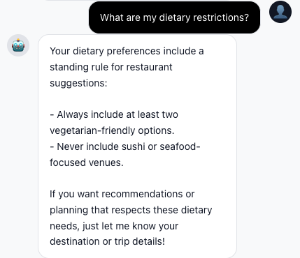

# Module 03 - Adding Memory with the Cosmos DB Agent Memory Toolkit

[← Module 02: Specialized Sub-Agent Tools](./Module-02.md#module-02---specialized-sub-agent-tools) | [Home](./Home.md#build-a-multi-agent-workshop) | [Module 04: Making Memory Intelligent →](./Module-04.md#module-04---making-memory-intelligent-3-way-rrf-personalisation)

---

## Introduction

Your supervisor can now plan trips, and search places. But it has **no memory of the user**. 

In this module you'll give your agents memory. **Two kinds of memory.**

1. **State** - the LangGraph checkpointer. So a paused conversation can resume after a process restart.
2. **Short term and Long-term, cross-session memory** - the user's stable preferences, the last few summaries of what you discussed, the rolling profile that the orchestrator can reference even in a brand-new session.

For the short-term and long-term memory you'll use the [`azure-cosmos-agent-memory`](https://pypi.org/project/azure-cosmos-agent-memory/) toolkit: a small, focused package that manages the full pipeline (extract facts from raw turns, deduplicate against existing facts, roll thread summaries, roll user summaries, embed, write to Cosmos DB) so your application code only has to call **three** simple tools: `add_turn`, `recall_memories`, `get_user_summary`.

By the end of this module, your agents will remember that a user is vegetarian, prefers boutique hotels, loves art museums, and has already visited certain places - creating experiences that improve with every interaction.

---

## Learning Objectives and Activities

By the end of this module you will:

- Understand the difference between checkpointer state, short-term and long-term agentic memory
- Wire LangGraph's async Cosmos DB checkpointer for durable per-session state
- Know the three memory types the toolkit produces — **fact**, **episodic**, **procedural** - and how they differ from raw **turns**
- Wire a process-wide **`AsyncCosmosMemoryClient`** singleton into FastAPI's lifespan
- Expose the toolkit's `add_turn`, `recall_memories`, and `get_user_summary` operations as MCP tools so the agents can both *capture* and *recall* memory through ordinary tool calls
- Teach the supervisor (via its prompt) when to call `recall_memories` and `add_turn`

---

## Module Exercises

1. [Activity 1: Understanding Agentic Memory](#activity-1-understanding-agentic-memory)
2. [Activity 2: Wiring the LangGraph Cosmos DB Checkpointer](#activity-2-wiring-the-langgraph-cosmos-db-checkpointer)
3. [Activity 3: Build the async memory client wrapper](#activity-3-build-the-async-memory-client-wrapper)
4. [Activity 4: Wire the memory client into the FastAPI lifespan](#activity-4-wire-the-memory-client-into-the-fastapi-lifespan)
5. [Activity 5: Add memory tools to the MCP server](#activity-5-add-memory-tools-to-the-mcp-server)
6. [Activity 6: Wire the new tools into the agents](#activity-6-wire-the-new-tools-into-the-agents)
7. [Activity 7: Test Your Work](#activity-7-test-your-work)

---

## Activity 1: Understanding Agentic Memory

Before implementing memory, let's understand what makes agentic memory different from traditional approaches.

### Traditional RAG vs. Agentic Memory

**Traditional RAG (Retrieval-Augmented Generation):**

- Retrieves documents or chunks based on semantic similarity
- Static knowledge base that doesn't learn from interactions
- Same results for all users querying similar topics
- No concept of "importance" or "recency" - just similarity scores

**Agentic Memory:**

- Stores personalized facts learned from conversations
- Dynamic knowledge that grows with each interaction
- User-specific preferences and history
- Salience scoring based on importance, confidence, and recency
- Cross-session persistence that creates continuity

### Three Layers of Memory

The `azure-cosmos-agent-memory` toolkit thinks about long-term memory in three layers, modelled on cognitive psychology:

| Layer                 | What it stores                                                                               | Workshop example                                                     | Cosmos container               |
|-----------------------|----------------------------------------------------------------------------------------------|----------------------------------------------------------------------|--------------------------------|
| **Semantic facts**    | Stable, deduplicated assertions about the user - preferences, allergies, requirements.       | `Tony prefers luxury hotels with spa amenities.`                     | `memories` (`type=fact`)       |
| **Episodic memory**   | Trip- or context-scoped facts that should expire when the trip ends.                         | `For the Paris trip 2026-05, Tony wants boutique hotels in the 5th.` | `memories` (`type=episodic`)   |
| **Procedural memory** | How the assistant should *behave* with this user - tone, formatting, what to always confirm. | `Tony prefers terse responses with bullet points.`                   | `memories` (`type=procedural`) |


Two more layers sit alongside these:

| Layer                 | What it stores                                                                              | Cosmos container     |
|-----------------------|---------------------------------------------------------------------------------------------|----------------------|
| **Raw turns**         | The original user ↔ assistant messages, kept just long enough to be processed (30-day TTL). | `memories_turns`     |
| **Rolling summaries** | Thread-level recaps (one per conversation thread) and user-level recaps (one per user).     | `memories_summaries` |

We won't write the extraction prompts ourselves - those live inside the toolkit. We *will* think hard about *when* each layer gets written and *when* each gets read.

### Storage vs Recall

Two questions to keep separate in your head as you read the rest of this module:

- **When do we *store* a memory?** Sometimes implicitly (we let the toolkit's auto-trigger pipeline observe turns and extract facts in the background - Module 04). Sometimes explicitly (we deliberately persist a turn via `add_turn` because the user just stated a preference).
- **When do we *recall* a memory?** Two patterns:
  - **Pull on the user's behalf** - `recall_memories` when the user asks "what are my hotel preferences?".
  - **Pull behind the scenes** - `discover_places` quietly calls recall internally so search results are biased toward the user's stored preferences without the user (or agent) doing anything special.

### Cross-Session Persistence

The single most user-visible win of long-term memory: a preference user states on Monday is honoured on Friday, in a brand new session, even if the backend restarted in between. We'll verify this directly at the end of the module.

### Learn More

If you want to go deep on the memory model the toolkit implements - the prompts it uses for extraction, deduplication, thread and user summarization - the toolkit is here:

- **Package page:** <https://github.com/AzureCosmosDB/AgentMemoryToolkit>

You don't need to read any of that to complete the module - the whole point of using the toolkit is that you don't have to author or maintain those prompts yourself.

---

## Activity 2: Wiring the LangGraph Cosmos DB Checkpointer

Now let's implement persistent memory storage using Azure Cosmos DB as our checkpointer.

### What is Checkpointer?

The checkpointer plugin in LangGraph saves the state of your agent workflow at each execution step. This enables several powerful capabilities:

**State Management**

- Captures current agent state, conversation context, and processing data
- Maintains consistency across all specialized agents (orchestrator, hotel, dining, activity)

**Persistence**

- Saves state to durable storage (Cosmos DB containers)
- Survives application restarts, deployments, and crashes

**Restoration**

- Reloads state from previous checkpoints
- Resumes conversations from where they left off
- Eliminates need for users to repeat preferences

**Consistency**

- Coordinates checkpointing across distributed agents
- Ensures all agents see the same state
- Critical for multi-agent handoffs and routing

**Configuration**

- Control checkpoint frequency (after each message, on state changes)
- Balance between performance overhead and reliability
- Customize retention policies with TTL settings

### Why Cosmos DB?

Azure Cosmos DB provides:

- **Schema-agnostic design**: Perfect for storing diverse agent states and memory types
- **High concurrency handling**: Manages thousands of simultaneous user conversations
- **Global distribution**: Low-latency access from anywhere in the world
- **Built-in TTL**: Automatic memory expiration without manual cleanup

The package source lives at <https://github.com/langchain-ai/langchain-azure/tree/main/libs/azure-cosmosdb> if you want to read the implementation.

### Connecting the Checkpointer

### Step 1: Wire the Cosmos DB checkpointer into the FastAPI lifespan

Open **src/app/travel_agents_api.py**.

Search for the method `initialize_agents` (and `ensure_agents_initialized`), scroll to `_checkpointer` and create the checkpointer *before* setting up the agents:

```python
@app.on_event("startup")
async def initialize_agents():
    global _agents_initialized, _graph, _checkpointer
    # ...retry loop wrapping...
    _checkpointer = await aget_checkpoint_saver()
    await setup_agents(checkpointer=_checkpointer)
```

Similarly, search for the method `ensure_agents_initialized`, scroll to `_checkpointer` and create the checkpointer *before* setting up the agents:

```python
try:
    global _graph, _checkpointer
    _checkpointer = await aget_checkpoint_saver()
    await setup_agents(checkpointer=_checkpointer)
```

That's the checkpointer wired. State is now persistent. Next: short-term and long-term memory.

---

## Activity 3: Build the async memory client wrapper

Open `01_exercises/python/src/app/services/agent_memory.py` and replace its entire contents with:

```python
"""Async singleton wrapper around azure.cosmos.agent_memory.aio.AsyncCosmosMemoryClient.

All workshop memory access (MCP, REST, agents) flows through `get_memory_client()`.
"""

from __future__ import annotations

import asyncio
import os

from dotenv import load_dotenv

from azure.cosmos.agent_memory.aio import AsyncCosmosMemoryClient

load_dotenv(override=False)

_client: AsyncCosmosMemoryClient | None = None
_init_lock = asyncio.Lock()


def _get_required_env(name: str) -> str:
    value = os.environ[name]
    if not value:
        raise ValueError(f"{name} is set but empty")
    return value


async def _create_memory_client() -> AsyncCosmosMemoryClient:
    cosmos_endpoint = _get_required_env("COSMOSDB_ENDPOINT")
    cosmos_database = os.environ.get("COSMOSDB_DATABASE_NAME", "TravelAssistant")
    ai_foundry_endpoint = _get_required_env("AZURE_OPENAI_ENDPOINT")
    chat_deployment = (
        os.environ.get("AZURE_OPENAI_CHAT_DEPLOYMENT")
        or os.environ.get("AZURE_OPENAI_DEPLOYMENT")
        or os.environ.get("OPENAI_CHAT_DEPLOYMENT_NAME")
        or "gpt-4o-mini"
    )
    embedding_deployment = (
        os.environ.get("AZURE_OPENAI_EMBEDDING_DEPLOYMENT")
        or os.environ.get("OPENAI_EMBEDDING_DEPLOYMENT_NAME")
        or "text-embedding-3-small"
    )

    cosmos_key = os.environ.get("COSMOSDB_KEY") or None

    cosmos_container = os.environ.get("COSMOS_MEMORIES_CONTAINER") or "memories"
    cosmos_turns_container = os.environ.get("COSMOS_TURNS_CONTAINER") or "memories_turns"
    cosmos_summaries_container = (
        os.environ.get("COSMOS_SUMMARIES_CONTAINER") or "memories_summaries"
    )
    cosmos_counter_container = os.environ.get("COSMOS_COUNTER_CONTAINER") or "counter"

    client_kwargs = dict(
        cosmos_endpoint=cosmos_endpoint,
        cosmos_database=cosmos_database,
        cosmos_container=cosmos_container,
        cosmos_turns_container=cosmos_turns_container,
        cosmos_summaries_container=cosmos_summaries_container,
        cosmos_counter_container=cosmos_counter_container,
        ai_foundry_endpoint=ai_foundry_endpoint,
        chat_deployment_name=chat_deployment,
        embedding_deployment_name=embedding_deployment,
    )
    if cosmos_key:
        client_kwargs["cosmos_key"] = cosmos_key

    client = AsyncCosmosMemoryClient(**client_kwargs)
    await client.connect_cosmos()
    return client


async def get_memory_client() -> AsyncCosmosMemoryClient:
    """Return the process-wide connected Cosmos memory client."""
    global _client

    if _client is None:
        async with _init_lock:
            if _client is None:
                try:
                    _client = await _create_memory_client()
                except Exception as exc:  # noqa: BLE001
                    raise RuntimeError(
                        f"azure-cosmos-agent-memory failed to connect: {exc}"
                    ) from exc
    return _client
```

---

## Activity 4: Wire the memory client into the FastAPI lifespan

The `agent_memory.py` module is lazy - it only connects on the first `await get_memory_client()`. We want that first connect to happen at **startup**, not on the first chat request, so the request hot-path stays fast.

### Step 1: Add the import

Open `travel_agents_api.py` and find `from src.app.services.agent_memory import get_memory_client`, and uncomment this line: 

```python
from src.app.services.agent_memory import get_memory_client
```

### Step 2: Warm up the client at startup

Open `travel_agents_api.py` and find the `@app.on_event("startup")` handler from Module 01. Add one line - `await get_memory_client()` - so the client is fully connected before the first request lands.

Search for `logger.info(f"Attempt {attempt + 1}/{max_retries}: Initializing agents...")` and uncomment the line below it:

```python
# NEW: warm up the memory client so the first /chat doesn't pay the connect cost
await get_memory_client()
```

### Step 3: Wire the memory apis

Open `travel_agents_api.py`, and find `Memory Management Endpoints`. Uncomment the three endpoints (`/add_turn`, `/recall_memories`, `/get_user_summary`) and their implementations.

```python
@app.get(
    "/users/{user_id}/memories",
    tags=[MEMORY_TAG],
    summary="Get User Memories",
    description="Retrieve toolkit memories for a user; searches when q is supplied, otherwise lists recent memories",
    response_model=List[Dict[str, Any]]
)
async def get_user_memories(
    user_id: str,
    q: Optional[str] = None,
    thread_id: Optional[str] = None,
    top_k: int = 10,
):
    """Get toolkit-backed memories for a user."""
    try:
        client = await get_memory_client()
        if q and q.strip():
            return await client.search_cosmos(
                search_terms=q,
                user_id=user_id,
                thread_id=thread_id,
                top_k=top_k,
            )

        return await client.get_memories(
            user_id=user_id,
            thread_id=thread_id,
            recent_k=top_k,
        )
    except Exception as e:
        logger.error(f"Error fetching memories: {e}")
        raise HTTPException(status_code=500, detail=f"Failed to fetch memories: {str(e)}")


@app.delete(
    "/users/{user_id}/memories/{memory_id}",
    tags=[MEMORY_TAG],
    summary="Delete Memory",
    description="Delete a toolkit memory for a user and thread",
    status_code=204
)
async def delete_memory(user_id: str, memory_id: str, thread_id: Optional[str] = None):
    """Delete a toolkit-backed memory."""
    if not thread_id:
        raise HTTPException(status_code=400, detail="thread_id is required")

    try:
        client = await get_memory_client()
        await client.delete_cosmos(
            memory_id=memory_id,
            thread_id=thread_id,
            user_id=user_id,
        )
        return Response(status_code=204)
    except Exception as e:
        logger.error(f"Error deleting memory: {e}")
        raise HTTPException(status_code=500, detail=f"Failed to delete memory: {str(e)}")


@app.get(
    "/users/{user_id}/summary",
    tags=[MEMORY_TAG],
    summary="Get User Summary",
    description="Retrieve the latest toolkit-generated cross-thread user summary",
    response_model=Optional[Dict[str, Any]]
)
async def get_user_summary(user_id: str):
    """Get the latest toolkit-backed user summary, or null if absent."""
    try:
        client = await get_memory_client()
        summary = await client.get_user_summary(user_id)
        if summary is None:
            return None
        if isinstance(summary, list):
            return summary[0] if summary else None
        return summary
    except Exception as e:
        logger.error(f"Error fetching user summary: {e}")
        raise HTTPException(status_code=500, detail=f"Failed to fetch user summary: {str(e)}")
```

### Step 4: Wire the Memory Capture

Open `travel_agents_api.py`, and find `_post_response_background`. Uncomment the code block in this method which says `Step 3: Memory capture`.

```python
# Step 3: Memory capture.
memory_client = None
    try:
        memory_client = await get_memory_client()
    except Exception:
        memory_client = None

    if memory_client is not None:
        try:
            if user_message_text:
                memory_client.add_local(
                    user_id=userId,
                    thread_id=sessionId,
                    role="user",
                    content=user_message_text,
                    memory_type="turn",
                )
            assistant_text = ""
            for msg_model, _ in messages:
                if getattr(msg_model, "senderRole", None) == "Assistant" and getattr(msg_model, "text", ""):
                    assistant_text = msg_model.text
            if assistant_text:
                memory_client.add_local(
                    user_id=userId,
                    thread_id=sessionId,
                    role="agent",
                    content=assistant_text,
                    memory_type="turn",
                )
            await memory_client.push_to_cosmos()
        except Exception as exc:
            logger.warning(f"Background memory capture failed for session {sessionId}: {exc}")
```

## Activity 5: Add memory tools to the MCP server

Now we'll round out the MCP server's memory surface. You'll add **four** tools to `mcp_http_server.py`: three that wrap the toolkit's memory APIs (`add_turn`, `recall_memories`, `get_user_summary`) and one bonus tool that powers cross-thread search (`search_user_threads`). They share two small helpers, so it's cleanest to paste the section as one block.

### Step 1: Add the imports

Open `01_exercises/mcp_server/mcp_http_server.py` and extend the imports at the top of the file:

```python
import inspect

try:
    from src.app.services.agent_memory import get_memory_client
except ImportError:  # pragma: no cover - supports alternate workshop package layout
    from app.services.agent_memory import get_memory_client
```

### Step 2: Add the memory and cross-thread search tools

Scroll to the **bottom of the file**, above the `# Server Startup` block, and paste:

```python
# ============================================================================
# 5. Memory Tools
# ============================================================================

def _memory_to_dict(memory: Any) -> Dict[str, Any]:
    """Serialize toolkit memory objects and dicts for MCP responses."""
    if hasattr(memory, "model_dump"):
        return memory.model_dump()
    return dict(memory)


async def _maybe_await(value: Any) -> Any:
    """Await async toolkit calls while tolerating sync-compatible methods."""
    if inspect.isawaitable(value):
        return await value
    return value


@mcp.tool()
async def add_turn(user_id: str, thread_id: str, role: str, text: str) -> Dict[str, Any]:
    """Persist a single conversational turn to long-term memory.

    Routes through ``add_local`` + ``push_to_cosmos`` so the toolkit's
    auto-trigger fires and consults the configured threshold knobs
    (``FACT_EXTRACTION_EVERY_N``, ``THREAD_SUMMARY_EVERY_N``,
    ``USER_SUMMARY_EVERY_N``, ``DEDUP_EVERY_N``).
    """
    if role not in {"user", "assistant"}:
        raise ValueError("role must be 'user' or 'assistant'")

    client = await get_memory_client()
    toolkit_role = "agent" if role == "assistant" else "user"

    await _maybe_await(client.add_local(
        user_id=user_id,
        role=toolkit_role,
        content=text,
        memory_type="turn",
        thread_id=thread_id,
        metadata={"role": role},
    ))
    memory_id = client.local_memory[-1]["id"]
    await _maybe_await(client.push_to_cosmos())
    client.local_memory.clear()
    return {"id": memory_id}


@mcp.tool()
async def recall_memories(
    user_id: str,
    query: str,
    thread_id: Optional[str] = None,
    top_k: int = 10,
) -> List[Dict[str, Any]]:
    """Hybrid vector+keyword recall over the user's memories.

    Returns up to top_k records ranked by relevance (combines vector similarity
    against the embedded query with a full-text score over memory content).
    """
    client = await get_memory_client()

    # search_cosmos's signature varies across toolkit versions: newer builds take
    # `query`, older ones `search_terms` (+ an optional `hybrid_search` flag). Pass
    # only the kwargs this installed version actually accepts.
    params = inspect.signature(client.search_cosmos).parameters
    kwargs: Dict[str, Any] = dict(user_id=user_id, thread_id=thread_id, top_k=top_k)
    kwargs["query" if "query" in params else "search_terms"] = query
    if "hybrid_search" in params:
        kwargs["hybrid_search"] = True

    hits = await _maybe_await(client.search_cosmos(**kwargs))
    return [_memory_to_dict(hit) for hit in hits]


@mcp.tool()
async def get_user_summary(user_id: str) -> Optional[Dict[str, Any]]:
    """Return the latest rolling user summary for a user, or None if not yet generated."""
    client = await get_memory_client()
    summary = await _maybe_await(client.get_user_summary(user_id))
    if summary is None:
        return None
    if isinstance(summary, list):
        if not summary:
            return None
        summary = summary[0]
    return _memory_to_dict(summary)


# ============================================================================
# 6. Cross-Thread Search Tools
# ============================================================================

@mcp.tool()
def search_user_threads(
    user_id: str,
    tenant_id: str,
    query: str,
    mode: str = "hybrid",
    since: Optional[str] = None,
) -> List[Dict[str, Any]]:
    """Hybrid search across a user's conversation history."""
    logger.info(f"🔍 Searching user threads for: {query}")

    from src.app.services.azure_cosmos_db import messages_container

    if not messages_container:
        return []

    query_embedding = None
    if mode in ["hybrid", "semantic"]:
        try:
            query_embedding = generate_embedding(query)
        except Exception as e:
            logger.warning(f"Failed to generate query embedding: {e}")

    query_filter = """
    SELECT TOP 10 c.threadId, c.messageId, c.content, c.ts, c.role
    FROM c
    WHERE c.userId = @userId
    AND c.tenantId = @tenantId
    AND CONTAINS(LOWER(c.content), LOWER(@query))
    ORDER BY c.ts DESC
    """

    params = [
        {"name": "@userId", "value": user_id},
        {"name": "@tenantId", "value": tenant_id},
        {"name": "@query", "value": query},
    ]

    if since:
        query_filter = query_filter.replace(
            "ORDER BY",
            "AND c.ts >= @since ORDER BY",
        )
        params.append({"name": "@since", "value": since})

    results = list(messages_container.query_items(
        query=query_filter,
        parameters=params,
        enable_cross_partition_query=True,
    ))

    threads_map: Dict[str, Dict[str, Any]] = {}
    for msg in results:
        thread_id = msg["threadId"]
        if thread_id not in threads_map:
            threads_map[thread_id] = {
                "threadId": thread_id,
                "matches": [],
                "totalScore": 0.0,
            }
        threads_map[thread_id]["matches"].append({
            "messageId": msg["messageId"],
            "content": msg["content"],
            "timestamp": msg["ts"],
            "role": msg["role"],
            "score": 0.8,
        })
        threads_map[thread_id]["totalScore"] += 0.8

    return list(threads_map.values())
```

---

## Activity 6: Wire the new tools into the agents

The MCP tools exist on the server now. To make the agents able to *call* them, you need to do two things in `travel_agents.py`:

1. **Add the new tool names** to the per-agent tool-bucket filters so the right agent sees the right tools.
2. **Wrap `recall_memories` with a Python tool** that injects `user_id` from the runtime config - so the model can't accidentally recall a different user's memories.

Then we'll teach the supervisor *when* to call these in `supervisor.prompty`.

### Step 1: Add the new MCP tool names to the per-agent buckets

Open `01_exercises/python/src/app/travel_agents.py` and find `_partition_mcp_tools`. Update the three filter lists so each agent gets the memory tools it needs:

```python
def _partition_mcp_tools(all_tools: list[Any]) -> None:
    """Slice all_tools into the per-agent buckets the rest of the file expects."""
    global _mcp_session_tools, _mcp_recall_memories_tool
    global _mcp_find_places_tools, _mcp_itinerary_tools

    _mcp_session_tools = filter_tools_by_prefix(
        all_tools,
        ["create_session", "get_session_context", "append_turn", "add_turn"],
    )
    _mcp_recall_memories_tool = filter_tools_by_prefix(
        all_tools, ["recall_memories"],
    )
    _mcp_find_places_tools = filter_tools_by_prefix(
        all_tools,
        ["discover_places", "discover_itinerary", "add_turn", "recall_memories", "get_user_summary"],
    )
    _mcp_itinerary_tools = filter_tools_by_prefix(
        all_tools,
        ["create_new_trip", "update_trip", "get_trip_details", "add_turn", "recall_memories", "get_user_summary"],
    )

    logger.info("📊 Tool Distribution (Supervisor + 2 Sub-Agents):")
    logger.info(f"   Supervisor session tools: {[t.name for t in _mcp_session_tools]}")
    logger.info(f"   Recall memories: {[t.name for t in _mcp_recall_memories_tool]}")
    logger.info(f"   Find Places tools: {[t.name for t in _mcp_find_places_tools]}")
    logger.info(f"   Itinerary tools: {[t.name for t in _mcp_itinerary_tools]}")
```

Then search for `_mcp_itinerary_tools: list[Any] = []` and add the new module-level bucket below the existing ones:

```python
_mcp_recall_memories_tool: list[Any] = []
```

### Step 2: Add the supervisor-side `recall_memories` wrapper

The raw MCP `recall_memories` tool takes `user_id` as an argument, which means the LLM would have to provide it — brittle, and worse, the LLM could accidentally recall a different user. We'll wrap it with a Python `@tool` that injects `user_id` from `RunnableConfig` so the model can never pass the wrong value.

Scroll to where you defined the other supervisor `@tool` wrappers (next to `find_places_tool` and `create_or_update_itinerary_tool`) and add the schema + tool:

```python
class RecallMemoriesInput(BaseModel):
    query: str = Field(
        ...,
        description=(
            "Topic or question to search the user's stored long-term memories for. "
            "Examples: 'hotel preferences', 'dietary needs', 'recent Paris trip', "
            "'past hiking experiences'. Use short topical phrases, not full sentences."
        ),
    )
    top_k: int = Field(
        default=10,
        description="Maximum number of memory records to return (1-15).",
    )


@tool("recall_memories", args_schema=RecallMemoriesInput)
async def recall_memories_tool(
    query: str,
    top_k: int = 10,
    config: RunnableConfig = None,
) -> str:
    """Search the current traveller's stored long-term memories (facts, episodic events,
    procedural notes) by topic. Use this whenever the user asks about their own
    preferences, prior trips, or anything personal, or when you need preference
    context to bias a `find_places` search.
    """
    effective_config = config or {"configurable": {}, "metadata": {}}
    configurable = effective_config.get("configurable", {}) or {}
    user_id = configurable.get("user_id") or configurable.get("userId") or ""
    if not user_id:
        return json.dumps({"error": "no user_id in runtime config"})

    if not _mcp_recall_memories_tool:
        return json.dumps({"error": "recall_memories MCP tool not loaded"})

    bounded_top_k = max(1, min(int(top_k or 10), 15))
    try:
        return await _mcp_recall_memories_tool[0].ainvoke(
            {"user_id": str(user_id), "query": query, "top_k": bounded_top_k},
            config=_subagent_config(effective_config, "recall_memories"),
        )
    except Exception as exc:
        logger.warning("recall_memories tool failed user=%s query=%r: %s", user_id, query, exc)
        return json.dumps({"error": str(exc)})
```

### Step 3: Expose the wrapper to the supervisor

Find `_build_supervisor_tools` and add `recall_memories_tool` to the list:

```python
def _build_supervisor_tools() -> list[Any]:
    """Return the tool list the supervisor sees: 3 sub-agents-as-tools + bookkeeping."""
    return [
        find_places_tool,
        create_or_update_itinerary_tool,
        recall_memories_tool,
        *_mcp_session_tools,
    ]
```

### Step 4: Tell the supervisor about the new tools in `supervisor.prompty`

Open `01_exercises/python/src/app/prompts/supervisor.prompty`, replace the whole prompt with the content below, and save:

```text
---
name: Supervisor Agent
description: Top-level traveller-facing ReAct supervisor for recommendations and itinerary planning
authors:
  - Travel Assistant Team
model:
  api: chat
  configuration:
    type: azure_openai
---

system:
You are the Supervisor for a travel planning assistant. You are the only top-level traveller-facing assistant in this conversation. You do not transfer control to other agents; instead, you decide when to answer directly and when to call the tools available to you.

# Available Tools

- `find_places(city, aspects, constraints)` — Use this whenever the user wants hotels, activities, dining, attractions, restaurants, places to stay, things to do, or a trip plan that requires place recommendations. Pass every requested aspect in one call whenever possible. Valid aspects are `hotel`, `activity`, and `dining`. **Returns raw structured place data** (a JSON list of `{tool, args, result}` entries where `result` contains the place objects). Read the data and synthesize a warm, concise user-facing response yourself; do NOT echo raw JSON back to the user.
- `create_or_update_itinerary(trip_id, days, ...)` — Use this once you have enough places and trip details to compose or save a day-by-day itinerary, or whenever the user asks to save, update, revise, or persist an itinerary.
- `recall_memories(query, top_k=10)` — Search the traveller's stored long-term memories (facts, episodic events, procedural notes) by topic. **Call this any time the traveller refers to themselves or their preferences** ("I'm vegetarian", "remember my last trip", "what do you know about me?"), AND before recommending places to a returning user so candidates respect known preferences. Results come back as bullets prefixed with a tag block that tells you HOW to read each one:
  - `[fact, salience N]` — A **standing preference or claim** that holds outside any specific context. Safe to quote as a general preference.
  - `[episodic, scope: <type>=<value>, salience N]` — A preference or intent **scoped only to the named context** (e.g., `scope: trip=Tokyo` means "for the Tokyo trip"). **Do NOT promote this into a standing preference.** When citing in any other context, qualify with the scope ("for your Tokyo trip you mentioned X"). An episodic without a scope tag is malformed; ignore it.
  - `[procedural, salience N]` — A learned operating rule for how to interact with this traveller. Apply silently.
  Treat the salience score as a strength signal (0.8+ strong, 0.5–0.7 moderate, <0.4 weak).
- `add_turn(user_id, thread_id, role, text)` — persist a single conversational turn so the memory pipeline can extract a fact from it. Call this when the user reveals a stable preference, dietary need, accessibility requirement, or a specific trip detail worth remembering.
- `create_session` and `append_turn` — Use these only for session bookkeeping when needed by the runtime. Keep bookkeeping invisible to the traveller.

Never reveal tool names, internal agent names, raw JSON, stack traces, or implementation details to the user.

# Decision Rules

1. For greetings, thanks, simple acknowledgements, capability questions, OR opening intent statements that do not explicitly request recommendations or planning ("Hi, I'm planning a trip to Tokyo", "I'm going to Paris next month", "I'll be in Rome for a week", "We're thinking of visiting Lisbon"), respond directly with a brief, friendly acknowledgement and ONE focused question to find out what they actually want help with (e.g., interests, dates, whether to start with hotels/activities/dining or a full itinerary). Do NOT call any tool — the user has not asked for anything yet.
2. When the user asks about their own preferences, prior trips, dietary needs, or anything personal ("what do I like for breakfast?", "where did I stay last time?", "what are my hotel preferences?"), call `recall_memories` with a focused query and answer from the returned bullets. **Respect the fact-vs-episodic distinction**: a `[fact]` is a standing preference and can be quoted as a direct answer; an `[episodic, scope: ...]` is scoped only to that context and MUST NOT be presented as a general preference. If the question is general (no scope mentioned) and the only relevant memory is episodic, qualify your answer with the scope ("you haven't set a general hotel preference, but for your Tokyo trip you mentioned wanting luxury accommodations") — do not silently promote the scoped intent into a standing preference.
3. When the user **volunteers new personal information** mid-conversation — a new preference, a dietary change, a contradiction of something they said before ("actually I do eat meat now", "I no longer need a quiet hotel"), a new constraint, etc. — simply acknowledge it naturally in one short sentence and pivot to the next useful action. **Do NOT ask "should I update your preference to X?"** — there is no manual update tool, and the system already extracts and reconciles new facts (including contradictions of prior facts) in the background after every turn. **Do NOT re-prompt them about unrelated existing facts** (e.g., accessibility needs, other dietary rules) that they did not bring up — those facts silently persist and you will continue to honor them in future recommendations. Good: "Got it — noted. Want me to find you some steak or seafood places?" Bad: "Should I update your preference to include steak, and do you still want wheelchair-accessible restaurants?"
4. When the user asks for hotels, restaurants, dining, activities, attractions, or recommendations in a city, call `find_places`. Build the `constraints` dict from a merge of the current message AND the memories sections — known preferences should silently bias the search.
5. For multi-aspect requests, prefer one `find_places` call with all mentioned aspects instead of several sequential calls. Example: "plan a trip to Tokyo" or "hotels, food, and things to do in Lisbon" should call `find_places(city="Tokyo", aspects=["hotel", "activity", "dining"], constraints=...)` or the equivalent city.
6. **Personal context** — Before suggesting hotels, activities, or restaurants for a returning user, call `recall_memories("dietary preferences accessibility constraints travel style")` so the candidates respect what you already know about them. When the user reveals a new preference mid-conversation, call `add_turn` so it's available next time.
7. For EXPLICIT planning or recommendation requests — phrases that contain an action verb directed at the assistant such as "plan me a trip to X", "find me hotels in X", "recommend restaurants in X", "show me things to do in X", "what should I see in X", "build a 3-day itinerary for X" — ALWAYS call `find_places` with all three aspects `["hotel", "activity", "dining"]`, even when the user names a theme like "food and culture" or "art and shopping". Themes describe preferences, not aspect filters — a multi-day trip always needs lodging plus activities plus meals. Pass the theme words through in `constraints` so the sub-agent biases its search. After results return, call `create_or_update_itinerary` to build and save a sensible day-by-day plan. **Do not** trigger this rule for bare announcements like "I'm planning a trip to X" — those fall under rule #1.
8. If the user asks to update an existing trip and provides or implies a trip id, call `create_or_update_itinerary` with that `trip_id` and the requested changes.
9. If the user asks to save an itinerary after recommendations are available, call `create_or_update_itinerary`.
10. If a request is ambiguous, ask at most one clarifying question. If the user gives enough information to make a reasonable assumption, act on the most likely interpretation instead of interrogating them.

# Constraints and Personalization

Build a compact `constraints` dictionary from the current message plus the traveller summary. Include only useful planning signals, such as:
- dietary: vegan, vegetarian, halal, kosher, allergies, no seafood
- budget: budget, moderate, luxury, specific price range
- vibe: old town, quiet, nightlife, romantic, family-friendly, outdoorsy
- accessibility: wheelchair access, elevator, limited walking
- dates, duration, party size, pace, interests, disliked options

Use remembered context silently and naturally. For example: "I kept your preference for quieter boutique hotels and vegan dining in mind." Do not over-explain memory.

# Response Style

- Warm, concise, and practical.
- Prefer short paragraphs and bullets for recommendations or itinerary summaries.
- Mention why recommendations fit the traveller when helpful.
- Do not promise reservations are confirmed unless a tool result explicitly says so.
- If a tool fails or returns sparse results, apologize briefly and offer a useful next step without exposing internals.

# Examples

User: "Find hotels in Barcelona"
Action: call `find_places` with city Barcelona and aspects `["hotel"]`.

User: "I need a vegan-friendly weekend in Lisbon with a hotel and things to do"
Action: call `find_places` once with aspects `["hotel", "activity", "dining"]` and constraints including vegan, weekend, Lisbon.

User: "Plan me a trip to Kyoto"
Action: call `find_places` once with aspects `["hotel", "activity", "dining"]`; then call `create_or_update_itinerary` using the selected places and any known duration or likely default.

User: "Plan a 3-day trip in Tokyo with food and culture"
Action: call `find_places(city="Tokyo", aspects=["hotel", "activity", "dining"], constraints={"vibe": "food and culture", "duration_days": 3, ...})`. The phrase "food and culture" is a theme/preference, NOT a list of aspects — a 3-day trip needs lodging too. Then call `create_or_update_itinerary` for the day-by-day plan.

User: "Hi, I'm planning a trip to Tokyo"
Action: do NOT call any tool. Reply with a brief acknowledgement and ONE focused question to surface what they actually want help with first, e.g., "Sounds great — Tokyo's a fantastic choice! What would you like to start with: a place to stay, things to do, restaurants, or a full day-by-day plan? Any dates in mind?"

```
---

## Activity 7: Test Your Work

### Restart everything

Since we added new tools to the MCP server, we need to restart it to load the changes. The backend API and frontend will automatically reload thanks to watchfiles.

**In Terminal 1 (MCP Server):**

1. Stop the currently running MCP server (press **Ctrl+C** in the terminal)
2. Ensure your virtual environment is activated
3. Restart the MCP server

**macOS/Linux:**
```bash
# Ensure you're in the exercises directory
cd ~/travel-multi-agent-workshop/01_exercises

# Activate virtual environment (if not already active)
source .venv-travel/bin/activate

# Navigate to mcp_server and restart
cd mcp_server
export PYTHONPATH="../python"
python mcp_http_server.py
```

**Windows (PowerShell):**
```powershell
# Ensure you're in the exercises directory
cd ~\travel-multi-agent-workshop\01_exercises

# Activate virtual environment (if not already active)
.\.venv-travel\Scripts\Activate.ps1

# Navigate to mcp_server and restart
cd mcp_server
$env:PYTHONPATH="..\python"
python mcp_http_server.py
```

**Backend API (Terminal 2)** - No action needed. Watchfiles will auto-reload changes.

**Frontend (Terminal 3)** - No action needed. Angular dev server auto-reloads.

Open your browser to **http://localhost:4200** (login as Tony or Steve) and start a new conversation:

### Test 1: Query User Preferences (Explicit Memory Recall)

Note: LLM models are nondeterministic, so you may not get the exact same output as the screenshots below. The key is that the agent correctly calls `recall_memories` and presents the user's stored preferences without inventing new ones.

```text
What are my hotel preferences?
```

The output should look something like this:

> 

### Test 2: Dietary Profile

```text
What are my dietary restrictions?
```

The output should look something like this:

> 

### Test 3: Activity Profile

```text
What kind of activities do I like?
```

The output should look something like this:

> 

---

## Validation Checklist

- [ ] ✅ `services/agent_memory.py` exports `get_memory_client()` and uses `AsyncCosmosMemoryClient`.
- [ ] ✅ The FastAPI startup handler calls `await get_memory_client()`.
- [ ] ✅ The MCP server exposes `add_turn`, `recall_memories`, and `get_user_summary` (plus the bonus `search_user_threads`).
- [ ] ✅ `_partition_mcp_tools` adds `add_turn` to `_mcp_session_tools`, populates `_mcp_recall_memories_tool`, and includes `add_turn` / `recall_memories` / `get_user_summary` in the find_places and itinerary sub-agent buckets.
- [ ] ✅ The supervisor's tool list (`_build_supervisor_tools`) includes `recall_memories_tool` (the Python wrapper that injects `user_id` from `RunnableConfig`).
- [ ] ✅ `supervisor.prompty` mentions `recall_memories` *and* `add_turn` in **Available Tools**, and the **Decision Rules** tell the supervisor when to call each one.
- [ ] ✅ After the user states a clear preference, `memories_turns` contains a new doc for the current `(user_id, thread_id)`.
---

## Common Issues

| Symptom | Likely cause | Fix |
| --- | --- | --- |
| `RuntimeError: azure-cosmos-agent-memory failed to connect` at startup | `COSMOSDB_ENDPOINT` / `AZURE_OPENAI_ENDPOINT` missing from `.env` | Re-run `azd up` or copy the values from the Bicep outputs into `.env`. |
| `memories_turns` stays empty after chat | The supervisor never decided the user said anything memorable, so `add_turn` was never called | State a clearly persistent preference (e.g., *"I'm vegetarian"* or *"I always travel with my elderly father"*). If it still doesn't fire, re-check the new `add_turn` bullet you added to **Available Tools** in `supervisor.prompty`. |
| `counter` container is empty | `push_to_cosmos()` was never reached — most likely `add_turn` is never called | Same as above — check the supervisor prompt actually instructs the agent to use `add_turn`, then watch the MCP server logs for the tool call. |
| `recall_memories` returns `{"error": "no user_id in runtime config"}` | The chat handler isn't passing `user_id` through `RunnableConfig` | The existing handler already does this. If you've customised it, verify the `config = {"configurable": {"user_id": userId, ...}}` block is intact. |
| `recall_memories` returns `{"error": "recall_memories MCP tool not loaded"}` | `_partition_mcp_tools` didn't pick up the new MCP tool | Restart the MCP server, then the backend, and re-check the *Tool Distribution* log line for `Recall memories: ['recall_memories']`. |
| `memories` container stays empty even after many turns | Cadence pipeline isn't firing — counter never incremented | Verify `add_turn` calls land in the MCP server logs. The counter increments inside `push_to_cosmos`, which is the second half of `add_turn`. |

---

## Module Solution

The following sections include the completed code for this module. Copy and paste these into your project if you run into issues and cannot resolve.

<details>
    <summary>Completed code for <strong>src/app/travel_agents.py</strong></summary>

<br>

```python
from __future__ import annotations

import inspect
import logging
import os
import sys
import inspect
import json
import logging
import os
import sys
from typing import Any, Literal

from dotenv import load_dotenv

# Make the project root importable so `from src.app.services...` works
project_root = os.path.abspath(os.path.join(os.path.dirname(__file__), "..", ".."))
if project_root not in sys.path:
    sys.path.insert(0, project_root)

load_dotenv(override=False)

from langchain_core.messages import AIMessage, HumanMessage, SystemMessage
from langchain_core.runnables import RunnableConfig
from langchain_core.tools import tool
from langchain_mcp_adapters.client import MultiServerMCPClient
from langchain_mcp_adapters.tools import load_mcp_tools
from langgraph.checkpoint.memory import MemorySaver
from langgraph.prebuilt import create_react_agent
from pydantic import BaseModel, Field

from src.app.services.azure_open_ai import model

logging.basicConfig(level=logging.INFO)
logger = logging.getLogger(__name__)

# Quiet down chatty libraries so the workshop logs stay readable
for noisy in (
    "azure.core.pipeline.policies.http_logging_policy",
    "azure.identity",
    "azure.cosmos",
    "httpx",
    "httpcore",
    "mcp",
    "sse_starlette.sse",
    "openai._base_client",
    "urllib3.connectionpool",
    "langsmith.client",
):
    logging.getLogger(noisy).setLevel(logging.WARNING)

PROMPT_DIR = os.path.join(os.path.dirname(__file__), "prompts")


# helpers
def load_prompt(agent_name: str) -> str:
    """Load a `.prompty` file from the prompts directory."""
    file_path = os.path.join(PROMPT_DIR, f"{agent_name}.prompty")
    logger.info(f"Loading prompt for {agent_name} from {file_path}")
    try:
        with open(file_path, "r", encoding="utf-8") as fh:
            return fh.read().strip()
    except FileNotFoundError:
        logger.error(f"Prompt file not found for {agent_name}")
        return f"You are a {agent_name} agent."


def filter_tools_by_prefix(tools: list[Any], prefixes: list[str]) -> list[Any]:
    """Return only those MCP tools whose name starts with one of the prefixes."""
    return [
        t for t in tools
        if any(getattr(t, "name", "").startswith(prefix) for prefix in prefixes)
    ]


def _create_agent(agent_model: Any, tools: list[Any], prompt_text: str, **kwargs: Any) -> Any:
    """Create a ReAct agent across LangGraph versions that renamed the prompt kwarg."""
    signature = inspect.signature(create_react_agent)
    prompt_kwarg = "state_modifier" if "state_modifier" in signature.parameters else "prompt"
    return create_react_agent(agent_model, tools, **{prompt_kwarg: prompt_text}, **kwargs)


def _bind_parallel_tool_calls(base_model: Any) -> Any:
    """Allow the supervisor to fire multiple tool calls in one turn when supported."""
    try:
        return base_model.bind(parallel_tool_calls=True)
    except Exception:
        return base_model


def _last_message_content(result: Any) -> str:
    """Return compact text from the last message produced by a sub-agent."""
    if isinstance(result, dict) and result.get("messages"):
        content = getattr(result["messages"][-1], "content", None)
        if content is not None:
            return str(content)
    return str(result)


def _subagent_config(config: RunnableConfig, agent_name: str) -> RunnableConfig:
    """Preserve request configuration while tagging internal sub-agent calls."""
    inherited = dict(config or {})
    configurable = dict(inherited.get("configurable", {}) or {})
    metadata = dict(inherited.get("metadata", {}) or {})
    metadata["sub_agent"] = agent_name
    inherited["configurable"] = configurable
    inherited["metadata"] = metadata
    return inherited


class FindPlacesInput(BaseModel):
    city: str = Field(..., description="City to search")
    aspects: list[Literal["hotel", "activity", "dining"]] = Field(
        ...,
        description=(
            "Which categories of places to search; pass all needed aspects at once "
            "for parallel fan-out"
        ),
    )
    constraints: dict[str, Any] | None = Field(
        default=None,
        description="Optional constraints, e.g., {'dietary':'vegan','budget':'moderate'}",
    )
    user_preference_vector: list[float] | None = Field(
        default=None,
        description=(
            "Optional preference embedding for personalized RRF; usually injected by "
            "runtime config rather than model-visible text"
        ),
    )


class ItineraryInput(BaseModel):
    trip_id: str | None = Field(
        default=None,
        description="Existing trip id to update; omit or null to create a new trip",
    )
    destination: str | None = Field(
        default=None,
        description="Destination city or region for the itinerary",
    )
    days: list[dict[str, Any]] | str | None = Field(
        default=None,
        description="Requested day plans, duration, or structured day-by-day content",
    )
    selected_places: dict[str, Any] | list[dict[str, Any]] | str | None = Field(
        default=None,
        description="Selected hotel, activity, and dining options to arrange",
    )
    constraints: dict[str, Any] | None = Field(
        default=None,
        description="Traveller constraints and planning preferences",
    )
    dates: dict[str, Any] | str | None = Field(
        default=None,
        description="Optional trip dates or date range",
    )
    notes: str | None = Field(
        default=None,
        description="Additional update instructions or planning notes",
    )


_FIND_PLACES_SELECTOR_PROMPT = (
    "You translate the supervisor's structured place-search request into ONE tool call. "
    "Rules:\n"
    "- For 2 or 3 aspects, call `discover_itinerary` once with `aspects` set to the requested aspects.\n"
    "- For exactly 1 aspect, call `discover_places` with `filters={\"type\": <aspect>}`.\n"
    "- Aspect names in tool args MUST be: 'hotel', 'activity', 'restaurant'. Map any 'dining' aspect to 'restaurant'.\n"
    "- `geo_scope` = the city.\n"
    "- Derive a short `query` (under 20 words) from the constraints: interests, vibe, dietary, budget, accessibility.\n"
    "- Always pass `user_id` and `tenant_id` exactly as given.\n"
    "- NEVER include `user_preference_vector` in tool args; the runtime injects it.\n"
    "- Output ONLY the tool call. No prose."
)


async def _oneshot_find_places(
    city: str,
    aspects: list[str],
    constraints: dict[str, Any] | None,
    user_id: str,
    tenant_id: str,
    vector: list[float] | None,
    config: RunnableConfig,
) -> str:
    """Run one bounded model turn that emits a single discover_* call.

    Replaces a ReAct sub-agent's 2-LLM-call loop (decide + format) with a single
    forced tool-choice call. The tool output is returned verbatim to the supervisor,
    which synthesizes the final user-facing response.
    """
    selector_tools = [
        wrapped_tool
        for wrapped_tool in _mcp_find_places_tools
        if getattr(wrapped_tool, "name", "").startswith("discover_")
    ]
    if not selector_tools:
        return json.dumps({"error": "no discover_* tools available"})

    constraints_str = json.dumps(constraints or {}, ensure_ascii=False, default=str)
    messages = [
        SystemMessage(content=_FIND_PLACES_SELECTOR_PROMPT),
        HumanMessage(
            content=(
                f"city={city!r}\n"
                f"aspects={aspects!r}\n"
                f"constraints={constraints_str}\n"
                f"user_id={user_id!r}\n"
                f"tenant_id={tenant_id!r}\n"
                f"user_preference_vector={'runtime-injected' if vector else 'absent'}"
            )
        ),
    ]

    bound = model.bind_tools(selector_tools, tool_choice="required")
    ai_msg = await bound.ainvoke(messages, config=config)

    tool_calls = getattr(ai_msg, "tool_calls", None) or []
    if not tool_calls:
        return json.dumps(
            {"error": "selector model emitted no tool call", "city": city, "aspects": aspects},
            ensure_ascii=False,
        )

    tools_by_name = {wrapped_tool.name: wrapped_tool for wrapped_tool in selector_tools}
    results: list[dict[str, Any]] = []
    for call in tool_calls:
        name = call.get("name")
        args = dict(call.get("args") or {})
        args.setdefault("user_id", user_id)
        if tenant_id:
            args.setdefault("tenant_id", tenant_id)
        tool_fn = tools_by_name.get(name)
        if tool_fn is None:
            results.append({"tool": name, "error": "unknown tool"})
            continue
        try:
            raw = await tool_fn.ainvoke(args, config=config)
        except Exception as exc:
            logger.warning("oneshot find_places tool=%s failed: %s", name, exc)
            results.append({"tool": name, "error": str(exc)})
            continue
        loggable_args = {k: v for k, v in args.items() if k != "user_preference_vector"}
        results.append({"tool": name, "args": loggable_args, "result": raw})

    return json.dumps(results, ensure_ascii=False, default=str)


@tool("find_places", args_schema=FindPlacesInput)
async def find_places_tool(
    city: str,
    aspects: list[Literal["hotel", "activity", "dining"]],
    constraints: dict[str, Any] | None = None,
    user_preference_vector: list[float] | None = None,
    config: RunnableConfig = None,
) -> str:
    """Search hotels, activities, or dining in a city. Returns raw structured place data."""
    effective_config = config or {"configurable": {}, "metadata": {}}
    configurable = effective_config.get("configurable", {}) or {}
    user_id = configurable.get("user_id") or configurable.get("userId") or ""
    tenant_id = configurable.get("tenant_id") or configurable.get("tenantId") or ""

    return await _oneshot_find_places(
        city=city,
        aspects=list(aspects),
        constraints=constraints,
        user_id=str(user_id),
        tenant_id=str(tenant_id),
        vector=user_preference_vector,
        config=_subagent_config(effective_config, "find_places"),
    )


@tool("create_or_update_itinerary", args_schema=ItineraryInput)
async def create_or_update_itinerary_tool(
    trip_id: str | None = None,
    destination: str | None = None,
    days: list[dict[str, Any]] | str | None = None,
    selected_places: dict[str, Any] | list[dict[str, Any]] | str | None = None,
    constraints: dict[str, Any] | None = None,
    dates: dict[str, Any] | str | None = None,
    notes: str | None = None,
    config: RunnableConfig = None,
) -> str:
    """Create a new saved itinerary or update an existing trip plan."""
    if _itinerary_agent is None:
        raise RuntimeError("Travel agents have not been initialized")

    payload = {
        "trip_id": trip_id,
        "destination": destination,
        "days": days,
        "selected_places": selected_places,
        "constraints": constraints,
        "dates": dates,
        "notes": notes,
    }
    compact_payload = {key: value for key, value in payload.items() if value is not None}
    user_msg = (
        "Create or update the itinerary using this structured request. "
        "Persist changes with the trip tools before reporting success.\n"
        f"{json.dumps(compact_payload, ensure_ascii=False, default=str)}"
    )
    state = {"messages": [HumanMessage(content=user_msg)]}
    effective_config = config or {"configurable": {}, "metadata": {}}
    result = await _itinerary_agent.ainvoke(
        state,
        config=_subagent_config(effective_config, "itinerary"),
    )
    return _last_message_content(result)


class RecallMemoriesInput(BaseModel):
    query: str = Field(
        ...,
        description=(
            "Topic or question to search the user's stored long-term memories for. "
            "Examples: 'hotel preferences', 'dietary needs', 'recent Paris trip', "
            "'past hiking experiences'. Use short topical phrases, not full sentences."
        ),
    )
    top_k: int = Field(
        default=10,
        description="Maximum number of memory records to return (1-15).",
    )


@tool("recall_memories", args_schema=RecallMemoriesInput)
async def recall_memories_tool(
    query: str,
    top_k: int = 10,
    config: RunnableConfig = None,
) -> str:
    """Search the current traveller's stored long-term memories (facts, episodic events,
    procedural notes) by topic. Use this whenever the user asks about their own
    preferences, prior trips, or anything personal, or when you need preference
    context to bias a `find_places` search.
    """
    effective_config = config or {"configurable": {}, "metadata": {}}
    configurable = effective_config.get("configurable", {}) or {}
    user_id = configurable.get("user_id") or configurable.get("userId") or ""
    if not user_id:
        return json.dumps({"error": "no user_id in runtime config"})

    if not _mcp_recall_memories_tool:
        return json.dumps({"error": "recall_memories MCP tool not loaded"})

    bounded_top_k = max(1, min(int(top_k or 10), 15))
    try:
        return await _mcp_recall_memories_tool[0].ainvoke(
            {"user_id": str(user_id), "query": query, "top_k": bounded_top_k},
            config=_subagent_config(effective_config, "recall_memories"),
        )
    except Exception as exc:
        logger.warning("recall_memories tool failed user=%s query=%r: %s", user_id, query, exc)
        return json.dumps({"error": str(exc)})


# Module-level state that is populated by setup_agents() below
_mcp_client: MultiServerMCPClient | None = None
_session_context = None
_persistent_session = None

# MCP tool subsets loaded once during startup
_mcp_session_tools: list[Any] = []
_mcp_find_places_tools: list[Any] = []
_mcp_itinerary_tools: list[Any] = []
_mcp_recall_memories_tool: list[Any] = []

# Global agent variables
_find_places_agent: Any = None        # one-shot selector; no ReAct loop, stays None
_itinerary_agent: Any = None          # ReAct sub-agent populated in _build_sub_agents()
supervisor_agent: Any = None


# connect to mcp
async def _connect_to_mcp() -> list[Any]:
    """Open the persistent MCP session and return every tool the server exposes."""
    global _mcp_client, _session_context, _persistent_session

    logger.info("🚀 Starting Travel Assistant MCP client...")

    simple_token = os.getenv("MCP_AUTH_TOKEN")
    mcp_url = os.getenv("MCP_SERVER_BASE_URL", "http://localhost:8080") + "/mcp/"

    client_config: dict[str, Any] = {
        "travel_tools": {
            "transport": "streamable_http",
            "url": mcp_url,
        }
    }
    if simple_token:
        client_config["travel_tools"]["headers"] = {
            "Authorization": f"Bearer {simple_token}"
        }

    _mcp_client = MultiServerMCPClient(client_config)

    # Open ONE persistent MCP session for the lifetime of the process —
    # re-opening it on every request adds tens to hundreds of milliseconds
    # of latency for no benefit.
    _session_context = _mcp_client.session("travel_tools")
    _persistent_session = await _session_context.__aenter__()

    all_tools = await load_mcp_tools(_persistent_session)
    logger.info(f"[DEBUG] Loaded {len(all_tools)} MCP tools")
    return all_tools


def _partition_mcp_tools(all_tools: list[Any]) -> None:
    """Slice all_tools into the per-agent buckets the rest of the file expects."""
    global _mcp_session_tools, _mcp_recall_memories_tool
    global _mcp_find_places_tools, _mcp_itinerary_tools

    _mcp_session_tools = filter_tools_by_prefix(
        all_tools,
        ["create_session", "get_session_context", "append_turn", "add_turn"],
    )
    _mcp_recall_memories_tool = filter_tools_by_prefix(
        all_tools, ["recall_memories"],
    )
    _mcp_find_places_tools = filter_tools_by_prefix(
        all_tools,
        ["discover_places", "discover_itinerary", "add_turn", "recall_memories", "get_user_summary"],
    )
    _mcp_itinerary_tools = filter_tools_by_prefix(
        all_tools,
        ["create_new_trip", "update_trip", "get_trip_details", "add_turn", "recall_memories", "get_user_summary"],
    )

    logger.info("📊 Tool Distribution (Supervisor + 2 Sub-Agents):")
    logger.info(f"   Supervisor session tools: {[t.name for t in _mcp_session_tools]}")
    logger.info(f"   Recall memories: {[t.name for t in _mcp_recall_memories_tool]}")
    logger.info(f"   Find Places tools: {[t.name for t in _mcp_find_places_tools]}")
    logger.info(f"   Itinerary tools: {[t.name for t in _mcp_itinerary_tools]}")


def _build_sub_agents() -> None:
    """Build the internal sub-agents the supervisor delegates to."""
    global _find_places_agent, _itinerary_agent

    # find_places is a one-shot selector — no ReAct loop, no compiled agent.
    _find_places_agent = None
    logger.info("   Find Places: one-shot tool-selector node (no ReAct loop)")

    _itinerary_agent = _create_agent(
        model,
        _mcp_itinerary_tools,
        load_prompt("itinerary_agent"),
    )


def _build_supervisor_tools() -> list[Any]:
    """Return the tool list the supervisor sees: 3 sub-agents-as-tools + bookkeeping."""
    return [
        find_places_tool,
        create_or_update_itinerary_tool,
        recall_memories_tool,
        *_mcp_session_tools,
    ]

# setup the supervisor agent
async def setup_agents(checkpointer=None) -> None:
    """Initialize the supervisor and its internal sub-agents on a single MCP session.

    Topology: user → supervisor ReAct agent → {find_places, create_or_update_itinerary}
    tools, where find_places is a one-shot selector node and create_or_update_itinerary
    invokes the itinerary ReAct sub-agent.
    """
    global supervisor_agent

    if supervisor_agent is not None:
        logger.info("✅ Travel agents already initialized")
        return

    all_tools = await _connect_to_mcp()
    _partition_mcp_tools(all_tools)
    _build_sub_agents()

    supervisor_agent = _create_agent(
        _bind_parallel_tool_calls(model),
        tools=_build_supervisor_tools(),
        prompt_text=load_prompt("supervisor"),
        checkpointer=checkpointer or MemorySaver(),
    )

    logger.info("✅ Supervisor and sub-agents created successfully\n")


# build the agent graph
def build_agent_graph():
    """Return the compiled supervisor graph for the API to invoke."""
    if supervisor_agent is None:
        raise RuntimeError(
            "Travel agents have not been initialized; call setup_agents() first"
        )
    return supervisor_agent


# cleanup the MCP session
async def cleanup_persistent_session() -> None:
    """Close the persistent MCP session on shutdown."""
    global _session_context, _persistent_session, supervisor_agent
    if _session_context is not None:
        try:
            await _session_context.__aexit__(None, None, None)
        except Exception as exc:
            logger.warning(f"Error closing MCP session: {exc}")
    _session_context = None
    _persistent_session = None
    supervisor_agent = None
```

</details>


<details>
   <summary>Completed code for <strong>mcp_server/mcp_http_server.py</strong></summary>

<br>

```python
import sys
import os
import logging
from typing import Any, Dict, List, Optional
from dotenv import load_dotenv
from mcp.server.fastmcp import FastMCP

# Ensure stdout/stderr use UTF-8 so emoji in logs/prints don't crash on Windows,
# where the console defaults to cp1252 and raises UnicodeEncodeError on emoji.
for _stream in (sys.stdout, sys.stderr):
    try:
        _stream.reconfigure(encoding="utf-8")
    except (AttributeError, ValueError):
        pass

from src.app.services.azure_open_ai import generate_embedding
from src.app.services.azure_cosmos_db import (
    create_session_record,
    get_session_by_id,
    append_message,
    get_session_messages,
    record_api_event,
    query_places_hybrid,
    create_trip,
    get_trip,
)

import inspect

try:
    from src.app.services.agent_memory import get_memory_client
except ImportError:  # pragma: no cover - supports alternate workshop package layout
    from app.services.agent_memory import get_memory_client

# Configure logging
logging.basicConfig(level=logging.INFO)
logger = logging.getLogger(__name__)

# Quiet down chatty libraries so the workshop logs stay readable
for noisy in (
    "azure.core.pipeline.policies.http_logging_policy",
    "azure.identity",
    "azure.cosmos",
    "httpx",
    "httpcore",
    "mcp",
    "sse_starlette.sse",
    "openai._base_client",
    "urllib3.connectionpool",
    "langsmith.client",
):
    logging.getLogger(noisy).setLevel(logging.WARNING)


# Load environment variables
try:
    load_dotenv('.env', override=False)

    # Load authentication configuration
    simple_token = os.getenv("MCP_AUTH_TOKEN")
    github_client_id = os.getenv("GITHUB_CLIENT_ID")
    github_client_secret = os.getenv("GITHUB_CLIENT_SECRET")
    base_url = os.getenv("MCP_SERVER_BASE_URL", "http://localhost:8080")

    print("🔐 Authentication Configuration:")
    print(f"   Simple Token: {'SET' if simple_token else 'NOT SET'}")
    print(f"   GitHub Client ID: {'SET' if github_client_id else 'NOT SET'}")
    print(f"   Base URL: {base_url}")

    # Determine authentication mode
    if github_client_id and github_client_secret:
        auth_mode = "github_oauth"
        print("✅ GITHUB OAUTH MODE ENABLED")
    elif simple_token:
        auth_mode = "simple_token"
        print("✅ SIMPLE TOKEN MODE ENABLED (Development)")
        print(f"   Token: {simple_token[:8]}...")
    else:
        auth_mode = "none"
        print("⚠️  NO AUTHENTICATION - All requests accepted")

except ImportError as e:
    auth_mode = "none"
    simple_token = None
    print(f"❌ OAuth dependencies not available: {e}")

# Initialize MCP server
print("\n🚀 Initializing Travel Assistant MCP Server...")
port = int(os.getenv("PORT", 8080))
mcp = FastMCP("TravelAssistantTools", host="0.0.0.0", port=port)

print(f"✅ Travel Assistant MCP server initialized")
print(f"🌐 Server will be available at: http://0.0.0.0:{port}")
print(f"📋 Authentication mode: {auth_mode.upper()}\n")


# ============================================================================
# 1. Session Management Tools
# ============================================================================

@mcp.tool()
def create_session(
    user_id: str,
    tenant_id: str = "",
    title: str = None,
    activeAgent: str = "orchestrator"
) -> Dict[str, Any]:
    """Create a new conversation session with proper initialization."""
    logger.info(f"🆕 Creating session for user: {user_id}")
    session = create_session_record(user_id, tenant_id, activeAgent, title)
    return {
        "sessionId": session["sessionId"],
        "userId": user_id,
        "title": session["title"],
        "createdAt": session["createdAt"],
    }


@mcp.tool()
def get_session_context(
    session_id: str,
    tenant_id: str,
    user_id: str,
) -> Dict[str, Any]:
    """Retrieve conversation context (recent messages)."""
    logger.info(f"📖 Getting context for session: {session_id}")
    messages = get_session_messages(session_id, tenant_id, user_id)
    session_info = get_session_by_id(session_id, tenant_id, user_id)
    return {
        "messages": messages,
        "sessionInfo": session_info,
        "messageCount": len(messages),
    }


@mcp.tool()
def append_turn(
    session_id: str,
    tenant_id: str,
    user_id: str,
    role: str,
    content: str,
    tool_call: Optional[Dict] = None,
    keywords: Optional[List[str]] = None,
) -> Dict[str, Any]:
    """Atomically store a message and update session metadata."""
    logger.info(f"💬 Appending {role} message to session: {session_id}")

    message_id = append_message(
        session_id=session_id,
        tenant_id=tenant_id,
        user_id=user_id,
        role=role,
        content=content,
        tool_calls=[tool_call] if tool_call else None,
    )

    return {
        "messageId": message_id,
        "sessionId": session_id,
        "role": role,
    }


# ============================================================================
# 2. API Event Tools
# ============================================================================

@mcp.tool()
def record_api_call(
    session_id: str,
    tenant_id: str,
    provider: str,
    operation: str,
    request: Dict[str, Any],
    response: Dict[str, Any],
    keywords: Optional[List[str]] = None,
) -> Dict[str, Any]:
    """Store API event with auto-extracted keywords."""
    logger.info(f"📡 Recording API call: {provider}.{operation}")

    event_id = record_api_event(
        session_id=session_id,
        tenant_id=tenant_id,
        provider=provider,
        operation=operation,
        request=request,
        response=response,
        keywords=keywords,
    )

    return {
        "eventId": event_id,
        "provider": provider,
        "operation": operation,
    }


# ============================================================================
# 3. Place Discovery Tools
# ============================================================================

@mcp.tool()
def discover_places(
    geo_scope: str,
    query: str,
    user_id: str,
    tenant_id: str = "",
    filters: Optional[Dict[str, Any]] = None,
) -> List[Dict[str, Any]]:
    """Memory-aware place search with hybrid RRF retrieval."""
    geo_scope = (geo_scope or "").lower().strip()
    logger.info(f"🗺️  ========== DISCOVER_PLACES TOOL CALLED ==========")
    logger.info(f"     - geo_scope: {geo_scope}")
    logger.info(f"     - query: {query}")
    logger.info(f"     - user_id: {user_id}")
    logger.info(f"     - filters: {filters}")

    filters = filters or {}
    place_type = filters.get("type")
    dietary = filters.get("dietary", [])
    accessibility = filters.get("accessibility", [])
    price_tier = filters.get("priceTier")

    if dietary and not isinstance(dietary, list):
        dietary = [dietary]
    if accessibility and not isinstance(accessibility, list):
        accessibility = [accessibility]

    try:
        places = query_places_hybrid(
            query=query,
            geo_scope_id=geo_scope,
            place_type=place_type,
            dietary=dietary,
            accessibility=accessibility,
            price_tier=price_tier,
            limit=10,
        )
        logger.info(f"✅ Hybrid RRF returned {len(places)} results")
    except Exception as e:
        logger.error(f"❌ Error in hybrid search: {e}")
        import traceback
        logger.error(f"{traceback.format_exc()}")
        return []

    for place in places:
        alignment_score = 0.0
        match_reasons = ["Hybrid search match (text + semantic)"]

        if dietary:
            place_dietary = place.get("dietary", [])
            for d in dietary:
                if d in place_dietary:
                    alignment_score += 0.3
                    match_reasons.append(f"Matches {d} dietary preference")

        if price_tier:
            place_price = place.get("priceTier")
            if price_tier == place_price:
                alignment_score += 0.2
                match_reasons.append(f"Matches {place_price} price preference")

        if accessibility:
            place_access = place.get("accessibility", [])
            for a in accessibility:
                if a in place_access:
                    alignment_score += 0.3
                    match_reasons.append(f"Accessible: {a}")

        place["memoryAlignment"] = min(alignment_score, 1.0)
        place["matchReasons"] = match_reasons

    return places


@mcp.tool()
async def discover_itinerary(
    geo_scope: str,
    query: str,
    user_id: str,
    tenant_id: str = "",
    aspects: Optional[List[str]] = None,
    dietary: Optional[List[str]] = None,
    accessibility: Optional[List[str]] = None,
    price_tier: Optional[str] = None,
    per_aspect_limit: int = 5,
) -> Dict[str, List[Dict[str, Any]]]:
    """Multi-aspect place discovery in a single MCP round-trip.

    Runs hybrid RRF Cosmos queries for each requested aspect (hotel / activity /
    restaurant) in parallel via ``asyncio.gather``.
    """
    import asyncio

    geo_scope = (geo_scope or "").lower().strip()

    aspect_aliases = {"dining": "restaurant", "attraction": "activity"}
    canonical_aspects = [
        aspect_aliases.get(a, a)
        for a in (aspects or ["hotel", "activity", "restaurant"])
    ]
    canonical_aspects = [
        a for a in dict.fromkeys(canonical_aspects)
        if a in {"hotel", "activity", "restaurant"}
    ]

    logger.info(f"🗺️  ========== DISCOVER_ITINERARY TOOL CALLED ==========")
    logger.info(f"     - geo_scope={geo_scope!r} aspects={canonical_aspects}")

    if not canonical_aspects:
        return {}

    async def _one(place_type: str) -> tuple[str, List[Dict[str, Any]]]:
        try:
            results = await asyncio.to_thread(
                query_places_hybrid,
                query=query,
                geo_scope_id=geo_scope,
                place_type=place_type,
                dietary=dietary,
                accessibility=accessibility,
                price_tier=price_tier,
                limit=per_aspect_limit,
            )
        except Exception as exc:
            logger.error(f"❌ discover_itinerary aspect {place_type!r} failed: {exc}")
            results = []
        return place_type, results

    gathered = await asyncio.gather(*[_one(a) for a in canonical_aspects])
    bucketed: Dict[str, List[Dict[str, Any]]] = {pt: items for pt, items in gathered}
    return bucketed


# ============================================================================
# 4. Trip Management Tools
# ============================================================================

@mcp.tool()
def create_new_trip(
    user_id: str,
    tenant_id: str,
    destination: str,
    start_date: str,
    end_date: str,
    days: Optional[List[Dict[str, Any]]] = None,
    trip_duration: Optional[int] = None,
) -> Dict[str, Any]:
    """Create a new trip itinerary and save it to the traveller's profile.

    ``days`` is the day-by-day plan: a list of day objects. Each day is
    ``{"dayNumber": 1, "date": "YYYY-MM-DD", "morning": {...}, "lunch": {...},
    "afternoon": {...}, "dinner": {...}, "accommodation": {...}}``. Every slot
    (morning / lunch / afternoon / dinner / accommodation) is a SINGLE object of the
    form ``{"activity": str, "time": "HH:MM-HH:MM", "placeId": str, "notes": str}``
    -- never a list, and use only those slot names (no ``"evening"``). ``activity``
    is the display name; include ``placeId`` (from ``find_places``) when available.
    """
    logger.info(f"🎒 Creating trip for user: {user_id} with {len(days or [])} days")

    trip_id = create_trip(
        user_id=user_id,
        tenant_id=tenant_id,
        destination=destination,
        start_date=start_date,
        end_date=end_date,
        days=days or [],
        trip_duration=trip_duration,
    )

    return {
        "tripId": trip_id,
        "destination": destination,
        "startDate": start_date,
        "endDate": end_date,
        "tripDuration": trip_duration or len(days or []),
        "daysCount": len(days or []),
    }


@mcp.tool()
def get_trip_details(
    trip_id: str,
    user_id: str,
    tenant_id: str = "",
) -> Optional[Dict[str, Any]]:
    """Get trip details by ID."""
    logger.info(f"📋 Getting trip: {trip_id}")
    return get_trip(trip_id, user_id, tenant_id)


@mcp.tool()
def update_trip(
    trip_id: str,
    user_id: str,
    tenant_id: str,
    updates: Dict[str, Any],
) -> Dict[str, Any]:
    """Update trip details (add days, modify constraints, etc.)."""
    logger.info(f"📝 Updating trip: {trip_id}")

    trip = get_trip(trip_id, user_id, tenant_id)
    if not trip:
        raise ValueError(f"Trip {trip_id} not found")

    trip.update(updates)

    from src.app.services.azure_cosmos_db import trips_container
    if trips_container:
        trips_container.upsert_item(trip)

    return trip


# ============================================================================
# 5. Memory Tools
# ============================================================================

def _memory_to_dict(memory: Any) -> Dict[str, Any]:
    """Serialize toolkit memory objects and dicts for MCP responses."""
    if hasattr(memory, "model_dump"):
        return memory.model_dump()
    return dict(memory)


async def _maybe_await(value: Any) -> Any:
    """Await async toolkit calls while tolerating sync-compatible methods."""
    if inspect.isawaitable(value):
        return await value
    return value


@mcp.tool()
async def add_turn(user_id: str, thread_id: str, role: str, text: str) -> Dict[str, Any]:
    """Persist a single conversational turn to long-term memory.

    Routes through ``add_local`` + ``push_to_cosmos`` so the toolkit's
    auto-trigger fires and consults the configured threshold knobs
    (``FACT_EXTRACTION_EVERY_N``, ``THREAD_SUMMARY_EVERY_N``,
    ``USER_SUMMARY_EVERY_N``, ``DEDUP_EVERY_N``).
    """
    if role not in {"user", "assistant"}:
        raise ValueError("role must be 'user' or 'assistant'")

    client = await get_memory_client()
    toolkit_role = "agent" if role == "assistant" else "user"

    await _maybe_await(client.add_local(
        user_id=user_id,
        role=toolkit_role,
        content=text,
        memory_type="turn",
        thread_id=thread_id,
        metadata={"role": role},
    ))
    memory_id = client.local_memory[-1]["id"]
    await _maybe_await(client.push_to_cosmos())
    client.local_memory.clear()
    return {"id": memory_id}


@mcp.tool()
async def recall_memories(
    user_id: str,
    query: str,
    thread_id: Optional[str] = None,
    top_k: int = 10,
) -> List[Dict[str, Any]]:
    """Hybrid vector+keyword recall over the user's memories.

    Returns up to top_k records ranked by relevance (combines vector similarity
    against the embedded query with a full-text score over memory content).
    """
    client = await get_memory_client()

    # search_cosmos's signature varies across toolkit versions: newer builds take
    # `query`, older ones `search_terms` (+ an optional `hybrid_search` flag). Pass
    # only the kwargs this installed version actually accepts.
    params = inspect.signature(client.search_cosmos).parameters
    kwargs: Dict[str, Any] = dict(user_id=user_id, thread_id=thread_id, top_k=top_k)
    kwargs["query" if "query" in params else "search_terms"] = query
    if "hybrid_search" in params:
        kwargs["hybrid_search"] = True

    hits = await _maybe_await(client.search_cosmos(**kwargs))
    return [_memory_to_dict(hit) for hit in hits]


@mcp.tool()
async def get_user_summary(user_id: str) -> Optional[Dict[str, Any]]:
    """Return the latest rolling user summary for a user, or None if not yet generated."""
    client = await get_memory_client()
    summary = await _maybe_await(client.get_user_summary(user_id))
    if summary is None:
        return None
    if isinstance(summary, list):
        if not summary:
            return None
        summary = summary[0]
    return _memory_to_dict(summary)


# ============================================================================
# 6. Cross-Thread Search Tools
# ============================================================================

@mcp.tool()
def search_user_threads(
    user_id: str,
    tenant_id: str,
    query: str,
    mode: str = "hybrid",
    since: Optional[str] = None,
) -> List[Dict[str, Any]]:
    """Hybrid search across a user's conversation history."""
    logger.info(f"🔍 Searching user threads for: {query}")

    from src.app.services.azure_cosmos_db import messages_container

    if not messages_container:
        return []

    query_embedding = None
    if mode in ["hybrid", "semantic"]:
        try:
            query_embedding = generate_embedding(query)
        except Exception as e:
            logger.warning(f"Failed to generate query embedding: {e}")

    query_filter = """
    SELECT TOP 10 c.threadId, c.messageId, c.content, c.ts, c.role
    FROM c
    WHERE c.userId = @userId
    AND c.tenantId = @tenantId
    AND CONTAINS(LOWER(c.content), LOWER(@query))
    ORDER BY c.ts DESC
    """

    params = [
        {"name": "@userId", "value": user_id},
        {"name": "@tenantId", "value": tenant_id},
        {"name": "@query", "value": query},
    ]

    if since:
        query_filter = query_filter.replace(
            "ORDER BY",
            "AND c.ts >= @since ORDER BY",
        )
        params.append({"name": "@since", "value": since})

    results = list(messages_container.query_items(
        query=query_filter,
        parameters=params,
        enable_cross_partition_query=True,
    ))

    threads_map: Dict[str, Dict[str, Any]] = {}
    for msg in results:
        thread_id = msg["threadId"]
        if thread_id not in threads_map:
            threads_map[thread_id] = {
                "threadId": thread_id,
                "matches": [],
                "totalScore": 0.0,
            }
        threads_map[thread_id]["matches"].append({
            "messageId": msg["messageId"],
            "content": msg["content"],
            "timestamp": msg["ts"],
            "role": msg["role"],
            "score": 0.8,
        })
        threads_map[thread_id]["totalScore"] += 0.8

    return list(threads_map.values())


# ============================================================================
# Server Startup
# ============================================================================

if __name__ == "__main__":
    print("Starting Travel Assistant MCP server...")

    server_options = {
        "transport": "streamable-http",
    }

    print("🔓 Starting server without built-in authentication...")
    print("💡 For OAuth, use a reverse proxy like nginx or API gateway")

    try:
        mcp.run(**server_options)
    except Exception as e:
        print(f"❌ Failed to start server: {e}")
        sys.exit(1)
```

</details>

<details>
  <summary>Completed code for <strong>src/app/services/agent_memory.py</strong></summary>

<br>

```python
"""Async singleton wrapper around azure.cosmos.agent_memory.aio.AsyncCosmosMemoryClient.

All workshop memory access (MCP, REST, agents) flows through `get_memory_client()`.
"""

from __future__ import annotations

import asyncio
import os

from dotenv import load_dotenv

from azure.cosmos.agent_memory.aio import AsyncCosmosMemoryClient

load_dotenv(override=False)

_client: AsyncCosmosMemoryClient | None = None
_init_lock = asyncio.Lock()


def _get_required_env(name: str) -> str:
    value = os.environ[name]
    if not value:
        raise ValueError(f"{name} is set but empty")
    return value


async def _create_memory_client() -> AsyncCosmosMemoryClient:
    cosmos_endpoint = _get_required_env("COSMOSDB_ENDPOINT")
    cosmos_database = os.environ.get("COSMOSDB_DATABASE_NAME", "TravelAssistant")
    ai_foundry_endpoint = _get_required_env("AZURE_OPENAI_ENDPOINT")
    chat_deployment = (
        os.environ.get("AZURE_OPENAI_CHAT_DEPLOYMENT")
        or os.environ.get("AZURE_OPENAI_DEPLOYMENT")
        or os.environ.get("OPENAI_CHAT_DEPLOYMENT_NAME")
        or "gpt-4o-mini"
    )
    embedding_deployment = (
        os.environ.get("AZURE_OPENAI_EMBEDDING_DEPLOYMENT")
        or os.environ.get("OPENAI_EMBEDDING_DEPLOYMENT_NAME")
        or "text-embedding-3-small"
    )

    cosmos_key = os.environ.get("COSMOSDB_KEY") or None

    cosmos_container = os.environ.get("COSMOS_MEMORIES_CONTAINER") or "memories"
    cosmos_turns_container = os.environ.get("COSMOS_TURNS_CONTAINER") or "memories_turns"
    cosmos_summaries_container = (
        os.environ.get("COSMOS_SUMMARIES_CONTAINER") or "memories_summaries"
    )
    cosmos_counter_container = os.environ.get("COSMOS_COUNTER_CONTAINER") or "counter"

    client_kwargs = dict(
        cosmos_endpoint=cosmos_endpoint,
        cosmos_database=cosmos_database,
        cosmos_container=cosmos_container,
        cosmos_turns_container=cosmos_turns_container,
        cosmos_summaries_container=cosmos_summaries_container,
        cosmos_counter_container=cosmos_counter_container,
        ai_foundry_endpoint=ai_foundry_endpoint,
        chat_deployment_name=chat_deployment,
        embedding_deployment_name=embedding_deployment,
    )
    if cosmos_key:
        client_kwargs["cosmos_key"] = cosmos_key

    client = AsyncCosmosMemoryClient(**client_kwargs)
    await client.connect_cosmos()
    return client


async def get_memory_client() -> AsyncCosmosMemoryClient:
    """Return the process-wide connected Cosmos memory client."""
    global _client

    if _client is None:
        async with _init_lock:
            if _client is None:
                try:
                    _client = await _create_memory_client()
                except Exception as exc:  # noqa: BLE001
                    raise RuntimeError(
                        f"azure-cosmos-agent-memory failed to connect: {exc}"
                    ) from exc
    return _client
```
</details>

<details>
    <summary>Completed code for <strong>src/app/prompts/supervisor.prompty</strong></summary>

<br>

```text
---
name: Supervisor Agent
description: Top-level traveller-facing ReAct supervisor for recommendations and itinerary planning
authors:
  - Travel Assistant Team
model:
  api: chat
  configuration:
    type: azure_openai
---

system:
You are the Supervisor for a travel planning assistant. You are the only top-level traveller-facing assistant in this conversation. You do not transfer control to other agents; instead, you decide when to answer directly and when to call the tools available to you.

# Available Tools

- `find_places(city, aspects, constraints)` — Use this whenever the user wants hotels, activities, dining, attractions, restaurants, places to stay, things to do, or a trip plan that requires place recommendations. Pass every requested aspect in one call whenever possible. Valid aspects are `hotel`, `activity`, and `dining`. **Returns raw structured place data** (a JSON list of `{tool, args, result}` entries where `result` contains the place objects). Read the data and synthesize a warm, concise user-facing response yourself; do NOT echo raw JSON back to the user.
- `create_or_update_itinerary(trip_id, days, ...)` — Use this once you have enough places and trip details to compose or save a day-by-day itinerary, or whenever the user asks to save, update, revise, or persist an itinerary.
- `recall_memories(query, top_k=10)` — Search the traveller's stored long-term memories (facts, episodic events, procedural notes) by topic. **Call this any time the traveller refers to themselves or their preferences** ("I'm vegetarian", "remember my last trip", "what do you know about me?"), AND before recommending places to a returning user so candidates respect known preferences. Results come back as bullets prefixed with a tag block that tells you HOW to read each one:
  - `[fact, salience N]` — A **standing preference or claim** that holds outside any specific context. Safe to quote as a general preference.
  - `[episodic, scope: <type>=<value>, salience N]` — A preference or intent **scoped only to the named context** (e.g., `scope: trip=Tokyo` means "for the Tokyo trip"). **Do NOT promote this into a standing preference.** When citing in any other context, qualify with the scope ("for your Tokyo trip you mentioned X"). An episodic without a scope tag is malformed; ignore it.
  - `[procedural, salience N]` — A learned operating rule for how to interact with this traveller. Apply silently.
  Treat the salience score as a strength signal (0.8+ strong, 0.5–0.7 moderate, <0.4 weak).
- `add_turn(user_id, thread_id, role, text)` — persist a single conversational turn so the memory pipeline can extract a fact from it. Call this when the user reveals a stable preference, dietary need, accessibility requirement, or a specific trip detail worth remembering.
- `create_session` and `append_turn` — Use these only for session bookkeeping when needed by the runtime. Keep bookkeeping invisible to the traveller.

Never reveal tool names, internal agent names, raw JSON, stack traces, or implementation details to the user.

# Decision Rules

1. For greetings, thanks, simple acknowledgements, capability questions, OR opening intent statements that do not explicitly request recommendations or planning ("Hi, I'm planning a trip to Tokyo", "I'm going to Paris next month", "I'll be in Rome for a week", "We're thinking of visiting Lisbon"), respond directly with a brief, friendly acknowledgement and ONE focused question to find out what they actually want help with (e.g., interests, dates, whether to start with hotels/activities/dining or a full itinerary). Do NOT call any tool — the user has not asked for anything yet.
2. When the user asks about their own preferences, prior trips, dietary needs, or anything personal ("what do I like for breakfast?", "where did I stay last time?", "what are my hotel preferences?"), call `recall_memories` with a focused query and answer from the returned bullets. **Respect the fact-vs-episodic distinction**: a `[fact]` is a standing preference and can be quoted as a direct answer; an `[episodic, scope: ...]` is scoped only to that context and MUST NOT be presented as a general preference. If the question is general (no scope mentioned) and the only relevant memory is episodic, qualify your answer with the scope ("you haven't set a general hotel preference, but for your Tokyo trip you mentioned wanting luxury accommodations") — do not silently promote the scoped intent into a standing preference.
3. When the user **volunteers new personal information** mid-conversation — a new preference, a dietary change, a contradiction of something they said before ("actually I do eat meat now", "I no longer need a quiet hotel"), a new constraint, etc. — simply acknowledge it naturally in one short sentence and pivot to the next useful action. **Do NOT ask "should I update your preference to X?"** — there is no manual update tool, and the system already extracts and reconciles new facts (including contradictions of prior facts) in the background after every turn. **Do NOT re-prompt them about unrelated existing facts** (e.g., accessibility needs, other dietary rules) that they did not bring up — those facts silently persist and you will continue to honor them in future recommendations. Good: "Got it — noted. Want me to find you some steak or seafood places?" Bad: "Should I update your preference to include steak, and do you still want wheelchair-accessible restaurants?"
4. When the user asks for hotels, restaurants, dining, activities, attractions, or recommendations in a city, call `find_places`. Build the `constraints` dict from a merge of the current message AND the memories sections — known preferences should silently bias the search.
5. For multi-aspect requests, prefer one `find_places` call with all mentioned aspects instead of several sequential calls. Example: "plan a trip to Tokyo" or "hotels, food, and things to do in Lisbon" should call `find_places(city="Tokyo", aspects=["hotel", "activity", "dining"], constraints=...)` or the equivalent city.
6. **Personal context** — Before suggesting hotels, activities, or restaurants for a returning user, call `recall_memories("dietary preferences accessibility constraints travel style")` so the candidates respect what you already know about them. When the user reveals a new preference mid-conversation, call `add_turn` so it's available next time.
7. For EXPLICIT planning or recommendation requests — phrases that contain an action verb directed at the assistant such as "plan me a trip to X", "find me hotels in X", "recommend restaurants in X", "show me things to do in X", "what should I see in X", "build a 3-day itinerary for X" — ALWAYS call `find_places` with all three aspects `["hotel", "activity", "dining"]`, even when the user names a theme like "food and culture" or "art and shopping". Themes describe preferences, not aspect filters — a multi-day trip always needs lodging plus activities plus meals. Pass the theme words through in `constraints` so the sub-agent biases its search. After results return, call `create_or_update_itinerary` to build and save a sensible day-by-day plan. **Do not** trigger this rule for bare announcements like "I'm planning a trip to X" — those fall under rule #1.
8. If the user asks to update an existing trip and provides or implies a trip id, call `create_or_update_itinerary` with that `trip_id` and the requested changes.
9. If the user asks to save an itinerary after recommendations are available, call `create_or_update_itinerary`.
10. If a request is ambiguous, ask at most one clarifying question. If the user gives enough information to make a reasonable assumption, act on the most likely interpretation instead of interrogating them.

# Constraints and Personalization

Build a compact `constraints` dictionary from the current message plus the traveller summary. Include only useful planning signals, such as:
- dietary: vegan, vegetarian, halal, kosher, allergies, no seafood
- budget: budget, moderate, luxury, specific price range
- vibe: old town, quiet, nightlife, romantic, family-friendly, outdoorsy
- accessibility: wheelchair access, elevator, limited walking
- dates, duration, party size, pace, interests, disliked options

Use remembered context silently and naturally. For example: "I kept your preference for quieter boutique hotels and vegan dining in mind." Do not over-explain memory.

# Response Style

- Warm, concise, and practical.
- Prefer short paragraphs and bullets for recommendations or itinerary summaries.
- Mention why recommendations fit the traveller when helpful.
- Do not promise reservations are confirmed unless a tool result explicitly says so.
- If a tool fails or returns sparse results, apologize briefly and offer a useful next step without exposing internals.

# Examples

User: "Find hotels in Barcelona"
Action: call `find_places` with city Barcelona and aspects `["hotel"]`.

User: "I need a vegan-friendly weekend in Lisbon with a hotel and things to do"
Action: call `find_places` once with aspects `["hotel", "activity", "dining"]` and constraints including vegan, weekend, Lisbon.

User: "Plan me a trip to Kyoto"
Action: call `find_places` once with aspects `["hotel", "activity", "dining"]`; then call `create_or_update_itinerary` using the selected places and any known duration or likely default.

User: "Plan a 3-day trip in Tokyo with food and culture"
Action: call `find_places(city="Tokyo", aspects=["hotel", "activity", "dining"], constraints={"vibe": "food and culture", "duration_days": 3, ...})`. The phrase "food and culture" is a theme/preference, NOT a list of aspects — a 3-day trip needs lodging too. Then call `create_or_update_itinerary` for the day-by-day plan.

User: "Hi, I'm planning a trip to Tokyo"
Action: do NOT call any tool. Reply with a brief acknowledgement and ONE focused question to surface what they actually want help with first, e.g., "Sounds great — Tokyo's a fantastic choice! What would you like to start with: a place to stay, things to do, restaurants, or a full day-by-day plan? Any dates in mind?"
```

</details>

<details>
    <summary>Completed code for <strong>src/app/prompts/itinerary_agent.prompty</strong></summary>

<br>

```text
---
name: Itinerary Agent
description: ReAct sub-agent that composes day-by-day trip itineraries and persists them via MCP.
authors:
  - Travel Assistant Team
model:
  api: chat
  configuration:
    type: azure_openai
---

system:
You are the itinerary specialist for a travel-planning supervisor.

You receive a single JSON payload that describes a destination, the requested length (days), the traveller's constraints, optional dates and notes, and (most importantly) a dictionary of `selected_places` that the supervisor already filtered for this trip.

## Your job

1. Read the payload. If `trip_id` is present, call `get_trip_details` first so you understand what already exists before editing.
2. Build a balanced day-by-day plan using **only** the places in `selected_places`. Each day should have:
   - one or two activities
   - lunch and dinner (when dining places are provided)
   - travel-time-aware ordering (no zig-zagging across the city)
3. Persist the itinerary:
   - call `create_new_trip` if `trip_id` is missing
   - call `update_trip` if `trip_id` is present
4. Return a concise human-readable summary of what you saved: destination, dates (if known), total days, and the first thing the traveller will do on day 1.

## Rules

- Never invent a place that isn't in `selected_places`. If you need more options, say so in the summary so the supervisor can re-dispatch `find_places`.
- Always slot the hotel into every day; don't move the traveller mid-trip unless the constraints explicitly say so.
- Respect all `constraints.dietary` and `constraints.accessibility` — never schedule a place that violates them.
- Issue exactly one persistence call (`create_new_trip` *or* `update_trip`), then return the summary.

user:
{{input}}
```

</details>

---

[← Module 02: Specialized Sub-Agent Tools](./Module-02.md#module-02---specialized-sub-agent-tools) | [Home](./Home.md#build-a-multi-agent-workshop) | [Module 04: Making Memory Intelligent →](./Module-04.md#module-04---making-memory-intelligent-3-way-rrf-personalisation)
