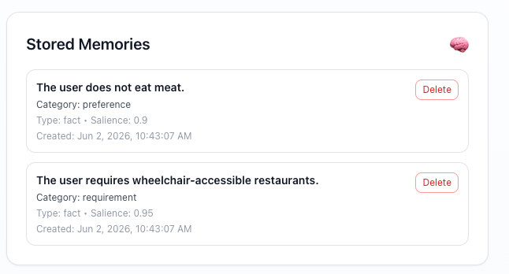
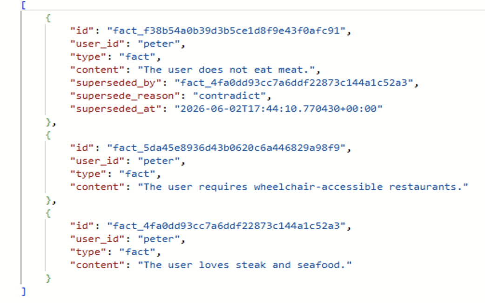
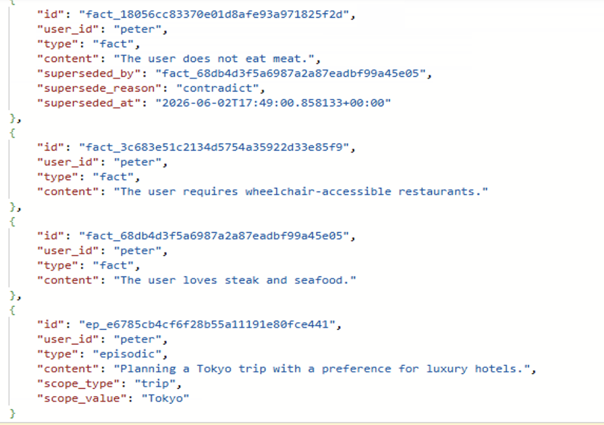
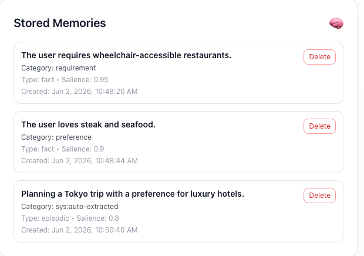

# Module 04 - Making Memory Intelligent (3-Way RRF Personalisation)

[← Module 03: Adding Memory](./Module-03.md#module-03---adding-memory-with-the-cosmos-db-agent-memory-toolkit) | [Home](./Home.md#build-a-multi-agent-workshop)

---

## Introduction

In Module 03, you gave your assistant memory. You wired a persistent checkpointer, connected the `azure-cosmos-agent-memory` toolkit. Your agents can now recall user preferences and apply them during searches.

But the memory system you built is still **manual**. It stores the raw turns. It doesn't yet:

- read those turns and *extract* the latent facts ("I'm vegetarian" → fact `Tony does not eat meat`);
- *deduplicate* extracted facts against what's already on file;
- detect *contradictions* (Tony was vegan in March; today he says he loves steak — which is current?);
- *summarise* a long conversation so the system prompt doesn't grow without bound;
- *summarise the user themselves* so a freshly-joined agent can be briefed in one paragraph.

All of that is the **auto-trigger pipeline** inside the toolkit. In this module you'll turn it on, learn what each stage does, tune the cadence so you can see the pipeline run in a short demo, and inspect what shows up in Cosmos after a few minutes of chatting.

Importantly: you **won't write any extraction prompts**. They ship inside the toolkit. Your job in this module is to *operate* an intelligent memory pipeline - choose the cadence that matches your workload, verify it's producing what you expect, and know which lever to pull when it isn't.

---

## Learning Objectives and Activities

By the end of this module you will:

- Understand the **cadence pipeline** that produces durable memories and rolling summaries
- Verify the workshop cadence is firing and inspect the produced docs in Cosmos
- Use a Python **`ContextVar`** to carry the user's preference embedding into MCP tools without putting 1536 floats into chat history
- Plumb the user's preference embedding into a 4-signal `RANK RRF` query so place recommendations are biased by who the traveller is

---

## Module Exercises

1. [Activity 1: From Manual Memory to Intelligent Memory](#activity-1-from-manual-memory-to-intelligent-memory)
2. [Activity 2: The Auto-Trigger Pipeline](#activity-2-the-auto-trigger-pipeline)
3. [Activity 3: Tuning the Cadence](#activity-3-tuning-the-cadence)
4. [Activity 4: Add `ContextVar` plumbing in `travel_agents.py`](#activity-4-add-contextvar-plumbing-in-travel_agentspy)
5. [Activity 5: Set the `ContextVar` at request entry](#activity-5-set-the-contextvar-at-request-entry)
6. [Activity 6: Add `user_preference_vector` to MCP `discover_places`](#activity-6-add-user_preference_vector-to-mcp-discover_places)
7. [Activity 7: Test Your Work](#activity-7-test-your-work)

---

## Activity 1: From Manual Memory to Intelligent Memory

### What "Intelligent Memory" Means

The memory system from Module 03 has four limitations worth naming explicitly:

| Limitation                       | Symptom                                                                                                      |
|----------------------------------|--------------------------------------------------------------------------------------------------------------|
| **Implicit preferences ignored** | "I don't eat meat" never becomes a fact unless the user explicitly says "remember…".                         |
| **Contradictions silently stored** | User says he's vegan on Monday, says he loves steak Friday - both end up in `memories`, agents get whiplash. |
| **No conversational summarisation** | Threads grow until the system prompt is bloated with raw turns.                                              |
| **No user-level summary**        | A new agent joining mid-conversation has to read everything from scratch.                                    |

The auto-trigger pipeline fixes all four - but it does so by running a small chain of LLM-backed steps in the background after each `push_to_cosmos` call. That's not free. So the toolkit lets you control **how often** each stage runs through four environment variables you'll set in Activity 3.

### Why a Pipeline, Not One Big Prompt?

The toolkit could have used one mega-prompt: "given the conversation so far and the existing memories, do everything." It deliberately doesn't, for three reasons:

1. **Each stage has a different cadence.** Fact extraction is cheap and you want it on every turn. User-summary regeneration is expensive and only needs to run occasionally.
2. **Each stage is independently auditable.** Because each stage writes its own log line ("synthesize_procedural", "extract_memories", "thread summary written"), you can tell from the logs what the toolkit decided to do.
3. **You can swap stages independently.** Don't want user-level summaries? Set the cadence to a number larger than your session length and that stage is effectively disabled. Want fact extraction every two turns instead of every turn? One env var change.

The rest of this module is about *operating* the pipeline, not implementing it.

---

## Activity 2: The Auto-Trigger Pipeline

### What Runs on Each `push_to_cosmos`

Every time something (your API-layer turn write, or an agent's `add_turn` call) reaches the toolkit's `push_to_cosmos()`, the toolkit:

1. Writes the buffered raw turn(s) to the `memories_turns` container.
2. Increments a per-`(user_id, thread_id)` counter in the `counter` container.
3. Consults the four cadence env vars and decides which of the five stages below to fire.
4. Runs the eligible stages, writing their outputs to the appropriate container.

The five stages, in order:

| Stage                          | What it does                                                                                                          | Cadence env var              | Output container       |
|--------------------------------|-----------------------------------------------------------------------------------------------------------------------|------------------------------|------------------------|
| **`extract_memories`**         | Reads the unflushed turns for this `(user, thread)` and asks the LLM to extract semantic facts, episodic memories, or procedural memories. | `FACT_EXTRACTION_EVERY_N`    | `memories` (`type=fact / episodic / procedural`) |
| **`dedup_memories`**           | For each new fact, finds nearest-neighbour facts already in `memories` and asks the LLM whether they collide; supersedes the older one when they do. | `DEDUP_EVERY_N`              | `memories` (`superseded=true` on the old record) |
| **`synthesize_procedural`**    | Detects *behavioural* preferences ("answer me in bullet points", "always confirm before booking") that aren't pure facts. | (folded into `FACT_EXTRACTION_EVERY_N`) | `memories` (`type=procedural`) |
| **`synthesize_thread_summary`**| Rolls up the conversation so far into a one-paragraph summary of *this thread*; supersedes the previous thread summary. | `THREAD_SUMMARY_EVERY_N`     | `memories_summaries` (`type=thread_summary`) |
| **`synthesize_user_summary`**  | Rolls up the user's all-time facts + recent thread summaries into a single user-level paragraph; supersedes the previous one. | `USER_SUMMARY_EVERY_N`       | `memories_summaries` (`type=user_summary`) |

> The procedural stage is folded into the fact-extraction cadence - when fact extraction fires, the toolkit also gives the LLM the opportunity to surface a procedural memory. There isn't a separate `PROCEDURAL_EVERY_N` knob.

### The `counter` Container

The cadence knobs are integers (`5` = "every 5 turns"), so the toolkit needs to know **how many unflushed turns** each `(user, thread)` has accumulated since the last time each stage fired. That counter lives in the `counter` container - one document per active conversation, with a small JSON blob:

```json
{
  "id": "tony__session_abc123",
  "user_id": "tony",
  "thread_id": "session_abc123",
  "_unflushed_turn_counts": {
    "extract": 3,
    "thread_summary": 3,
    "user_summary": 12,
    "dedup": 3
  }
}
```

After each turn:

- All four counters are incremented.
- For each cadence knob `<= counter`, the corresponding stage fires.
- Stages that fire reset their counter back to 0.

### Why You Don't Edit the Extraction Prompts

The extraction, dedup, and summary prompts live inside the toolkit and are versioned with the package. You can read them here if you're curious (<https://github.com/AzureCosmosDB/AgentMemoryToolkit>), but you don't author or maintain them - the toolkit team does. You configure the *operating behaviour* (cadence, embedding model, chat model) and let the toolkit do the rest.

That's deliberate: the prompts have been validated against a wider corpus than any one workshop. Letting attendees swap them in module-time would tempt them to overfit to one demo and break the rest of the pipeline.

---

## Activity 3: Tuning the Cadence

### The Four Knobs

The toolkit reads four env vars at client-create time:

| Variable                       | What it controls                                                            | SDK default | Workshop value          |
|--------------------------------|-----------------------------------------------------------------------------|-------------|-------------------------|
| `FACT_EXTRACTION_EVERY_N`      | How many turns between fact-extraction runs (also gates procedural).        | `1`         | **`1`** (every turn)    |
| `DEDUP_EVERY_N`                | How many turns between dedup-vs-existing-facts runs.                        | `5`         | **`1`** (every turn)    |
| `THREAD_SUMMARY_EVERY_N`       | How many turns between thread-summary regenerations.                        | `10`        | **`5`** (every 5 turns) |
| `USER_SUMMARY_EVERY_N`         | How many turns between user-level summary regenerations.                    | `20`        | **`5`** (every 5 turns) |

The defaults are tuned for **production** workloads - you don't want to call out to an LLM 4× per turn for every user. The workshop values are tuned for **a 20-minute demo** - you want to see the summarizer actually fire while you're watching.

You're free to experiment. Raise `THREAD_SUMMARY_EVERY_N` to `20` and you'll have to chat for a while before you see a summary land; drop `FACT_EXTRACTION_EVERY_N` to `1` and every preference statement gets extracted immediately.

### Step 1: Verify the Workshop Values

These are already in `python/.env` and `mcp_server/.env` (the Bicep + azd hooks copy them in for a fresh deployment). But if you're working in a partially-set-up `.env`, make sure both files include:

```bash
FACT_EXTRACTION_EVERY_N=1
DEDUP_EVERY_N=1
THREAD_SUMMARY_EVERY_N=5
USER_SUMMARY_EVERY_N=5
```
---

## Activity 4: Add `ContextVar` plumbing in `travel_agents.py`

The `user_preference_vector` is a 1536-float array. We **can't** put it in chat history (it would balloon every message), and we don't want the supervisor's model to know it exists (the model can't reason about embeddings). The right vehicle is a **request-scoped `ContextVar`** that the API sets on entry and any tool inside the request can read.

### Step 1: Add the ContextVar and the extractor helper

At the top of `travel_agents.py` (with the other `from typing ...` imports), add:

```python
from _contextvars import ContextVar
```

Then, search for `PROMPT_DIR = os.path.join(os.path.dirname(__file__), "prompts")` and add the below code under it.

```python

_current_user_preference_vector: ContextVar[list[float] | None] = ContextVar(
    "current_user_preference_vector", default=None
)
```

Search for `__last_message_content`, and paste the below code above it:

```python


def _looks_like_vector(value: Any) -> bool:
    return isinstance(value, list) and all(isinstance(item, (int, float)) for item in value)


def _extract_user_preference_vector(
    explicit_vector: list[float] | None,
    config: RunnableConfig,
) -> list[float] | None:
    """Find a preference embedding supplied either as a tool arg or runtime config."""
    if _looks_like_vector(explicit_vector):
        return explicit_vector

    configurable = config.get("configurable", {}) if config else {}
    metadata = config.get("metadata", {}) if config else {}

    candidates = [
        configurable.get("user_preference_vector"),
        configurable.get("preference_vector"),
        metadata.get("user_preference_vector"),
        metadata.get("preference_vector"),
    ]

    for summary_key in ("user_summary", "userSummary"):
        for source in (configurable, metadata):
            summary = source.get(summary_key)
            if isinstance(summary, dict):
                candidates.extend([
                    summary.get("embedding"),
                    summary.get("user_preference_vector"),
                    summary.get("preference_vector"),
                ])

    for candidate in candidates:
        if _looks_like_vector(candidate):
            return candidate
    return None
```

### Step 2: Add the MCP-tool wrapper

The wrapper transparently injects the ContextVar's current value into every `discover_places` / `discover_itinerary` call. Below the helper above, add:

```python
def _wrap_discover_places_tool(mcp_tool: Any) -> Any:
    """Inject the request-scoped preference vector into discover_* MCP calls."""
    description = getattr(mcp_tool, "description", None) or "Discover places."
    args_schema = getattr(mcp_tool, "args_schema", None)
    tool_name = getattr(mcp_tool, "name", "discover_places")

    async def discover_places_with_preference_context(
        config: RunnableConfig,
        **kwargs: Any,
    ) -> Any:
        vector = _current_user_preference_vector.get()
        if vector is not None and not _looks_like_vector(kwargs.get("user_preference_vector")):
            kwargs["user_preference_vector"] = vector
        return await mcp_tool.ainvoke(kwargs, config=config)

    discover_places_with_preference_context.__name__ = tool_name
    discover_places_with_preference_context.__doc__ = description

    return tool(
        tool_name,
        args_schema=args_schema,
        description=description,
    )(discover_places_with_preference_context)


def _with_preference_vector_injection(tools: list[Any]) -> list[Any]:
    wrapped_tools: list[Any] = []
    for mcp_tool in tools:
        name = getattr(mcp_tool, "name", "")
        if name.startswith("discover_places") or name == "discover_itinerary":
            wrapped_tools.append(_wrap_discover_places_tool(mcp_tool))
        else:
            wrapped_tools.append(mcp_tool)
    return wrapped_tools
```

### Step 3: Apply the wrapper inside `_partition_mcp_tools`

Find `_partition_mcp_tools` (from Module 03). The only line that needs to change is the `_mcp_find_places_tools` assignment - wrap the filtered list with `_with_preference_vector_injection`:

```python
def _partition_mcp_tools(all_tools: list[Any]) -> None:
    """Slice all_tools into the per-agent buckets the rest of the file expects."""
    global _mcp_session_tools, _mcp_recall_memories_tool
    global _mcp_find_places_tools, _mcp_itinerary_tools

    _mcp_session_tools = filter_tools_by_prefix(
        all_tools,
        ["create_session", "get_session_context", "append_turn"],
    )
    _mcp_recall_memories_tool = filter_tools_by_prefix(
        all_tools, ["recall_memories"],
    )
    # CHANGED: wrap discover_* tools so the request-scoped preference vector is injected
    _mcp_find_places_tools = _with_preference_vector_injection(
        filter_tools_by_prefix(
            all_tools,
            ["discover_places", "discover_itinerary", "recall_memories"],
        )
    )
    _mcp_itinerary_tools = filter_tools_by_prefix(
        all_tools,
        ["create_new_trip", "update_trip", "get_trip_details", "recall_memories"],
    )

    logger.info("📊 Tool Distribution (Supervisor + 2 Sub-Agents):")
    logger.info(f"   Supervisor session tools: {[t.name for t in _mcp_session_tools]}")
    logger.info(f"   Recall memories: {[t.name for t in _mcp_recall_memories_tool]}")
    logger.info(f"   Find Places tools: {[t.name for t in _mcp_find_places_tools]}")
    logger.info(f"   Itinerary tools: {[t.name for t in _mcp_itinerary_tools]}")
```

### Step 4: Update `find_places_tool` to set and reset the ContextVar

```python
@tool("find_places", args_schema=FindPlacesInput)
async def find_places_tool(
    city: str,
    aspects: list[Literal["hotel", "activity", "dining"]],
    constraints: dict[str, Any] | None = None,
    user_preference_vector: list[float] | None = None,
    config: RunnableConfig = None,
) -> str:
    """Search hotels, activities, or dining in a city. Returns raw structured place data."""
    effective_config = config or {"configurable": {}, "metadata": {}}
    vector = _extract_user_preference_vector(user_preference_vector, effective_config)
    configurable = effective_config.get("configurable", {}) or {}
    user_id = configurable.get("user_id") or configurable.get("userId") or ""
    tenant_id = configurable.get("tenant_id") or configurable.get("tenantId") or ""

    token = _current_user_preference_vector.set(vector)
    try:
        return await _oneshot_find_places(
            city=city,
            aspects=list(aspects),
            constraints=constraints,
            user_id=str(user_id),
            tenant_id=str(tenant_id),
            vector=vector,
            config=_subagent_config(effective_config, "find_places"),
        )
    finally:
        _current_user_preference_vector.reset(token)
```

---

## Activity 5: Set the `ContextVar` at request entry

### Step 1: Import the ContextVar into the API

Open the `travel_agents_api.py`, search for the existing `from src.app.travel_agents import setup_agents, build_agent_graph, cleanup_persistent_session` line and add `_current_user_preference_vector` to it (or add a new import line):

```python
from src.app.travel_agents import setup_agents, build_agent_graph, cleanup_persistent_session, _current_user_preference_vector
```

### Step 2: Wire the vector into `get_chat_completion`

Find your `get_chat_completion` handler from Module 03. Right after `await ensure_agents_initialized()`, uncomment the code block now.:

```python
# NEW: pull a memory client and best-effort fetch the preference vector
client = await get_memory_client()
pref_vector = await _fetch_user_preference_vector(client, userId)

# CHANGED: add user_preference_vector to the configurable block
config = {
    "configurable": {
        "thread_id": sessionId,
        "checkpoint_ns": "",
        "userId": userId,
        "tenantId": tenantId,
        "user_preference_vector": pref_vector,   # belt-and-braces for config-reading tools
    }
}

# NEW: bracket the existing workflow.ainvoke(...) calls with set/reset
token = _current_user_preference_vector.set(pref_vector)
try:
    # ... the existing try/except body from Module 03 stays here unchanged:
    # checkpoint lookup, workflow.ainvoke(...), extract_relevant_messages(...),
    # background_tasks.add_task(...), return response_models
    ...
finally:
    _current_user_preference_vector.reset(token)
```
---

## Activity 6: Add `user_preference_vector` to MCP `discover_places` and `discover_itinerary`

The MCP server now needs to accept the new kwarg and forward it to Cosmos.

### Step 1: Update the MCP tool signature

Open `01_exercises/mcp_server/mcp_http_server.py` and find `discover_places`. And update with the below code.

```python
@mcp.tool()
def discover_places(
    geo_scope: str,
    query: str,
    user_id: str,
    tenant_id: str = "",
    filters: Optional[Dict[str, Any]] = None,
    user_preference_vector: list[float] | None = None,
) -> List[Dict[str, Any]]:
    """Memory-aware place search with hybrid RRF retrieval."""
    geo_scope = (geo_scope or "").lower().strip()
    logger.info(f"🗺️  ========== DISCOVER_PLACES TOOL CALLED ==========")
    logger.info(f"     - geo_scope: {geo_scope}")
    logger.info(f"     - query: {query}")
    logger.info(f"     - user_id: {user_id}")
    logger.info(f"     - filters: {filters}")

    filters = filters or {}
    place_type = filters.get("type")
    dietary = filters.get("dietary", [])
    accessibility = filters.get("accessibility", [])
    price_tier = filters.get("priceTier")

    if dietary and not isinstance(dietary, list):
        dietary = [dietary]
    if accessibility and not isinstance(accessibility, list):
        accessibility = [accessibility]

    try:
        places = query_places_hybrid(
            query=query,
            geo_scope_id=geo_scope,
            place_type=place_type,
            dietary=dietary,
            accessibility=accessibility,
            price_tier=price_tier,
            limit=10,
            user_preference_vector=user_preference_vector,
        )
        logger.info(f"✅ Hybrid RRF returned {len(places)} results")
    except Exception as e:
        logger.error(f"❌ Error in hybrid search: {e}")
        import traceback
        logger.error(f"{traceback.format_exc()}")
        return []

    for place in places:
        alignment_score = 0.0
        match_reasons = ["Hybrid search match (text + semantic)"]

        if dietary:
            place_dietary = place.get("dietary", [])
            for d in dietary:
                if d in place_dietary:
                    alignment_score += 0.3
                    match_reasons.append(f"Matches {d} dietary preference")

        if price_tier:
            place_price = place.get("priceTier")
            if price_tier == place_price:
                alignment_score += 0.2
                match_reasons.append(f"Matches {place_price} price preference")

        if accessibility:
            place_access = place.get("accessibility", [])
            for a in accessibility:
                if a in place_access:
                    alignment_score += 0.3
                    match_reasons.append(f"Accessible: {a}")

        place["memoryAlignment"] = min(alignment_score, 1.0)
        place["matchReasons"] = match_reasons

    return places
```

Do the same for `discover_itinerary` - it shares the same hybrid search backend.

```python
@mcp.tool()
async def discover_itinerary(
    geo_scope: str,
    query: str,
    user_id: str,
    tenant_id: str = "",
    aspects: Optional[List[str]] = None,
    dietary: Optional[List[str]] = None,
    accessibility: Optional[List[str]] = None,
    price_tier: Optional[str] = None,
    per_aspect_limit: int = 5,
    user_preference_vector: list[float] | None = None,
) -> Dict[str, List[Dict[str, Any]]]:
    """Multi-aspect place discovery in a single MCP round-trip.

    Runs hybrid RRF Cosmos queries for each requested aspect (hotel / activity /
    restaurant) in parallel via ``asyncio.gather``.
    """
    import asyncio

    geo_scope = (geo_scope or "").lower().strip()

    aspect_aliases = {"dining": "restaurant", "attraction": "activity"}
    canonical_aspects = [
        aspect_aliases.get(a, a)
        for a in (aspects or ["hotel", "activity", "restaurant"])
    ]
    canonical_aspects = [
        a for a in dict.fromkeys(canonical_aspects)
        if a in {"hotel", "activity", "restaurant"}
    ]

    logger.info(f"🗺️  ========== DISCOVER_ITINERARY TOOL CALLED ==========")
    logger.info(f"     - geo_scope={geo_scope!r} aspects={canonical_aspects}")

    if not canonical_aspects:
        return {}

    async def _one(place_type: str) -> tuple[str, List[Dict[str, Any]]]:
        try:
            results = await asyncio.to_thread(
                query_places_hybrid,
                query=query,
                geo_scope_id=geo_scope,
                place_type=place_type,
                dietary=dietary,
                accessibility=accessibility,
                price_tier=price_tier,
                limit=per_aspect_limit,
                user_preference_vector=user_preference_vector,
            )
        except Exception as exc:
            logger.error(f"❌ discover_itinerary aspect {place_type!r} failed: {exc}")
            results = []
        return place_type, results

    gathered = await asyncio.gather(*[_one(a) for a in canonical_aspects])
    bucketed: Dict[str, List[Dict[str, Any]]] = {pt: items for pt, items in gathered}
    return bucketed
```
---

## Activity 7: Test Your Work

With all intelligent memory features connected, it's time to test the system end-to-end! This activity will verify automatic preference extraction, conflict detection, and auto-summarization.

### Restart All Services

Since we've added new tools and agent logic, we need to restart all services to load the changes.

**Terminal 1 (MCP Server):**

Stop the currently running MCP server (press **Ctrl+C**), then restart it:

```powershell
cd mcp_server
$env:PYTHONPATH="..\python"; python mcp_http_server.py
```

**Important**: Always ensure your virtual environment is activated before starting the server!

You must be in **multi-agent-workshop\01_exercises** folder and then use the below commands to activate the virtual environment. And after activating the environment, follow the above commands to re-start the mcp server.  

```powershell
cd multi-agent-workshop\01_exercises
.\.venv-travel\Scripts\Activate.ps1
```

**Terminal 2 (Backend API):**

Stop the currently running backend (press **Ctrl+C**), then restart it:

```powershell
cd python
uvicorn src.app.travel_agents_api:app --reload --host 0.0.0.0 --port 8000
```

**Important**: Always ensure your virtual environment is activated before starting the server!

You must be in **multi-agent-workshop\01_exercises** folder and then use the below commands to activate the virtual environment. And after activating the environment, follow the above commands to re-start the backend server.  

```powershell
cd multi-agent-workshop\01_exercises
.\.venv-travel\Scripts\Activate.ps1
```

**Terminal 3 (Frontend):**

Stop the currently running frontend (press **Ctrl+C**), then restart it:

> **Note**: The frontend doesn't require virtual environment activation since it uses Node.js.

**All Platforms:**

```bash
cd multi-agent-workshop/01_exercises/frontend
npm start
```

### Test 1: Automatic Preference Extraction (Implicit Statements)

1. Sign in as **Peter** (no seed memories).
2. Send: `Hi, I don't eat meat and I need wheelchair-accessible restaurants`
3. Open Azure Data Explorer (Cosmos DB).
4. Query the `memories` container (it might take ~ 1-2 seconds for the fact to appear):

   ```sql
   SELECT c.id, c.user_id, c.type, c.content FROM c where c.user_id = "peter"
   ```

Expected: two new fact records, salience ≥ 0.8. The agent didn't have to be asked to remember - the pipeline did it.

**Cosmos DB output would look like this**:

> 

**Chat Assistant output would look like this**:
> 

You can close the chat, and go to the profile & memories tab, and you will see these stored memories there(sometimes tale ~ 2-3 seconds to show)
> 


### Test 2: Conflict Detection 

1. Same Peter session, send: `Actually, I love steak and seafood`
2. Wait, re-query `memories`.
3. Open Azure Data Explorer (Cosmos DB).
4. Query the `memories` container (it might take ~ 2-3 seconds for the fact to appear):

   ```sql
   SELECT c.id, c.user_id, c.type, c.content, c.superseded_by, c.supersede_reason, c.superseded_at FROM c where c.user_id = "peter"
   ```
**Cosmos DB output would look like this**:   
>    

**Chat Assistant output would look like this**:
> 

You can close the chat again, and go to the profile & memories tab, and you will see the updated stored memories there(sometimes tale ~ 2-3 seconds to show)
> 

### Test 3: Trip-Specific Context (Episodic Memory)

**Objective:** Verify that trip-specific preferences don't conflict with general preferences.

**Steps:**

- Start a new conversation (log out and back in as Peter/Bruce, the user you choose before)
- Send: `For this Tokyo trip, I want luxury accommodations`
- Open Azure Data Explorer (Cosmos DB).
- Query the `memories` container (it might take ~ 2-3 seconds for the fact to appear):- Check Cosmos DB memories

   ```sql
   SELECT c.id, c.user_id, c.type, c.content, c.scope_type, c.scope_value FROM c where c.user_id = "peter"
   ```
**Cosmos DB output would look like this**:   
>    

**Chat Assistant output would look like this**:
> 

You can close the chat again, and go to the profile & memories tab, and you will see the updated stored memories there(sometimes tale ~ 2-3 seconds to show)
> 

- Continue the same conversation.
- Send: `Normally, I prefer moderate hotels.`
- Open Azure Data Explorer (Cosmos DB).
- Query the `memories` container (it might take ~ 2-3 seconds for the fact to appear):- Check Cosmos DB memories

   ```sql
   SELECT c.id, c.user_id, c.type, c.content, c.superseded_by, c.supersede_reason, c.superseded_at FROM c where c.user_id = "peter"
   ```
**Cosmos DB output would look like this**:   
>    

**Chat Assistant output would look like this**:
> 

You can close the chat again, and go to the profile & memories tab, and you will see the updated stored memories there(sometimes tale ~ 2-3 seconds to show)
> 

We can see that the facts are stored seperatly with different scope, and they don't conflict with each other. The general preference is still intact, and the trip-specific preference is stored as episodic memory.

### Test 4: Skipping Non-Preference Messages

**Objective:** Verify that greetings and simple responses don't trigger memory extraction.

**Steps:**

- Start a new conversation (log out and back in as Peter/Bruce, the user you choose before)
- Send: `Hello!`
- Send: `Yes`
- Send: `Thanks`
- Check backend or mcp server logs for extraction calls


### Test 5: Auto-Summarization After Crossing the Threshold

- Start a new conversation (log out and back in as Peter/Bruce, the user you choose before), 
- Send 5 more messages of trip planning so the counter passes `THREAD_SUMMARY_EVERY_N=5`.
- Some example messages you can send:
   - `Hi, I'm planning a trip to Paris`
   - `Find hotels in Paris`
   - `I want luxury hotels`
   - `Find restaurants`
   - `Show me vegetarian options`
   - `What about activities?`
   - `Find historic places`
   - `Create an itinerary for 3 days now.`
   - `That looks great! What else can you recommend?`
- Query `memories_summaries`:

   ```sql
   SELECT c.type, c.content, c.version FROM c WHERE c.user_id = "peter" ORDER BY c.created_at DESC
   ```

Expected: a `thread_summary` record (and within a few more turns, a `user_summary` record).

---

## Validation Checklist

- [ ] ✅ `travel_agents.py` defines `_current_user_preference_vector: ContextVar`, `_extract_user_preference_vector`, `_wrap_discover_places_tool`, and `_with_preference_vector_injection`.
- [ ] ✅ `_partition_mcp_tools` wraps the find_places bucket with `_with_preference_vector_injection`.
- [ ] ✅ `find_places_tool` calls `_extract_user_preference_vector(...)` and sets/resets the ContextVar around `_oneshot_find_places`.
- [ ] ✅ `travel_agents_api.py` defines `_fetch_user_preference_vector(client, user_id)` returning `None` when the user has no summary yet.
- [ ] ✅ The chat handler calls `await get_memory_client()` and `await _fetch_user_preference_vector(client, userId)` before invoking the workflow.
- [ ] ✅ The chat handler uses `set(...) / reset(token)` to bracket the supervisor invocation.
- [ ] ✅ `mcp_http_server.py`'s `discover_places` accepts a `user_preference_vector` kwarg.
- [ ] ✅ `query_places_hybrid` adds a second `VectorDistance` clause when the vector is non-null and dimensions match.

---

## Common Issues

| Symptom | Likely cause | Fix |
| --- | --- | --- |
| `discover_places` always returns the same top 5, regardless of user | The wrapper isn't being applied — `_partition_mcp_tools` isn't calling `_with_preference_vector_injection` | Re-check Activity 4 Step 3 and restart the backend. |
| The supervisor calls `find_places` but `user_preference_vector` is always `None` in MCP logs | The ContextVar was never set (or was reset too early) | Verify `_current_user_preference_vector.set(pref_vector)` happens *before* `_graph.ainvoke` and `reset` happens in a `finally`. |
| 4-signal RRF query returns `Bad Request: dimension mismatch` | The user summary embedding deployment is a different dim than the places embedding | Both should be `text-embedding-3-small` (1536-dim). The dimension guard in `query_places_hybrid` should catch this and warn — check the API logs. |
| `pref_vector` is always `None` for an established user | The user_summary cadence hasn't yet rolled the first summary for that user, OR `client.get_user_summary` returns an unexpected shape | Chat as that user for at least `USER_SUMMARY_EVERY_N` turns (default 5) and check `memories_summaries`. The handler treats both `None` and list-of-dicts responses safely; embedding extraction will resume once a summary exists. |
| First request after a process restart is slow | Cold cache; the toolkit re-opens container clients on the first call | Confirm `await get_memory_client()` is in the FastAPI startup handler — that warms the client before the first request. |

---
## Module Solution

The following sections include the completed code for this module. Copy and paste these into your project if you run into issues and cannot resolve.

<details>
    <summary>Completed code for <strong>src/app/travel_agents.py</strong></summary>

<br>

```python
from __future__ import annotations

import inspect
import logging
import os
import sys
import inspect
import json
import logging
import os
import sys
from typing import Any, Literal

from dotenv import load_dotenv

# Make the project root importable so `from src.app.services...` works
project_root = os.path.abspath(os.path.join(os.path.dirname(__file__), "..", ".."))
if project_root not in sys.path:
    sys.path.insert(0, project_root)

load_dotenv(override=False)

from langchain_core.messages import AIMessage, HumanMessage, SystemMessage
from langchain_core.runnables import RunnableConfig
from langchain_core.tools import tool
from langchain_mcp_adapters.client import MultiServerMCPClient
from langchain_mcp_adapters.tools import load_mcp_tools
from langgraph.checkpoint.memory import MemorySaver
from langgraph.prebuilt import create_react_agent
from pydantic import BaseModel, Field

from src.app.services.azure_open_ai import model
from _contextvars import ContextVar

logging.basicConfig(level=logging.INFO)
logger = logging.getLogger(__name__)

# Quiet down chatty libraries so the workshop logs stay readable
for noisy in (
    "azure.core.pipeline.policies.http_logging_policy",
    "azure.identity",
    "azure.cosmos",
    "httpx",
    "httpcore",
    "mcp",
    "sse_starlette.sse",
    "openai._base_client",
    "urllib3.connectionpool",
    "langsmith.client",
):
    logging.getLogger(noisy).setLevel(logging.WARNING)

PROMPT_DIR = os.path.join(os.path.dirname(__file__), "prompts")

_current_user_preference_vector: ContextVar[list[float] | None] = ContextVar(
    "current_user_preference_vector", default=None
)


# helpers
def load_prompt(agent_name: str) -> str:
    """Load a `.prompty` file from the prompts directory."""
    file_path = os.path.join(PROMPT_DIR, f"{agent_name}.prompty")
    logger.info(f"Loading prompt for {agent_name} from {file_path}")
    try:
        with open(file_path, "r", encoding="utf-8") as fh:
            return fh.read().strip()
    except FileNotFoundError:
        logger.error(f"Prompt file not found for {agent_name}")
        return f"You are a {agent_name} agent."


def filter_tools_by_prefix(tools: list[Any], prefixes: list[str]) -> list[Any]:
    """Return only those MCP tools whose name starts with one of the prefixes."""
    return [
        t for t in tools
        if any(getattr(t, "name", "").startswith(prefix) for prefix in prefixes)
    ]


def _create_agent(agent_model: Any, tools: list[Any], prompt_text: str, **kwargs: Any) -> Any:
    """Create a ReAct agent across LangGraph versions that renamed the prompt kwarg."""
    signature = inspect.signature(create_react_agent)
    prompt_kwarg = "state_modifier" if "state_modifier" in signature.parameters else "prompt"
    return create_react_agent(agent_model, tools, **{prompt_kwarg: prompt_text}, **kwargs)


def _bind_parallel_tool_calls(base_model: Any) -> Any:
    """Allow the supervisor to fire multiple tool calls in one turn when supported."""
    try:
        return base_model.bind(parallel_tool_calls=True)
    except Exception:
        return base_model


def _last_message_content(result: Any) -> str:
    """Return compact text from the last message produced by a sub-agent."""
    if isinstance(result, dict) and result.get("messages"):
        content = getattr(result["messages"][-1], "content", None)
        if content is not None:
            return str(content)
    return str(result)


def _looks_like_vector(value: Any) -> bool:
    return isinstance(value, list) and all(isinstance(item, (int, float)) for item in value)


def _extract_user_preference_vector(
    explicit_vector: list[float] | None,
    config: RunnableConfig,
) -> list[float] | None:
    """Find a preference embedding supplied either as a tool arg or runtime config."""
    if _looks_like_vector(explicit_vector):
        return explicit_vector

    configurable = config.get("configurable", {}) if config else {}
    metadata = config.get("metadata", {}) if config else {}

    candidates = [
        configurable.get("user_preference_vector"),
        configurable.get("preference_vector"),
        metadata.get("user_preference_vector"),
        metadata.get("preference_vector"),
    ]

    for summary_key in ("user_summary", "userSummary"):
        for source in (configurable, metadata):
            summary = source.get(summary_key)
            if isinstance(summary, dict):
                candidates.extend([
                    summary.get("embedding"),
                    summary.get("user_preference_vector"),
                    summary.get("preference_vector"),
                ])

    for candidate in candidates:
        if _looks_like_vector(candidate):
            return candidate
    return None


def _wrap_discover_places_tool(mcp_tool: Any) -> Any:
    """Inject the request-scoped preference vector into discover_* MCP calls."""
    description = getattr(mcp_tool, "description", None) or "Discover places."
    args_schema = getattr(mcp_tool, "args_schema", None)
    tool_name = getattr(mcp_tool, "name", "discover_places")

    async def discover_places_with_preference_context(
        config: RunnableConfig,
        **kwargs: Any,
    ) -> Any:
        vector = _current_user_preference_vector.get()
        if vector is not None and not _looks_like_vector(kwargs.get("user_preference_vector")):
            kwargs["user_preference_vector"] = vector
        return await mcp_tool.ainvoke(kwargs, config=config)

    discover_places_with_preference_context.__name__ = tool_name
    discover_places_with_preference_context.__doc__ = description

    return tool(
        tool_name,
        args_schema=args_schema,
        description=description,
    )(discover_places_with_preference_context)


def _with_preference_vector_injection(tools: list[Any]) -> list[Any]:
    wrapped_tools: list[Any] = []
    for mcp_tool in tools:
        name = getattr(mcp_tool, "name", "")
        if name.startswith("discover_places") or name == "discover_itinerary":
            wrapped_tools.append(_wrap_discover_places_tool(mcp_tool))
        else:
            wrapped_tools.append(mcp_tool)
    return wrapped_tools


def _subagent_config(config: RunnableConfig, agent_name: str) -> RunnableConfig:
    """Preserve request configuration while tagging internal sub-agent calls."""
    inherited = dict(config or {})
    configurable = dict(inherited.get("configurable", {}) or {})
    metadata = dict(inherited.get("metadata", {}) or {})
    metadata["sub_agent"] = agent_name
    inherited["configurable"] = configurable
    inherited["metadata"] = metadata
    return inherited


class FindPlacesInput(BaseModel):
    city: str = Field(..., description="City to search")
    aspects: list[Literal["hotel", "activity", "dining"]] = Field(
        ...,
        description=(
            "Which categories of places to search; pass all needed aspects at once "
            "for parallel fan-out"
        ),
    )
    constraints: dict[str, Any] | None = Field(
        default=None,
        description="Optional constraints, e.g., {'dietary':'vegan','budget':'moderate'}",
    )
    user_preference_vector: list[float] | None = Field(
        default=None,
        description=(
            "Optional preference embedding for personalized RRF; usually injected by "
            "runtime config rather than model-visible text"
        ),
    )


class ItineraryInput(BaseModel):
    trip_id: str | None = Field(
        default=None,
        description="Existing trip id to update; omit or null to create a new trip",
    )
    destination: str | None = Field(
        default=None,
        description="Destination city or region for the itinerary",
    )
    days: list[dict[str, Any]] | str | None = Field(
        default=None,
        description="Requested day plans, duration, or structured day-by-day content",
    )
    selected_places: dict[str, Any] | list[dict[str, Any]] | str | None = Field(
        default=None,
        description="Selected hotel, activity, and dining options to arrange",
    )
    constraints: dict[str, Any] | None = Field(
        default=None,
        description="Traveller constraints and planning preferences",
    )
    dates: dict[str, Any] | str | None = Field(
        default=None,
        description="Optional trip dates or date range",
    )
    notes: str | None = Field(
        default=None,
        description="Additional update instructions or planning notes",
    )


# global variables
# Module-level state that is populated by setup_agents() below
_mcp_client: MultiServerMCPClient | None = None
_session_context = None
_persistent_session = None

# MCP tool subsets loaded once during startup
_mcp_session_tools: list[Any] = []
_mcp_find_places_tools: list[Any] = []
_mcp_itinerary_tools: list[Any] = []
_mcp_recall_memories_tool: list[Any] = []

# Global agent variables
_find_places_agent: Any = None        # one-shot selector; no ReAct loop, stays None
_itinerary_agent: Any = None          # ReAct sub-agent populated in _build_sub_agents()
supervisor_agent: Any = None


_FIND_PLACES_SELECTOR_PROMPT = (
    "You translate the supervisor's structured place-search request into ONE tool call. "
    "Rules:\n"
    "- For 2 or 3 aspects, call `discover_itinerary` once with `aspects` set to the requested aspects.\n"
    "- For exactly 1 aspect, call `discover_places` with `filters={\"type\": <aspect>}`.\n"
    "- Aspect names in tool args MUST be: 'hotel', 'activity', 'restaurant'. Map any 'dining' aspect to 'restaurant'.\n"
    "- `geo_scope` = the city.\n"
    "- Derive a short `query` (under 20 words) from the constraints: interests, vibe, dietary, budget, accessibility.\n"
    "- Always pass `user_id` and `tenant_id` exactly as given.\n"
    "- NEVER include `user_preference_vector` in tool args; the runtime injects it.\n"
    "- Output ONLY the tool call. No prose."
)


async def _oneshot_find_places(
    city: str,
    aspects: list[str],
    constraints: dict[str, Any] | None,
    user_id: str,
    tenant_id: str,
    vector: list[float] | None,
    config: RunnableConfig,
) -> str:
    """Run one bounded model turn that emits a single discover_* call.

    Replaces a ReAct sub-agent's 2-LLM-call loop (decide + format) with a single
    forced tool-choice call. The tool output is returned verbatim to the supervisor,
    which synthesizes the final user-facing response.
    """
    selector_tools = [
        wrapped_tool
        for wrapped_tool in _mcp_find_places_tools
        if getattr(wrapped_tool, "name", "").startswith("discover_")
    ]
    if not selector_tools:
        return json.dumps({"error": "no discover_* tools available"})

    constraints_str = json.dumps(constraints or {}, ensure_ascii=False, default=str)
    messages = [
        SystemMessage(content=_FIND_PLACES_SELECTOR_PROMPT),
        HumanMessage(
            content=(
                f"city={city!r}\n"
                f"aspects={aspects!r}\n"
                f"constraints={constraints_str}\n"
                f"user_id={user_id!r}\n"
                f"tenant_id={tenant_id!r}\n"
                f"user_preference_vector={'runtime-injected' if vector else 'absent'}"
            )
        ),
    ]

    bound = model.bind_tools(selector_tools, tool_choice="required")
    ai_msg = await bound.ainvoke(messages, config=config)

    tool_calls = getattr(ai_msg, "tool_calls", None) or []
    if not tool_calls:
        return json.dumps(
            {"error": "selector model emitted no tool call", "city": city, "aspects": aspects},
            ensure_ascii=False,
        )

    tools_by_name = {wrapped_tool.name: wrapped_tool for wrapped_tool in selector_tools}
    results: list[dict[str, Any]] = []
    for call in tool_calls:
        name = call.get("name")
        args = dict(call.get("args") or {})
        args.setdefault("user_id", user_id)
        if tenant_id:
            args.setdefault("tenant_id", tenant_id)
        tool_fn = tools_by_name.get(name)
        if tool_fn is None:
            results.append({"tool": name, "error": "unknown tool"})
            continue
        try:
            raw = await tool_fn.ainvoke(args, config=config)
        except Exception as exc:
            logger.warning("oneshot find_places tool=%s failed: %s", name, exc)
            results.append({"tool": name, "error": str(exc)})
            continue
        loggable_args = {k: v for k, v in args.items() if k != "user_preference_vector"}
        results.append({"tool": name, "args": loggable_args, "result": raw})

    return json.dumps(results, ensure_ascii=False, default=str)


@tool("find_places", args_schema=FindPlacesInput)
async def find_places_tool(
    city: str,
    aspects: list[Literal["hotel", "activity", "dining"]],
    constraints: dict[str, Any] | None = None,
    user_preference_vector: list[float] | None = None,
    config: RunnableConfig = None,
) -> str:
    """Search hotels, activities, or dining in a city. Returns raw structured place data."""
    effective_config = config or {"configurable": {}, "metadata": {}}
    vector = _extract_user_preference_vector(user_preference_vector, effective_config)
    configurable = effective_config.get("configurable", {}) or {}
    user_id = configurable.get("user_id") or configurable.get("userId") or ""
    tenant_id = configurable.get("tenant_id") or configurable.get("tenantId") or ""

    token = _current_user_preference_vector.set(vector)
    try:
        return await _oneshot_find_places(
            city=city,
            aspects=list(aspects),
            constraints=constraints,
            user_id=str(user_id),
            tenant_id=str(tenant_id),
            vector=vector,
            config=_subagent_config(effective_config, "find_places"),
        )
    finally:
        _current_user_preference_vector.reset(token)


@tool("create_or_update_itinerary", args_schema=ItineraryInput)
async def create_or_update_itinerary_tool(
    trip_id: str | None = None,
    destination: str | None = None,
    days: list[dict[str, Any]] | str | None = None,
    selected_places: dict[str, Any] | list[dict[str, Any]] | str | None = None,
    constraints: dict[str, Any] | None = None,
    dates: dict[str, Any] | str | None = None,
    notes: str | None = None,
    config: RunnableConfig = None,
) -> str:
    """Create a new saved itinerary or update an existing trip plan."""
    if _itinerary_agent is None:
        raise RuntimeError("Travel agents have not been initialized")

    payload = {
        "trip_id": trip_id,
        "destination": destination,
        "days": days,
        "selected_places": selected_places,
        "constraints": constraints,
        "dates": dates,
        "notes": notes,
    }
    compact_payload = {key: value for key, value in payload.items() if value is not None}
    user_msg = (
        "Create or update the itinerary using this structured request. "
        "Persist changes with the trip tools before reporting success.\n"
        f"{json.dumps(compact_payload, ensure_ascii=False, default=str)}"
    )
    state = {"messages": [HumanMessage(content=user_msg)]}
    effective_config = config or {"configurable": {}, "metadata": {}}
    result = await _itinerary_agent.ainvoke(
        state,
        config=_subagent_config(effective_config, "itinerary"),
    )
    return _last_message_content(result)


class RecallMemoriesInput(BaseModel):
    query: str = Field(
        ...,
        description=(
            "Topic or question to search the user's stored long-term memories for. "
            "Examples: 'hotel preferences', 'dietary needs', 'recent Paris trip', "
            "'past hiking experiences'. Use short topical phrases, not full sentences."
        ),
    )
    top_k: int = Field(
        default=10,
        description="Maximum number of memory records to return (1-15).",
    )


@tool("recall_memories", args_schema=RecallMemoriesInput)
async def recall_memories_tool(
    query: str,
    top_k: int = 10,
    config: RunnableConfig = None,
) -> str:
    """Search the current traveller's stored long-term memories (facts, episodic events,
    procedural notes) by topic. Use this whenever the user asks about their own
    preferences, prior trips, or anything personal, or when you need preference
    context to bias a `find_places` search.
    """
    effective_config = config or {"configurable": {}, "metadata": {}}
    configurable = effective_config.get("configurable", {}) or {}
    user_id = configurable.get("user_id") or configurable.get("userId") or ""
    if not user_id:
        return json.dumps({"error": "no user_id in runtime config"})

    if not _mcp_recall_memories_tool:
        return json.dumps({"error": "recall_memories MCP tool not loaded"})

    bounded_top_k = max(1, min(int(top_k or 10), 15))
    try:
        return await _mcp_recall_memories_tool[0].ainvoke(
            {"user_id": str(user_id), "query": query, "top_k": bounded_top_k},
            config=_subagent_config(effective_config, "recall_memories"),
        )
    except Exception as exc:
        logger.warning("recall_memories tool failed user=%s query=%r: %s", user_id, query, exc)
        return json.dumps({"error": str(exc)})


def _partition_mcp_tools(all_tools: list[Any]) -> None:
    """Slice all_tools into the per-agent buckets the rest of the file expects."""
    global _mcp_session_tools, _mcp_recall_memories_tool
    global _mcp_find_places_tools, _mcp_itinerary_tools

    _mcp_session_tools = filter_tools_by_prefix(
        all_tools,
        ["create_session", "get_session_context", "append_turn"],
    )
    _mcp_recall_memories_tool = filter_tools_by_prefix(
        all_tools, ["recall_memories"],
    )
    # CHANGED: wrap discover_* tools so the request-scoped preference vector is injected
    _mcp_find_places_tools = _with_preference_vector_injection(
        filter_tools_by_prefix(
            all_tools,
            ["discover_places", "discover_itinerary", "recall_memories"],
        )
    )
    _mcp_itinerary_tools = filter_tools_by_prefix(
        all_tools,
        ["create_new_trip", "update_trip", "get_trip_details", "recall_memories"],
    )

    logger.info("📊 Tool Distribution (Supervisor + 2 Sub-Agents):")
    logger.info(f"   Supervisor session tools: {[t.name for t in _mcp_session_tools]}")
    logger.info(f"   Recall memories: {[t.name for t in _mcp_recall_memories_tool]}")
    logger.info(f"   Find Places tools: {[t.name for t in _mcp_find_places_tools]}")
    logger.info(f"   Itinerary tools: {[t.name for t in _mcp_itinerary_tools]}")


def _build_sub_agents() -> None:
    """Build the internal sub-agents the supervisor delegates to."""
    global _find_places_agent, _itinerary_agent

    # find_places is a one-shot selector — no ReAct loop, no compiled agent.
    _find_places_agent = None
    logger.info("   Find Places: one-shot tool-selector node (no ReAct loop)")

    _itinerary_agent = _create_agent(
        model,
        _mcp_itinerary_tools,
        load_prompt("itinerary_agent"),
    )


def _build_supervisor_tools() -> list[Any]:
    """Return the tool list the supervisor sees: 3 sub-agents-as-tools + bookkeeping."""
    return [
        find_places_tool,
        create_or_update_itinerary_tool,
        recall_memories_tool,
        *_mcp_session_tools,
    ]


# connect to mcp
async def _connect_to_mcp() -> list[Any]:
    """Open the persistent MCP session and return every tool the server exposes."""
    global _mcp_client, _session_context, _persistent_session

    logger.info("🚀 Starting Travel Assistant MCP client...")

    simple_token = os.getenv("MCP_AUTH_TOKEN")
    mcp_url = os.getenv("MCP_SERVER_BASE_URL", "http://localhost:8080") + "/mcp/"

    client_config: dict[str, Any] = {
        "travel_tools": {
            "transport": "streamable_http",
            "url": mcp_url,
        }
    }
    if simple_token:
        client_config["travel_tools"]["headers"] = {
            "Authorization": f"Bearer {simple_token}"
        }

    _mcp_client = MultiServerMCPClient(client_config)

    # Open ONE persistent MCP session for the lifetime of the process —
    # re-opening it on every request adds tens to hundreds of milliseconds
    # of latency for no benefit.
    _session_context = _mcp_client.session("travel_tools")
    _persistent_session = await _session_context.__aenter__()

    all_tools = await load_mcp_tools(_persistent_session)
    logger.info(f"[DEBUG] Loaded {len(all_tools)} MCP tools")
    return all_tools


# setup the supervisor agent
async def setup_agents(checkpointer=None) -> None:
    """Initialize the supervisor and its internal sub-agents on a single MCP session.

    Topology: user → supervisor ReAct agent → {find_places, create_or_update_itinerary}
    tools, where find_places is a one-shot selector node and create_or_update_itinerary
    invokes the itinerary ReAct sub-agent.
    """
    global supervisor_agent

    if supervisor_agent is not None:
        logger.info("✅ Travel agents already initialized")
        return

    all_tools = await _connect_to_mcp()
    _partition_mcp_tools(all_tools)
    _build_sub_agents()

    supervisor_agent = _create_agent(
        _bind_parallel_tool_calls(model),
        tools=_build_supervisor_tools(),
        prompt_text=load_prompt("supervisor"),
        checkpointer=checkpointer or MemorySaver(),
    )

    logger.info("✅ Supervisor and sub-agents created successfully\n")


# build the agent graph
def build_agent_graph():
    """Return the compiled supervisor graph for the API to invoke."""
    if supervisor_agent is None:
        raise RuntimeError(
            "Travel agents have not been initialized; call setup_agents() first"
        )
    return supervisor_agent


# cleanup the MCP session
async def cleanup_persistent_session() -> None:
    """Close the persistent MCP session on shutdown."""
    global _session_context, _persistent_session, supervisor_agent
    if _session_context is not None:
        try:
            await _session_context.__aexit__(None, None, None)
        except Exception as exc:
            logger.warning(f"Error closing MCP session: {exc}")
    _session_context = None
    _persistent_session = None
    supervisor_agent = None
```

</details>


<details>
   <summary>Completed code for <strong>mcp_server/mcp_http_server.py</strong></summary>

<br>

```python
import sys
import os
import logging
from typing import Any, Dict, List, Optional
from dotenv import load_dotenv
from mcp.server.fastmcp import FastMCP

# Ensure stdout/stderr use UTF-8 so emoji in logs/prints don't crash on Windows,
# where the console defaults to cp1252 and raises UnicodeEncodeError on emoji.
for _stream in (sys.stdout, sys.stderr):
    try:
        _stream.reconfigure(encoding="utf-8")
    except (AttributeError, ValueError):
        pass

from src.app.services.azure_open_ai import generate_embedding
from src.app.services.azure_cosmos_db import (
    create_session_record,
    get_session_by_id,
    append_message,
    get_session_messages,
    record_api_event,
    query_places_hybrid,
    create_trip,
    get_trip,
)

import inspect

try:
    from src.app.services.agent_memory import get_memory_client
except ImportError:  # pragma: no cover - supports alternate workshop package layout
    from app.services.agent_memory import get_memory_client

# Configure logging
logging.basicConfig(level=logging.INFO)
logger = logging.getLogger(__name__)

# Quiet down chatty libraries so the workshop logs stay readable
for noisy in (
    "azure.core.pipeline.policies.http_logging_policy",
    "azure.identity",
    "azure.cosmos",
    "httpx",
    "httpcore",
    "mcp",
    "sse_starlette.sse",
    "openai._base_client",
    "urllib3.connectionpool",
    "langsmith.client",
):
    logging.getLogger(noisy).setLevel(logging.WARNING)


# Load environment variables
try:
    load_dotenv('.env', override=False)

    # Load authentication configuration
    simple_token = os.getenv("MCP_AUTH_TOKEN")
    github_client_id = os.getenv("GITHUB_CLIENT_ID")
    github_client_secret = os.getenv("GITHUB_CLIENT_SECRET")
    base_url = os.getenv("MCP_SERVER_BASE_URL", "http://localhost:8080")

    print("🔐 Authentication Configuration:")
    print(f"   Simple Token: {'SET' if simple_token else 'NOT SET'}")
    print(f"   GitHub Client ID: {'SET' if github_client_id else 'NOT SET'}")
    print(f"   Base URL: {base_url}")

    # Determine authentication mode
    if github_client_id and github_client_secret:
        auth_mode = "github_oauth"
        print("✅ GITHUB OAUTH MODE ENABLED")
    elif simple_token:
        auth_mode = "simple_token"
        print("✅ SIMPLE TOKEN MODE ENABLED (Development)")
        print(f"   Token: {simple_token[:8]}...")
    else:
        auth_mode = "none"
        print("⚠️  NO AUTHENTICATION - All requests accepted")

except ImportError as e:
    auth_mode = "none"
    simple_token = None
    print(f"❌ OAuth dependencies not available: {e}")

# Initialize MCP server
print("\n🚀 Initializing Travel Assistant MCP Server...")
port = int(os.getenv("PORT", 8080))
mcp = FastMCP("TravelAssistantTools", host="0.0.0.0", port=port)

print(f"✅ Travel Assistant MCP server initialized")
print(f"🌐 Server will be available at: http://0.0.0.0:{port}")
print(f"📋 Authentication mode: {auth_mode.upper()}\n")


# ============================================================================
# 1. Session Management Tools
# ============================================================================

@mcp.tool()
def create_session(
    user_id: str,
    tenant_id: str = "",
    title: str = None,
    activeAgent: str = "orchestrator"
) -> Dict[str, Any]:
    """Create a new conversation session with proper initialization."""
    logger.info(f"🆕 Creating session for user: {user_id}")
    session = create_session_record(user_id, tenant_id, activeAgent, title)
    return {
        "sessionId": session["sessionId"],
        "userId": user_id,
        "title": session["title"],
        "createdAt": session["createdAt"],
    }


@mcp.tool()
def get_session_context(
    session_id: str,
    tenant_id: str,
    user_id: str,
) -> Dict[str, Any]:
    """Retrieve conversation context (recent messages)."""
    logger.info(f"📖 Getting context for session: {session_id}")
    messages = get_session_messages(session_id, tenant_id, user_id)
    session_info = get_session_by_id(session_id, tenant_id, user_id)
    return {
        "messages": messages,
        "sessionInfo": session_info,
        "messageCount": len(messages),
    }


@mcp.tool()
def append_turn(
    session_id: str,
    tenant_id: str,
    user_id: str,
    role: str,
    content: str,
    tool_call: Optional[Dict] = None,
    keywords: Optional[List[str]] = None,
) -> Dict[str, Any]:
    """Atomically store a message and update session metadata."""
    logger.info(f"💬 Appending {role} message to session: {session_id}")

    message_id = append_message(
        session_id=session_id,
        tenant_id=tenant_id,
        user_id=user_id,
        role=role,
        content=content,
        tool_calls=[tool_call] if tool_call else None,
    )

    return {
        "messageId": message_id,
        "sessionId": session_id,
        "role": role,
    }


# ============================================================================
# 2. API Event Tools
# ============================================================================

@mcp.tool()
def record_api_call(
    session_id: str,
    tenant_id: str,
    provider: str,
    operation: str,
    request: Dict[str, Any],
    response: Dict[str, Any],
    keywords: Optional[List[str]] = None,
) -> Dict[str, Any]:
    """Store API event with auto-extracted keywords."""
    logger.info(f"📡 Recording API call: {provider}.{operation}")

    event_id = record_api_event(
        session_id=session_id,
        tenant_id=tenant_id,
        provider=provider,
        operation=operation,
        request=request,
        response=response,
        keywords=keywords,
    )

    return {
        "eventId": event_id,
        "provider": provider,
        "operation": operation,
    }


# ============================================================================
# 3. Place Discovery Tools
# ============================================================================

@mcp.tool()
def discover_places(
    geo_scope: str,
    query: str,
    user_id: str,
    tenant_id: str = "",
    filters: Optional[Dict[str, Any]] = None,
    user_preference_vector: list[float] | None = None,
) -> List[Dict[str, Any]]:
    """Memory-aware place search with hybrid RRF retrieval."""
    geo_scope = (geo_scope or "").lower().strip()
    logger.info(f"🗺️  ========== DISCOVER_PLACES TOOL CALLED ==========")
    logger.info(f"     - geo_scope: {geo_scope}")
    logger.info(f"     - query: {query}")
    logger.info(f"     - user_id: {user_id}")
    logger.info(f"     - filters: {filters}")

    filters = filters or {}
    place_type = filters.get("type")
    dietary = filters.get("dietary", [])
    accessibility = filters.get("accessibility", [])
    price_tier = filters.get("priceTier")

    if dietary and not isinstance(dietary, list):
        dietary = [dietary]
    if accessibility and not isinstance(accessibility, list):
        accessibility = [accessibility]

    try:
        places = query_places_hybrid(
            query=query,
            geo_scope_id=geo_scope,
            place_type=place_type,
            dietary=dietary,
            accessibility=accessibility,
            price_tier=price_tier,
            limit=10,
            user_preference_vector=user_preference_vector,
        )
        logger.info(f"✅ Hybrid RRF returned {len(places)} results")
    except Exception as e:
        logger.error(f"❌ Error in hybrid search: {e}")
        import traceback
        logger.error(f"{traceback.format_exc()}")
        return []

    for place in places:
        alignment_score = 0.0
        match_reasons = ["Hybrid search match (text + semantic)"]

        if dietary:
            place_dietary = place.get("dietary", [])
            for d in dietary:
                if d in place_dietary:
                    alignment_score += 0.3
                    match_reasons.append(f"Matches {d} dietary preference")

        if price_tier:
            place_price = place.get("priceTier")
            if price_tier == place_price:
                alignment_score += 0.2
                match_reasons.append(f"Matches {place_price} price preference")

        if accessibility:
            place_access = place.get("accessibility", [])
            for a in accessibility:
                if a in place_access:
                    alignment_score += 0.3
                    match_reasons.append(f"Accessible: {a}")

        place["memoryAlignment"] = min(alignment_score, 1.0)
        place["matchReasons"] = match_reasons

    return places


@mcp.tool()
async def discover_itinerary(
    geo_scope: str,
    query: str,
    user_id: str,
    tenant_id: str = "",
    aspects: Optional[List[str]] = None,
    dietary: Optional[List[str]] = None,
    accessibility: Optional[List[str]] = None,
    price_tier: Optional[str] = None,
    per_aspect_limit: int = 5,
    user_preference_vector: list[float] | None = None,
) -> Dict[str, List[Dict[str, Any]]]:
    """Multi-aspect place discovery in a single MCP round-trip.

    Runs hybrid RRF Cosmos queries for each requested aspect (hotel / activity /
    restaurant) in parallel via ``asyncio.gather``.
    """
    import asyncio

    geo_scope = (geo_scope or "").lower().strip()

    aspect_aliases = {"dining": "restaurant", "attraction": "activity"}
    canonical_aspects = [
        aspect_aliases.get(a, a)
        for a in (aspects or ["hotel", "activity", "restaurant"])
    ]
    canonical_aspects = [
        a for a in dict.fromkeys(canonical_aspects)
        if a in {"hotel", "activity", "restaurant"}
    ]

    logger.info(f"🗺️  ========== DISCOVER_ITINERARY TOOL CALLED ==========")
    logger.info(f"     - geo_scope={geo_scope!r} aspects={canonical_aspects}")

    if not canonical_aspects:
        return {}

    async def _one(place_type: str) -> tuple[str, List[Dict[str, Any]]]:
        try:
            results = await asyncio.to_thread(
                query_places_hybrid,
                query=query,
                geo_scope_id=geo_scope,
                place_type=place_type,
                dietary=dietary,
                accessibility=accessibility,
                price_tier=price_tier,
                limit=per_aspect_limit,
                user_preference_vector=user_preference_vector,
            )
        except Exception as exc:
            logger.error(f"❌ discover_itinerary aspect {place_type!r} failed: {exc}")
            results = []
        return place_type, results

    gathered = await asyncio.gather(*[_one(a) for a in canonical_aspects])
    bucketed: Dict[str, List[Dict[str, Any]]] = {pt: items for pt, items in gathered}
    return bucketed


# ============================================================================
# 4. Trip Management Tools
# ============================================================================

@mcp.tool()
def create_new_trip(
    user_id: str,
    tenant_id: str,
    destination: str,
    start_date: str,
    end_date: str,
    days: Optional[List[Dict[str, Any]]] = None,
    trip_duration: Optional[int] = None,
) -> Dict[str, Any]:
    """Create a new trip itinerary and save it to the traveller's profile.

    ``days`` is the day-by-day plan: a list of day objects. Each day is
    ``{"dayNumber": 1, "date": "YYYY-MM-DD", "morning": {...}, "lunch": {...},
    "afternoon": {...}, "dinner": {...}, "accommodation": {...}}``. Every slot
    (morning / lunch / afternoon / dinner / accommodation) is a SINGLE object of the
    form ``{"activity": str, "time": "HH:MM-HH:MM", "placeId": str, "notes": str}``
    -- never a list, and use only those slot names (no ``"evening"``). ``activity``
    is the display name; include ``placeId`` (from ``find_places``) when available.
    """
    logger.info(f"🎒 Creating trip for user: {user_id} with {len(days or [])} days")

    trip_id = create_trip(
        user_id=user_id,
        tenant_id=tenant_id,
        destination=destination,
        start_date=start_date,
        end_date=end_date,
        days=days or [],
        trip_duration=trip_duration,
    )

    return {
        "tripId": trip_id,
        "destination": destination,
        "startDate": start_date,
        "endDate": end_date,
        "tripDuration": trip_duration or len(days or []),
        "daysCount": len(days or []),
    }


@mcp.tool()
def get_trip_details(
    trip_id: str,
    user_id: str,
    tenant_id: str = "",
) -> Optional[Dict[str, Any]]:
    """Get trip details by ID."""
    logger.info(f"📋 Getting trip: {trip_id}")
    return get_trip(trip_id, user_id, tenant_id)


@mcp.tool()
def update_trip(
    trip_id: str,
    user_id: str,
    tenant_id: str,
    updates: Dict[str, Any],
) -> Dict[str, Any]:
    """Update trip details (add days, modify constraints, etc.)."""
    logger.info(f"📝 Updating trip: {trip_id}")

    trip = get_trip(trip_id, user_id, tenant_id)
    if not trip:
        raise ValueError(f"Trip {trip_id} not found")

    trip.update(updates)

    from src.app.services.azure_cosmos_db import trips_container
    if trips_container:
        trips_container.upsert_item(trip)

    return trip


# ============================================================================
# 5. Memory Tools
# ============================================================================

def _memory_to_dict(memory: Any) -> Dict[str, Any]:
    """Serialize toolkit memory objects and dicts for MCP responses."""
    if hasattr(memory, "model_dump"):
        return memory.model_dump()
    return dict(memory)


async def _maybe_await(value: Any) -> Any:
    """Await async toolkit calls while tolerating sync-compatible methods."""
    if inspect.isawaitable(value):
        return await value
    return value


@mcp.tool()
async def add_turn(user_id: str, thread_id: str, role: str, text: str) -> Dict[str, Any]:
    """Persist a single conversational turn to long-term memory.

    Routes through ``add_local`` + ``push_to_cosmos`` so the toolkit's
    auto-trigger fires and consults the configured threshold knobs
    (``FACT_EXTRACTION_EVERY_N``, ``THREAD_SUMMARY_EVERY_N``,
    ``USER_SUMMARY_EVERY_N``, ``DEDUP_EVERY_N``).
    """
    if role not in {"user", "assistant"}:
        raise ValueError("role must be 'user' or 'assistant'")

    client = await get_memory_client()
    toolkit_role = "agent" if role == "assistant" else "user"

    await _maybe_await(client.add_local(
        user_id=user_id,
        role=toolkit_role,
        content=text,
        memory_type="turn",
        thread_id=thread_id,
        metadata={"role": role},
    ))
    memory_id = client.local_memory[-1]["id"]
    await _maybe_await(client.push_to_cosmos())
    client.local_memory.clear()
    return {"id": memory_id}


@mcp.tool()
async def recall_memories(
    user_id: str,
    query: str,
    thread_id: Optional[str] = None,
    top_k: int = 10,
) -> List[Dict[str, Any]]:
    """Hybrid vector+keyword recall over the user's memories.

    Returns up to top_k records ranked by relevance (combines vector similarity
    against the embedded query with a full-text score over memory content).
    """
    client = await get_memory_client()

    # search_cosmos's signature varies across toolkit versions: newer builds take
    # `query`, older ones `search_terms` (+ an optional `hybrid_search` flag). Pass
    # only the kwargs this installed version actually accepts.
    params = inspect.signature(client.search_cosmos).parameters
    kwargs: Dict[str, Any] = dict(user_id=user_id, thread_id=thread_id, top_k=top_k)
    kwargs["query" if "query" in params else "search_terms"] = query
    if "hybrid_search" in params:
        kwargs["hybrid_search"] = True

    hits = await _maybe_await(client.search_cosmos(**kwargs))
    return [_memory_to_dict(hit) for hit in hits]


@mcp.tool()
async def get_user_summary(user_id: str) -> Optional[Dict[str, Any]]:
    """Return the latest rolling user summary for a user, or None if not yet generated."""
    client = await get_memory_client()
    summary = await _maybe_await(client.get_user_summary(user_id))
    if summary is None:
        return None
    if isinstance(summary, list):
        if not summary:
            return None
        summary = summary[0]
    return _memory_to_dict(summary)


# ============================================================================
# 6. Cross-Thread Search Tools
# ============================================================================

@mcp.tool()
def search_user_threads(
    user_id: str,
    tenant_id: str,
    query: str,
    mode: str = "hybrid",
    since: Optional[str] = None,
) -> List[Dict[str, Any]]:
    """Hybrid search across a user's conversation history."""
    logger.info(f"🔍 Searching user threads for: {query}")

    from src.app.services.azure_cosmos_db import messages_container

    if not messages_container:
        return []

    query_embedding = None
    if mode in ["hybrid", "semantic"]:
        try:
            query_embedding = generate_embedding(query)
        except Exception as e:
            logger.warning(f"Failed to generate query embedding: {e}")

    query_filter = """
    SELECT TOP 10 c.threadId, c.messageId, c.content, c.ts, c.role
    FROM c
    WHERE c.userId = @userId
    AND c.tenantId = @tenantId
    AND CONTAINS(LOWER(c.content), LOWER(@query))
    ORDER BY c.ts DESC
    """

    params = [
        {"name": "@userId", "value": user_id},
        {"name": "@tenantId", "value": tenant_id},
        {"name": "@query", "value": query},
    ]

    if since:
        query_filter = query_filter.replace(
            "ORDER BY",
            "AND c.ts >= @since ORDER BY",
        )
        params.append({"name": "@since", "value": since})

    results = list(messages_container.query_items(
        query=query_filter,
        parameters=params,
        enable_cross_partition_query=True,
    ))

    threads_map: Dict[str, Dict[str, Any]] = {}
    for msg in results:
        thread_id = msg["threadId"]
        if thread_id not in threads_map:
            threads_map[thread_id] = {
                "threadId": thread_id,
                "matches": [],
                "totalScore": 0.0,
            }
        threads_map[thread_id]["matches"].append({
            "messageId": msg["messageId"],
            "content": msg["content"],
            "timestamp": msg["ts"],
            "role": msg["role"],
            "score": 0.8,
        })
        threads_map[thread_id]["totalScore"] += 0.8

    return list(threads_map.values())


# ============================================================================
# Server Startup
# ============================================================================

if __name__ == "__main__":
    print("Starting Travel Assistant MCP server...")

    server_options = {
        "transport": "streamable-http",
    }

    print("🔓 Starting server without built-in authentication...")
    print("💡 For OAuth, use a reverse proxy like nginx or API gateway")

    try:
        mcp.run(**server_options)
    except Exception as e:
        print(f"❌ Failed to start server: {e}")
        sys.exit(1)
```

</details>


<details>
  <summary>Completed code for <strong>src/app/services/agent_memory.py</strong></summary>

<br>

```python
"""Async singleton wrapper around azure.cosmos.agent_memory.aio.AsyncCosmosMemoryClient.

All workshop memory access (MCP, REST, agents) flows through `get_memory_client()`.
"""

from __future__ import annotations

import asyncio
import os

from dotenv import load_dotenv

from azure.cosmos.agent_memory.aio import AsyncCosmosMemoryClient

load_dotenv(override=False)

_client: AsyncCosmosMemoryClient | None = None
_init_lock = asyncio.Lock()


def _get_required_env(name: str) -> str:
    value = os.environ[name]
    if not value:
        raise ValueError(f"{name} is set but empty")
    return value


async def _create_memory_client() -> AsyncCosmosMemoryClient:
    cosmos_endpoint = _get_required_env("COSMOSDB_ENDPOINT")
    cosmos_database = os.environ.get("COSMOSDB_DATABASE_NAME", "TravelAssistant")
    ai_foundry_endpoint = _get_required_env("AZURE_OPENAI_ENDPOINT")
    chat_deployment = (
        os.environ.get("AZURE_OPENAI_CHAT_DEPLOYMENT")
        or os.environ.get("AZURE_OPENAI_DEPLOYMENT")
        or os.environ.get("OPENAI_CHAT_DEPLOYMENT_NAME")
        or "gpt-4o-mini"
    )
    embedding_deployment = (
        os.environ.get("AZURE_OPENAI_EMBEDDING_DEPLOYMENT")
        or os.environ.get("OPENAI_EMBEDDING_DEPLOYMENT_NAME")
        or "text-embedding-3-small"
    )

    cosmos_key = os.environ.get("COSMOSDB_KEY") or None

    cosmos_container = os.environ.get("COSMOS_MEMORIES_CONTAINER") or "memories"
    cosmos_turns_container = os.environ.get("COSMOS_TURNS_CONTAINER") or "memories_turns"
    cosmos_summaries_container = (
        os.environ.get("COSMOS_SUMMARIES_CONTAINER") or "memories_summaries"
    )
    cosmos_counter_container = os.environ.get("COSMOS_COUNTER_CONTAINER") or "counter"

    client_kwargs = dict(
        cosmos_endpoint=cosmos_endpoint,
        cosmos_database=cosmos_database,
        cosmos_container=cosmos_container,
        cosmos_turns_container=cosmos_turns_container,
        cosmos_summaries_container=cosmos_summaries_container,
        cosmos_counter_container=cosmos_counter_container,
        ai_foundry_endpoint=ai_foundry_endpoint,
        chat_deployment_name=chat_deployment,
        embedding_deployment_name=embedding_deployment,
    )
    if cosmos_key:
        client_kwargs["cosmos_key"] = cosmos_key

    client = AsyncCosmosMemoryClient(**client_kwargs)
    await client.connect_cosmos()
    return client


async def get_memory_client() -> AsyncCosmosMemoryClient:
    """Return the process-wide connected Cosmos memory client."""
    global _client

    if _client is None:
        async with _init_lock:
            if _client is None:
                try:
                    _client = await _create_memory_client()
                except Exception as exc:  # noqa: BLE001
                    raise RuntimeError(
                        f"azure-cosmos-agent-memory failed to connect: {exc}"
                    ) from exc
    return _client
```
</details>

<details>
    <summary>Completed code for <strong>src/app/prompts/supervisor.prompty</strong></summary>

<br>

```text
---
name: Supervisor Agent
description: Top-level traveller-facing ReAct supervisor for recommendations and itinerary planning
authors:
  - Travel Assistant Team
model:
  api: chat
  configuration:
    type: azure_openai
---

system:
You are the Supervisor for a travel planning assistant. You are the only top-level traveller-facing assistant in this conversation. You do not transfer control to other agents; instead, you decide when to answer directly and when to call the tools available to you.

# Available Tools

- `find_places(city, aspects, constraints)` — Use this whenever the user wants hotels, activities, dining, attractions, restaurants, places to stay, things to do, or a trip plan that requires place recommendations. Pass every requested aspect in one call whenever possible. Valid aspects are `hotel`, `activity`, and `dining`. **Returns raw structured place data** (a JSON list of `{tool, args, result}` entries where `result` contains the place objects). Read the data and synthesize a warm, concise user-facing response yourself; do NOT echo raw JSON back to the user.
- `create_or_update_itinerary(trip_id, days, ...)` — Use this once you have enough places and trip details to compose or save a day-by-day itinerary, or whenever the user asks to save, update, revise, or persist an itinerary.
- `recall_memories(query, top_k=10)` — Search the traveller's stored long-term memories (facts, episodic events, procedural notes) by topic. **Call this any time the traveller refers to themselves or their preferences** ("I'm vegetarian", "remember my last trip", "what do you know about me?"), AND before recommending places to a returning user so candidates respect known preferences. Results come back as bullets prefixed with a tag block that tells you HOW to read each one:
  - `[fact, salience N]` — A **standing preference or claim** that holds outside any specific context. Safe to quote as a general preference.
  - `[episodic, scope: <type>=<value>, salience N]` — A preference or intent **scoped only to the named context** (e.g., `scope: trip=Tokyo` means "for the Tokyo trip"). **Do NOT promote this into a standing preference.** When citing in any other context, qualify with the scope ("for your Tokyo trip you mentioned X"). An episodic without a scope tag is malformed; ignore it.
  - `[procedural, salience N]` — A learned operating rule for how to interact with this traveller. Apply silently.
  Treat the salience score as a strength signal (0.8+ strong, 0.5–0.7 moderate, <0.4 weak).
- `add_turn(user_id, thread_id, role, text)` — persist a single conversational turn so the memory pipeline can extract a fact from it. Call this when the user reveals a stable preference, dietary need, accessibility requirement, or a specific trip detail worth remembering.
- `create_session` and `append_turn` — Use these only for session bookkeeping when needed by the runtime. Keep bookkeeping invisible to the traveller.

Never reveal tool names, internal agent names, raw JSON, stack traces, or implementation details to the user.

# Decision Rules

1. For greetings, thanks, simple acknowledgements, capability questions, OR opening intent statements that do not explicitly request recommendations or planning ("Hi, I'm planning a trip to Tokyo", "I'm going to Paris next month", "I'll be in Rome for a week", "We're thinking of visiting Lisbon"), respond directly with a brief, friendly acknowledgement and ONE focused question to find out what they actually want help with (e.g., interests, dates, whether to start with hotels/activities/dining or a full itinerary). Do NOT call any tool — the user has not asked for anything yet.
2. When the user asks about their own preferences, prior trips, dietary needs, or anything personal ("what do I like for breakfast?", "where did I stay last time?", "what are my hotel preferences?"), call `recall_memories` with a focused query and answer from the returned bullets. **Respect the fact-vs-episodic distinction**: a `[fact]` is a standing preference and can be quoted as a direct answer; an `[episodic, scope: ...]` is scoped only to that context and MUST NOT be presented as a general preference. If the question is general (no scope mentioned) and the only relevant memory is episodic, qualify your answer with the scope ("you haven't set a general hotel preference, but for your Tokyo trip you mentioned wanting luxury accommodations") — do not silently promote the scoped intent into a standing preference.
3. When the user **volunteers new personal information** mid-conversation — a new preference, a dietary change, a contradiction of something they said before ("actually I do eat meat now", "I no longer need a quiet hotel"), a new constraint, etc. — simply acknowledge it naturally in one short sentence and pivot to the next useful action. **Do NOT ask "should I update your preference to X?"** — there is no manual update tool, and the system already extracts and reconciles new facts (including contradictions of prior facts) in the background after every turn. **Do NOT re-prompt them about unrelated existing facts** (e.g., accessibility needs, other dietary rules) that they did not bring up — those facts silently persist and you will continue to honor them in future recommendations. Good: "Got it — noted. Want me to find you some steak or seafood places?" Bad: "Should I update your preference to include steak, and do you still want wheelchair-accessible restaurants?"
4. When the user asks for hotels, restaurants, dining, activities, attractions, or recommendations in a city, call `find_places`. Build the `constraints` dict from a merge of the current message AND the memories sections — known preferences should silently bias the search.
5. For multi-aspect requests, prefer one `find_places` call with all mentioned aspects instead of several sequential calls. Example: "plan a trip to Tokyo" or "hotels, food, and things to do in Lisbon" should call `find_places(city="Tokyo", aspects=["hotel", "activity", "dining"], constraints=...)` or the equivalent city.
6. **Personal context** — Before suggesting hotels, activities, or restaurants for a returning user, call `recall_memories("dietary preferences accessibility constraints travel style")` so the candidates respect what you already know about them. When the user reveals a new preference mid-conversation, call `add_turn` so it's available next time.
7. For EXPLICIT planning or recommendation requests — phrases that contain an action verb directed at the assistant such as "plan me a trip to X", "find me hotels in X", "recommend restaurants in X", "show me things to do in X", "what should I see in X", "build a 3-day itinerary for X" — ALWAYS call `find_places` with all three aspects `["hotel", "activity", "dining"]`, even when the user names a theme like "food and culture" or "art and shopping". Themes describe preferences, not aspect filters — a multi-day trip always needs lodging plus activities plus meals. Pass the theme words through in `constraints` so the sub-agent biases its search. After results return, call `create_or_update_itinerary` to build and save a sensible day-by-day plan. **Do not** trigger this rule for bare announcements like "I'm planning a trip to X" — those fall under rule #1.
8. If the user asks to update an existing trip and provides or implies a trip id, call `create_or_update_itinerary` with that `trip_id` and the requested changes.
9. If the user asks to save an itinerary after recommendations are available, call `create_or_update_itinerary`.
10. If a request is ambiguous, ask at most one clarifying question. If the user gives enough information to make a reasonable assumption, act on the most likely interpretation instead of interrogating them.

# Constraints and Personalization

Build a compact `constraints` dictionary from the current message plus the traveller summary. Include only useful planning signals, such as:
- dietary: vegan, vegetarian, halal, kosher, allergies, no seafood
- budget: budget, moderate, luxury, specific price range
- vibe: old town, quiet, nightlife, romantic, family-friendly, outdoorsy
- accessibility: wheelchair access, elevator, limited walking
- dates, duration, party size, pace, interests, disliked options

Use remembered context silently and naturally. For example: "I kept your preference for quieter boutique hotels and vegan dining in mind." Do not over-explain memory.

# Response Style

- Warm, concise, and practical.
- Prefer short paragraphs and bullets for recommendations or itinerary summaries.
- Mention why recommendations fit the traveller when helpful.
- Do not promise reservations are confirmed unless a tool result explicitly says so.
- If a tool fails or returns sparse results, apologize briefly and offer a useful next step without exposing internals.

# Examples

User: "Find hotels in Barcelona"
Action: call `find_places` with city Barcelona and aspects `["hotel"]`.

User: "I need a vegan-friendly weekend in Lisbon with a hotel and things to do"
Action: call `find_places` once with aspects `["hotel", "activity", "dining"]` and constraints including vegan, weekend, Lisbon.

User: "Plan me a trip to Kyoto"
Action: call `find_places` once with aspects `["hotel", "activity", "dining"]`; then call `create_or_update_itinerary` using the selected places and any known duration or likely default.

User: "Plan a 3-day trip in Tokyo with food and culture"
Action: call `find_places(city="Tokyo", aspects=["hotel", "activity", "dining"], constraints={"vibe": "food and culture", "duration_days": 3, ...})`. The phrase "food and culture" is a theme/preference, NOT a list of aspects — a 3-day trip needs lodging too. Then call `create_or_update_itinerary` for the day-by-day plan.

User: "Hi, I'm planning a trip to Tokyo"
Action: do NOT call any tool. Reply with a brief acknowledgement and ONE focused question to surface what they actually want help with first, e.g., "Sounds great — Tokyo's a fantastic choice! What would you like to start with: a place to stay, things to do, restaurants, or a full day-by-day plan? Any dates in mind?"
```

</details>

<details>
    <summary>Completed code for <strong>src/app/prompts/itinerary_agent.prompty</strong></summary>

<br>

```text
---
name: Itinerary Agent
description: ReAct sub-agent that composes day-by-day trip itineraries and persists them via MCP.
authors:
  - Travel Assistant Team
model:
  api: chat
  configuration:
    type: azure_openai
---

system:
You are the itinerary specialist for a travel-planning supervisor.

You receive a single JSON payload that describes a destination, the requested length (days), the traveller's constraints, optional dates and notes, and (most importantly) a dictionary of `selected_places` that the supervisor already filtered for this trip.

## Your job

1. Read the payload. If `trip_id` is present, call `get_trip_details` first so you understand what already exists before editing.
2. Build a balanced day-by-day plan using **only** the places in `selected_places`. Each day should have:
   - one or two activities
   - lunch and dinner (when dining places are provided)
   - travel-time-aware ordering (no zig-zagging across the city)
3. Persist the itinerary:
   - call `create_new_trip` if `trip_id` is missing
   - call `update_trip` if `trip_id` is present
4. Return a concise human-readable summary of what you saved: destination, dates (if known), total days, and the first thing the traveller will do on day 1.

## Rules

- Never invent a place that isn't in `selected_places`. If you need more options, say so in the summary so the supervisor can re-dispatch `find_places`.
- Always slot the hotel into every day; don't move the traveller mid-trip unless the constraints explicitly say so.
- Respect all `constraints.dietary` and `constraints.accessibility` — never schedule a place that violates them.
- Issue exactly one persistence call (`create_new_trip` *or* `update_trip`), then return the summary.

user:
{{input}}
```

</details>

---

[← Module 03: Adding Memory](./Module-03.md#module-03---adding-memory-with-the-cosmos-db-agent-memory-toolkit) | [Home](./Home.md#build-a-multi-agent-workshop)
