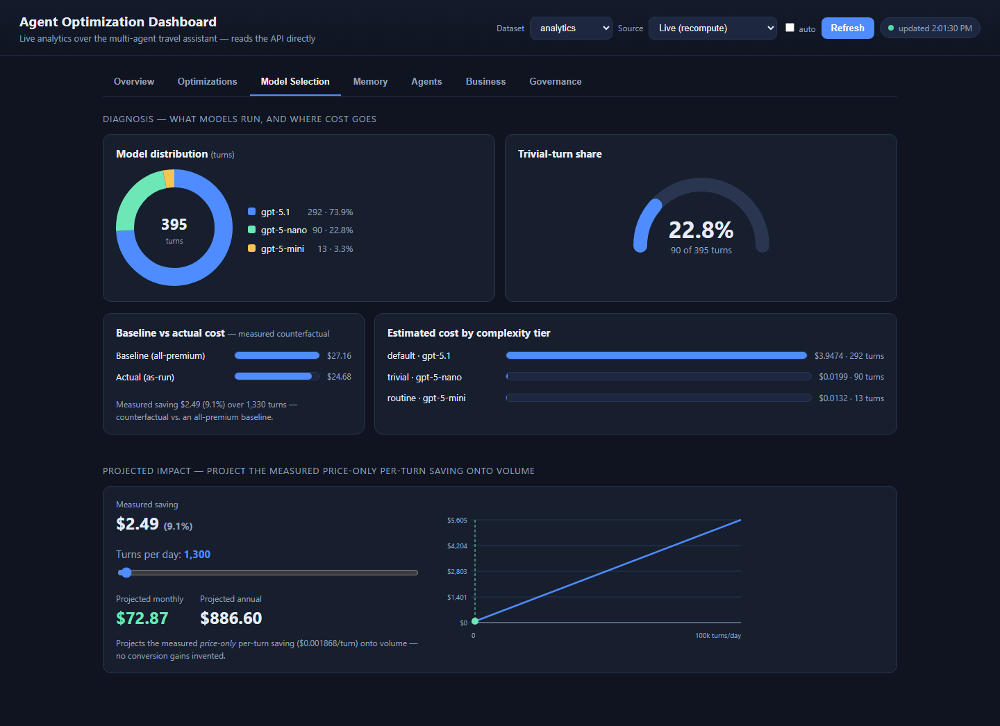
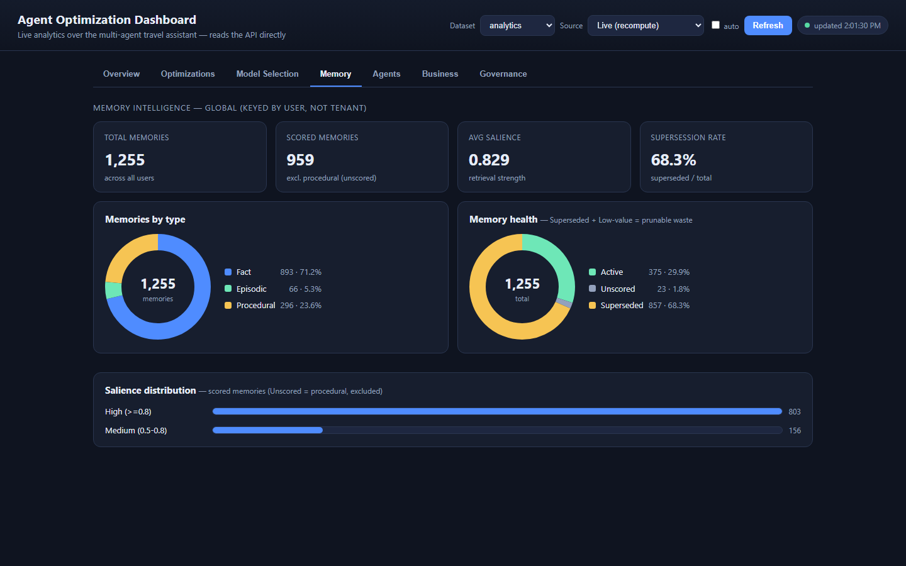

# Module 07 - Agent Analytics (Visibility & Insight)

**[< Evaluating Your Multi-Agent Application](./Module-06.md#module-06---evaluating-your-multi-agent-application-bonus-module)** - **[Agent Optimization >](./Module-08.md#module-08---agent-optimization-apply-autonomy)**

## Introduction

You've built a capable multi-agent travel assistant, made it **observable** (Module 05, LangSmith traces) and learned to **evaluate** its quality (Module 06). Traces tell you what happened on *one* request; evaluation scores *one* conversation. But to run an agent system well, organizations need to answer **higher-level, fleet-wide** questions:

- Which agents and workflows deliver the best outcomes?
- Which memories improve success — and which are stale or ineffective?
- What is the **cost per successful outcome**, and where is spend wasted?
- How does agent behavior evolve over time?

Answering these requires turning raw execution into **analytics** — structured, queryable signal about how your agents behave and what it costs. This module is about **visibility and insight**: instrumenting your app to capture that signal, moving it into surfaces you can explore, and reading it to find concrete opportunities. In Module 08 you'll *act* on what you find.

Even beyond describing the system, analytics exists to *change* it. The questions that make this strategic are:

- **How can these insights improve agent behavior?**
- **Which optimizations should be applied — and which can be applied safely, automatically?**
- **How can an agent system continuously improve over time?**

Those are the questions this module (visibility) and the next (action) exist to answer.

> **This module is additive.** It bolts onto the app you already built with one small hook and two provided files — **you will not modify Modules 01–05.** The Cosmos containers and the analytics surfaces it uses are provisioned for you by `azd up` (Bicep). You write the capture hook; you *use* the provided dashboards.

## Learning Objectives and Activities

- Understand why fleet-level **analytics** matters for agents, the **8 optimization dimensions**, and the **maturity model** (Visibility → Recommendations → Assisted → Autonomous → Adaptive)
- Learn the **risk model**: policies (memory, routing, model selection, tools) are lower-risk; prompt/workflow/code changes are human-governed
- **Instrument** your app to capture per-turn model, token, and complexity tier signal — and (optionally) **per-agent node-grain** that feeds the Module 09 **agent scorecard**
- Move that signal into an analytics surface you can explore *now* — the **web analytics portal** (+ REST) over Cosmos — and understand the **Cosmos → Fabric → reverse-ETL** pipeline that feeds the portal's notebook-backed view (with Power BI available as an optional report) in Module 09
- **Detect** opportunities and **measure** what matters — starting with **cost per successful outcome**

## Module Exercises

1. [Activity 1: Why Analytics for Agents](#activity-1-why-analytics-for-agents)
2. [Activity 2: Instrument Your App](#activity-2-instrument-your-app)
3. [Activity 3: Generate Signal and See It](#activity-3-generate-signal-and-see-it)
4. [Activity 4: Detect Opportunities](#activity-4-detect-opportunities)
5. [Activity 5: Measure What Matters](#activity-5-measure-what-matters)
6. [Activity 6: How It Scales — The Analytics Pipeline](#activity-6-how-it-scales--the-analytics-pipeline)
7. [Activity 7: From Insight to Action](#activity-7-from-insight-to-action)

---

## Activity 1: Why Analytics for Agents

### From traces to analytics

Observability (Module 05) is *per-request* debugging: you follow one trace from user message → supervisor → tool → Cosmos. **Analytics** is *aggregate*: across thousands of turns, which patterns cost the most, which produce outcomes, which memories help. Both matter; this module builds the second.

### The 8 optimization dimensions

Organizations want to continuously optimize:

1. **Agent quality** — are responses correct and helpful?
2. **Workflow efficiency** — are the right steps taken, without waste?
3. **Memory effectiveness** — do recalled memories improve success?
4. **Routing effectiveness** — does work go to the right agent/tool?
5. **Tool utilization** — are tools used when they should be?
6. **Model selection** — is each turn on a model sized to its value?
7. **Cost efficiency** — what does an outcome cost?
8. **Business outcomes** — bookings, conversions, satisfaction.

### The maturity model

| Level | Name | What the system does |
|-------|------|----------------------|
| L1 | Visibility | Surfaces data on dashboards |
| L2 | Recommendations | Suggests optimizations |
| L3 | Assisted | Applies with human approval |
| L4 | Autonomous | Applies within guardrails |
| L5 | Adaptive | Continuously self-tunes |

**This module is L1–L2** (visibility and recommendations). Module 08 climbs to L3–L5.

### The risk model (remember this)

Not every optimization is equally safe to automate:

- **Higher-risk (human-governed, ceiling ~L3):** prompts, workflows, code.
- **Lower-risk (can reach L4/L5):** *policies* — memory salience/retention, retrieval weighting, routing thresholds, **model selection**, tool selection.

Analytics doesn't just describe the system — it feeds the decision about *which* optimizations are safe to apply, and how autonomously. Keep the risk model in mind as you read the insights below.

---

## Activity 2: Instrument Your App

You can't analyze what you don't capture. The provided **optimization layer** ships a lightweight per-turn recorder; your job is to call it.

### Tour the provided files

- `python/src/app/services/optimization.py` — the reusable analytics + optimization engine. In this module you'll use `record_optimization_turn(...)` (capture) and `build_recommendations(...)` (the recommendation card). It also contains the policy store, complexity classifier, and dynamic model helper you'll connect to your LangGraph app in Module 08. Those functions are inert until you add the Module 08 hook and activate a policy.
- `python/src/app/optimization_api.py` — the `/optimizations` REST surface (recommendations now; apply/revert in Module 08).

Both are provided; the Cosmos containers they use (`OptimizationTurns`, `OptimizationPolicies`) are created by `azd up` (Bicep).

### Hook 1 — mount the REST surface

Open `01_exercises/python/src/app/travel_agents_api.py`. You'll add two things here — the **imports** (top of the file) and the **router mount** (right after the app is configured).

**1a — imports.** Scroll to the **import section at the top of the file** (where the other `from src.app...` lines live). Copy the four lines below and paste them at the end of that import block. Module 08 will reuse the `optimization` service; `AZURE_OPENAI_DEPLOYMENT` identifies the fixed baseline model recorded in this module.

```python
# Module 07 — optimization / analytics
from src.app.optimization_api import router as optimization_router
from src.app.services import optimization
from src.app.services.azure_open_ai import AZURE_OPENAI_DEPLOYMENT
```

**1b — mount the router.** Near the top of the file, find the CORS middleware block — it starts with `app.add_middleware(CORSMiddleware,` and ends with a line containing just `)`:

```python
app.add_middleware(
    CORSMiddleware,
    ...
)
```

**Immediately after that closing `)`** (and before the `# Health & Status Endpoints` section), copy and paste this single line:

```python
app.include_router(optimization_router)   # Module 07 — mount the /optimizations REST surface
```

### Hook 2 — record every turn

Still in `travel_agents_api.py`, **search for `def store_debug_log_from_response`**. This helper runs after every turn — it already pulls the token usage out of the model response and writes your debug log, so it's exactly where the per-turn optimization record belongs (the completion handler itself never sees the token counts).

Inside that function's `try` block, find the `stored_id = store_debug_log(` call and the closing `)` of that call. **Copy the block below and paste it immediately after that closing `)`** — and before the `logger.info(...)` line just below it (keep the indentation shown, since it sits inside the `try` block):

```python
        # Module 07 — record this turn for optimization analytics.
        # Every turn runs on the default model for now, so record complexity_tier "default".
        optimization.record_optimization_turn(
            tenant_id=tenantId, user_id=userId, session_id=sessionId,
            complexity_tier="default", deployment=AZURE_OPENAI_DEPLOYMENT,
            usage={"input_tokens": input_tokens, "output_tokens": output_tokens,
                   "total_tokens": total_tokens, "cached_tokens": cached_tokens},
            model_name=model_name,
        )
```

You're reusing the `input_tokens`, `output_tokens`, `total_tokens`, `cached_tokens`, and `model_name` variables that this function already computed a few lines above — and `optimization` / `AZURE_OPENAI_DEPLOYMENT` are the imports you added in Hook 1.

### Hook 3 — capture per-agent node-grain (optional; feeds the Module 09 agent scorecard)

> **Add this only if it is absent.** Some workshop builds already include Hook 3. Search for
> `record_node_executions` first; if the call is present, compare it with the block below and do
> not paste a second recorder.

Hook 2 records **one aggregate row per turn** — enough for spend and model selection, but it can't answer *which agent* drove the cost. Your graph already streams **per-node updates** (`response_data` is the `stream_mode="updates"` result — a list of `{node: {"messages": [...]}}`), so the per-agent signal is right there; the flattening loop at the top of this function just collapses it into one total. This hook keeps it.

Still inside `store_debug_log_from_response`, **immediately after the Hook 2 block you just pasted** (same indentation — inside the `try`), paste:

```python
        # Module 07 (Hook 3) — capture per-AGENT node-grain, not just the turn total.
        # response_data is a list of {node: {"messages": [...]}} updates, so each entry
        # already isolates one agent's model call(s). Sum each agent's usage into a node
        # record instead of collapsing them into a single turn total.
        node_execs = []
        node_deployment, _ = optimization.select_deployment_for_turn(
            [{"role": "user", "content": user_message_text}]
        )
        for entry in response_data:
            for node_agent, node_details in entry.items():
                n_in = n_out = n_total = n_cached = 0
                n_model = model_name
                for msg in (node_details.get("messages", []) if isinstance(node_details, dict) else []):
                    um = getattr(msg, "usage_metadata", None) or {}
                    if not um:
                        continue
                    n_in += um.get("input_tokens", 0) or 0
                    n_out += um.get("output_tokens", 0) or 0
                    n_total += um.get("total_tokens", 0) or 0
                    n_cached += (um.get("input_token_details") or {}).get("cache_read", 0) or 0
                    n_model = (getattr(msg, "response_metadata", {}) or {}).get("model_name", n_model)
                if n_total or n_in or n_out:
                    node_execs.append({
                        "seq": len(node_execs), "agent": node_agent,
                        "model_deployment": node_deployment, "model_name": n_model,
                        "input_tokens": n_in, "output_tokens": n_out,
                        "total_tokens": n_total, "cached_tokens": n_cached,
                    })
        optimization.record_node_executions(
            tenant_id=tenantId, user_id=userId, session_id=sessionId,
            turn_id=debug_log_id, node_execs=node_execs,
        )
```

`record_node_executions` is the provided recorder (it **self-provisions** the `NodeExecutions` container, so it works even before an `azd up`; the Bicep also declares the container for future deploys). Each turn now writes **one document holding a per-agent list** alongside the turn aggregate. Use the active policy's selected deployment for `model_deployment` so tiered node rows join to the same pricing configuration as aggregate turns.

> **Where's the payoff?** The per-turn portal cards don't read node-grain — the **agent scorecard** does, on the portal's **Agents** tab after the Module 09 notebook writes the `agent_scorecard` snapshot. There the Fabric notebook rolls your `NodeExecutions` into an *agent × dimension* health view (**cost efficiency**, **model selection**, **workflow efficiency**). The pre-seeded **`analytics`** tenant already carries node-grain so that view renders immediately; **this hook is what makes _your own_ traffic show up there too.** To spot-check capture right now, drive a few turns, then run `SELECT * FROM c` on the **`NodeExecutions`** container in the Data Explorer — you'll see one document per turn with a `nodeExecutions` array.

### Save and let the API reload

The travel API runs under uvicorn with `--reload`, so **saving the file auto-reloads it — no manual restart is needed** (watch Terminal 2 for the reload line). If the API isn't running, start it with the Terminal 2 command from [Module 00](./Module-00.md#module-00---deployment-and-setup). Nothing behaves differently in the chat — but every turn now lands in the `OptimizationTurns` container. That's the **instrument** step of the loop.

> In Module 08 you'll replace this baseline recorder call with `optimization.record_optimization_turn_for_message(...)` and pass the user text through your completion telemetry seam. The reusable service will classify the turn and record the deployment chosen by the active policy.

---

## Activity 3: Generate Signal and See It

Drive some realistic traffic through the app (frontend or completion endpoint): a few greetings ("hi", "thanks"), several place queries ("hotels in Amsterdam", "good restaurants near the Rijksmuseum"), and a full itinerary-to-trip request — e.g. *"Create a 3-day trip to Amsterdam starting August 5 — canal cruise day 1, Van Gogh Museum day 2, Anne Frank House day 3, hotel Krasnapolsky. Save it to my profile."*

> **Pace yourself.** If you fire many turns in quick succession (especially the heavy trip turn), you may see a **rate-limit message** — the shared model deployment has a per-minute request/token quota. It's harmless: just wait ~30 seconds and resend. Driving turns at a natural pace avoids it.

After the trip saves, open the **Trips** page in the app to see your new day-by-day itinerary — a good sanity check that the agent, MCP tools, and Cosmos are all wired end-to-end. That same turn also lands in `OptimizationTurns`, which is the signal the rest of this module reads.

> **Mark the trip as confirmed.** On the **Trips** page, click **Confirm** on the trip you just created (the button appears on any trip still in *planning*). This flips its status to `confirmed` — a real **outcome**. The **cost-per-outcome** panel below divides spend by *confirmed* trips, so without at least one confirmation your funnel never converts and every token reads as "wasted." Confirming here is what turns your traffic into a completed funnel.

You now have two ways to look at the captured signal:

### The web analytics portal (provided)

**Open a new terminal for this** — your MCP, API, and frontend terminals are all still running, so the portal needs a **fourth** terminal of its own. Start the **web analytics portal** — the provided single-file dashboard — on its own port (separate from the `:4200` travel app):

```powershell
# in a NEW terminal, from the repo root
python -m http.server 8060 --directory analytics\dashboard
```

Leave it running and open <http://localhost:8060> in your browser.

> **No virtual environment needed here.** The portal is a **static** web app (`analytics\dashboard\index.html`) that calls the Travel API on `:8000` over REST from your browser. `python -m http.server` is just Python's built-in static file server, so any Python works and there are **no dependencies to install** — this is unlike the MCP and API servers, which are Python apps that run inside the workshop's virtual environment. (The API *does* need to be running, since the portal reads from it.)

Open <http://localhost:8060>. The portal auto-detects the local API as `http://localhost:8000` — there is no API URL to enter. The **Dataset** selector defaults to **`marvel`** — the tenant the frontend records turns under, so the traffic you just drove is stored under it. Set **Source → Live (recompute)** so the portal recomputes from the raw captured turns (there is no notebook snapshot yet), then click **Refresh** (the portal also refreshes automatically when you switch datasets).

> **The Dataset selector is a *lens*, not an optimization boundary.** It picks *which slice of captured telemetry you're looking at* — but any optimization you **apply** (e.g. a model-selection policy) is **app-wide (global)**: policies live in a container with no `tenantId`, so they take effect for every tenant at once. That's why it's labelled *Dataset*, not *Tenant* — you observe per-dataset, but you optimize for the whole app.

> **This is *your* traffic — and it's a small sample.** `marvel` ships with **no** pre-captured optimization turns; everything here is the handful of turns *you* drove in Activity 3 — that's the payoff of instrumenting the app, seeing your own signal appear. With a sample this small, some recommendation cards will be **modest, or read "not enough signal yet"** — that's expected, not a bug. You'll see the same panels backed by a rich stream in a moment (the `analytics` tenant).

> **Where the portal gets its data.** The portal is a *static* page — it stores nothing itself. With **Source → Live (recompute)**, **Refresh** calls the Travel API's `/optimizations/*` endpoints and the **API computes the metrics and recommendation cards on demand, straight from Cosmos**. There is no Fabric, notebook, or Power BI in this loop; each panel is a live rollup of an operational container:
>
> - **Turns · spend · model usage · trivial share · model-selection card** ← `OptimizationTurns` (one row per turn, written by `record_optimization_turn`).
> - **Cost per outcome & conversion funnel** ← the per-session journey in `Debug` (`agent_path`) joined to your confirmed **`Trips`**.
> - **Agent-path cost & redundant-tool cards** ← `Debug` (`agent_path` + per-turn tokens).
> - **Memory-retention card** ← the `Memories` container (global — shared across datasets, not per-tenant).
> - **The $ rates** behind "estimated cost" ← the `Configuration` model-pricing rows.
>
> Because every number is computed live from the operational store, the portal runs on **Cosmos alone** in this module. The heavier reverse-ETL path (`OptimizationInsights` via a Fabric mirror) is **Module 09**; after that notebook writes its snapshot, you'll switch the portal's Source to **Reverse-ETL (notebook)**.

Take a few minutes to read each panel; here's what to notice in each, and why it matters:

- **Turns & spend** — total turns, total tokens, and estimated cost. *Why it matters: this is your baseline spend — the single number Module 08 will try to move.*
- **Model usage** — a breakdown by model. Right now it's **one model, 100%**. *Why it matters: every turn, trivial or complex, pays the same rate — the core inefficiency this lab targets.*
- **Trivial-turn share** — the fraction of turns that are short, no-delegation answers (greetings, acks, one-line clarifications). *Why it matters: these are near-zero-work turns paying full price; the share varies by app, but it's usually a meaningful slice worth reclaiming.*
- **Cost per outcome** — total spend divided by confirmed trips. *Why it matters: this is the north-star; a turn that never leads to a booking isn't "cheap," it's waste.*
- **Recommendation cards** — each card is a detected opportunity with evidence and a proposed change, **computed live in-app from your `OptimizationTurns`** (no notebook or Fabric mirror needed — that deeper reverse-ETL path is Module 09). In this module you *read* them; in Module 08 you *apply* the config cards from the portal.

> **Model pricing is config-driven — one edit, everywhere.** The $/1M-token rates behind "estimated cost" are stored in the Cosmos **`Configuration`** container (`type = "model_pricing"`), seeded at deploy time from the models `azd` actually deployed. The app's recommendation card, the web analytics portal, the Fabric reverse-ETL notebook, and the optional Power BI report all read those **same** rows — no CSV, no per-place hardcoding. Models are discovered from your data; any model without a priced row falls back to a default, so a model swap never breaks a report. To change a price or add a model, edit **`python/data/model_pricing.json`** (the committed price reference, format `{"deployment": {"input": x, "output": y}}` USD per 1M tokens) and redeploy. See **[analytics/docs/model-pricing.md](../../analytics/docs/model-pricing.md)** for the default models and how to find a model's price.

Notice what the portal is doing: it rolls your captured turns up into a handful of **decisions** — which is exactly what a human operator (or, later, the system itself) needs to act. Keep **Source → Live (recompute)**, then switch the **Dataset** selector to **`analytics`** — a pre-seeded tenant with hundreds of turns — to see the recommendations at full strength, where "many turns → a few decisions" really lands. **`analytics` is the at-scale dataset you'll keep using through Modules 08–09** (it's also what the traffic simulator and the Module 09 conversion funnel write to), so get familiar with it now.

### The raw signal (REST + CLI)

Everything the surfaces show comes from data you can query directly. This is a plain REST call — **no virtual environment needed** (it just hits the running API over HTTP), but your **API must be running** (Terminal 2 from [Module 00](./Module-00.md#module-00---deployment-and-setup)). Use any free terminal, or open a new one:

```powershell
# the recommendation card, straight from the API — replace 'marvel' with 'analytics' for the at-scale dataset
Invoke-RestMethod "http://localhost:8000/optimizations/marvel" | ConvertTo-Json -Depth 6
```

The portal is a *view*; the source of truth is `OptimizationTurns` (with the `Debug` and `Trips` telemetry beside it) in Cosmos. Now that you can *see* the signal, the next two activities are the analytics work itself — **detect** the opportunities in it, then **measure** what actually matters.

---

## Activity 4: Detect Opportunities

Read the recommendation card (portal or REST). With every turn on one model, two things jump out:

- **A single model serves everything** — greetings and full itinerary generation alike.
- **A large share of turns are trivial** — short answers with no delegation. Commonly ~40–50%.

That's the **model-selection** opportunity (dimension 6): trivial turns pay full price; high-value turns might merit a stronger model. The card names it, shows the evidence from *your* data, and proposes a complexity-tiered policy — the **recommend** step (maturity L2). A card looks like:

```json
{
  "scenario_id": "model-selection",
  "title": "Capability-tiered model selection",
  "status": "not_proposed",
  "evidence": {
    "total_turns": 18,
    "trivial_turns": 8,
    "trivial_pct": 44.4,
    "model_distribution": { "gpt-5.1-...": 18 }
  },
  "estimated_saving_usd": 0.13,
  "estimate_caveat": "ESTIMATE only. gpt-5-nano is a reasoning model ...",
  "proposed_params": { "complexity_tiers": { "trivial": "gpt-5-nano", "routine": "gpt-5-mini", "complex": "gpt-5.1" } }
}
```

Read it critically: the `evidence` is *your* measured data; the `estimated_saving_usd` is a projection with an explicit caveat (you'll confirm or refute it by measuring in Module 08).

Look also for other dimensions in the same data:
- **Tool utilization** — how often does a place question get answered from model knowledge instead of a `find_places` search?
- **Cost concentration** — do a few expensive turns (itinerary generation) dominate total spend?

### The portal surfaces more than model selection

`GET /optimizations/<tenant>` (and the portal's **Optimizations** tab) returns a **set** of cards — and they're deliberately different *kinds* of action, which is the real lesson: an "optimization" isn't one thing.

- **Apply-able policies** (autonomous, L4/L5): capability-tiered **model selection** and **memory retention** (prune stale/superseded memories). One-click, reversible toggles.
- **Insights awaiting analysis** (higher-risk, human-governed → L3): **redundant tool calls** (a repeated-node pattern the engine detects from telemetry). Detection is operational, but *proposing and measuring* the prompt/code fix is offline analytical work. After Module 09's analyst writes a staged card, the portal shows **Review change** plus the **Approve / Deploy / Dismiss / Roll back** governance lifecycle; it still never auto-edits code or bypasses human review.
- **Diagnostic lenses** (no toggle): **cost per outcome & conversion funnel** and **agent-path cost concentration**. cost per outcome is the *business-impact* view — it doesn't just say "36% of tokens went to sessions that never booked," it builds a funnel (engaged → searched → planned → confirmed), shows **where** sessions leak and **why** (e.g. the agent kept re-asking the city), and names the fix. These *tell you where to look*; you act via the policies above — a dashboard can't auto-fix a conversion problem, but it can point straight at the cause.

You're not fixing anything yet — you're building the *insight* that Module 08 will act on.

> **Concept — memory intelligence (the flagship signal).** The `memory retention` policy above sits on a distinct family of signals worth understanding on their own: **salience** (how confident/valuable each memory is), **memory health** (Active vs. **Superseded** vs. **Low-value**), and **supersession rate** (how often the agent corrects itself as a user's preferences change). Why it matters: **memories aren't free** — every recall retrieves and *pays* (tokens + latency) for the memories it pulls, so stale, never-recalled, low-salience, and superseded memories are pure cost that can also dilute answer quality. The portal's **Memory** tab visualizes exactly this (salience distribution, memories by type, memory health); the **`memory-retention`** policy is the *action* — a reversible soft-prune of superseded memories. It's the memory-pillar instance of the same **detect → measure → apply → re-measure** loop as model selection — and it's something an **analytics platform is uniquely able to show**: trace tools tell you what one run did, but only cross-entity analytics over your app's own memory state can tell you *"X% of memories are never recalled and Y% are superseded."*

---

## Activity 5: Measure What Matters

The north-star metric for an agent system isn't tokens per turn — it's **cost per successful outcome** (e.g., cost per confirmed trip). A cheap turn that never leads to a booking isn't efficient; an expensive turn that closes one may be the better value.

The portal *showed* you this; now **measure it yourself** with the provided `optimization_mining.py` script — the command-line counterpart to the portal, and the tool you'll re-run in Module 08 to prove an optimization actually saved money.

You need a terminal with the **virtual environment active** (the script talks to Cosmos), and it's run from the **repo root** (one level above `01_exercises`). Reuse your portal terminal, or open a new one:

```powershell
# activate the venv (from the 01_exercises folder), then step up to the repo root
.\.venv-travel\Scripts\Activate.ps1
cd ..

# per-complexity-tier cost breakdown from the turns you captured
python analytics/scripts/optimization_mining.py --tenant marvel --verify
```

Use `--tenant marvel` for *your* traffic (or `--tenant analytics` for the at-scale dataset). The `--verify` report groups your captured turns **by complexity tier** and prints turns, tokens, and **estimated cost** per tier, with a grand total:

```
=== MODEL-SELECTION VERIFY - per-complexity-tier cost for tenant 'marvel' ===
  complexity tier (deployment)          turns    in   out  total    est $
  default (gpt-5.1)                          5   ...   ...    ...   0.00xx
  TOTAL                                                             0.00xx
```

**Right now everything is `default`** — a single row, because every turn runs on one model. *That single line is your baseline.* Note the totals. In Module 08 you'll apply the model-selection policy (which tags turns `trivial`/`routine`/`complex`), re-run this **exact command**, and see it split into **multiple rows** — that's how you compare **cost per outcome** before/after. Two habits to build now:

1. **Measure outcomes, not just cost** — always tie spend to a business result.
2. **Trust measurement over estimates** — especially with reasoning models, whose hidden "reasoning tokens" make naive projections misleading. The measured before/after is the truth (not the card's *estimated* saving).

---

## Activity 6: How It Scales — The Analytics Pipeline

You just detected and measured on a **live, in-app peek**: `GET /optimizations/{dataset}` computes the cards and KPIs on demand, straight from Cosmos, with no analytics infrastructure required. That's ideal for *detecting* an opportunity — but it doesn't scale to cross-session aggregation, historical trends, or the measured before/after. For that you need an **analytical plane**, which is what **Module 09** builds. Here's the shape of it so the pieces click into place.

How does a turn become an insight on a dashboard? The pipeline:

```
 app turn ──record_optimization_turn──▶ Cosmos: OptimizationTurns
                                             │
                                             ▼
                              Fabric notebooks (analyze / aggregate,
                              compute recommendation cards + KPIs)
                                   │                     │
                             reverse-ETL             Lakehouse tables
                                   ▼                     ▼
                     Cosmos: OptimizationInsights   Optional Power BI report
                                   │
                                   ▼
                   Web analytics portal (cards + apply/governance)
```

Key ideas to understand (and to talk about):

- **Cosmos is the operational store** — the app writes turns here and reads *insights/cards* here, so the live app and the dashboards share one low-latency source.
- **Fabric does the heavy analysis** — aggregations, trends, and recommendation generation run in notebooks over the lakehouse, not on the request path.
- **Reverse-ETL closes the loop** — computed insights are written *back* into Cosmos so the app and the portal can act on them in real time. This is why the portal can show recommendations and apply them without an analytics round-trip.

> **Detect operationally; measure analytically.** Computing a recommendation card is lightweight, so `GET /optimizations/<tenant>` does it **in-app from Cosmos** — the fast "peek" you used to *detect*. The **cross-session aggregation and the measured before/after** belong in the analytical plane: in Module 09 you compute the **conversion funnel** and the **measured saving** over the Fabric mirror and reverse-ETL them into `OptimizationInsights`, where the portal's **Reverse-ETL (notebook)** source (and `GET /optimizations/<tenant>/result`) read them cheaply.

**The at-scale view (keep Source → Live (recompute)).** Switch the **Dataset** to `analytics` — the pre-seeded tenant with hundreds of turns — and keep **Source → Live (recompute)** to see the same panels at scale, recomputed live from the raw turns. (In **Module 09** you'll stand up the Fabric mirror, run the reverse-ETL notebook, and *then* switch the portal's **Source** to **Reverse-ETL (notebook)** to read the notebook's snapshot instead — but that comes later.) Here's what two of those tabs look like at scale:



*The portal's **Model Selection** tab puts the tiering story front and centre — the model-distribution donut, a trivial-turn gauge, cost by complexity tier, baseline-vs-actual bars, and a turns-per-day projection slider: the fleet-level baseline (Activity 5) rendered at scale.*



*The portal's **Memory** tab: total vs **scored** memories, average salience, supersession rate, and the memories-by-type / memory-health / salience-distribution breakdowns. **Unscored** memories (procedural rules with no salience score) appear in the type and health views but are excluded from the salience-strength chart, so they don't look like weak memories.*

> **Power BI is optional.** A Power BI report over the same mirror is auto-deployed as an optional, secondary surface — but the web analytics portal above is the recommended surface for this workshop.

---

## Activity 7: From Insight to Action

You've completed the first half of the optimization loop:

> **instrument → detect → recommend →** *apply → verify*

You instrumented the app, saw the signal in the portal, detected the model-selection opportunity, established the cost-per-outcome baseline, and traced the pipeline that feeds the portal's **Reverse-ETL (notebook)** source in Module 09. You're at **maturity L2**: the system can *recommend*, and a human can read the insight.

In **Module 08** you'll close the loop — apply the recommended optimization with one click, verify it from data, contrast a lower-risk autonomous change with a higher-risk human-governed one, and finally make the system **self-correct** with an automated quality gate.

## Test Your Work

- [ ] The two hooks (mount router, `record_optimization_turn`) are wired; the app runs normally.
- [ ] After some traffic, `OptimizationTurns` has one document per turn.
- [ ] `GET /optimizations/<tenant>` returns a recommendation card built from your turns.
- [ ] You can open the web analytics portal with **Source → Live (recompute)** (or query the REST endpoint) and explain, in your own words, the trivial-turn waste and the single-model pattern.
- [ ] `--verify` prints a per-complexity-tier (currently all `default`) cost baseline.
- [ ] You can state why **cost per outcome** — not cost per turn — is the metric that matters.

## Troubleshooting

- **`OptimizationTurns` is empty after traffic.** Confirm the `record_optimization_turn` call is *after* you extract token usage and is actually reached (add a log line). Confirm `azd up` created the `OptimizationTurns` container (`az cosmosdb sql container list ...`).
- **Recommendation card shows `total_turns: 0`.** You're querying a different `tenantId` than you drove traffic with — pass the same tenant to `GET /optimizations/{tenant}`.
- **Portal shows nothing.** With **Source → Live (recompute)**, it reads the same Cosmos data as the REST API — verify the API returns a card first, then reload the portal.
- **`--verify` errors on the container.** Pass `--container OptimizationTurns` (the default), and ensure `COSMOSDB_ENDPOINT`/`COSMOSDB_DATABASE_NAME` in your env match your deployment.

## What You Learned

You turned raw execution into **analytics**: you instrumented the app, moved the signal into surfaces you can explore, and read it to find a concrete, data-backed opportunity — all without touching the app's core behavior. You learned the 8 dimensions, the maturity model, and the risk model that governs *how* optimizations can be applied. Next, you'll act on it.

### Return to **[Home](./Home.md#build-a-multi-agent-workshop)**

**[< Evaluating Your Multi-Agent Application](./Module-06.md#module-06---evaluating-your-multi-agent-application-bonus-module)** - **[Agent Optimization >](./Module-08.md#module-08---agent-optimization-apply-autonomy)**
