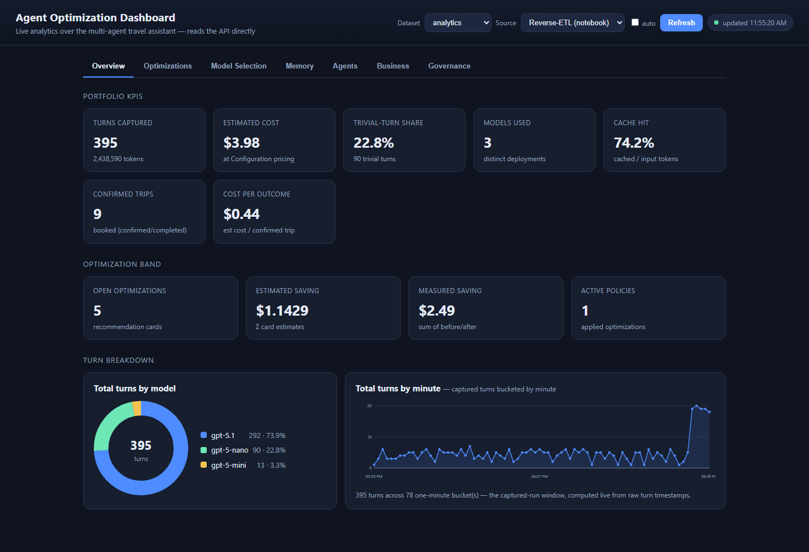
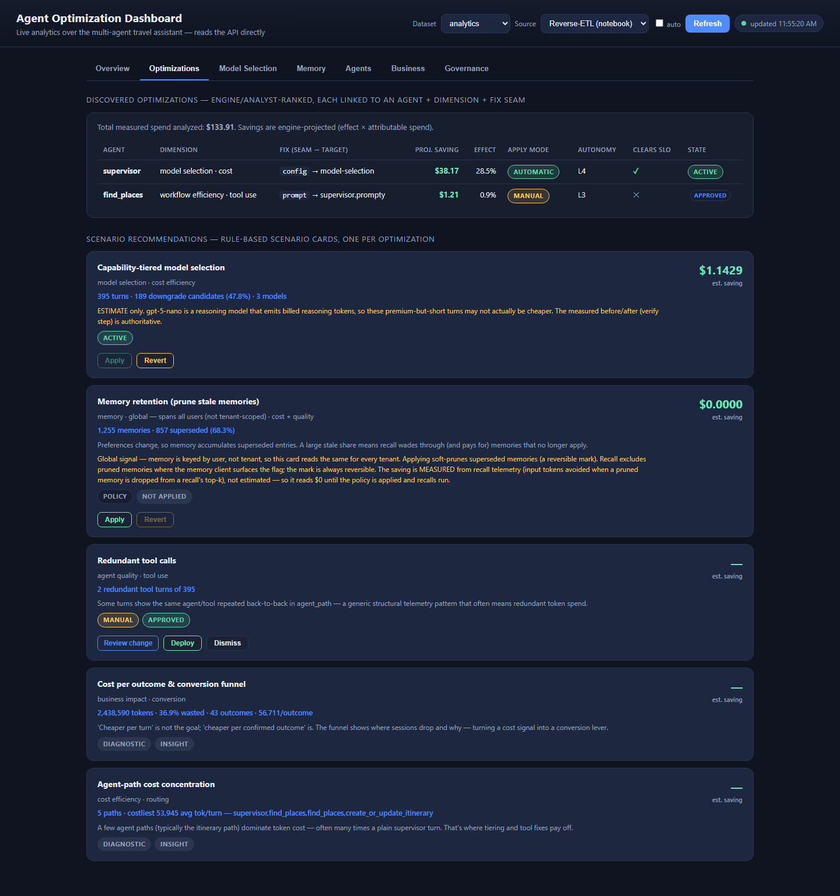
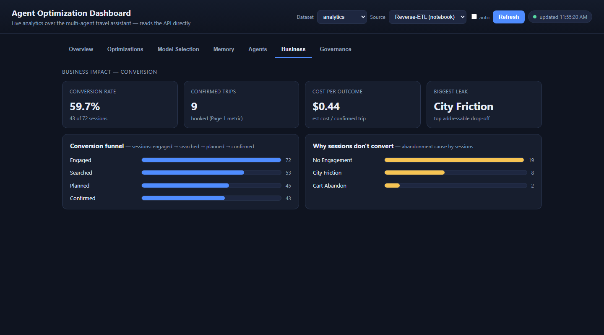
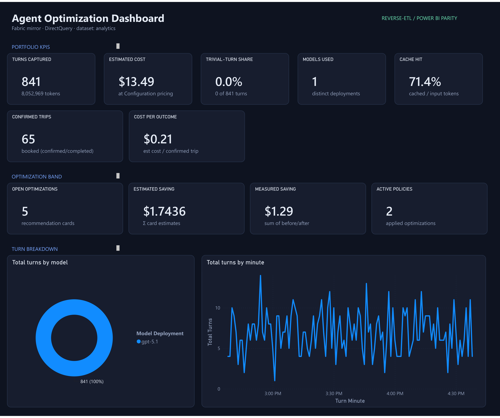
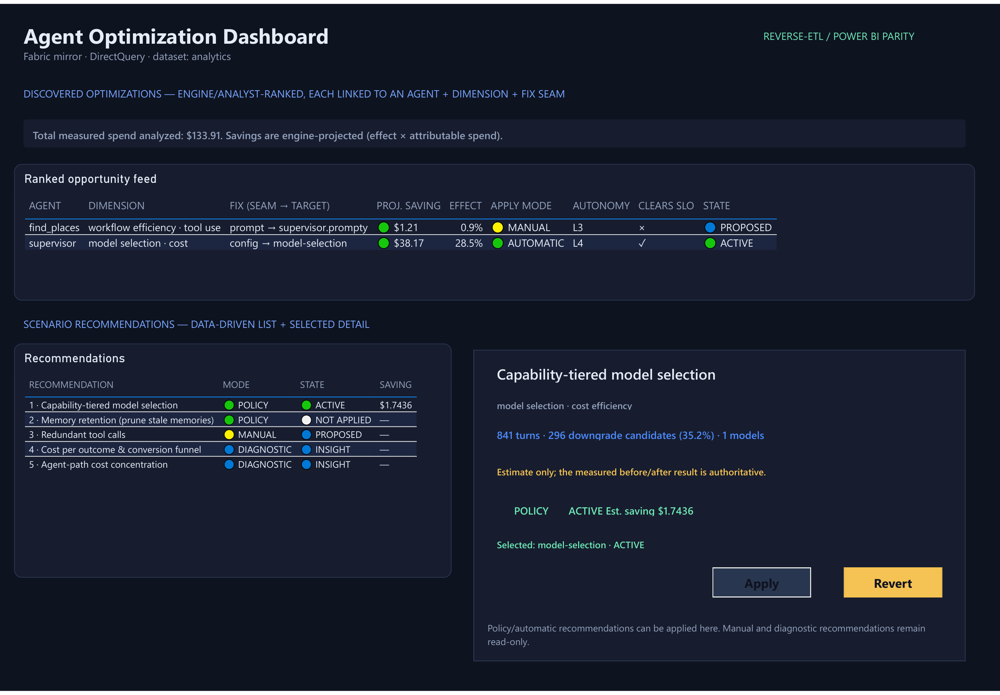
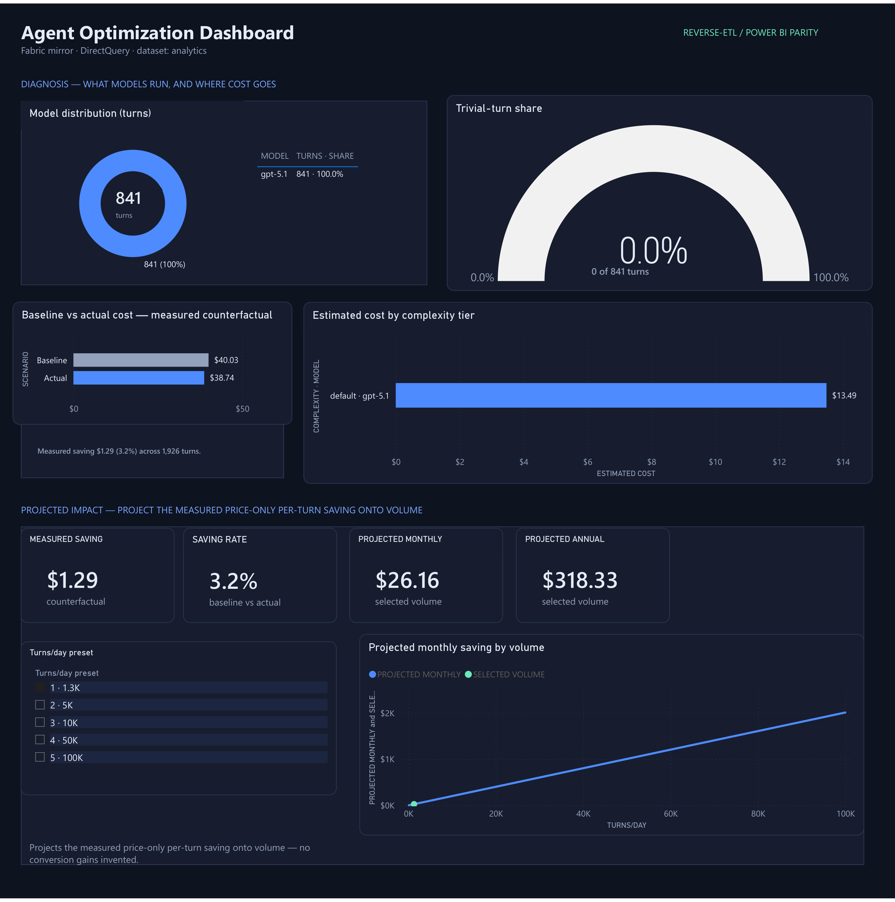
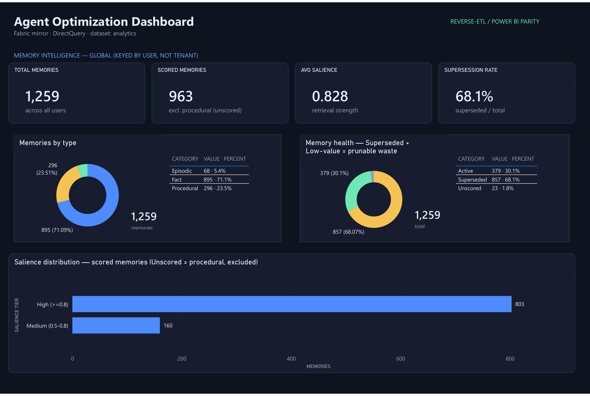
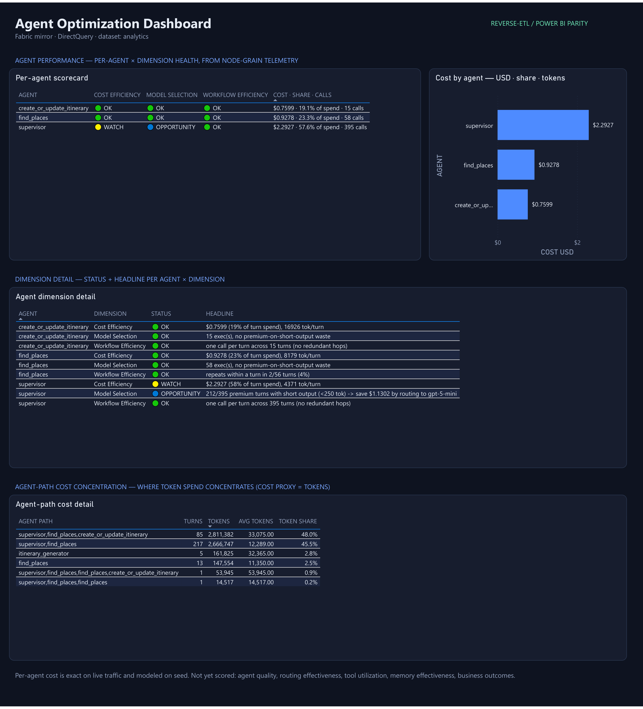
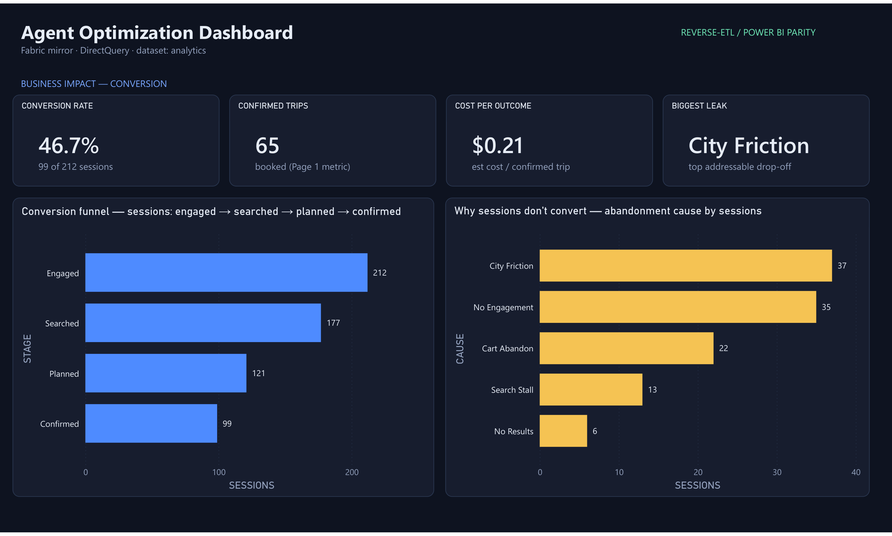
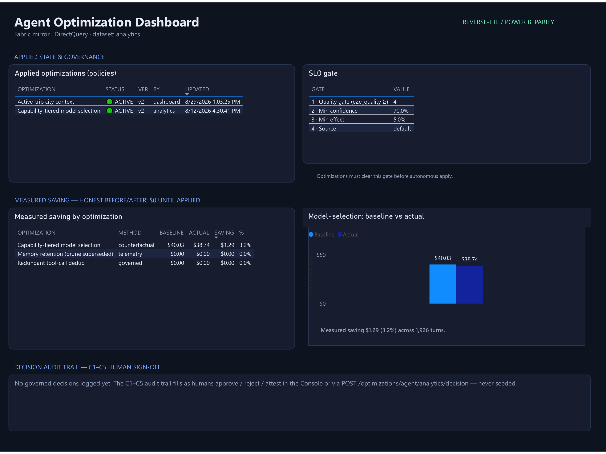

# Module 09 - Fabric Analytics & Reverse-ETL

**[< Agent Optimization](./Module-08.md#module-08---agent-optimization-apply-autonomy)** - **[Lessons Learned & The Future >](./Module-10.md#module-10---lessons-learned-the-future-of-agentic-systems)**

## Introduction

In Modules 07–08 you instrumented the agent, surfaced recommendations, and applied a reversible optimization — all on **Azure Cosmos DB**, the app's **operational** store. Cosmos is the right home for the live agent: single-digit-millisecond reads/writes on the request path, global distribution, schema-flexible documents.

But the *heavy* analytics — a **conversion funnel** across every session, trends over time, cross-tenant rollups — is a different workload. You should **not** run large aggregations on the transactional path: it doesn't scale, it burns request-unit budget, and a runaway analytical query shouldn't be able to slow the agent that's serving customers.

The answer is **two planes, one zero-ETL bridge**:

```
Cosmos (operational) ──mirror──▶ Fabric (analytical) ──reverse-ETL──▶ Cosmos (OptimizationInsights) ──▶ app acts / web analytics portal
```

- **Microsoft Fabric Mirroring** streams your Cosmos containers into Fabric's OneLake **with no pipeline to build** and near-real-time freshness — and analytics read the *mirror*, never the transactional account.
- **Reverse-ETL** writes the *computed* result back into Cosmos, small and flat, so the operational app (and, at higher maturity, the agent itself) can act on it in real time.

That closed loop is the substrate for the vision's **Level 4 (autonomous)** and **Level 5 (adaptive)** systems: Fabric computes the intelligence; reverse-ETL lands it where the running system can use it.

> **Why this module exists.** This is the pattern that makes agent analytics a *product*, not a demo — and it's why Cosmos + Fabric is such a strong pairing for AI applications: Cosmos for the operational agent, Fabric for the analytical brain, Mirroring + reverse-ETL to connect them.

## Learning Objectives and Activities

By the end you will be able to:

- Explain the **operational vs analytical plane** split and why analytics doesn't belong on the transactional path.
- Describe **Mirroring** (zero-ETL Cosmos → Fabric) and **reverse-ETL** (insights back to Cosmos).
- Compute a **conversion funnel** over the mirror in a Fabric Spark notebook.
- Implement the **reverse-ETL write** that closes the loop.
- Run an **LLM analyst** over the aggregated telemetry — the model *proposes* a recommendation card, the engine's **guardrails** *dispose* — and reverse-ETL the **discovered opportunity**.
- View the **complete** notebook-produced snapshot — **every** portal tab — by switching **Source → Reverse-ETL (notebook)** after the notebook runs.
- Compare the **web analytics portal** and the deployed **Power BI report** as two views over the same reverse-ETL snapshot.
- Use Power BI's **data-function buttons** to call a Fabric User Data Function and safely Apply/Revert an optimization policy.
- Generate policy-aware traffic, rerun reverse-ETL, and verify that both analytics surfaces reflect the changed model mix.
- Connect the pattern to **L4/L5 autonomy**.

## Module Exercises

1. [Activity 1: The Two Planes and the Mirror](#activity-1-the-two-planes-and-the-mirror)
2. [Activity 2: Provision the Workspace and Mirror, then Open the Notebook](#activity-2-provision-the-workspace-and-mirror-then-open-the-notebook)
3. [Activity 3: Build the Decision (`cause` classification)](#activity-3-build-the-decision-cause-classification)
4. [Activity 4: Reverse-ETL the Insights Back to Cosmos](#activity-4-reverse-etl-the-insights-back-to-cosmos)
5. [Activity 5: View the Notebook Snapshot in the Web Analytics Portal](#activity-5-view-the-notebook-snapshot-in-the-web-analytics-portal)
6. [Activity 6: Explore Power BI, Apply the Policy, and Re-measure](#activity-6-explore-power-bi-apply-the-policy-and-re-measure)
7. [Activity 7: The LLM Analyst (Propose, Dispose)](#activity-7-the-llm-analyst-propose-dispose)

---

## Activity 1: The Two Planes and the Mirror

A **mirrored database** is a zero-ETL, near-real-time copy of your Cosmos analytics containers inside Fabric's OneLake. Analytics read *that* copy — never the transactional account. In the next activity you will create it; for now, understand what it is and why it exists.

> **What `azd up` actually provisioned.** For the analytics path, `azd` created **only the Fabric F2 _capacity_** (compute) and the Cosmos containers. It did **not** create the Fabric workspace, the mirrored database, or the notebook — you stand those up in **Activity 2**.

Once created, the mirror carries the workshop's analytics containers as tables, including `OptimizationTurns`, `NodeExecutions`, `Trips`, `OptimizationPolicies`, `OptimizationGovernance`, `Configuration`, `Messages`, `ApiEvents`, `memories`, and the reverse-ETL target `OptimizationInsights`. This module reads those mirrored tables, uses `Configuration` for pricing, and writes computed results back to `OptimizationInsights`.

Two things to internalize:

- **The analytical plane reads the mirror, not Cosmos.** The Spark notebook queries the mirror's **SQL analytics endpoint** — the transactional account isn't touched by analytics.
- **Reverse-ETL is a deliberate, small write back.** You compute a lot in Fabric, then write a **handful of flat rows** back to Cosmos so the app can act cheaply.

## Activity 2: Provision the Workspace and Mirror, then Open the Notebook

You will create the Fabric workspace, the Cosmos mirror, and upload this module's notebook using a single PowerShell script. It reads your deployment settings from your `azd` environment automatically, so you only supply a workspace name and — for one unavoidable portal step — a connection id.

> **⏱️ First, start a live traffic stream — so the portal has data by the time you switch sources.** Provisioning and the mirror's first sync take a few minutes; rather than run traffic *then* wait, start it **now** in a **separate terminal** and leave it running while you work through this module. It streams turns straight into Cosmos, so by **Activity 5** the mirror and notebook snapshot have plenty to show. From the **`analytics/scripts`** folder:
>
> ```powershell
> .\Run-TrafficSimulator.ps1 -Tenant analytics -Forever
> ```
>
> It auto-detects your deployment's Cosmos and virtual environment (needs only `az login`) — run it bare to be prompted for the tenant. **`analytics`** is the shared demo tenant, so you can select it in the portal to watch this stream. Leave it running; press **Ctrl+C** when you finish Activity 5. *(Turns written before the mirror exists are picked up by its initial snapshot, so starting early is exactly right.)*

> **Prerequisites:** you have run `azd up` for this workshop, and you are signed in with `az login` (and `azd auth login`) as a user with permission to create Fabric workspaces. Microsoft Fabric must be enabled for your tenant.

### Step 1 — Run the provisioning script (Phase 1)

Open a **new PowerShell terminal** at the repository root and run:

```powershell
cd analytics\fabric
.\Provision-Fabric.ps1
```

The script auto-detects the workshop folder you deployed (e.g. `02_completed` or `01_exercises`) and its virtual environment. Enter a workspace name that is unique in your tenant, for example **`Multi-Agent Travel Workshop <your initials>`**. Fabric workspace names can remain tenant-reserved even when the signed-in user cannot see the existing workspace; the script reports that collision explicitly. It then runs **Phase 1**: it creates the workspace, assigns it to your F2 capacity, provisions the workspace identity, and grants the required Cosmos RBAC — then pauses.

> If the capacity is `Active` in Azure Resource Manager but never appears in the Fabric control
> plane, this is usually a tenant/region availability mismatch rather than normal propagation.
> Set `FABRIC_CAPACITY_LOCATION` in the `azd` environment to a Fabric-supported region for your
> tenant, reprovision the capacity, and retry. The provisioning error prints this recovery path.

> Uploading the **completed** notebook (for the `02_completed` demo) instead of the learner version? Run `.\Provision-Fabric.ps1 -Solution`.

### Step 2 — Create the Cosmos connection in the Fabric portal (manual, one time)

Creating the Cosmos **connection** is the one step Fabric does not let us automate today, so the script pauses and walks you through it. You are **only creating a connection object** here — the script creates the mirrored database itself, using the connection id you provide. In [https://app.fabric.microsoft.com](https://app.fabric.microsoft.com):

1. Click **Settings** (gear, top-right) → **Manage connections and gateways**. *(This is a **tenant-level** setting, not your workspace settings.)*
2. On the **Connections** tab, click **+ New**.
3. Set **Connection type** to **Azure Cosmos DB v2**, and use the Cosmos **endpoint** the script printed as the account URL. *(Can't copy the URL? The script also prints the Cosmos **account name** and **resource group** — open that account in the Azure portal → **Overview** → copy its **URI**.)*
4. Set the **Authentication method** to **OAuth 2.0** (Organizational account), sign in, then click **Create**.
5. Open the new connection → **Settings** and **copy its Connection ID** (a GUID). *Do not start the "New mirrored database" wizard — the script creates the mirror for you.*

> **Paste tip:** in the VS Code terminal, paste with **Ctrl+Shift+V** (`Ctrl+V` shows a literal `^V`). Alternatively, press Enter to exit and re-run non-interactively: `.\Provision-Fabric.ps1 -ConnectionId <id>`.

> A tenant conditional-access policy may reject VS Code's embedded browser. In that case, create
> the OAuth connection in a compliant external browser and paste only its connection ID into the
> terminal. Never paste an OAuth token or account secret.

### Step 3 — Paste the connection id (Phase 2)

Back in the PowerShell terminal, **paste the connection id** at the prompt and press Enter. The script runs **Phase 2**: it creates the mirrored database, starts replication, and uploads the **`ConversionFunnelReverseETL`** notebook with its parameters pre-filled from your deployment (Cosmos endpoint/database + the mirror's SQL endpoint). It saves `FABRIC_WORKSPACE_ID` and `FABRIC_MIRROR_ID` to your `azd` environment. To resume explicitly after stopping at Phase 1, run `.\Provision-Fabric.ps1 -Phase 2 -ConnectionId <id>`.

> **You never copy the SQL endpoint or database.** The mirror's **SQL analytics endpoint** and database name are the two values people expect to have to hunt down — but the script **discovers them automatically** and **injects them into the notebook's Parameters cell** for you (`SQL_EP` / `SQL_DB`), along with your Cosmos endpoint, database, and tenant id. The **only** value Fabric makes you handle by hand is the **connection id** in Step 2 — the one step Fabric can't automate. When you open the notebook in Step 5, those connection parameters are already filled in; you just confirm them and set `TENANT`.

### Step 4 — Verify in the Fabric portal

Refresh your workspace. Confirm you see both:

- a **mirrored database** whose tables show a *Replicating* / *Running* status,
- the **`ConversionFunnelReverseETL`** notebook,
- the **`optimization-apply-loop`** User Data Function — the translytical Apply/Revert capability used in Activity 6 (provisioning injected your Cosmos endpoint/database and installed `azure-cosmos`), and
- the **`TravelAssistantAnalyticsReport`** report and semantic model — deployed from source, pointed at your mirror, and query-validated by the script (no Power BI Desktop required). If validation fails, provisioning stops instead of reporting a false success.

Your `azd up` deployment already **seeded the demo tenant, `analytics`**, into your Cosmos `OptimizationTurns` / `Messages` / `Trips` containers (~120 sessions with a realistic mix of converted and abandoned outcomes). The mirror replicates it within a minute — so there is **nothing extra for you to run**; the notebook has data waiting.

### Step 5 — Open the notebook and read the mirror

Open the **`ConversionFunnelReverseETL`** notebook. Confirm the pre-filled connection parameters (`COSMOS_ENDPOINT`, `COSMOS_DATABASE`, `SQL_EP`, `SQL_DB`, `TENANT_ID`) are populated from your deployment — you do **not** paste any of them — and set only `TENANT = "analytics"` (which app tenant to analyze).

> **Don't run anything yet.** You'll make two small edits first — the `cause` classification (**Activity 3**) and the reverse-ETL write (**Activity 4**) — and then run the **whole notebook in one step**. Sections **3** and **5** are the `TODO` cells you'll edit; everything else is provided.

Take a moment to skim the top sections so you know what you'll be running. When the notebook runs, **Section 1** pulls the mirrored tables via the SQL endpoint and **Section 2** (provided) aggregates turns into per-session stages — **engaged → searched → planned → confirmed** — attaching a friction signal from the assistant `Messages`:

- `searched` — the session delegated to a place search (`handoff_count > 0` / `agent_path` hit `find_places`).
- `planned` — a turn reached the itinerary step.
- `confirmed` — the session (or its user) has a booked `Trip`.
- `city_reask` / `no_results` — friction flags mined from the assistant messages.

> **Troubleshooting — `Error occurred while attempting to read a deletion vector`.** If the read cell throws this, it's a Fabric **SQL analytics endpoint metadata-sync lag**, not a data problem. Open your **mirrored database → SQL analytics endpoint** in the portal and click **Refresh** (metadata sync), confirm the F2 capacity isn't paused, wait ~1–2 minutes, then re-run the notebook (**Run all**). If it persists, **Stop** and then **Start** replication on the mirrored database to force a clean re-snapshot, and re-run.

*This is the analysis you would never run on Cosmos directly — it groups and joins across every session.*

## Activity 3: Build the Decision (`cause` classification)

In the notebook you opened in Activity 2, scroll to the section headed **`## 3. TODO 1 — classify the abandonment cause`**. The code cell just below it contains a `# ---- TODO 1 ----` placeholder — this is the analytics decision (the notebook analog of `classify_complexity_tier`). **Replace that placeholder** with the classification below. For every **non-converting** session it adds a `cause` column that explains *why* it leaked, in this order:

| Condition | `cause` |
|---|---|
| `planned == 1` | `cart_abandon` — got a plan, never booked |
| `searched` and `city_reask` | `city_friction` — the agent kept re-asking the city (→ a prompt fix) |
| `searched` and `no_results` | `no_results` — the search dead-ended |
| `searched` | `search_stall` |
| otherwise | `no_engagement` — never searched |

```python
sess = sess.withColumn(
    "cause",
    F.when(F.col("confirmed") == 1, F.lit("converted"))
     .when(F.col("planned") == 1, F.lit("cart_abandon"))
     .when((F.col("searched") == 1) & (F.col("city_reask") == 1), F.lit("city_friction"))
     .when((F.col("searched") == 1) & (F.col("no_results") == 1), F.lit("no_results"))
     .when(F.col("searched") == 1, F.lit("search_stall"))
     .otherwise(F.lit("no_engagement")))
```

That's the edit — **don't run it yet** (you'll run the whole notebook after the next edit). When it runs, this cell prints the `cause` breakdown (the biggest bucket should be ≈ `city_friction` on `analytics`), and the next (provided) `## 4` cell shapes the results into **flat** `OptimizationInsights` rows — `funnel_stage`, `abandonment_cause`, and a `conversion_kpi` row that even names the **biggest addressable leak** (flat rows mean the portal needs *no* session math). **Section 4b** then computes the **measured saving** — a counterfactual over the mirrored `OptimizationTurns` + `Configuration` pricing — into the `optimization_result` row (`result_df`).

## Activity 4: Reverse-ETL the Insights Back to Cosmos

Scroll to the section headed **`## 5. TODO 2 — reverse-ETL the insights back to Cosmos`**. Its code cell contains a `# ---- TODO 2 ----` placeholder — this is the pattern this module teaches. **Replace that placeholder** with the write below. It sends the four DataFrames (`funnel_df`, `cause_df`, `kpi_df`, and the **Section 4b** `result_df`) back to the Cosmos **`OptimizationInsights`** container using the Spark Cosmos connector (the `cosmos_write` options are already defined in the cell above; Fabric authenticates to Cosmos with your Entra token):

```python
for df in (funnel_df, cause_df, kpi_df, result_df):
    df.write.format("cosmos.oltp").options(**cosmos_write).mode("append").save()
```

That's reverse-ETL: Fabric-computed intelligence, landed back in the operational store — where the app and web analytics portal can read it, and where the **mirror** carries it back to Fabric for the Power BI report.

> **The rest of the surface, same pattern (provided).** Below TODO 2, the notebook's **Section 5b** (agent-path cost), **Section 5c** (turn metrics), **Section 5d** (agent scorecard), **Section 6** (memory intelligence), and **Section 7** (the LLM analyst) are **provided** and reverse-ETL *themselves* the same way — one `df.write.format("cosmos.oltp")` each — extending the loop to the agent-collaboration, per-agent, cost, memory, recommendation, ranked-opportunity, and SLO dimensions. They emit the same flat report contract as the maintainer twin `analytics/fabric/compute_insights.py`, so the portal's **Reverse-ETL (notebook)** source and Power BI consume a consistent schema whichever producer ran.

> **Section 5d — the agent scorecard (per-agent health).** This section reads the mirrored **`NodeExecutions`** container — the per-agent node-grain you captured in **[Module 07, Hook 3](./Module-07.md#activity-2-instrument-your-app)** — and scores every agent across **cost efficiency**, **model selection**, and **workflow efficiency**, reverse-ETL'ing `agent_scorecard` rows that the portal's **Agents** tab renders. It prices with the same mirrored **Configuration** rates as the rest of the notebook, so the scorecard cost matches the portal. The pre-seeded **`analytics`** tenant already carries node-grain, so this renders even if you skipped the Module 07 hook; run the hook to see **your own** traffic scored here too.

> **The L4/L5 connection.** At Level 2 you *read* this insight. At **Level 4/5**, the system reads it and **acts** — e.g. the agent sees "biggest leak = city_friction" and routes a prompt-fix proposal into human review. Reverse-ETL is the mechanism that makes self-optimizing agents possible: without a path back to the operational store, analytical intelligence just sits in a dashboard.

### Now run the whole notebook

Both TODO edits are in place, so run the entire notebook top-to-bottom in **one step** — click **▶▶ Run all** in the notebook toolbar (or **⋯ → Run all**). Don't run cells one at a time; **Run all** guarantees the right order and dependencies:

- **Section 0** runs first — its `%%configure` loads the `cosmos.oltp` connector and (re)starts Spark, so the **first run takes a few minutes**. That's expected, and it's exactly why you run everything at once rather than cell-by-cell.
- Then, in order: read the mirror → build the funnel → **your `cause` classification** → shape the flat rows → measured saving → **your reverse-ETL write** → agent-path cost, turn metrics, agent scorecard, memory intelligence → the **LLM analyst**. Each cell prints what it wrote.

After each reverse-ETL section, the notebook overwrites a small `notebook_run_status` row in
`OptimizationInsights`. If Fabric reports only a generic Spark cancellation, query
`id = "run-status::analytics"`; its `last_completed_stage` identifies the last successful boundary
(`core_reverse_etl`, `agent_path`, `turn_metrics`, `agent_scorecard`, `memory_intelligence`, or
`complete`). Do not treat a partially populated portal as a successful Run all.

When it finishes and the checkpoint reads `complete`, your **complete** `OptimizationInsights`
snapshot is in Cosmos — every portal tab is now backed by a notebook row. Next, you'll see it.

## Activity 5: View the Notebook Snapshot in the Web Analytics Portal

Your successful **Run all** in Activity 4 wrote the **complete** `OptimizationInsights` snapshot — the funnel, measured saving, agent-path cost, turn metrics, agent scorecard, memory intelligence, **and** the analyst's recommendation cards. Confirm `last_completed_stage = "complete"` before treating every tab as notebook-backed.

> **This is the shift from the old design.** Reverse-ETL isn't just the funnel anymore — the notebook now produces **every** metric the dashboard shows: turn KPIs and cost-by-tier, the agent scorecard and agent-path cost, memory intelligence, the measured saving, *and* the analyst's recommendation cards. So when you switch the portal to the notebook source, the **whole** surface lights up — not just the Business tab.

Then open the **web analytics portal** (if it isn't already running):

```powershell
# from the repo root
python -m http.server 8060 --directory analytics\dashboard
```

Open <http://localhost:8060>, set **Dataset → analytics**, then switch **Source → Reverse-ETL (notebook)** and click **Refresh**. The ordering matters: **run the notebook first, then switch the Source toggle**. In this mode the portal reads the Travel API's `/optimizations/*` endpoints, and the API renders from the notebook-produced `OptimizationInsights` rows instead of recomputing from raw turns.

Now walk **every tab** — each is rendered from a row your notebook wrote. For each: *what it shows* · **which notebook section produced it**.

### Overview — the portfolio picture



Portfolio KPIs (turns, estimated cost, trivial-turn share, models used, cache hit, confirmed trips, **cost per outcome**), the **optimization band** (open optimizations, estimated vs measured saving, active policies), and the turn breakdown. **Produced by** Section **5c** (turn metrics), Section **4b** (measured saving → the band), and the funnel/`conversion_kpi` rows (Sections **3–4**).

### Optimizations — the action hub



The analyst-ranked discovered-optimizations table and a scenario card per opportunity, each with **Apply mode**, autonomy, clears-SLO, and governed **State**. **Produced by** Section **7** — the LLM analyst reverse-ETLs `discovered_opportunity`, report-compatible `agent_opportunity`, `slo_metric`, and `recommendation_card` rows.

### Model Selection — quantify the tiering saving


Model-distribution donut, trivial-turn gauge, **cost by complexity tier**, baseline-vs-actual bars, and the turns-per-day projection slider. **Produced by** Section **5c** (turn metrics + cost-by-tier) and Section **4b** (the measured counterfactual).

### Memory — the prune opportunity


Memory KPIs (total, scored, average salience, **supersession %**), memories-by-type, memory-health, and the salience distribution. **Produced by** Section **6** (memory intelligence over the mirrored `memories` table).

### Agents — per-agent × dimension health


The **scorecard matrix** (each agent scored OK / Watch / Opportunity on cost efficiency, model selection, workflow efficiency) and the **agent-path cost concentration** table. **Produced by** Section **5d** (agent scorecard, from mirrored `NodeExecutions`) and Section **5b** (agent-path cost).

### Business — from cost to conversion



The conversion funnel (engaged → searched → planned → confirmed), the conversion-rate KPI, the named **biggest leak**, and the abandonment-cause bars. **Produced by** the `cause` classification **you wrote in Activity 3** plus the flat funnel/kpi rows (Section **4**).

### Governance — safe, measured, reversible


Applied **policies**, the **SLO gate**, the **measured-saving** table (real before/after — model-selection's counterfactual, memory-retention's telemetry saving), baseline-vs-actual bars, and the **decision audit trail**. **Produced by** Section **4b** (measured saving) plus the governance/audit store the Apply/Revert actions write.

**You didn't touch the portal** — its analytical visuals are rendered from `OptimizationInsights` rows your notebook reverse-ETL'd, while current policy and governance records remain direct operational reads. The insight flowed Cosmos → Fabric → reverse-ETL → Cosmos → Travel API → web analytics portal.

## Activity 6: Explore Power BI, Apply the Policy, and Re-measure

You just explored the reverse-ETL snapshot in the web portal. Now open the other view over the same analytical plane:

1. Return to your **Fabric workspace**.
2. Open **`TravelAssistantAnalyticsReport`**.
3. If prompted, choose **View** rather than Edit. The report was imported and connected by provisioning; you do not need Power BI Desktop.

The report combines two kinds of data:

- **DirectQuery over mirrored operational tables** — for example `OptimizationTurns`, `Trips`, and `OptimizationPolicies`.
- **Reverse-ETL rows in `OptimizationInsights`** — recommendation cards, agent scorecards, memory intelligence, funnel results, SLO settings, and measured savings.

`Provision-Fabric.ps1` deployed the source-controlled PBIR report and TMDL semantic model, hydrated
their mirror/UDF/workspace placeholders, configured DirectQuery SSO, and ran a validation query.
The report is therefore deployment-specific without being manually edited.

### Walk the seven Power BI pages

#### Portfolio Overview



The same portfolio KPIs and optimization band you saw in the web portal, plus model distribution and turn activity.

#### Optimizations



The top table contains the engine-ranked opportunities. The lower-left table reads **every** `recommendation_card` row for `analytics`; it is not a fixed list. Select a recommendation and the detail panel updates from that row's title, dimension, evidence, caveat, apply mode, current state, and estimated saving.

The action state also comes from data:

- an **active** policy enables **Revert** and disables **Apply**;
- a **not-applied/reverted** policy enables **Apply** and disables **Revert**;
- a **manual/diagnostic** recommendation disables both buttons.

> **Why the buttons are beside the detail panel, not inside each row.** Power BI data-function actions must be standalone buttons. A native Table/Matrix cannot embed a Fabric User Data Function button in each row. The selected row supplies the `scenario` parameter through `SELECTEDVALUE`; the buttons then call the UDF for that scenario.

#### Model Selection



Compare model distribution, trivial-turn share, baseline vs actual cost, and cost by complexity tier. Use the turns/day presets to project the measured per-turn saving onto future volume.

#### Memory



Review global memory volume, scored memories, average salience, supersession rate, type/health donuts, and salience distribution.

#### Agents



Compare agents across cost efficiency, model selection, and workflow efficiency. The status indicators and agent-path table are reverse-ETL outputs from node-grain telemetry.

#### Business



Follow the ordered funnel **Engaged → Searched → Planned → Confirmed**, then compare the addressable abandonment causes.

#### Governance



Inspect current policies, the SLO gate, measured saving by optimization, baseline vs actual cost, and the human decision audit. Governance is read-only here; policy actions live on the **Optimizations** page beside the selected recommendation.

### Understand the User Data Function

Open the **`optimization-apply-loop`** User Data Function in the same workspace. Provisioning created or updated it in Phase 2:

- `function_app.py` was hydrated with your `COSMOSDB_ENDPOINT` and database name.
- The `azure-cosmos` library was installed.
- These public functions were published:
  - `apply_optimization`
  - `revert_optimization`
  - `get_optimization_status`
- The deploying user received Cosmos DB Built-in Data Contributor so the function can update `OptimizationPolicies`.

The write path is:

```text
Power BI selection
  → standalone Data function button
  → optimization-apply-loop UDF
  → Cosmos OptimizationPolicies
  → agent reads the policy on its next turn
```

### Apply model selection from Power BI

On the report's **Optimizations** page:

1. Select **Capability-tiered model selection** in the Recommendations table.
2. Confirm the detail panel says `Selected: model-selection`.
3. Click **Apply**.
4. Wait up to a minute for the Cosmos change to reach the Fabric mirror, then refresh the report. The selected recommendation should read **ACTIVE**, **Apply** should be disabled, and **Revert** should be enabled.

### Generate policy-aware traffic

Power BI changes policy state; it does **not** generate synthetic traffic. Traffic generation is intentionally kept out of the UDF because it is a demo-maintenance/API operation, not an analytical writeback.

If the simulator from Activity 2 is still running with `-Assume auto`, it detects the policy change and switches from the baseline premium-only mix to the tiered model mix. Otherwise run a short experiment from the repository root:

```powershell
.\analytics\scripts\Run-TrafficSimulator.ps1 -Tenant analytics -Rate 120 -Minutes 2 -Assume auto
```

If you are using the hosted **`02_completed`** application, you can instead open the web analytics portal's **gear menu → Generate traffic**. That button is capability-detected and is intentionally hidden when the running API does not expose the demo endpoint.

After traffic is generated:

1. Wait about one minute for Mirroring.
2. Refresh Power BI's **Portfolio Overview** and **Model Selection** pages. The raw mirrored turn/model visuals move through DirectQuery.
3. Rerun the Fabric notebook (**Run all**) to recompute the reverse-ETL snapshot.
4. Refresh the web portal with **Source → Reverse-ETL (notebook)** and refresh Power BI. Recommendation, memory, agent, business, and measured-saving visuals now read the new snapshot.

### Which web gear actions belong in Power BI?

| Web gear action | Power BI equivalent | Why |
|---|---|---|
| **Generate traffic** | Use `Run-TrafficSimulator.ps1`; hosted completed demo may use the web gear action | Generates synthetic operational records; not a policy writeback. |
| **Recompute insights** | Rerun the Fabric notebook | Reverse-ETL is the learning objective and authoritative analytical path. |
| **Freshen turn times** | No report action | Demo-only timestamp maintenance. |
| **Reset to baseline** | No report action; use the web completed-demo tool when needed | Broad destructive demo reset should not be exposed as a report button. |
| **Apply/Revert policy** | **Power BI data-function buttons** | Small, scoped, reversible operational write—appropriate for a UDF. |

More User Data Function details: [`analytics/fabric/udf/README.md`](../../analytics/fabric/udf/README.md).

*Stuck? Compare against `analytics/fabric/ConversionFunnelReverseETL_solution.ipynb`.*

## Activity 7: The LLM Analyst (Propose, Dispose)

Everything so far computed a **fixed** insight — the funnel, the counterfactual saving, the agent-path breakdown. The last, highest-maturity step of the loop turns that raw telemetry into a **ranked recommendation** written by an **LLM analyst** — the pattern from **[ADR-0010](../../analytics/docs/adr/adr-0010-agent-centric-data-driven-analysis-engine.md)**, *the agent-centric analysis engine*.

The rule is one sentence: **the LLM proposes; the engine disposes.**

The notebook's **`## 7. LLM analyst`** section (provided) ran as part of your **Run all** in Activity 4. Here's what it did:

1. builds the **detected issues** from the data above — the capability-tiered **model-selection** counterfactual (engine-computed saving = the **Section 4b counterfactual**, `$_saving` over `_n` turns) **and** the **repeated-node / tool-call-dedup** structural finding (engine-computed saving = the priced *avoidable duplicated hop* in `agent_path`);
2. asks the app's **Azure OpenAI** model (keyless — an Entra token, no keys in the notebook) to **propose one recommendation card per detected opportunity** as strict JSON;
3. runs each proposal through **five deterministic guardrails**; and
4. **reverse-ETLs** every accepted card back to `OptimizationInsights` two ways — a native `discovered_opportunity` row **and** a flat `recommendation_card` projection read by both the portal's **Reverse-ETL (notebook)** source and Power BI's data-driven Recommendations table.

The guardrails are the whole point — they make a hallucinating analyst *harmless*:

| # | Guardrail | Effect |
|---|---|---|
| 1 | **Bounded to a known seam** | the card's `seam`/`target` must be on the app's *declared* surface — else **rejected** |
| 2 | **Grounded + cited** | every card must cite the detector + opportunity id — else **rejected** |
| 3 | **Engine computes the saving** | the model's dollar figure is **ignored**; the measured counterfactual wins |
| 4 | **Apply mode from the seam** | `config` auto-applies; `prompt`/`code` are staged for human review |
| 5 | **Autonomy ceiling from the seam** | `config` → L4, `prompt`/`code` → L3 — set by risk, not by the card |

So even if the model invents a `$999,999` saving or an off-surface target, the engine overrides or rejects it. That is why an *analytical* LLM can be trusted to feed the *operational* loop: **analysis is analytical, but the guardrails and the measured number are authoritative.**

> **Keyless, and safe to skip.** The call uses your Entra identity against the app's Azure OpenAI account (the same keyless path proven in `analytics/fabric/verify_engine_on_fabric.py`). If you leave `AOAI_ENDPOINT` blank — or the call fails — the section falls back to the engine's **deterministic** proposer and still reverse-ETLs a guardrailed card, so the loop never breaks.

> **One design, two runtimes.** This notebook cell mirrors the reusable analyst in `src/app/engine/analyst/llm.py` (`make_llm_analyst`) — the *same* system prompt, JSON parser, and five guardrails that `data/run_engine_analysis.py --llm` and `data/verify_analyst_live.py` use against Cosmos. The notebook is the **Fabric** runtime of that one engine; nothing about the safety model changes because it moved to Spark.

**Where it surfaces.** After the write, switch the portal to **Source → Reverse-ETL (notebook)** and each analyst card appears on the **Optimizations** tab (the API reads `recommendation_card` rows from `OptimizationInsights`). Power BI reads those same rows: each new recommendation automatically appears in its Recommendations table and selecting it populates the detail panel. The portal's **Manual** redundant-tool-calls card additionally exposes **Review change** plus **Approve / Deploy / Dismiss / Roll back** governance actions; Power BI keeps prompt/code proposals read-only. Because the analyst's `tool-call-dedup` card shares its scenario id with the app-plane **insight (awaiting analysis)** card, it supersedes that dead-end insight with a staged/L3 `supervisor.prompty` remediation the moment the analyst runs. You just closed the full ADR-0010 loop from Fabric: *aggregate telemetry → detect → LLM proposes → engine disposes → reverse-ETL → the app/portal acts.*

### Hands-on: copy the analyst's prompt, then watch the guardrail win

A lot rides on this one section, so let's prove to ourselves that *the LLM proposes but the engine disposes* — by sending the analyst's **own prompt** ourselves and confirming the number it returns is **not** the number that ships.

Open the **`## 7. LLM analyst`** cell and find its two prompt pieces: the `SYSTEM` string (the strict-JSON contract) near the top, and `_analyst_prompt(det)`, which formats each detected issue. For the **model-selection** opportunity, those two pieces produce exactly this prompt (the two numbers in the user message come from *your* run):

**System message**

```text
You are an optimization analyst for a multi-agent app. Given a detected issue, propose exactly ONE change as STRICT JSON (no prose, no markdown) with keys:
  seam: one of "config" | "prompt" | "code"
  target: MUST be one of the allowed targets for that seam (given below)
  claimed_saving: number (your best dollar estimate)
  apply_mode: "auto" or "staged_change"
  autonomy_ceiling: "L3" | "L4" | "L5"
  evidence: a list with one object {detector, opportunity_id, traces:[...]}
Cite the detector + opportunity id you were given. Output ONLY the JSON object.
```

**User message**

```text
Detected issue:
  detector: counterfactual.model_fit
  kind: counterfactual
  agent: supervisor
  dimension: model selection · cost
  opportunity_id: opp-modelfit-supervisor
  evidence: {"turns": <your turn count>, "measured_saving_usd": <your measured saving>}

Allowed targets by seam:
  config: ['model-selection']
  prompt: ['itinerary_agent.prompty', 'supervisor.prompty']
  code: ['introduce-model-selector']
Sample trace ids you may cite: ['trace-1','trace-2']
```

1. **Be the analyst.** Open **Azure AI Foundry → your project → Chat playground**, pick the **`gpt-5.1`** deployment (the same one the app uses), paste the **system message** into the system box and the **user message** into the chat, and send. The model returns a single JSON object proposing the change — `seam`, `target`, a **`claimed_saving`**, `apply_mode`, and cited `evidence`. **That is "the LLM proposes," in your own hands.**
2. **Now watch the engine dispose.** Note the model's **`claimed_saving`**, then look at what Section 7 printed when the notebook ran — a line like `analyst card [opp-modelfit-supervisor]: {…} -> accepted (engine-computed saving; LLM $ ignored)`. The card's `saving` equals the **Section 4b measured counterfactual**, *not* the model's number. That's **guardrail #3**: the model's dollar figure is discarded and the engine-measured saving wins.
3. **(Optional) Break it on purpose.** In the playground, tell the model to use `claimed_saving: 999999` and `target: billing.prompty`, and resend — it obligingly will. Neither reaches production: `billing.prompty` is off the declared `prompt` surface (**guardrail #1 → rejected**), and even a valid card's inflated saving is **overridden** (guardrail #3). *The model can hallucinate a target or a number; neither ships.*

> **The analyst call was keyless — and, by default, skipped.** In your **Run all**, Section 7 used the deterministic fallback proposer because the `AOAI_ENDPOINT` parameter is blank, so it still reverse-ETL'd a guardrailed card. To make the *in-notebook* call hit the real model, set **`AOAI_ENDPOINT`** to your Azure OpenAI endpoint (`azd env get-value AZURE_OPENAI_ENDPOINT`) in the Parameters cell and **Run all** again — the call uses your Entra token, so no key goes in the notebook. The guardrails behave identically either way.

## Test Your Work

- [ ] The read cell prints non-zero counts for `turns`, `trips`, `messages` from the **mirror**.
- [ ] Your `cause` classification runs and the cause breakdown looks sane (biggest bucket ≈ `city_friction` on `analytics`).
- [ ] Your reverse-ETL write completes: `OptimizationInsights` has `funnel_stage` / `abandonment_cause` / `conversion_kpi` rows for the tenant, plus a scenario-keyed `optimization_result` row for `model-selection` (under the reserved key `tenantId="_global_optimizations"`).
- [ ] After running the notebook, the web analytics portal with **Source → Reverse-ETL (notebook)** shows **every tab** — Overview, Optimizations, Model Selection, Memory, Agents, Business, and Governance — rendered from the notebook snapshot, with no portal edits.
- [ ] Power BI shows the same seven analytical areas and its data-driven Recommendations table displays every `recommendation_card` row.
- [ ] On Power BI's **Optimizations** page, selecting `model-selection` populates the detail panel; Apply/Revert enablement matches the current policy state.
- [ ] The Power BI **Apply** button flips `model-selection` to `active` through the `optimization-apply-loop` UDF, and **Revert** reverses it.
- [ ] Policy-aware simulated traffic changes from premium-only to tiered after Apply; after rerunning the notebook, both the web portal and Power BI show the new model mix/snapshot.
- [ ] (Activity 7) Running the analyst section adds a `discovered_opportunity` **and** a `recommendation_card` row **per detected opportunity** (`model-selection` and `tool-call-dedup`) to `OptimizationInsights`; each card's saving equals the engine-computed figure, not the LLM's claim.
- [ ] You can explain, in your own words, why analytics runs in Fabric (not on Cosmos) and why reverse-ETL is what enables an agent to optimize *itself*.

---

## Looking Ahead — Closing the Loop Without a Human (L4 → L5)

You've now built the whole machine except its last reflex. Trace what you hold:

- **Module 08** — you *applied* a reversible policy, but **you** judged whether it was good. That's **L3 — assisted**.
- **This module** — you moved the *measurement* onto the analytical plane, compared the same snapshot in the web portal and Power BI, and used Power BI → Fabric UDF → Cosmos to enact the same reversible policy. A human still clicks the button.

The only thing between here and an **L4 (autonomous)** system is *who decides*. Replace the human's finger on that button with an **evaluator**, and the loop closes itself:

> **apply → measure on held-out turns → keep if quality holds, else auto-revert.**

Crucially, that evaluator belongs on the **analytical plane you just built** — not the request path. It runs as an offline job or a notebook cell, scores a sample, and enacts its verdict through the *same* reverse-ETL / UDF writeback. Nothing new touches the agent's hot path.

**We stop short of auto-applying in this workshop — deliberately.** Handing a system authority to change *itself* is a governance decision, not a coding one, and it belongs *after* you trust your measurements. But you now hold every real piece to build it. Here's how you would, yourself.

### The building blocks (all already in the repo)

1. **The gate already rides on the policy.** Every proposed policy carries one: `optimization.get_policy("model-selection")["gate"]` → `{"metric": "e2e_quality", "threshold": 4.0}`. That threshold is *your* starting bar — you set it when the policy is proposed.
2. **The evaluator is your Module 06 judge, importable as-is:** `from evaluators.llm_judges import answer_quality, humanness`. `answer_quality` returns a **pass/fail** boolean; `humanness` returns a **1–5** score. *You* decide how to fold these into the single `e2e_quality` number the gate compares against — that composite is a design choice, not a library call.
3. **The enact step is what you already clicked.** `optimization.apply_policy` / `revert_policy` are the app equivalents of Power BI's `apply_optimization` / `revert_optimization` UDF functions — so the gate drives the identical, audited writeback path, just without the click.
4. **There is no drop-in `run_quality_eval`.** The e2e harness (`evaluation/e2e_evaluation.py`) is a CLI `main()`, so you write a thin scorer around its real parts (`load_dataset`, `run_travel_agent_e2e`) and the judges above.

### The loop you'd add

```python
# The auto-gate loop YOU add — on the analytical plane (offline job or notebook).
# `optimization.*` and the judges are real, importable pieces; `run_quality_eval`
# is the thin scorer you write around them.
import statistics
from src.app.services import optimization
from evaluators.llm_judges import answer_quality, humanness
from e2e_evaluation import load_dataset, run_travel_agent_e2e  # graph must be initialized first

async def run_quality_eval(dataset) -> float:
    """Score a held-out sample -> one number to gate on (your composite 'e2e_quality')."""
    scores = []
    for row in dataset:                                   # row = {"question", "answer" (reference)}
        inputs  = {"question": row["question"]}
        outputs = await run_travel_agent_e2e(inputs)      # runs the live agent
        ref     = {"answer": row["answer"]}
        ok   = await answer_quality(inputs, outputs, ref) # pass/fail
        tone = await humanness(inputs, outputs, ref)      # 1-5
        scores.append(tone if ok else 1)                  # a failed answer floors the score
    return statistics.mean(scores)

async def gated_apply(scenario: str, dataset) -> None:
    optimization.apply_policy(scenario)                   # enact (or call the same Fabric UDF)
    gate  = optimization.get_policy(scenario)["gate"]     # {"metric": "e2e_quality", "threshold": 4.0}
    score = await run_quality_eval(dataset)
    if score < gate["threshold"]:
        optimization.revert_policy(scenario)              # auto-revert on regression
        print(f"reverted - {score:.2f} < {gate['threshold']}")
    else:
        print(f"retained - {score:.2f} >= {gate['threshold']}")
```

Run that on a schedule against fresh held-out turns and the policy tunes — and *un*-tunes — itself with no human in the loop: **L4**. Let it also *re-open* proposals as new telemetry arrives, continuously, and you reach **L5 — adaptive**.

That frontier — what it takes, technically *and* organizationally, to actually trust a system with that authority — is where we close in **[Module 10](./Module-10.md)**.

**[< Agent Optimization](./Module-08.md#module-08---agent-optimization-apply-autonomy)** - **[Lessons Learned & The Future >](./Module-10.md#module-10---lessons-learned-the-future-of-agentic-systems)**
