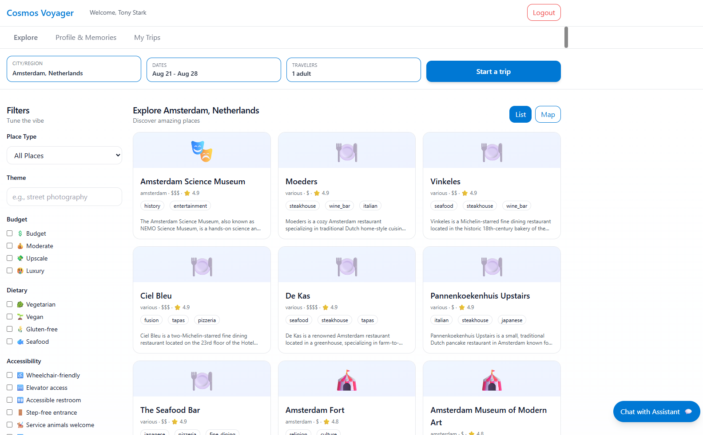

# Travel Multi-Agent Workshop

## Overview

This workshop walks through how to build a multi-agent travel assistant system using Python, LangGraph, Azure AI Foundry, and Azure Cosmos DB. Here, you'll create specialized AI agents that work together to help users plan travel arrangements and learn about agent memory orchestration. The workshop concludes with **optional modules on agent analytics and optimization** — instrumenting your agents, surfacing cost and quality insights, and applying (and auto-reverting) reversible optimizations — plus a **Microsoft Fabric** analytics and reverse-ETL module.

*The Cosmos Voyager web app — explore places, plan trips, and chat with the multi-agent assistant.*

### What You'll Build

By the end of this workshop, you'll have created a complete travel planning application featuring:

- **Multiple specialized sgents**: Hotel booking agent, dining recommendations agent, activity planning agent, and more
- **Intelligent orchestration**: A coordinator agent that manages interactions between specialized agents
- **Memory system**: Persistent memory storage using Azure Cosmos DB to remember user preferences and past interactions
- **Modern web interface**: An Angular frontend that provides an intuitive chat interface
- **API layer**: A FastAPI backend that orchestrates all agent interactions

### Memory layer

Memory is provided by the [`azure-cosmos-agent-memory`](https://pypi.org/project/azure-cosmos-agent-memory/) PyPI package. The toolkit auto-creates its Cosmos DB `memories`, `memories_turns`, `memories_summaries`, and `counter` containers on first run via `connect_cosmos()`. Auto-summarization thresholds are controlled by environment variables (`FACT_EXTRACTION_EVERY_N`, `DEDUP_EVERY_N`, `THREAD_SUMMARY_EVERY_N`, `USER_SUMMARY_EVERY_N`). Memory records are partitioned by `(user_id, thread_id)`. Memory prompts ship inside the package, so no `.prompty` files for memory are needed in this repo.

### Learning Objectives

- Understand multi-agent architecture patterns and design principles
- Learn to build agents using LangGraph framework with Azure AI Foundry
- Implement agent specialization and tool integration
- Add intelligent memory systems to enhance agent interactions
- Practice observability and experimentation techniques
- Deploy and manage AI applications on Azure

## Optional: Agent Analytics & Optimization

Modules **07–09** are an **optional track** that turns the assistant into a self-observing system:
you instrument every turn, then **detect → recommend → apply → verify** cost and quality
optimizations. You read and act on the results in a single-page **web Analytics Portal**
(`analytics/dashboard/`) — live KPIs, per-agent scorecards, a conversion funnel, and one-click
**Apply / Revert** of reversible policies — backed by **Microsoft Fabric** reverse-ETL (Module 09)
and an optional Power BI report.

*The web Analytics Portal (Overview tab) — portfolio KPIs, model-usage mix, and live turn volume across the six optimization pillars.*

Not planning to do the analytics track? You can **skip it**: build the assistant in Modules 00–06,
then jump straight to **Module 10** to wrap up (Module 06 has an exit ramp for exactly this). You
can always return to 07–09 later.

## Getting Started

This repository contains two main directories:

### 📚 **01_exercises** - The Workshop
Navigate to this folder to follow along with the step-by-step workshop modules. Start here if you want to build the solution from scratch and learn each concept progressively.

Get started here 👉 **[Start the Workshop](01_exercises/workshop/Home.md)**

### ✅ **02_completed** - The complete solution
Navigate to this folder to access the fully implemented solution. Use this if you want to see the end result or deploy the complete application.

Deploy the completed solution 👉 **[Deploy the Completed Solution](02_completed/README.md)**

