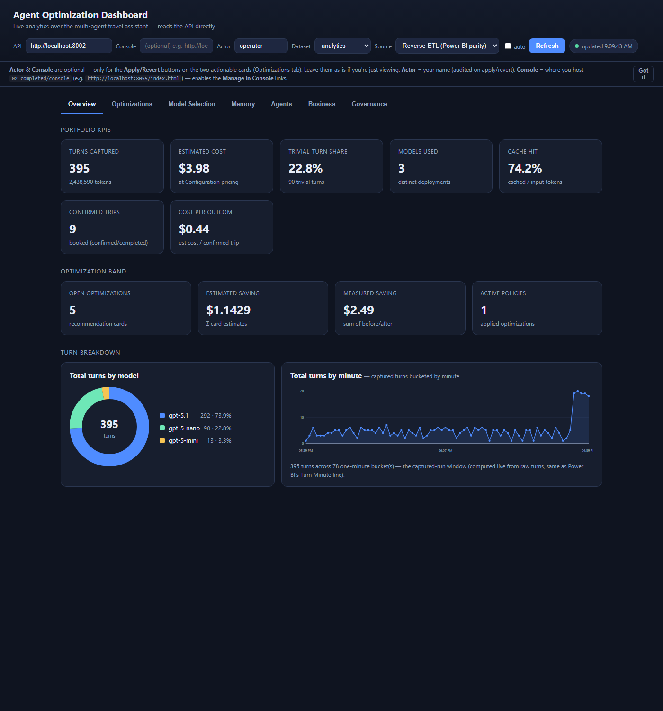

# Agent Optimization Dashboard

A single-file, web-based analytics dashboard for the multi-agent travel assistant.
It reads the **Travel API directly** over HTTP and renders live — no Power BI, no
Fabric mirror, no reverse-ETL lag. Open it in any browser.



## What it shows

The dashboard mirrors the seven-page Power BI optimization report as **tabbed pages
in the report's 1→7 order**, but live from the API. Each tab renders real charts
(SVG donuts, a gauge, a projection line, grouped baseline-vs-actual bars) — no
charting CDN, all self-contained. Tabs:

1. **Overview** — portfolio KPIs (turns, cost, trivial %, models, cache hit, confirmed trips, cost/outcome), optimization band, model-usage donut, **turns-over-time line chart**
2. **Optimizations** — analyst-ranked optimizations table (Agent · Dimension · Fix seam → target · Proj. saving · Effect · Apply mode · Autonomy · Clears SLO · **State**) + scenario recommendation cards. Each card shows a live evidence line. **Automatic** (config) cards — model-selection, memory-retention — carry **Apply/Revert**; the **Manual** (prompt/code) card — redundant tool calls — carries a **Review change** button (GitHub-style prompt diff) plus the governance-lifecycle buttons (Approve/Deploy/Dismiss/Roll back). Pure read-only lenses (cost-per-outcome, agent-path) carry no action.
3. **Model Selection** — model-distribution donut, trivial-turn gauge, cost-by-tier bars, and a turns/day projection slider with a live line chart
4. **Memory** — Total/Scored/Avg-salience/Supersession KPIs, **Memories-by-type donut**, **Memory-health donut**, **salience-distribution bars**
5. **Agents** — agent × dimension scorecard matrix, cost-by-agent bars (USD · share · **tokens**), **dimension-detail table** (status + headline), **agent-path cost concentration table**
6. **Business** — Conversion Rate / Biggest Leak KPIs, **conversion funnel**, **abandonment-cause bars**
7. **Governance** — applied policies, SLO gate, measured-saving table, baseline-vs-actual bar chart, and the decision audit trail

The deployed **`TravelAssistantAnalyticsReport`** is the Fabric/Power BI companion surface. It
reads the mirror with DirectQuery and the mirrored `OptimizationInsights` snapshot. Its
Recommendations table is data-driven: every new `recommendation_card` row appears automatically,
and selecting a row populates the detail/action panel.

The Memory, Business, and agent-path sections read the same reverse-ETL rows Power BI
reads (`memory_*`, `funnel_stage`, `abandonment_cause`, `conversion_kpi`, `agent_path_cost`
in `OptimizationInsights`) via dedicated endpoints — so they match Power BI by construction.
Run `compute_insights.py --tenant <t>` (or the notebook) to populate them.

Endpoint mapping:

| Power BI page | Dashboard section | Source endpoint(s) |
| --- | --- | --- |
| 1 · Portfolio Overview | KPI strip + optimization band (open opts, est/measured saving, active policies) | `metrics` + `{tenant}` + `result` + `policies` |
| 2 · Optimizations | Ranked opportunities + data-driven recommendations and actions | `/optimizations/agent/{tenant}/opportunities` + `GET /optimizations/{tenant}` |
| 3 · Model Selection | Model mix, cost by tier, and turns/day saving projection | `metrics` + `result` (model-selection) |
| 4 · Memory | Memory KPIs, type/health distributions, and salience | memory reverse-ETL endpoints |
| 5 · Agents | Agent × dimension scorecard + agent-path costs | `/optimizations/agent/{tenant}/scorecard` + agent-path rows |
| 6 · Business | Conversion funnel, outcome KPIs, and abandonment causes | `metrics` + funnel reverse-ETL rows |
| 7 · Governance | Policies, SLO gate, decision audit, and measured savings | `policies` + `/agent/{tenant}/slo` + `/agent/{tenant}/decisions` + `result` |

Scenario recommendation cards (`GET /optimizations/{tenant}?source=live`) render below the optimizations table — one actionable card per optimization.

The dashboard **never fabricates data**. Empty datasets (no scorecard rows, `$0`
measured savings before you apply a policy, an empty decision audit) show honest
empty/zero states.

### Source: reverse-ETL (Power BI parity) vs live

The header has a **Source** toggle that controls the KPI/recommendation numbers:

- **Reverse-ETL (default)** — the API reads the same reverse-ETL snapshot in Cosmos
  `OptimizationInsights` that Power BI's Fabric mirror is built from (`source=auto`).
  **This makes the dashboard's numbers match Power BI** (e.g. confirmed outcomes,
  cost per outcome), because both read the identical rows. The snapshot is written by
  `python analytics/fabric/compute_insights.py --tenant <t>` (or the Module 09 notebook);
  re-run it to refresh *both* Power BI and the dashboard together.
- **Live** — the API recomputes from the raw captured turns (`source=live`). This can
  differ from Power BI (it reflects the current Cosmos state, not the last snapshot).

The turns-over-time chart is always computed live from raw turn timestamps
(`GET /optimizations/{tenant}/turns_timeline`), the same raw turns Power BI's
`OptimizationTurns[Turn Minute]` line reads. Power BI parity requires pointing the
**API** box at a `02_completed` API (the tree whose Cosmos the Fabric mirror replicates).

### Which API you point at matters

The **`/optimizations/agent/*`** endpoints (scorecard, opportunities, decisions, SLO)
exist only in the **`02_completed`** API. Against the **`01_exercises`** API those 4
sections show a clear *"needs the 02_completed API"* note and the status pill goes
**amber** (not red) — the rest of the dashboard still renders. For the full 8-page
experience, point the **API** box at an `02_completed` API.

### Taking action (closed loop)

Every recommendation card is actionable directly in the portal — there is no separate console
to hop to. The card layout is uniform: a `[apply-mode · state]` badge row, then the action
buttons.

- **Automatic** (config-seam) cards — **model-selection**, **memory-retention** — carry
  status-aware **Apply / Revert** buttons that realize the detect → act → re-measure loop
  (the same reversible policy toggles Power BI's *translytical task flows* were meant to call).
  They POST to `/optimizations/{scenario}/apply|revert`, auto-seeding a proposal on first apply
  (so **Not applied** + **Apply** is one click). Reverting memory-retention restores the
  soft-pruned memories. After an action the dashboard **switches Source → Live** so you can
  watch the impact accrue on new agent traffic in near-real-time (tick **auto** to poll).
- **Manual** (prompt/code-seam) card — **redundant tool calls** — carries a **Review change**
  button (opens the diff modal, below) plus the governance-lifecycle buttons
  (**Approve / Deploy / Dismiss / Roll back**, per current state). These POST to
  `/optimizations/agent/{tenant}/decision` and append to the decision audit trail.
- The remaining lenses (cost-per-outcome, agent-path) are read-only diagnostics, no action.

Power BI exposes the same reversible policy actions through the Fabric
`optimization-apply-loop` User Data Function. Native Power BI tables cannot embed buttons in each
row, so the report uses a master-detail pattern: select the recommendation, then use the
standalone state-aware Apply/Revert buttons.

All actions are attributed to `by: "analytics-portal"` (there is no per-user actor box).

### Reviewing a proposed prompt/code change (diff modal)

The **Manual** (prompt/code-seam) scenario card — e.g. *Redundant tool calls* →
`supervisor.prompty` — carries a **Review change** button. It opens a **GitHub-style diff
modal** (`GET /optimizations/agent/{tenant}/diff?opportunity_id=…`) showing the engine's
suggested change over the **entire prompt** (the whole file is rendered, scrollable — no
context is collapsed): added lines are green, removed lines red. The diff view is
**non-selectable** (`user-select:none`) so the `+/-` markers can't be hand-copied into a file
— instead a **Copy updated prompt** button copies the clean, marker-free `after` prompt from a
separate buffer via `navigator.clipboard`.

(The card's Manual affordance is derived from the authoritative live opportunities endpoint, so
it's correct even when the reverse-ETL recommendation snapshot lags. The read-only optimizations
table above shows the same governance state in its **State** column but carries no button — the
action lives on the card.)

The governance lifecycle is **distinct from** the app-executed Apply/Revert on config cards,
because here the app can't make the change — **you** edit the `.prompty` file and deploy it.
The verbs describe a review-and-attest workflow, not an app action:

**Proposed → Approved → Deployed → Rolled back**, with **Dismissed** as the reject path.

- **Proposed** — the engine suggested it (default state).
- **Approved** — you've endorsed the change but haven't put it in production yet.
- **Deployed** — you edited the prompt file and shipped it to production. This is an
  **attestation**: the app records that *you* deployed it; it does **not** auto-edit the file.
- **Rolled back** — you removed it from production.
- **Dismissed** — rejected / withdrawn.

The **state-change buttons live on the card** (not in the modal — its footer shows the current
state read-only). Only the valid transitions render (Proposed/Rolled back → Approve/Dismiss;
Approved → Deploy/Dismiss; Deployed → Roll back; Dismissed → Approve). Each POSTs to
`/optimizations/agent/{tenant}/decision` (`{opportunity_id, action, by:"analytics-portal"}`)
and appends to the decision audit trail. The enhanced before/after diff requires the
**`02_completed`** API; against an older API the modal falls back to the plain diff string.

> **Why status can differ across environments:** a card's `ACTIVE` vs `NOT APPLIED` reflects the
> `OptimizationPolicies` store of **whichever API the dashboard points at**. Two APIs backed by
> different Cosmos databases will legitimately disagree — point the **API** box at the one whose
> state you want (the same one Power BI's Fabric mirror replicates for parity).

## Prerequisites

- The **Travel API** running (default `http://localhost:8000`). Locally:
  ```powershell
  .\.venv-travel\Scripts\Activate.ps1
  cd python
  uvicorn src.app.travel_agents_api:app --reload --host 0.0.0.0 --port 8000
  ```

## Run it

It's a static file — serve the folder and open it:

```powershell
# from the repo root
python -m http.server 8060 --directory analytics\dashboard
# then open http://localhost:8060
```

Or just double-click `index.html` (the `file://` origin works too, since the API
allows all origins).

### Which API it talks to (no API box)

There is no API input — the base URL is resolved automatically:

- **Local** (`localhost` / `127.0.0.1` / `file://`) → `http://localhost:8000`.
- **Hosted** (any other origin) → same-origin **`/api`**, which the reverse proxy in front of
  the portal forwards to the Travel API (no CORS, no URL to configure). When deployed, the portal
  is baked into the frontend container and served at `/analytics/`, alongside that `/api` proxy.
- **Override** — append `?api=<base>` to the URL to point at a specific API (handy in dev,
  e.g. `?api=http://localhost:8002`). CORS is open on the API, so cross-origin works.

## Controls

- **Dataset** — the tenant to analyze. Type any tenant id; the dropdown lists the
  seeded demo datasets (`analytics`, `marvel`).
- **Source** — Reverse-ETL (Power BI parity) vs Live (recompute). See above.
- **auto-refresh** — re-fetch every 15 s.
- **Refresh** — fetch now. The status pill shows load/ok/error + last-updated time.
- **Gear menu** — completed-demo operational maintenance. Generate traffic, recompute insights,
  freshen timestamps, and reset are intentionally **not** Power BI buttons. Power BI owns scoped
  policy Apply/Revert; the web/demo tooling owns broad maintenance operations.

Each section fetches independently, so one failing endpoint won't blank the page —
it shows a per-section message and the rest still renders.

## Theme

A self-contained dark-navy theme (`--bg #0f1420`, blue accent `#4f8cff`, with
`.tile`/`.panel`/`.card`/`.badge` components). Charts are inline SVG themed with the same
CSS variables — no external stylesheet or charting CDN.
