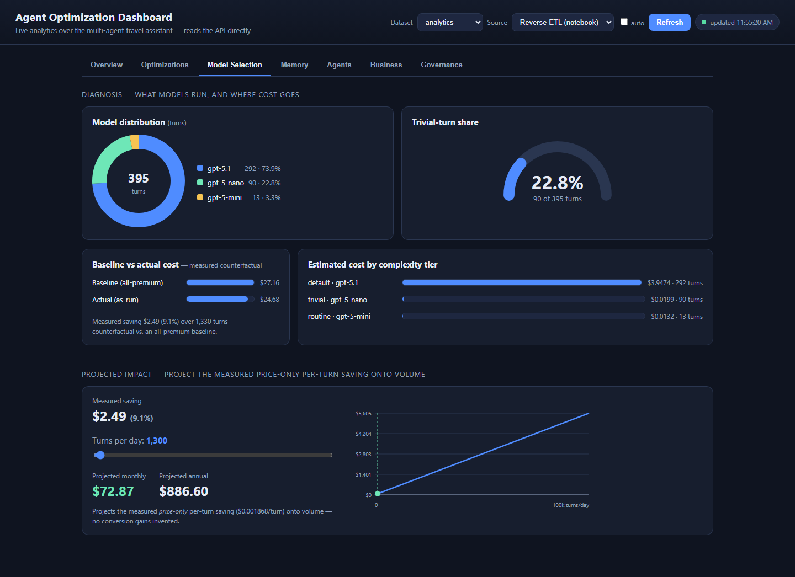
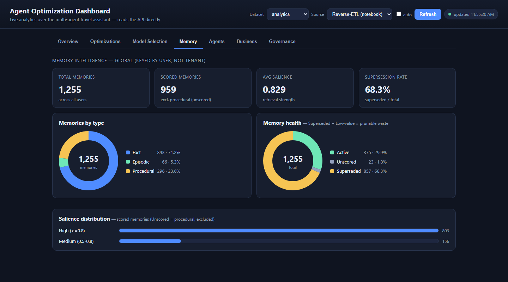
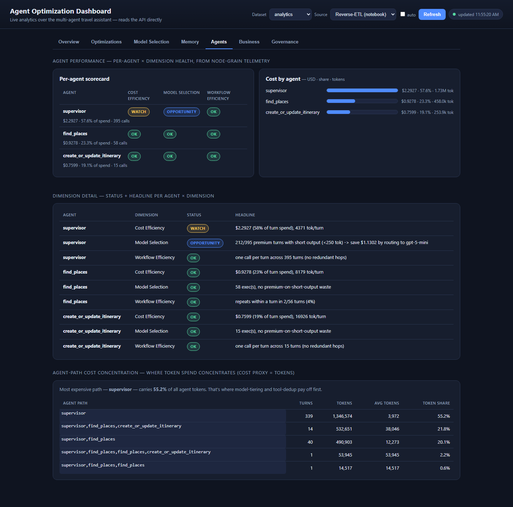
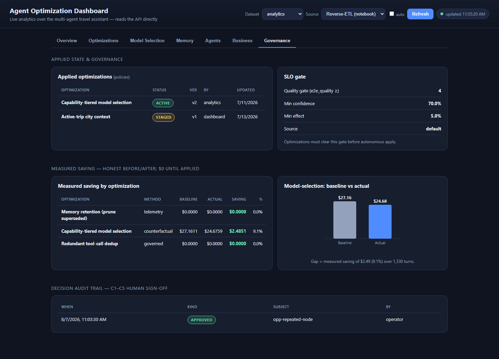

# Demo script — Agent Analytics & Optimization (60-minute session)

A presenter's talk track for demonstrating the **model-selection optimization** (SCEN-007)
end to end, without generating a mountain of data live. The design: pre-baked data carries
the at-scale story, and one small live moment makes it real.

The loop this demonstrates is the one the workshop teaches:
**instrument → detect → recommend → apply → verify.**

---

## The Analytics Portal — the demo surface (tab-by-tab)

The whole demo now runs in the **web analytics portal** — a single dark-themed page that reads
the Travel API's `/optimizations/*` endpoints live. Serve it and open it:

```powershell
python -m http.server 8060 --directory analytics\dashboard
# then open http://localhost:8060
```

There is **no API box** — the portal auto-detects the API (`http://localhost:8000` locally, or
the same-origin `/api` proxy when hosted at `/analytics/`). Two header controls drive everything:

- **Dataset** — which tenant to read (`analytics` is the pre-seeded at-scale story; `marvel` is
  where the live app records your turns).
- **Source** — **Live (recompute)** reads the raw captured turns straight from Cosmos (use this in
  Modules 07–08 and for the live moments); **Reverse-ETL (notebook)** reads the `OptimizationInsights`
  snapshot the Module 09 analytics notebook writes (use it after you run the notebook).

> *Power BI is still shipped as an optional report over the same Fabric mirror, but the portal is
> the recommended demo surface — it's live, needs no Desktop, and every tab below is one click.*

Seven tabs, front to back:

### 1. Overview — the portfolio picture


**What it shows:** top-line **Portfolio KPIs** (turns captured, estimated cost, trivial-turn share,
models used, cache hit, confirmed trips, cost per outcome), an **Optimization band** (open
optimizations, estimated vs measured saving, active policies), and a **Turn breakdown** (turns-by-model
donut + a turns-per-minute timeline).
**How to read it:** this is the "before" at a glance — a week of production traffic where one premium
model served everything and a big slice of turns are trivial. **Trivial-turn share** and the
one-color donut are the waste hook; **cost per outcome** is the business-grade denominator.
**Use it to** open the demo and to sanity-check that a change moved the top line.

### 2. Optimizations — the action hub


**What it shows:** the analyst-ranked **Discovered optimizations** table (agent · dimension · fix
seam→target · projected saving · effect · **Apply mode** · autonomy · clears-SLO · **State**), then a
**scenario recommendation card** per optimization.
**How to read it:** **Apply mode** tells you *who acts* — **Automatic** (a config policy the app flips)
vs **Manual** (a prompt/code edit you deploy). **State** is the live lifecycle. Config cards carry
**Apply / Revert**; the Manual "redundant tool calls" card carries **Review change** (a GitHub-style
prompt diff) plus **Approve → Deploy → Roll back / Dismiss** governance buttons.
**Use it to** apply the model-selection policy on stage, and to show the human-in-the-loop review of a
proposed prompt change.

### 3. Model Selection — quantify and project the tiering saving


**What it shows:** the model-distribution donut, a trivial-turn gauge, **cost by complexity tier**,
**baseline-vs-actual** bars, and a **turns-per-day projection slider** → monthly/annual saving.
**How to read it:** the "default" tier slice is premium spend on near-zero-work turns. The measured
cards and bars are *facts*; the slider + line are a *projection* — drag the slider to your daily volume
and only **Projected Monthly Saving** moves (everything else is static by design).
**Use it to** turn a per-turn saving into a "what's this worth at our volume" number — say *projection*,
not *measured*.

### 4. Memory — the prune opportunity


**What it shows:** memory KPIs (total, scored, average salience, **supersession %**), a memories-by-type
donut, a **memory-health** donut, and a salience-distribution histogram.
**How to read it:** preferences change, so memory accumulates **superseded** entries; a high stale share
means recall wades through (and pays for) memories that no longer apply.
**Use it to** justify the memory-retention policy — the supersession % is the evidence behind the
"prune stale memories" card on the Optimizations tab.

### 5. Agents — per-agent × dimension health


**What it shows:** the **scorecard matrix** (each agent scored OK / Watch / Opportunity on cost
efficiency, model selection, workflow efficiency), **cost by agent** (USD · share · tokens), a
dimension-detail table, and an **agent-path cost concentration** table.
**How to read it:** find the agent/dimension flagged **Opportunity**, then read the agent-path table to
see which multi-agent paths (usually the itinerary path) dominate token cost.
**Use it to** target the costliest agent/path — that's where tiering and tool-call fixes pay off most.

### 6. Business — from cost to conversion


**What it shows:** **Conversion rate** and **Biggest leak** KPIs, the **conversion funnel**
(engaged → searched → planned → confirmed), and **why sessions don't convert** (abandonment causes).
**How to read it:** everything else cuts *cost*; this answers *are we converting?* The funnel shows
where sessions drop and the abandonment bars name the cause (e.g. **City Friction** — the agent
re-asking which city instead of using the active trip).
**Use it to** re-justify a prompt fix by **revenue**, not just tokens — the same fix now points at a
conversion leak.

### 7. Governance — prove it's safe, measured, reversible


**What it shows:** applied **policies**, the **SLO gate**, a **measured-saving** table, baseline-vs-actual
bars, and the **decision audit trail**.
**How to read it:** every governed action is attributed and timestamped; a policy only counts if it
**clears the SLO**, and the saving shown is **measured** (before/after), not projected.
**Use it to** close the demo — "every change here is audited and reversible," which is exactly what makes
these optimizations safe to automate.

---

## Why the "before" looks the way it does

In the seed, most turns have `complexity_tier = "default"` — i.e. one premium model (gpt-5.1)
served *everything*, trivial or complex. That's not a bug to hide; it's the hook: **this is a
real agent app before anyone optimized it.** The optimization tiers trivial turns down to a
nano model, routine to a mini model, and keeps the premium model for the hard work.

You don't need a temporal before/after. You have two better devices:
1. The **policy-aware traffic simulator** on `analytics`: the workload is fixed, so applying the
   model-selection policy re-tiers the *same* stream (only the model changes) — a live,
   apples-to-apples before/after via the real apply-loop, and the engine's measured saving is the
   exact delta.
2. A **few live turns** through the real app to prove the routing happens for real.

---

## Pre-session setup (do once, off-stage)

1. **Build the analytics dataset** (the at-scale + business-impact story):
   ```powershell
   python analytics/scripts/funnel_seed.py
   # populate OptimizationInsights so the portal's Business tab (Reverse-ETL source) has data:
   python analytics/fabric/compute_insights.py --tenant analytics
   ```
   `funnel_seed.py` writes `analytics` (~120 sessions encoding real **abandonment causes**);
   `compute_insights.py` is the reverse-ETL reference that computes the funnel and writes flat
   rows to `OptimizationInsights` (in the workshop, Module 09's Fabric notebook does this). The
   portal's **Business** tab (on **Source → Reverse-ETL (notebook)**) then lights up.

   > **In-app alternative (no CLI, no Fabric).** The portal's **⚙ Demo tools** menu (top-right)
   > runs the whole loop live: **Reset to baseline** (clear governance/insights + normalize turns
   > to the single-premium before-state), **Generate traffic** (policy-aware — baseline until you
   > apply model-selection, then tiered), **Recompute insights** (rebuild the snapshot in-process),
   > and **Freshen turn times** (make *Turns-by-minute* current).

2. **Portal:** serve it with `python -m http.server 8060 --directory analytics\dashboard` and open
   <http://localhost:8060> (when deployed it's baked into the frontend at `/analytics/`). No API URL
   to configure. *(A Power BI report over the same mirror is auto-deployed by `Provision-Fabric.ps1`
   Phase 3 and remains available as an optional surface — but the portal is the recommended demo.)*

3. **Confirm the app + policy:** make sure the app is reachable and the **model-selection
   policy is NOT yet applied** (you'll apply it on stage). Locally the portal talks to the API on
   `:8000`; when hosted it's proxied at `/api` automatically — nothing to enter.

4. **Dry-run the live turns once** (so you trust them on stage) — see "Live turns" below.

---

## The talk track (~15–20 min of demo)

**1. Baseline — "the before" (Overview tab).**
*Show:* Turns captured, Estimated cost, Trivial %, model usage at ~100% one model.
> "This is a week of production traffic for our travel agent. Every turn — a 'hi', a
> thank-you, or a full 5-day itinerary — runs on our best, most expensive model. And look:
> a large share of turns are trivial, yet they cost exactly what the hard ones do."

**2. Quantify the waste (Model Selection tab, Cost by Tier).**
> "That giant 'default' slice is spend on a premium model for near-zero-work turns. Nobody
> had to guess this — the app instrumented every turn: tokens, model, handoffs."

**3. The recommendation (the "aha").**
*Show:* the SCEN-007 **model-selection** card on the portal's **Optimizations** tab — evidence from *their* data + projected saving.
> "The system didn't just log it; it *detected* the pattern and *recommends* a fix — route
> trivial turns to a nano model, routine to mini, keep the premium model for the hard stuff.
> Here's the projected saving."

**4. Apply — the live moment (one click).**
*Do:* click **Apply** on the **model-selection** card (Optimizations tab).
> "Applying it is a reversible policy flip — not a code change, not a redeploy. That's what
> makes this safe to automate."

**5a. Prove it — drive a quick tiered stream.**
*Do:* with the policy now applied, run a short burst of the traffic simulator on `analytics`, then
**Refresh** the portal:
```powershell
python analytics/scripts/traffic_simulator.py --tenant analytics --rate 120 --minutes 1
```
*(Zero-setup alternative: **⚙ → Generate traffic** in the portal — same policy-aware burst, no CLI.)*
> "Same workload profile as the baseline — but now that the policy is on, the simulator serves it
> tiered. Watch the model-usage donut split into nano/mini/premium, trivial turns show up as their
> own tier, and est cost per turn drops — with zero change to the user experience. The **Governance**
> tab's measured saving (~28%) is the exact before/after delta, re-priced against an all-premium
> baseline."

**5b. Prove it's live — a few real turns (optional flourish).**
*Do:* run the traffic simulator in **app mode** (or type turns by hand — see below), then **Refresh**
the portal with **Dataset → analytics** and **Source → Live (recompute)**.
> "And here it is happening for real: watch these new turns land — the greeting routed to nano,
> the itinerary to the premium model."

**5c. Project it forward (Model Selection tab).**
*Do:* open the **Model Selection** tab and drag the **Turns per Day** projection slider.
> "We measured the saving *per turn*. Now — what's that worth at *our* volume? Drag this to your
> daily turn count and **Projected Monthly Saving** scales with it. The **line** is the whole
> cost-vs-volume curve; it stays put on purpose — the slider just reads off a point on it."

*How to read this page (so no one thinks it's broken):* the **slider is your assumed daily volume**,
and the **`Projected Monthly Saving USD` card is the only thing that moves** when you drag it.
Everything else is **static by design** — the measured cards (`MS Saving USD`, `Saving %`) and the
baseline-vs-optimized bars are *measured facts*, and the line is the *full* projection curve, not a
value that reacts to the slider. It projects the **price-only** model-selection saving onto volume —
**never a conversion gain** (that's the funnel's job, next). Keep saying *projection*, not *measured*.

**6. The business-impact turn — from cost to conversion (the part that lands).**
*Do:* switch **Dataset → analytics** and open the **Business** tab (Cost per outcome & conversion funnel).
> "Everything so far cut *cost*. But the real question a business asks is: are we *converting*?
> This funnel shows it — 120 sessions engaged, 106 searched, 71 got a plan, only 56 booked. And
> it doesn't leave you hanging on 'why': the biggest addressable leak is **city friction** — 29
> sessions where the agent kept re-asking which city instead of using the active trip. That's not
> a model-cost problem; it's a *conversion* problem, and it points straight at the same
> prompt fix — now justified by revenue, not just tokens."

This is the uplevel: mechanical cost optimizations are table stakes; the analytics also surface **where the business is losing customers and why**. A dashboard can't auto-fix conversion — but it can name the cause and hand you the lever.

**7. Close — verify & govern.**
> "The measured before/after is the truth, not the projection — reasoning models bill hidden
> tokens, so we always confirm with real numbers. And every change here is audited and
> reversible."

---

## Live turns — automated (through the real app)

Drive a short burst of **authentic** turns through the **real** app with the traffic simulator's
**app mode** — real agent turns with real classifier routing (a greeting on nano, an itinerary on
the premium model) — so you can show the routing happening live, on top of the pre-baked
synthetic stream.

```powershell
# hosted app (web URL + /api; the API container app is internal-only):
python analytics/scripts/traffic_simulator.py --mode app --tenant analytics --rate 10 --minutes 1 --endpoint https://<web-app>.azurecontainerapps.io/api

# local dev app:
python analytics/scripts/traffic_simulator.py --mode app --tenant analytics --rate 10 --minutes 1
```

`--mode app` posts a realistic tier mix to the completion endpoint (real model calls). On
02_completed the app writes `Debug` telemetry, so **derive `OptimizationTurns`** from it once the
run finishes so the turns appear in the portal:

```powershell
cd 02_completed/python
python data/export_conversations.py --no-write   # derive only; don't overwrite the golden JSON
```

Then **Refresh** the portal with **Dataset → analytics** and **Source → Live (recompute)** — the
new turns land, tiered by the active policy.

> Apply the model-selection policy **first** (step 4), or the turns record as `default`.

---

## Live turns — manual (type these in the app UI)

If you'd rather do it by hand in the chat UI (or the network blocks the script), open the app,
start a new chat, and send these — one per tier, so the routing is obvious:

| Type this | Expected tier | Expected model |
|---|---|---|
| `hi` | trivial | gpt-5-nano |
| `thanks, that's perfect!` | trivial | gpt-5-nano |
| `what are some good hotels in Amsterdam near the centre?` | routine | gpt-5-mini |
| `plan me a detailed 3-day itinerary for Tokyo with hotels, activities, and places to eat` | complex | gpt-5.1 |

Then, to surface them in the portal (02_completed derives `OptimizationTurns` from `Debug`):

```powershell
cd 02_completed/python
python data/export_conversations.py --no-write   # derive only, don't overwrite the golden JSON
```

> `--no-write` still upserts derived turns into `OptimizationTurns`; it just skips rewriting the
> committed `data/*.json`. (For a live demo the automated helper is cleaner — it derives only the
> turns it sent.) **Refresh** the portal afterward.

---

## What to avoid (the "insane" list)
- Generating hundreds of turns live (slow, flaky, dead air).
- Rebuilding the mirror / semantic model / report on stage.
- Relying **only** on freshly-generated traffic — the pre-seeded `analytics` tenant is always
  there as a fallback.
- Presenting the projected saving as measured — call it a projection; the **measured
  counterfactual saving** (Governance tab) and the live per-turn routing are the proof.

---

## Numbers (measured, from the tiered stream)
- Capability-tiered model selection lands **≈28% lower** est cost than the all-premium baseline —
  the **measured counterfactual** (Governance tab) re-prices the actual turns against an
  all-premium baseline, so it's the real delta, not a canned one.
- Tier split ≈ trivial 9% / routine 57% / complex 34%.
- These are list-price *estimates* (from the Cosmos `Configuration` pricing rows); the portal
  shows them live. Exact figures depend on the traffic volume you drive.
